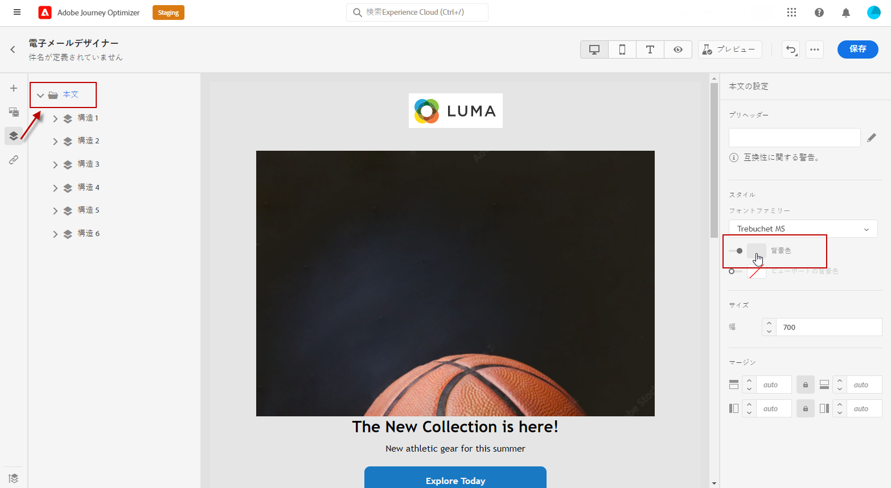
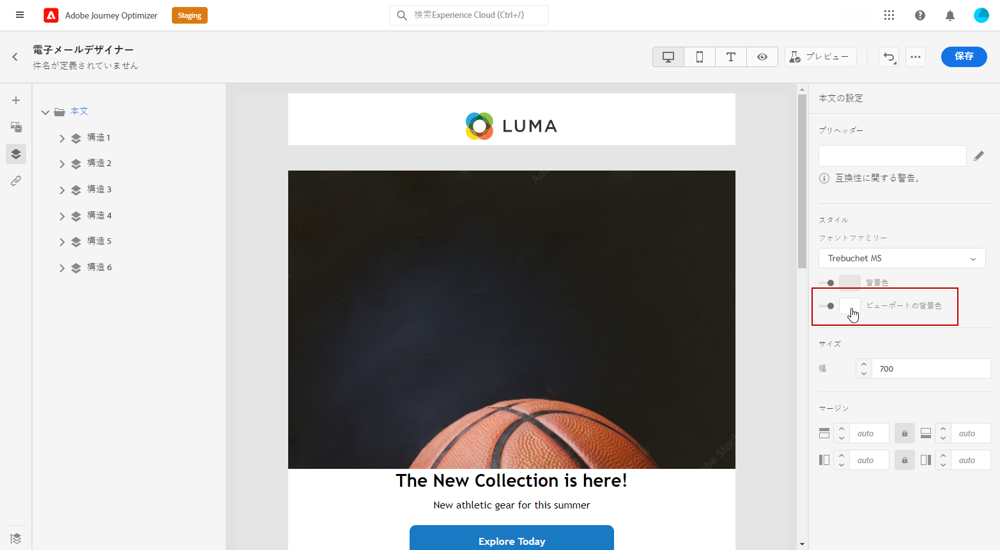
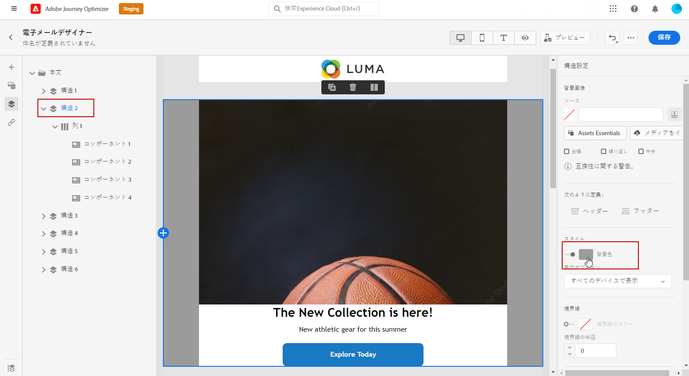
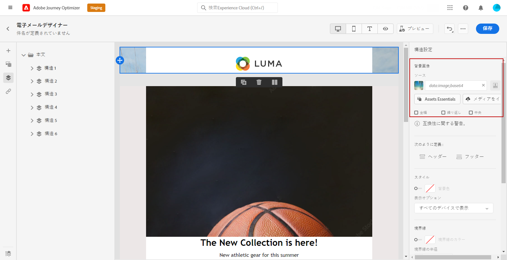
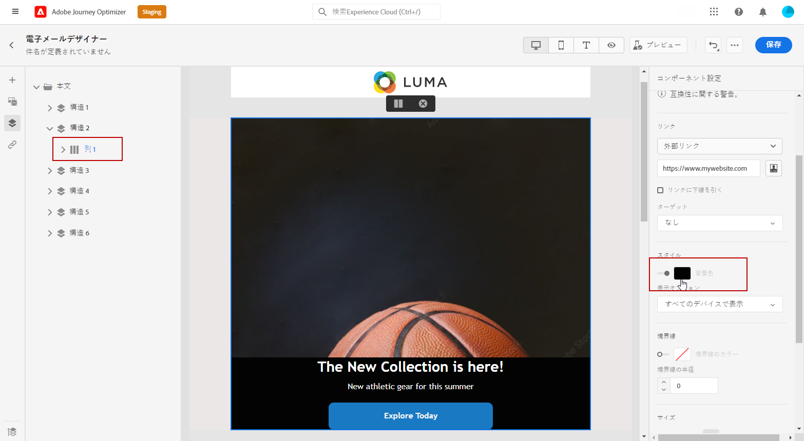

# メールの背景をパーソナライズ {#backgrounds}

>[!CONTEXTUALHELP]
>id="ac_edition_backgroundimage"
>title="背景の設定"
>abstract="コンテンツの背景色や背景画像をパーソナライズできます。背景画像は、すべてのメールクライアントでサポートされているわけではありません。"

E メールデザイナーで背景を設定する場合、アドビでは次の操作を推奨します。

1. デザインで必要な場合は、メールの本文に背景色を適用します。
1. ほとんどの場合、列レベルで背景色を設定します。
1. 管理が困難な画像やテキストコンポーネントでは、背景色を使用しないようにしてください。

使用可能な背景の設定は次のとおりです。

* メール全体に対して&#x200B;**[!UICONTROL 背景色]**&#x200B;を設定する。左側のパレットからアクセスできるナビゲーションツリーで、本文の設定を選択していることを確認します。

   

* 「**[!UICONTROL ビューポートの背景色]**」を選択して、すべての構造コンポーネントに同じ背景色を設定する。このオプションを使用した場合、背景色とは異なる設定を選択できます。

   

* 構造コンポーネントごとに異なる背景色を設定する。左側のパレットからアクセス可能なナビゲーションツリーで構造を選択し、特定の背景色をその構造にのみ適用します。

   構造の背景色が隠れる場合があるので、ビューポートの背景色は設定しないでください。

   

* 構造コンポーネントのコンテンツに&#x200B;**[!UICONTROL 背景画像]**&#x200B;を設定する。

   >[!NOTE]
   >
   >一部のメールプログラムは、背景画像をサポートしていません。サポートされていない場合は、行の背景色が代わりに使用されます。画像を表示できない場合に備えて、適切な代替背景色を選択してください。

   

* 列レベルで背景色を設定する。

   >[!NOTE]
   >
   >これは、最も一般的なユースケースです。アドビでは、メールコンテンツ全体をより柔軟に編集できるよう、列レベルで背景色を設定することをお勧めします。

   また、列レベルで背景画像を設定することもできますが、この設定はほとんど使用されません。

   
