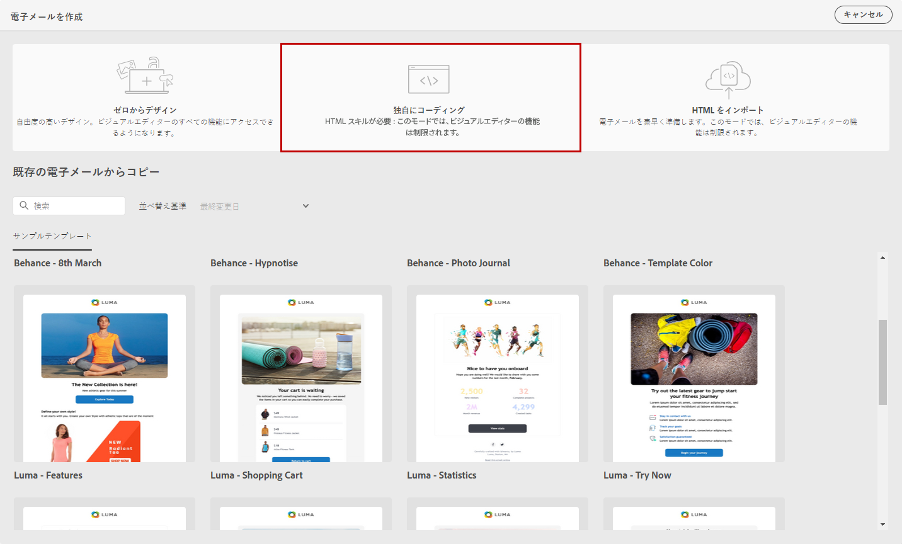
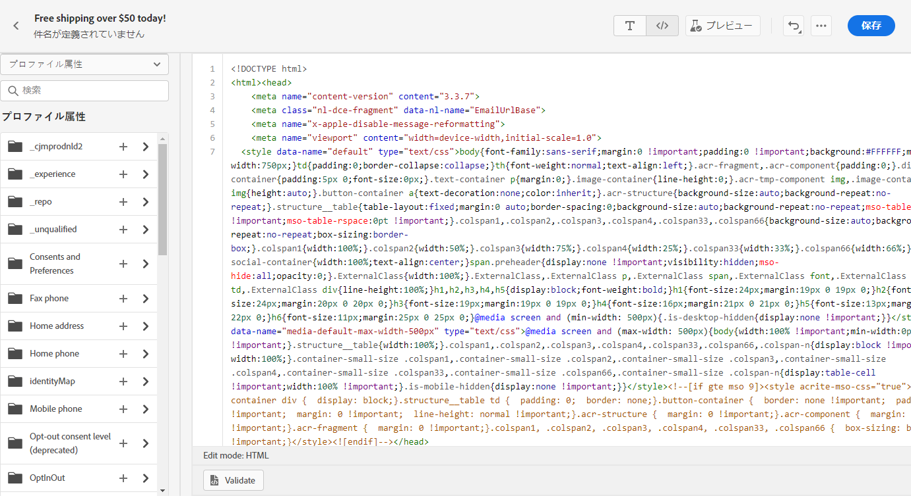
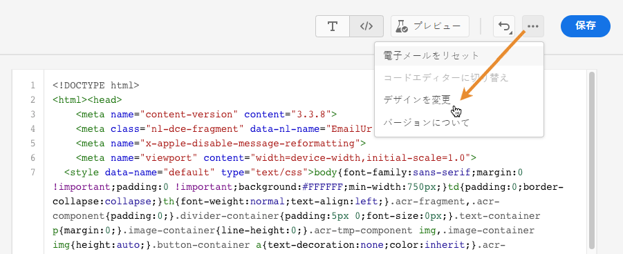
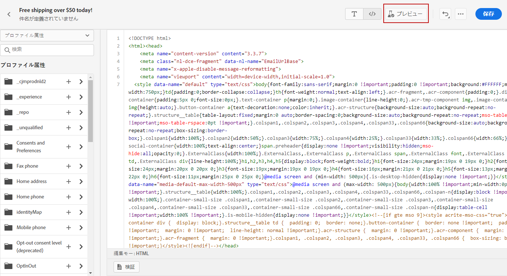

# 独自のコンテンツをコーディング {#code-content}

**[!UICONTROL 独自のコードを作成]**&#x200B;モードでは、Raw HTML を読み込んだり、メールコンテンツをコーディングしたりできます。このメソッドには HTML に関するスキルが必要です。

➡️ [この機能をビデオで確認](#video)

>[!CAUTION]
>
> [Adobe Experience Manager Assets Essentials](assets-essentials.md) の画像は、このメソッドを使用する場合は参照できません。HTML コードで参照される画像は、公開場所に保存する必要があります。

1. E メールデザイナーのホームページで、「**[!UICONTROL 独自のコードを作成]**」を選択します。

   

1. Raw HTML コードを入力または貼り付けます。

1. 左側のペインを使用して、[!DNL Journey Optimizer] パーソナライゼーション機能を利用します。
詳しくは、[この節](../personalization/personalize.md)を参照してください。

   

1. E メールデザイナーを開いて新しいデザインのメールに取り掛かる場合は、オプションメニューから「**[!UICONTROL デザインの変更]**」を選択します。

   

1. 「**[!UICONTROL プレビュー]**」ボタンをクリックし、テストプロファイルを使用したメッセージデザインとパーソナライゼーションを確認します。詳しくは、[この節](preview.md)を参照してください。

   

1. コードの準備が整ったら、「**[!UICONTROL 保存]**」をクリックし、メッセージ作成画面に戻ってメッセージを完成させます。

   
