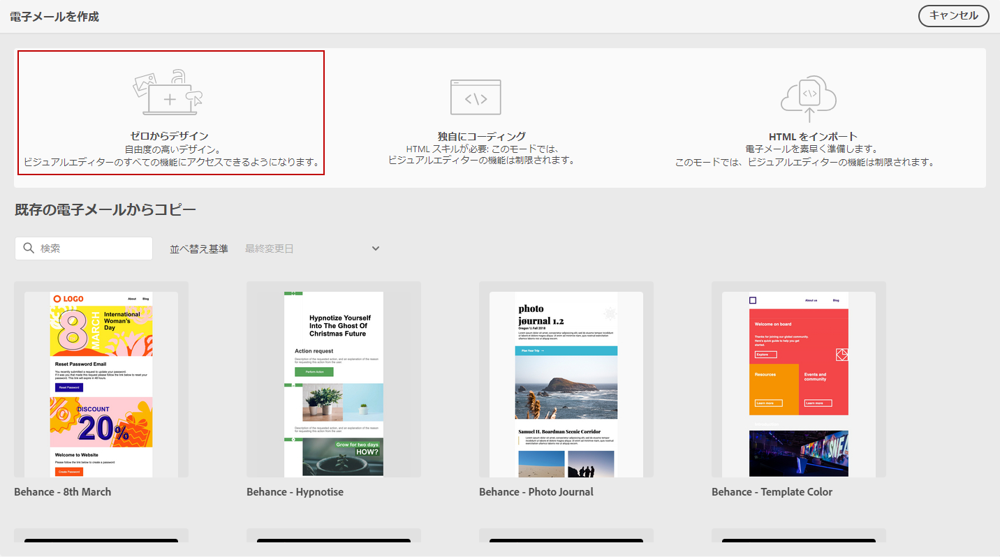
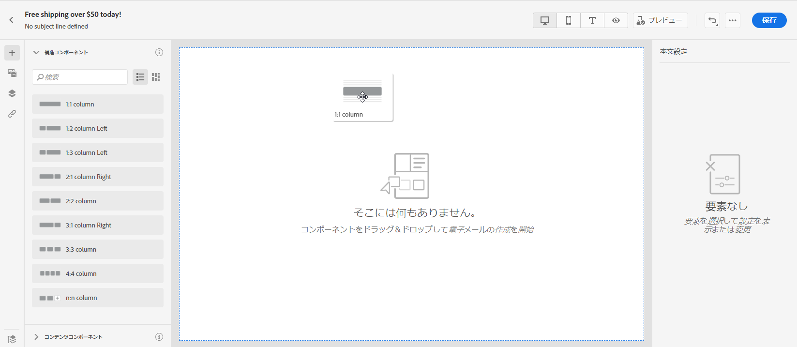
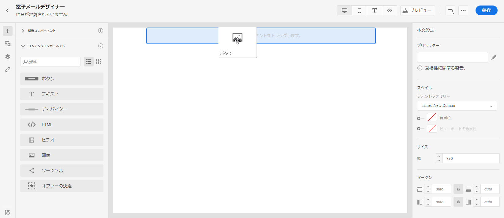
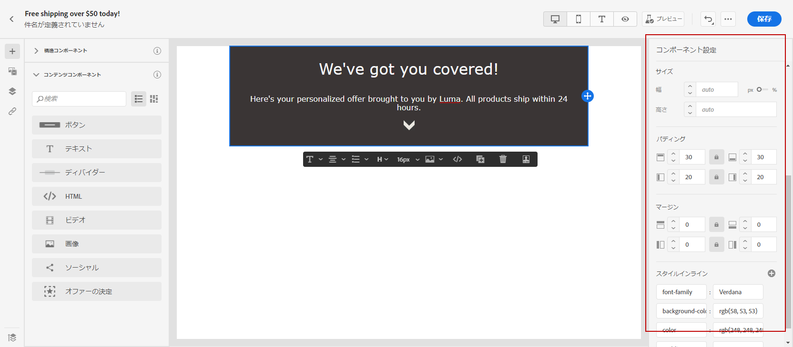
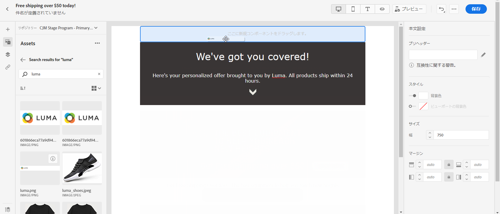
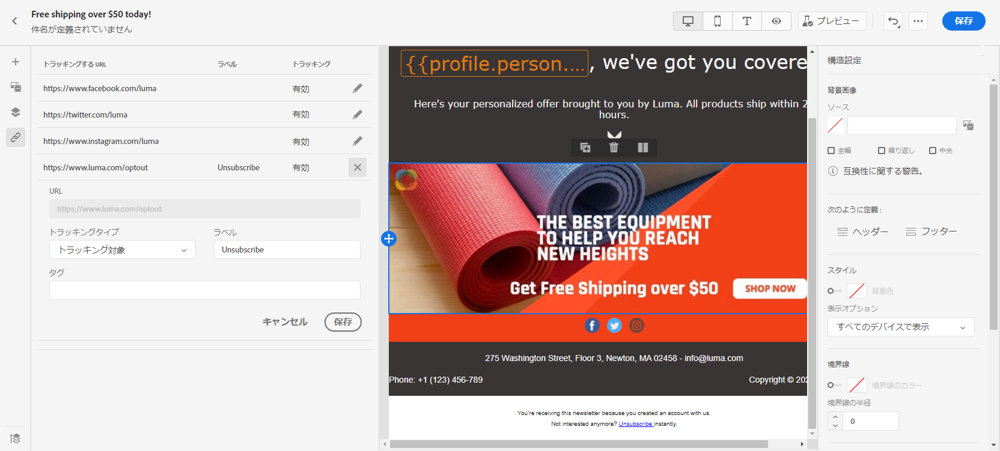
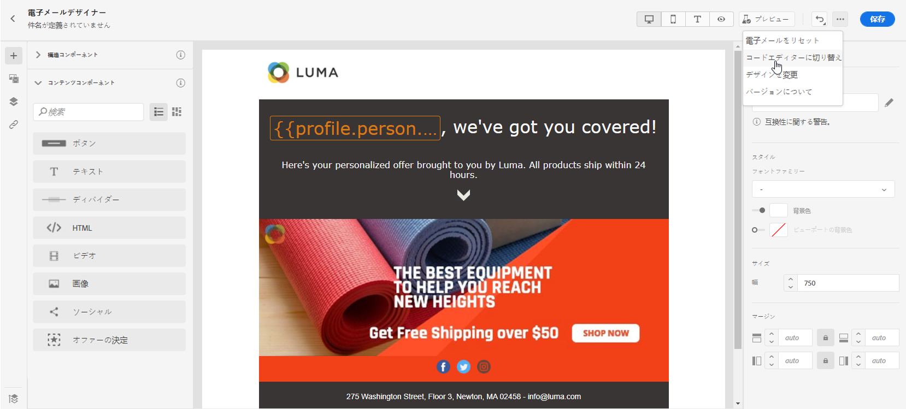
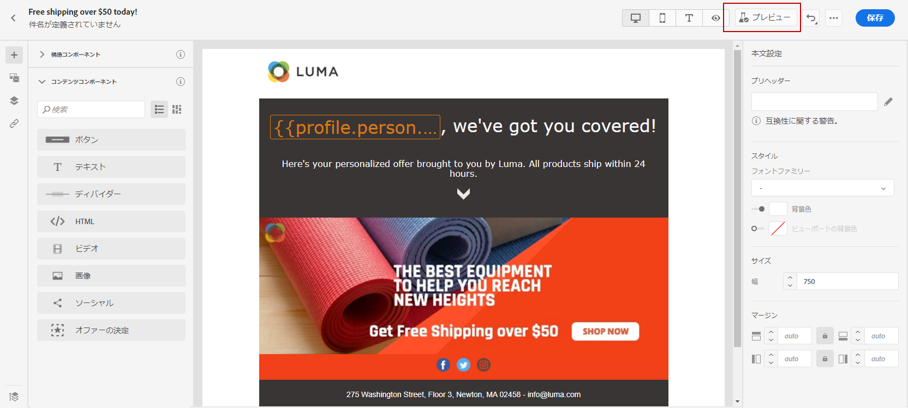

# 最初から開始 {#create-email-content}

>[!CONTEXTUALHELP]
>id="ac_structure_components"
>title="構造コンポーネントについて"
>abstract="構造コンポーネントはメールのレイアウトを定義します。"

>[!CONTEXTUALHELP]
>id="ac_edition_columns"
>title="メール列の定義"
>abstract="E メールデザイナーを使用すると、列構造を定義することで、メールのレイアウトを簡単に定義できます。"

E メールデザイナーを使用すると、メールの構造を簡単に定義できます。単純なドラッグ＆ドロップ操作で構造要素を追加したり移動したりして、メールの形を数秒でデザインすることができます。

E メールデザイナーでメールコンテンツの作成を開始するには、次の手順に従います。

1. E メールデザイナーのホームページで、 **[!UICONTROL ゼロからデザイン]** オプション。

   

1. ドラッグ&amp;ドロップで E メールコンテンツのデザインを開始 **[!UICONTROL 構造コンポーネント]** ：電子メールのレイアウトを定義します。

   >[!NOTE]
   >
   >列のスタックは、すべてのメールプログラムと互換性があるわけではありません。サポートされていない場合、列は積み重ねられません。
   >
   >メールに配置した後は、既にコンテンツコンポーネントまたはフラグメントが内部に配置されていない限り、コンポーネントを移動または削除できません。

   

1. 必要な数の&#x200B;**[!UICONTROL 構造コンポーネント]**&#x200B;を追加します。

   「**[!UICONTROL n:n 列]**」コンポーネントを選択して、選択する列数（3～10）を定義します。各列の下部にある矢印を動かして、各列の幅を定義することもできます。

   >[!NOTE]
   >
   >各列のサイズを構造コンポーネントの全幅の 10％未満にすることはできません。空でない列は削除できません。

1. 「**[!UICONTROL コンテンツコンポーネント]**」ドロップダウンから、必要な数の&#x200B;**[!UICONTROL コンテンツコンポーネント]**&#x200B;を構造コンポーネントに追加できます。[コンテンツコンポーネントの詳細情報](content-components.md)。

   

1. 各コンポーネントは、「**[!UICONTROL コンポーネント設定]**」セクションで詳細にカスタマイズできます。例えば、コンポーネントのテキストスタイル、パディング、またはマージンを変更できます。[整列とパディングの詳細については、こちらを参照](adjusting-vertical-alignment-and-padding.md)してください。

   

1.  「**[!UICONTROL アセットピッカー]**」から、**[!UICONTROL アセットライブラリ]**&#x200B;に保存されているアセットをメールに直接追加できます。[アセット管理の詳細情報](assets-essentials.md)。

   アセットを含むフォルダーをダブルクリックし、メールに追加するアセットをドラッグ＆ドロップします。

   

1. パーソナライズフィールドを追加して、プロファイルデータのコンテンツをカスタマイズします。[コンテンツのパーソナライゼーションの詳細情報](../personalization/personalize.md)。

   

1. 左側のペインの「**[!UICONTROL リンク]**」タブで、追跡するコンテンツのすべての URL のリストを確認します。必要に応じて、**[!UICONTROL トラッキングタイプ]**、**[!UICONTROL ラベル]**、**[!UICONTROL タグ]**&#x200B;を変更できます。

   

   >[!NOTE]
   >
   >リンクとメッセージの追跡について詳しくは、[このページ](message-tracking.md)を参照してください。

1. 必要に応じて、詳細メニューの「**[!UICONTROL コードエディターに切り替え]**」をクリックしてコードエディターに切り替え、メールをさらにパーソナライズできます。コードエディターについて詳しくは、[このページ](code-content.md#)を参照してください。

   >[!NOTE]
   >
   >コードエディターに切り替えると、このメールのビジュアルデザイナーは使用できなくなります。

   

1. 「**[!UICONTROL プレビューを表示]**」をクリックして、メールのレンダリングを確認します。デスクトップまたはモバイル表示を選択できます。

   メールのプレビュー方法について詳しくは、[このページ](preview.md)を参照してください。

   

1. メールの準備が整ったら、「**[!UICONTROL 保存して閉じる]**」をクリックします。

これで、メッセージでメールコンテンツを使用できるようになります。[メッセージの送信方法の詳細情報](../messages/publish-manage-message.md)。

## ハウツービデオ {#video}

メッセージエディターで E メールコンテンツを作成する方法を説明します。

>[!VIDEO](https://video.tv.adobe.com/v/334150?quality=12)