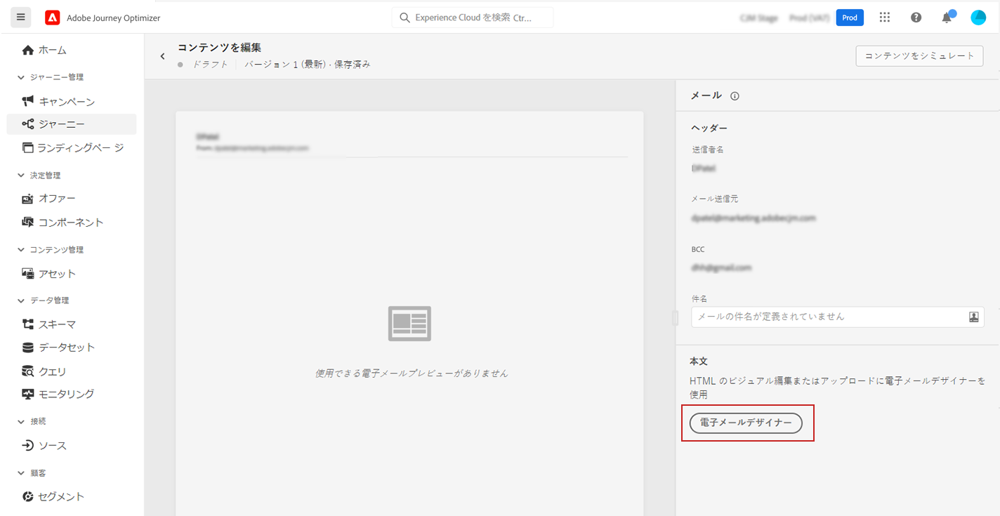
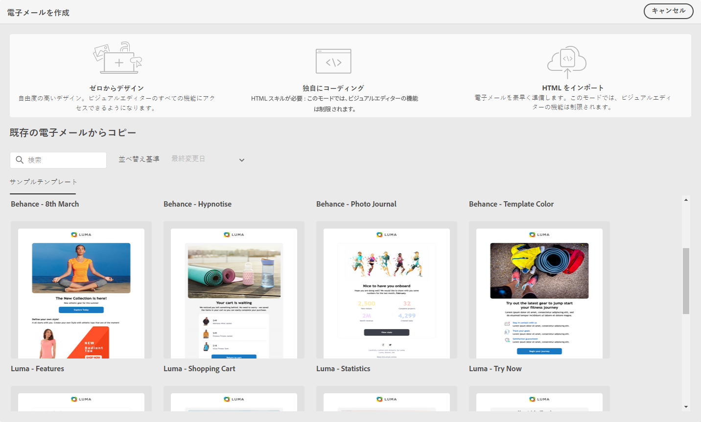

# メールデザインの基本を学ぶ {#get-started-content-design}

[!DNL Journey Optimizer] に既存のコンテンツを読み込むことも、コンテンツデザイン機能を活用することもできます。

* [!DNL Journey Optimizer] **メールデザイン機能**&#x200B;を使用して、レスポンシブなメールのデザインや読み込みを行います。[詳細情報](../design/create-email-content.md)

* **Adobe Experience Manager Assets Essentials** を活用してメールを強化し、独自のアセットデータベースを作成および管理します。[詳細情報](../design/assets-essentials.md)

* **Adobe Stock の写真**&#x200B;を検索しコンテンツを作成し、メールデザインを向上します。[詳細情報](../design/stock.md)

* プロファイル属性に基づいてパーソナライズされたメッセージと動的メッセージを作成し、カスタマーエクスペリエンスを強化します。[パーソナライズ機能](../personalization/personalize.md)および[動的コンテンツ](../personalization/get-started-dynamic-content.md)の詳細をご覧ください。

➡️ [この機能をビデオで確認](#video)

[メッセージを作成](../messages/get-started-content.md)したら、メールコンテンツの作成に取り掛かることができます。

1. 新しく作成したメッセージから、「**[!UICONTROL 本文]**」セクションの「**[!UICONTROL E メールデザイナー]**」を選択します。

   

1. 電子メールデザイナーのホームページで、次のオプションからメールのデザイン方法を選択します。

   * 電子メールデザイナーのインターフェイスで&#x200B;**メールをゼロから設計**&#x200B;し、[Adobe Experience Manager Assets Essentials](assets-essentials.md) の画像を活用します。メールコンテンツの設計方法や、ビルトインテンプレートについては、[この節](create-email-content.md)を参照してください。

   * サンプルテンプレートのリストで、**既存の電子メールからコピー**&#x200B;します。

   * 電子メールデザイナーで直接 **Raw HTML をコーディングまたは貼り付け**&#x200B;ます。独自のコンテンツの作成方法については、[この節](code-content.md)を参照してください。

   * ファイルまたは .zip フォルダーから&#x200B;**既存の HTML コンテンツを読み込み**&#x200B;ます。メールコンテンツの読み込み方法については、[この節](existing-content.md)を参照してください。

   

これらの機能はすべて、メッセージ作成画面から電子メールデザイナーにアクセスする場合に使用できます。[メッセージの作成の詳細情報](../messages/get-started-content.md)。

## ハウツービデオ {#video}

メッセージエディターでメールコンテンツを作成する方法を説明します。

>[!VIDEO](https://video.tv.adobe.com/v/334150?quality=12)