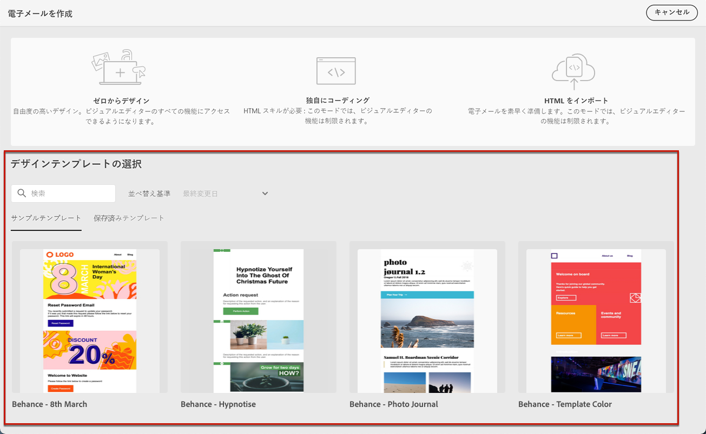
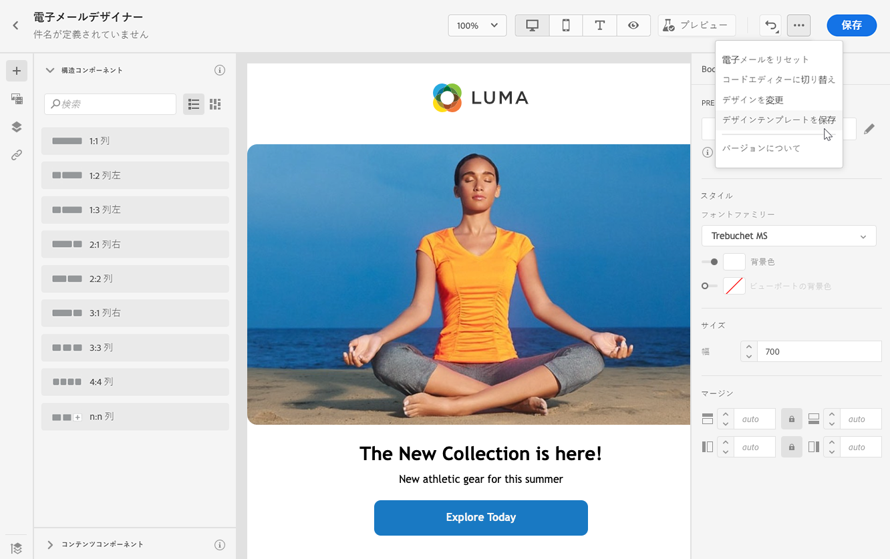
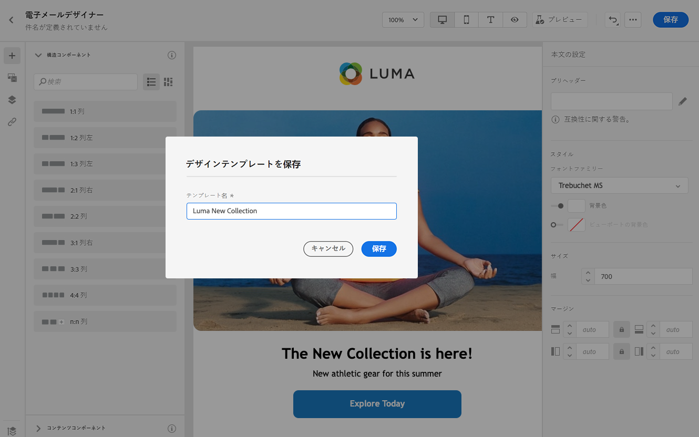
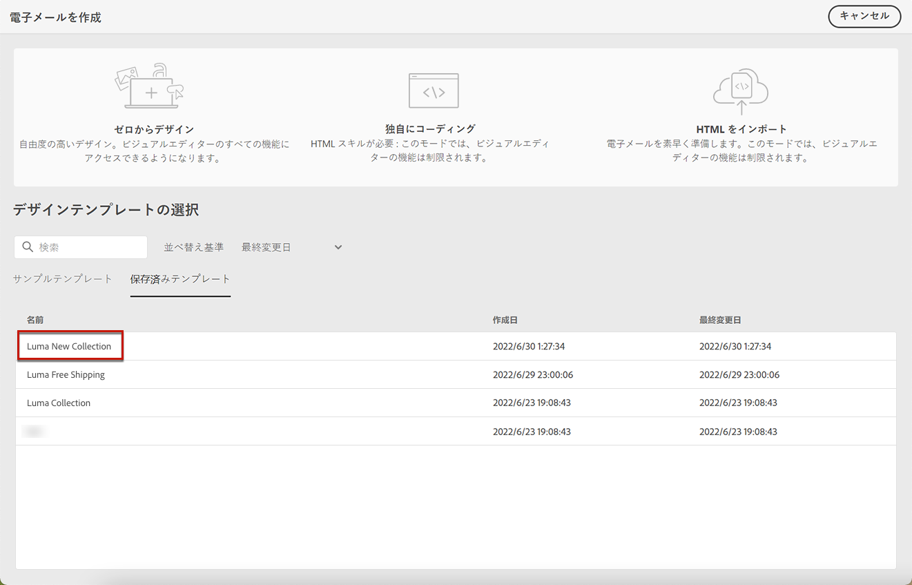
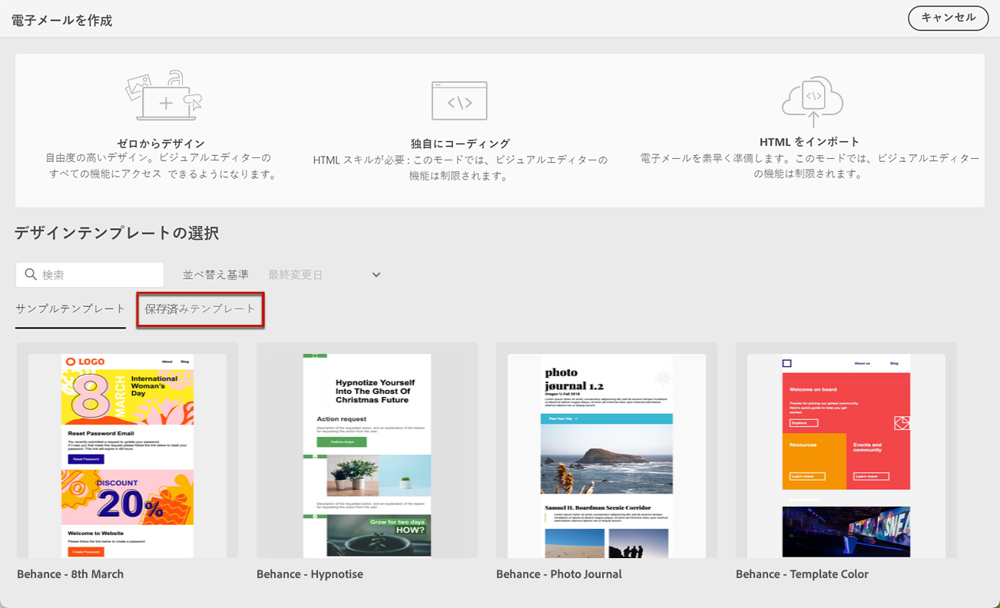
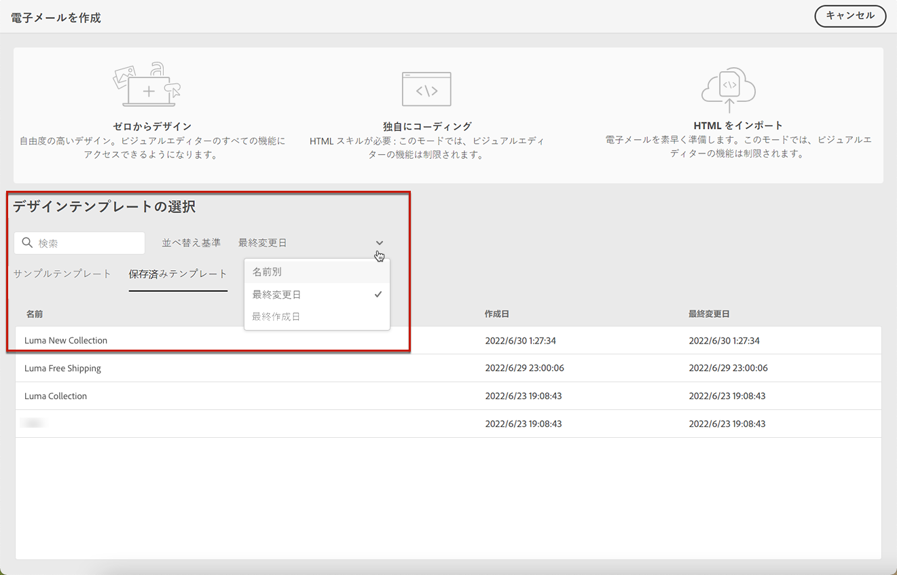
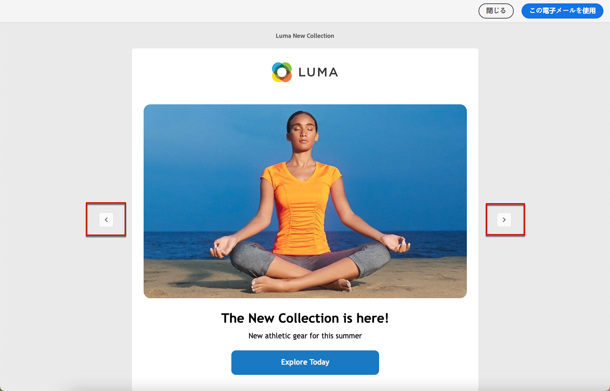

# メールテンプレートの操作 {#email-templates}

「 **[!UICONTROL デザインテンプレートを選択]**」セクションを使用して、テンプレートからコンテンツを作成します。

次の中から選択できます。
* 20 個の標準メールテンプレート。
* 保存済みテンプレート。[詳細情報](#save-as-template)

## テンプレートとして保存 {#save-as-template}

>[!CONTEXTUALHELP]
>id="ajo_messages_depecrated_inventory"
>title="メッセージの移行方法を説明します。"
>abstract="2022年7月25日（PT）より、メッセージメニューが表示されなくなり、ジャーニーから直接メッセージが作成されます。 従来のメッセージをジャーニーで再利用する場合は、それらをテンプレートとして保存する必要があります。"

[メールコンテンツ](design-emails.md)をデザインしたら、後日再利用するために保存できます。それには、次の手順に従います。

1. 画面の右上にある省略記号をクリックします。

1. ドロップダウンメニューから「**[!UICONTROL デザインテンプレートを保存]**」を選択します。

   

1. このテンプレートの名前を追加します。

   

1. 「**[!UICONTROL 保存]**」をクリックします。

次回メールを作成する際には、このテンプレートを使用してコンテンツを作成できます。[方法についてはこちらを参照](#use-saved-template)

## 保存済みテンプレートの使用 {#use-saved-template}

1. [電子メールデザイナー](create-email-content.md)を開きます。

1. **[!UICONTROL メールを作成]**&#x200B;画面で、「**[!UICONTROL サンプルテンプレート]**」タブがデフォルトで選択されています。「**[!UICONTROL 保存済みテンプレート]**」タブを選択します。

   

1. 以前[保存したすべてのテンプレート](#save-as-template)のリストが表示されます。**[!UICONTROL 名前別]**、**[!UICONTROL 最終変更日]**&#x200B;および&#x200B;**[!UICONTROL 最終作成日]**&#x200B;で並べ替え可能です。

   

1. リストから目的のテンプレートを選択します。

1. 選択したら、左右の矢印を使用して、保存済みのすべてのテンプレート間を移動できます。

   

1. 画面右上の「**[!UICONTROL この電子メールを使用]**」をクリックします。

1. 電子メールデザイナーを使用して、必要に応じてコンテンツを編集します。
