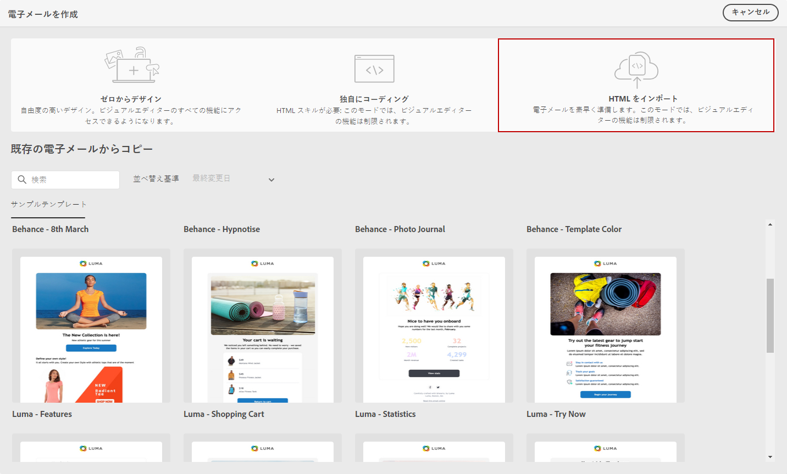

# メールコンテンツの読み込み {#existing-content}

Journey Optimizer では、既存の HTML コンテンツをインポートしてメールを設計できます。このコンテンツには次のようなものがあります。

* スタイルシートが組み込まれた **HTML ファイル**、
* HTML ファイル、スタイルシート（.css）、画像を含む **.zip フォルダー**。

   >[!NOTE]
   >
   >.zip ファイル構造に制限はありません。ただし、.zip フォルダーのツリー構造に合わせて、相対参照を指定する必要があります。

HTML コンテンツを含むファイルを読み込むには、次の手順に従います。

1. E メールデザイナーのホームページで、「**[!UICONTROL HTML を読み込む]**」を選択します。

   

1. HTML コンテンツを含む HTML または .zip ファイルをドラッグ＆ドロップします。

1. HTML コンテンツがアップロードされると、E メールデザイナーの機能を利用してメールの編集とプレビューをおこなうことができます。[詳しくは、この節](create-email-content.md)を参照してください。

   

## ハウツービデオ {#video}

既存の HTML コンテンツの読み込み、デザインの調整、ミラーページと購読解除リンクの追加およびコンテンツのコーディング方法について説明します。

>[!VIDEO](https://video.tv.adobe.com/v/334102?quality=12)
