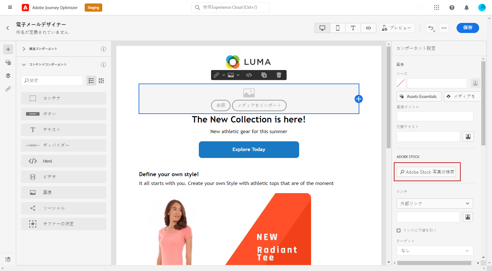
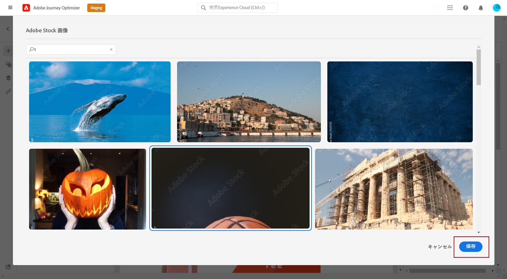
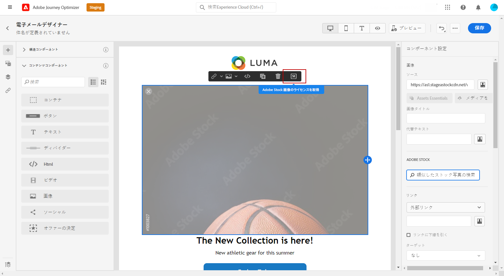
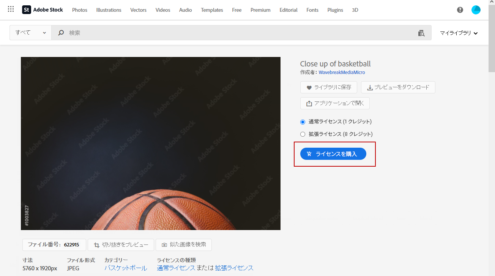
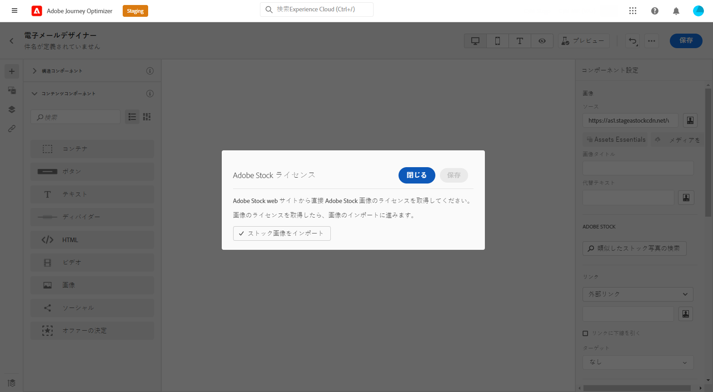
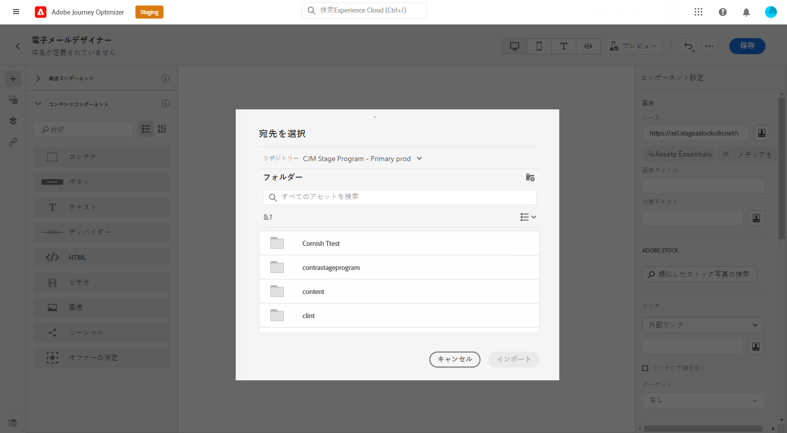
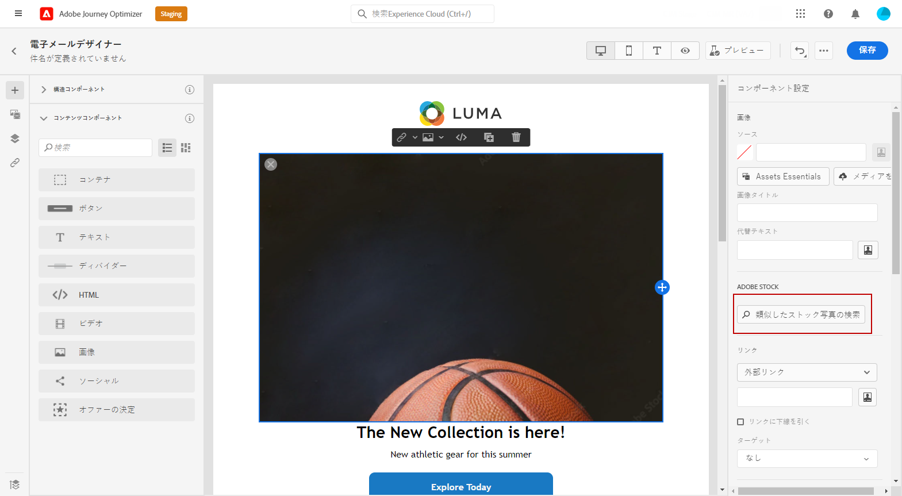
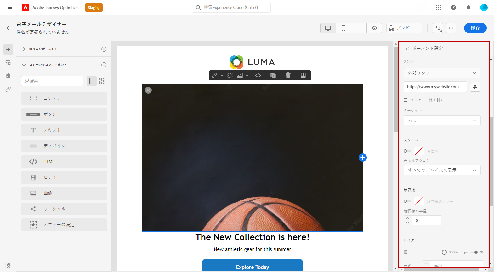

# 管理 [!DNL Adobe Stock] 画像 {#stock}

## [!DNL Adobe Stock] の基本を学ぶ {#get-started-stock}

[!DNL Adobe Stock] は、何百万もの高品質で厳選された、ロイヤリティフリーの写真、ビデオ、イラスト、ベクトルグラフィックを利用できます。 クレジットパックを購入してアセットのライセンスを取得するか、必要なアセットに対して Standard または Extended のライセンスを 1 つだけ購入するかを選択できます。 Adobe Stockはまた、アセットの無料コレクションを提供しています。

詳しくは、 [!DNL Adobe Stock]（を参照） [Adobe Stockはじめに](https://helpx.adobe.com/stock/get-started.html).

を使用 [!DNL Adobe Journey Optimizer]を使用すると、 [!DNL Adobe Stock] をクリックし、Assets フォルダーに追加します。 この **[!UICONTROL 類似画像を検索]** オプションを使用すると、配信で使用されるアセットのコンテンツ、色、構成に一致する画像を検索できます。
メールデザインについて詳しくは、[こちら](design-emails.md)を参照してください。

## 挿入と読み込み [!DNL Adobe Stock] 画像 {#add-stock-image}

E メールを編集およびパーソナライズした後、 [!DNL Adobe Stock] をテンプレートに追加します。

1. 画像をドラッグ&amp;ドロップ **[!UICONTROL コンテンツコンポーネント]** を電子メールに送信します。

   

1. 次の **[!UICONTROL コンポーネント設定]** メニュー、選択 **[!UICONTROL Adobe Stockの写真を検索]**.

   

1. ライブラリを参照するか、フィールドに検索語句を入力します。 選択した画像を選択し、 **[!UICONTROL 保存]**.

   

1. 画像のライセンスを取得してダウンロードするには、画像を選択します **[!UICONTROL コンテンツコンポーネント]** をクリックし、 **[!UICONTROL Adobe Stock画像のライセンス]**. 次のページにリダイレクトされます： [!DNL Adobe Stock] web サイト。

   >[!NOTE]
   > 画像が既にライセンスされている場合は、  アイコン その場合は、手順 7 に進むことができます。

   

1. 次の [!DNL Adobe Stock] web サイトで画像をダウンロードして透かしを削除するには、アセットを購入する必要があります。

   この購入は、Adobe Stockのプランまたはサブスクリプションによって異なります。 詳しくは、この[ページ](https://stock.adobe.com/plans)を参照してください。

   >[!WARNING]
   > ライセンスが不要な画像を含む E メールが送信された場合、画像は、ライセンスが不要なフォームの透かしを保持します。

   

1. 購入が完了したら、次のページで E メールに戻ることができます。 [!DNL Adobe Journey Optimizer] を選択し、 **[!UICONTROL 在庫画像をインポート]** をクリックして、ライセンス済みの画像をアセットに読み込みます。

   

1. アセットを保存するフォルダーを選択します。 詳しくは、 [!DNL Assets Essentials]（これを参照） [ページ](assets-essentials.md#get-started-assets-essentials).

   

1. 次から画像を選択した後： [!DNL Adobe Stock]、 **[!UICONTROL 類似の写真を検索]** 」オプションを使用して、画像のコンテンツ、カラーおよび構成に一致するアセットを検索できます。

   このオプションは、Assets フォルダー内のライセンス済み/ライセンス未取得の Stock 画像と画像に対して使用できます。

   

1. 画像を **[!UICONTROL コンポーネント設定]** メニュー コンポーネント設定について詳しくは、[こちら](content-components.md)を参照してください。

   

メッセージを作成してパーソナライズしたら、公開することで実行が可能になります。[詳細情報](../messages/publish-manage-message.md)