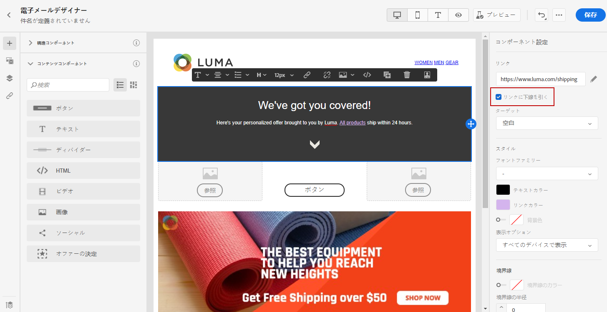
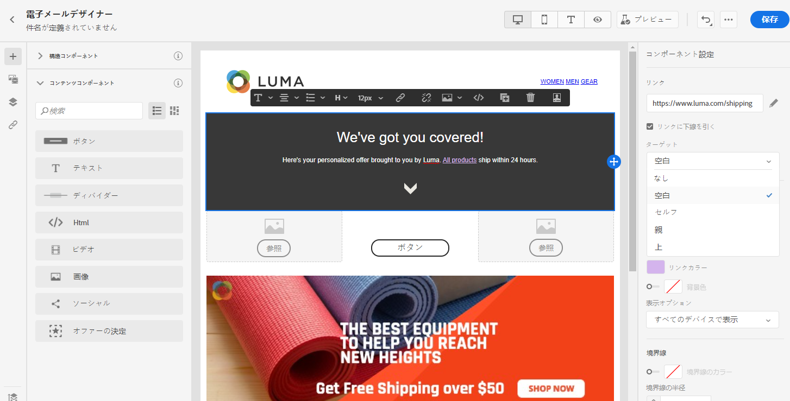

# リンクのスタイルの定義 {#styling-links}

E メールデザイナーでリンクに下線を引き、リンクの色とターゲットを選択できます。

1. リンクが挿入されるテキスト&#x200B;**[!UICONTROL コンテンツコンポーネント]**&#x200B;で、リンクを選択します。

1. **[!UICONTROL コンポーネント設定]**&#x200B;メニューで、「**[!UICONTROL リンクに下線を引く]**」にチェックを入れると、リンクのラベルテキストに下線を引くことができます。

   

1. **[!UICONTROL ターゲット]**&#x200B;ドロップダウンで、オーディエンスのリダイレクト方法を選択します。

   * **[!UICONTROL なし]**：クリックしたフレームと同じフレームでリンクを開きます（デフォルト）。
   * **[!UICONTROL 空白]**：リンクを新しいウィンドウまたは新しいタブで開きます。
   * **[!UICONTROL セルフ]**：クリックしたフレームと同じフレームでリンクを開きます。
   * **[!UICONTROL 親]**：親フレームでリンクを開きます。
   * **[!UICONTROL トップ]**：ウィンドウ全体でリンクを開きます。

   

1. リンクの色を変更するには、「**[!UICONTROL リンクの色]**」をクリックします。

   

1. 必要な色を選択します。

1. 変更を保存します。
