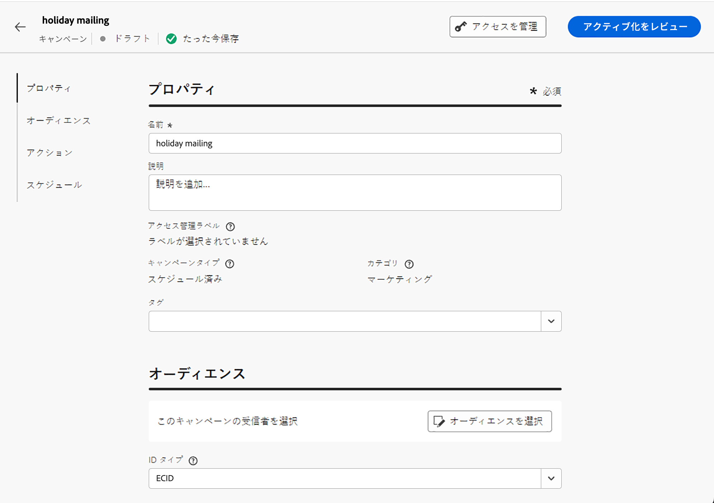

# ダイレクトメールメッセージの作成 {#create-direct}

>[!CONTEXTUALHELP]
>id="ajo_direct_mail"
>title="ダイレクトメールの作成"
>abstract="スケジュールされたキャンペーンでダイレクトメールメッセージを作成し、ダイレクトメールプロバイダーが顧客にメールを送信するために必要な抽出ファイルを設計します。"

## ダイレクトメールキャンペーンの作成{#create-dm-campaign}

1. 新しいスケジュール済みキャンペーンを作成し、 **[!UICONTROL ダイレクトメール]** を選択します。

1. を選択します。 **[!UICONTROL ダイレクトメールサーフェス]** を使用して、をクリックします。 **[!UICONTROL 作成]**. [ダイレクトメールサーフェスの作成方法を学ぶ](direct-mail-configuration.md#direct-mail-surface).

   {width="800" align="center"}

1. Adobe Analytics の **[!UICONTROL プロパティ]** セクションで、キャンペーンの **[!UICONTROL タイトル]** および **[!UICONTROL 説明]**.

1. ターゲットオーディエンスを定義するには、 **[!UICONTROL オーディエンスを選択]** 」ボタンをクリックして、使用可能なAdobe Experience Platformオーディエンスから選択します。 [詳細情報](../audience/about-audiences.md)

   >[!IMPORTANT]
   >
   >現時点では、オーディエンスの選択は 300 万個のプロファイルに制限されています。 この制限は、Adobe担当者へのリクエストに応じて解除できます。

1. Adobe Analytics の **[!UICONTROL ID 名前空間]** 「 」フィールドで、適切な名前空間を選択して、選択したオーディエンス内の個人を識別します。 [詳細情報](../event/about-creating.md#select-the-namespace)

   {width="800" align="center"}

1. キャンペーンは、特定の日付にスケジュールを設定したり、定期的に繰り返されるように設定したりできます。 キャンペーンの&#x200B;**[!UICONTROL スケジュール]**&#x200B;を設定する方法については、[この節](../campaigns/create-campaign.md#schedule)を参照してください。

これで、ダイレクトメールプロバイダーに送信する抽出ファイルの設定を開始できます。

## 抽出ファイルの設定 {#extraction-file}

1. キャンペーンの設定画面で、 **[!UICONTROL コンテンツを編集]** ボタンをクリックして抽出ファイルのコンテンツを設定します。

1. 抽出ファイルのプロパティを調整します。

   1. 目的のを指定 **[!UICONTROL ファイル名]** 抽出ファイル用。

   1. オプションで、 **[!UICONTROL 書き出しファイル名にタイムスタンプを追加]** オプションを使用します。

   1. 抽出ファイルの先頭または末尾に情報を追加することが必要となる場合があります。これをおこなうには、 **[!UICONTROL メモ]** フィールドを指定して、メモをヘッダーまたはフッターとして含めるかどうかを指定します。

      {width="800" align="center"}

1. 抽出ファイルに表示する列と情報を設定します。

   1. 次をクリック： **[!UICONTROL 追加]** ボタンをクリックして新しい列を作成します。

   1. The **[!UICONTROL 書式設定]** 右側にパネルが表示され、選択した列を設定できます。 を指定します。 **[!UICONTROL ラベル]** 」と入力します。

   1. Adobe Analytics の **[!UICONTROL データ]** 「 」フィールドで、 [式エディター](../personalization/personalization-build-expressions.md).

   1. 列を使用して抽出ファイルを並べ替えるには、列を選択し、 **[!UICONTROL 並べ替え基準]** オプション。 The **[!UICONTROL 並べ替え基準]** アイコンは、 **[!UICONTROL データフィールド]** 」セクションに入力します。

      {width="800" align="center"}

   1. これらの手順を繰り返して、抽出ファイルに必要な数の列を追加します。 追加できる列数は最大 50 です。

      列の位置を変更するには、列を **[!UICONTROL データフィールド]** 」セクションに入力します。 列を削除するには、その列を選択し、 **[!UICONTROL 削除]** ボタン **[!UICONTROL 書式設定]** ウィンドウ

これで、ダイレクトメールメッセージをテストして、オーディエンスに送信できます。 [ダイレクトメールメッセージのテストと送信の方法を説明します](test-send-direct-mail.md)
