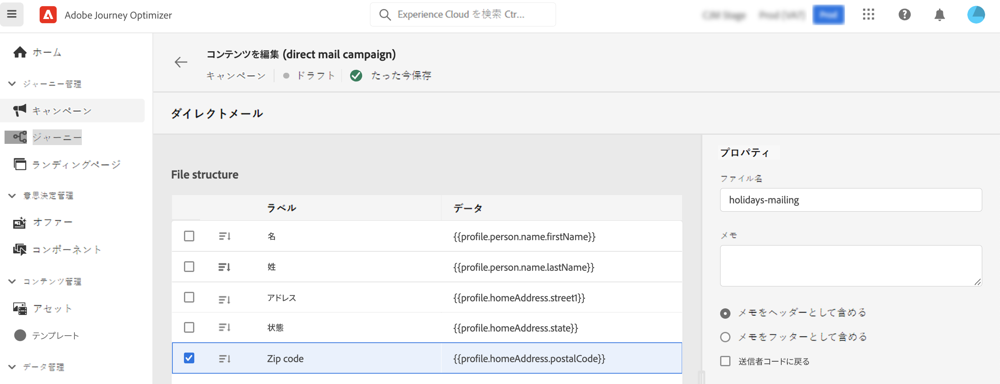

# ダイレクトメールメッセージの作成 {#create-direct}

>[!CONTEXTUALHELP]
>id="ajo_direct_mail"
>title="ダイレクトメールの作成"
>abstract="スケジュールされたキャンペーンでダイレクトメールメッセージを作成し、ダイレクトメールプロバイダーが顧客にメールを送信するために必要な抽出ファイルを設計します。"

>[!BEGINSHADEBOX]

このドキュメントの内容は次のとおりです。

* **[ダイレクトメールの作成](create-direct-mail.md)**
* [ダイレクトメールの設定](direct-mail-configuration.md)

>[!ENDSHADEBOX]

>[!AVAILABILITY]
>
>ダイレクトメールは現在、プライベートベータ版として利用可能で、予告なく頻繁に更新される場合があります。

ダイレクトメールは、ダイレクトメールプロバイダーが顧客にメールを送信するために必要な抽出ファイルをパーソナライズおよび生成できるオフラインチャネルです。

ダイレクトメールを作成すると、Journey Optimizer によって、すべてのターゲットプロファイルと選択したデータ（住所、プロファイル属性など）を含むファイルが生成されます。その後、ダイレクトメールプロバイダーは、そのファイルを取得でき、実際の送信処理を行います。

ダイレクトメールメッセージは、スケジュールされたキャンペーンのコンテキストでのみ作成できます。API トリガーキャンペーンやジャーニーでは使用できません。

>[!IMPORTANT]
>
>ダイレクトメールメッセージを送信する前に、次の設定が完了していることを確認します。
>
>1. [ファイルのルーティング設定](../direct-mail/direct-mail-configuration.md#file-routing-configuration)：抽出ファイルをアップロードして保存するサーバーを指定します。
>1. [ダイレクトメールメッセージサーフェス](../direct-mail/direct-mail-configuration.md#direct-mail-surface)：ファイルのルーティング設定を参照します。

## ダイレクトメールメッセージの作成 {#create}

ダイレクトメールメッセージを作成して送信する手順は次のとおりです。

1. 新しいスケジュール済みキャンペーンを作成し、アクションとして「**[!UICONTROL ダイレクトメール]**」を選択し、使用するチャネルサーフェスを選択します。[ダイレクトメールサーフェスの作成方法を学ぶ](../direct-mail/direct-mail-configuration.md#direct-mail-surface)

   

1. 「**[!UICONTROL 作成]**」をクリックして、キャンペーンの基本情報（名前、説明）を定義します。[キャンペーンの設定方法を学ぶ](../campaigns/create-campaign.md)

   

1. 「**[!UICONTROL コンテンツを編集]**」ボタンをクリックして、ダイレクトメールプロバイダーに送信する抽出ファイルを設定します。

1. 抽出ファイルの名前を「**[!UICONTROL ファイル名]**」フィールドで定義します。

   抽出ファイルの先頭または末尾に情報を追加することが必要となる場合があります。これを行うには、「**[!UICONTROL メモ]**」フィールドを使用して、メモをヘッダーまたはフッターとして含めるかどうかを指定します。

   <!--Click on the button to the right of the Output file field and enter the desired label. You can use personalization fields, content blocks and dynamic text (see Defining content). For example, you can complete the label with the delivery ID or the extraction date.-->

   

1. 左側の領域を使用して、抽出ファイルに列として表示される情報を定義します。

   1. 「**[!UICONTROL 追加]**」ボタンをクリックして新しい列を追加し、リストから選択します。

   1. 「**[!UICONTROL 書式設定]**」セクションで、列のラベルを指定し、[式エディター](../personalization/personalization-build-expressions.md)を使用して表示するプロファイル属性を定義します。

      

   1. 選択した列を使用して抽出ファイルを並べ替えるには、「**[!UICONTROL 並べ替え]**」オプションをオンに切り替えます。「**[!UICONTROL 並べ替え]**」アイコンは、ファイル構造の列のラベルの横に表示されます。

1. これらの手順を繰り返して、抽出ファイルを作成するために必要な数の列を追加します。追加できる列数は最大 50 です。

   列を選択して「**[!UICONTROL 書式設定]**」セクションの「**[!UICONTROL 削除]**」ボタンをクリックすると、いつでも列を削除できます。

   

1. ダイレクトメールのコンテンツを定義したら、キャンペーンの設定を完了します。

   キャンペーンが開始すると、抽出ファイルが自動的に生成され、[ファイルのルーティング設定](../direct-mail/direct-mail-configuration.md)で指定したサーバーに書き出されます。
