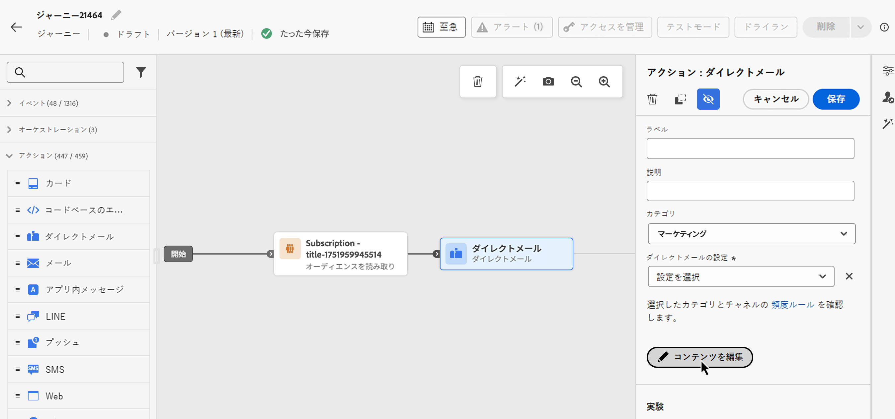
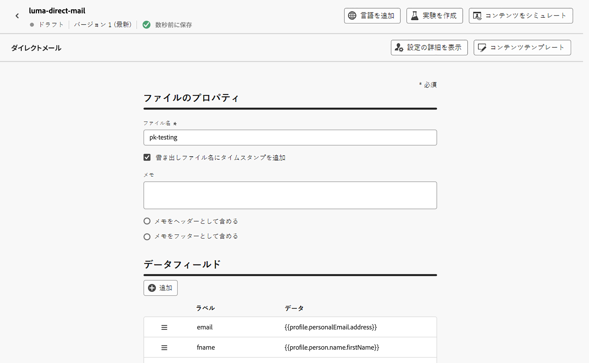
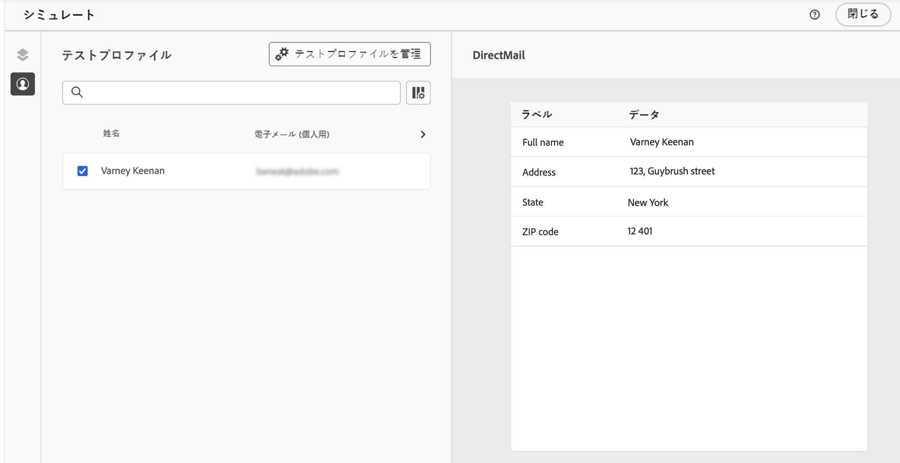
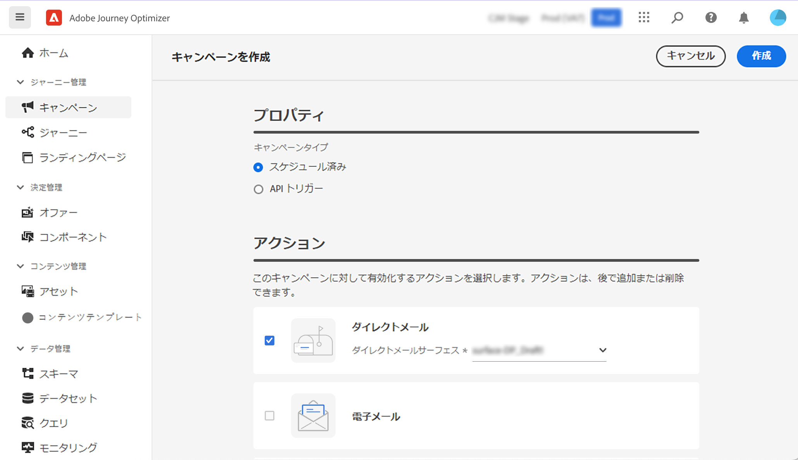
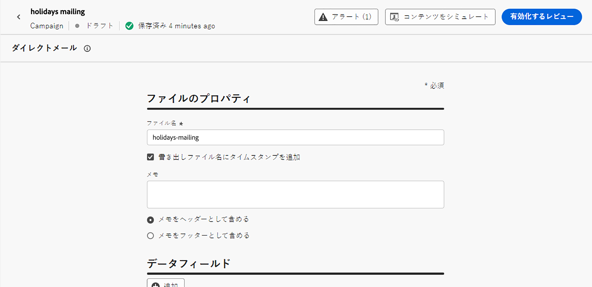
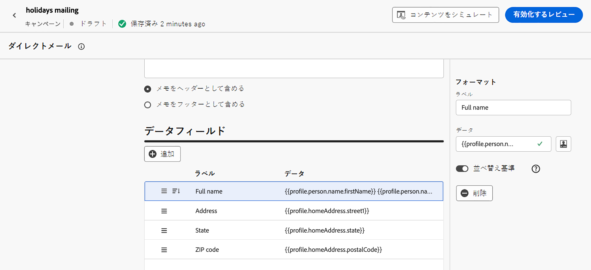

# ダイレクトメールメッセージの作成 {#create-direct}

>[!BEGINSHADEBOX]

**このページ：** キャンペーンまたはジャーニーにダイレクトメールメッセージを追加し、その抽出ファイルを設定して、ダイレクトメールプロバイダーが顧客にメールを送信するために必要なパーソナライズされたデータを持つようにします。

>[!ENDSHADEBOX]

>[!CONTEXTUALHELP]
>id="ajo_direct_mail"
>title="ダイレクトメールの作成"
>abstract="スケジュールキャンペーンとジャーニーでダイレクトメールメッセージを作成し、ダイレクトメールプロバイダーが顧客にメールを送信するのに必要な抽出ファイルを設計します。"

>[!CONTEXTUALHELP]
>id="ajo_journey_direct_mail"
>title="終了アクティビティ"
>abstract="ダイレクトメールは、サードパーティのダイレクトメールプロバイダーが顧客にメールを送信するために必要な抽出ファイルをパーソナライズおよび生成できるオフラインチャネルです。"

ダイレクトメールメッセージを作成するには、スケジュールされたキャンペーンまたはジャーニーを作成し、抽出ファイルを設定します。 このファイルは、ダイレクトメールプロバイダーが顧客にメールを送信するために必要です。

>[!IMPORTANT]
>
>ダイレクトメールメッセージを作成する前に、次の設定が完了していることを確認します。
>
>1. [ファイルのルーティング設定](../direct-mail/direct-mail-configuration.md#file-routing-configuration)：抽出ファイルをアップロードして保存するサーバーを指定します。
>1. [ダイレクトメールメッセージ設定](../direct-mail/direct-mail-configuration.md#direct-mail-surface)：ファイルのルーティング設定を参照します。

## ダイレクトメールメッセージの追加 {#create-dm-campaign}

>[!CONTEXTUALHELP]
>id="ajo_journey_action_direct_mail"
>title="ダイレクトメールアクション"
>abstract="ダイレクトメールチャネルアクションは、プロファイルがジャーニーのこのステップに到達したときに、プロファイルのダイレクトメールコンテンツを生成します。 ラベルはジャーニーキャンバス内のアクティビティを識別し、アクションは配信されるコンテンツを定義するダイレクトメール設定を参照します。 **最適化** セクションには、コンテンツの実験やターゲティングルールを含めることができます。また、**多言語** セクションには多言語のコンテンツを配信できます。アクションが失敗した場合、**タイムアウトまたはエラー** セクションには代替パスを定義できます。"
>additional-url="https://experienceleague.adobe.com/en/docs/journey-optimizer/using/orchestrate-journeys/about-journey-building/journey-action#add-action" text="チャネルアクションの概要"

キャンペーンまたはジャーニーにダイレクトメールメッセージを追加する方法については、以下のタブを参照してください。

>[!BEGINTABS]

>[!TAB  ダイレクトメールメッセージをジャーニーに追加]

1. ジャーニーを開き、パレットの「**アクション**」セクションから&#x200B;**[!UICONTROL ダイレクトメール]**&#x200B;アクティビティをドラッグ＆ドロップします。

1. メッセージに関する基本情報（ラベル、説明、カテゴリ）を入力したあと、使用するメッセージ設定を選択します。 **[!UICONTROL 設定]**&#x200B;フィールドはデフォルトで、ユーザーがチャネルで最後に使用した設定で事前入力されます。 ジャーニーの設定方法について詳しくは、[このページ](../building-journeys/journey-gs.md)を参照してください。

1. ダイレクトメールプロバイダーに送信する抽出ファイルを設定します。 これを行うには、「**[!UICONTROL コンテンツを編集]**」ボタンをクリックします。

   

1. ファイル名や表示する列など、抽出ファイルのプロパティを調整します。 抽出ファイルのプロパティの設定方法について詳しくは、[ダイレクトメールメッセージの作成](../direct-mail/create-direct-mail.md#extraction-file)の節を参照してください。

   

1. 抽出ファイルのコンテンツを定義したら、**[!UICONTROL コンテンツのシミュレーション]**&#x200B;を使用してプレビューします。 [コンテンツのプレビューとテストの方法について学ぶ](../content-management/preview-test.md)

   {width="800" align="center"}

抽出ファイルの準備が整ったら、[ジャーニー](../building-journeys/journey-gs.md)の設定を完了させて送信します。

>[!TAB  ダイレクトメールメッセージをキャンペーンに追加]

1. **[!UICONTROL キャンペーン]**&#x200B;メニューにアクセスし、「**[!UICONTROL キャンペーンを作成]**」をクリックします。

1. キャンペーンのタイプとして&#x200B;**スケジュール済み - マーケティング**&#x200B;を選択します。

1. 「**[!UICONTROL プロパティ]**」セクションで、キャンペーンの「**[!UICONTROL タイトル]**」と「**[!UICONTROL 説明]**」を編集します。

1. ターゲットオーディエンスを定義するには、「**[!UICONTROL オーディエンスを選択]**」ボタンをクリックして、使用可能な Adobe Experience Platform オーディエンスから選択します。 [学習を増やす](../audience/about-audiences.md)。

   >[!IMPORTANT]
   >
   >現時点では、オーディエンスの選択は 300 万プロファイルに制限されています。 この制限は、アドビ担当者にリクエストすることで解除できます。

1. 「**[!UICONTROL ID 名前空間]**」フィールドで、選択したオーディエンス内の個人を識別するために適した名前空間を選択します。 [学習を増やす](../event/about-creating.md#select-the-namespace)。

1. 「**[!UICONTROL アクション]**」セクションで、「**[!UICONTROL ダイレクトメール]**」を選択します。

1. 使用する&#x200B;**[!UICONTROL ダイレクトメール設定]**&#x200B;を選択または作成します。 [ダイレクトメール設定の作成方法について詳しくは、こちらを参照してください](direct-mail-configuration.md#direct-mail-surface)。

   {width="800" align="center"}

   >[!AVAILABILITY]
   >
   >ダイレクトメールは&#x200B;**Holdout**&#x200B;機能をサポートしていますが、現在&#x200B;**処理**&#x200B;をサポートしていません。 [実験の操作方法を学ぶ](../content-management/get-started-experiment.md)

1. キャンペーンは特定の日付にスケジュールすることも、定期的に繰り返すように設定することもできます。 キャンペーンの&#x200B;**[!UICONTROL スケジュール]**&#x200B;を設定する方法については、[この節](../campaigns/campaign-schedule.md)を参照してください。

これで、ダイレクトメールプロバイダーに送信する抽出ファイルの設定を開始できます。

>[!ENDTABS]

## 抽出ファイルの設定 {#extraction-file}

>[!CONTEXTUALHELP]
>id="ajo_direct_mail_data_fields"
>title="データフィールド"
>abstract="ダイレクトメールプロバイダーが顧客にメールを送信するために必要な抽出ファイルに表示する列と情報を追加および設定します。 最大 50 列を追加できます。"

>[!CONTEXTUALHELP]
>id="ajo_direct_mail_formatting"
>title="抽出ファイルの書式設定"
>abstract="各フィールドで、パーソナライゼーションエディターを使用して、ラベルと表示する情報を指定します。   「<b>並べ替え基準</b>」オプションを使用すると、選択したフィールドを使用して、抽出ファイルの列を並べ替えることができます。"

抽出ファイルは、ダイレクトメールプロバイダーが顧客にメールを送信するために必要です。 抽出ファイルの設定を定義するには、次の手順に従います。

1. キャンペーンまたはジャーニーの設定画面で、「**[!UICONTROL コンテンツを編集]**」ボタンをクリックして、抽出ファイルのコンテンツを設定します。

1. ダイレクトメールメッセージに決定ポリシーを追加するには、**[!UICONTROL データフィールド]** セクションの列を選択し、 アイコンを使用してパーソナライゼーションエディターを開きます。 決定ポリシーを作成して挿入するには、**[!UICONTROL 決定ポリシー]** メニューに移動します。 その後、抽出ファイルの列データとして決定項目属性を使用できます。

   >[!AVAILABILITY]
   >
   >ダイレクトメールのエクスペリエンス決定は新しい機能です。 以前は、ダイレクトメール抽出ファイルでは決定エンジンを使用できませんでした。決定ポリシーを追加し、決定項目属性を列データとして書き出しに含めることができるようになりました。

   [&#x200B; ダイレクトメールで決定ポリシーを追加する方法について説明します](../experience-decisioning/create-decision-policy.md#add)。 バッチ決定ワークフローと例（パーソナライズされたダイレクトメールまたはダウンストリームシステムへの書き出し）については、[&#x200B; ダイレクトメールでのバッチ決定](../experience-decisioning/batch-decisioning-direct-mail.md)を参照してください。

1. 次のように、抽出ファイルのプロパティを調整します。

   1. 「**[!UICONTROL ファイル名]**」フィールドで、抽出ファイルの名前を指定します。

      >[!NOTE]
      >
      >デフォルトでは、ファイルはサーバーのルートディレクトリに書き込まれます。 また、「**[!UICONTROL ファイル名]**」フィールドでは、「/your/path/here/Filename.csv」という形式も受け入れられます。指定したパスは、選択したサーバー上のターゲットディレクトリです。<!--TBC if for SFTP and Azure only, or for all servers including S3-->

   1. 指定したファイル名に自動タイムスタンプを付加する場合は、「**[!UICONTROL エクスポートファイル名にタイムスタンプを追加]**」オプションを有効にします。

   1. 抽出ファイルの先頭または末尾に情報を追加することが必要になる場合があります。 その場合は、「**[!UICONTROL メモ]**」フィールドを使用して、メモをヘッダーまたはフッターとして含めるかどうかを指定します。

      {width="800" align="center"}

1. 抽出ファイルに表示する列と情報を設定します。

   1. 「**[!UICONTROL 追加]**」ボタンをクリックして、新しい列を作成します。

   1. 右側に&#x200B;**[!UICONTROL フォーマット]**&#x200B;パネルが表示され、選択した列をセットアップできます。 列の「**[!UICONTROL ラベル]**」を指定します。

   1. 「**[!UICONTROL データ]**」フィールドで、[パーソナライゼーションエディター](../personalization/personalization-build-expressions.md)を使用して、表示するプロファイル属性を選択します。

   1. 列を使用して抽出ファイルを並べ替えるには、列を選択し、「**[!UICONTROL 並べ替え基準]**」オプションの切替スイッチをオンにします。 「**[!UICONTROL データフィールド]**」セクションで、列のラベルの横に&#x200B;**[!UICONTROL 並べ替え基準]**&#x200B;アイコンが表示されます。

      {width="800" align="center"}

   1. これらの手順を繰り返して、抽出ファイルに必要な数の列を追加します。 なお、追加できる列数は最大 50 です。

      列の位置を変更するには、「**[!UICONTROL データフィールド]**」セクションで、目的の位置に列をドラッグ＆ドロップします。 列を削除するには、列を選択し、**[!UICONTROL フォーマット]**&#x200B;パネルの「**[!UICONTROL 削除]**」ボタンをクリックします。

これで、ダイレクトメールメッセージをテストし、オーディエンスに送信できるようになりました。 [ダイレクトメールメッセージのテストおよび送信の方法についてはこちらを参照](test-send-direct-mail.md)

## 関連トピック {#related-topics}

* [ダイレクトメールの基本を学ぶ](get-started-direct-mail.md)
* [ダイレクトメールチャネルの設定](direct-mail-configuration.md)
* [ダイレクトメールのテストと送信](test-send-direct-mail.md)
* [コンテンツのプレビューとテスト](../content-management/preview-test.md)

ダイレクトメールに関するよくある質問については、[&#x200B; ダイレクトメールの基本を学ぶ](get-started-direct-mail.md)を参照してください。
