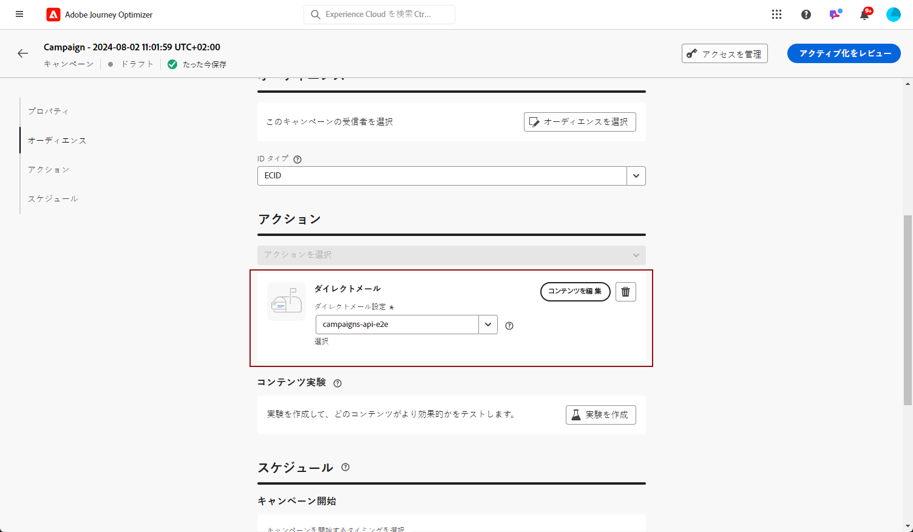

# ダイレクトメールメッセージの作成 {#create-direct}

>[!CONTEXTUALHELP]
>id="ajo_direct_mail"
>title="ダイレクトメールの作成"
>abstract="定期的なキャンペーンでダイレクトメールメッセージを作成し、ダイレクトメールプロバイダーが顧客に電子メールを送信するために必要な抽出ファイルをデザインします。"

ダイレクトメールは、ダイレクトメールプロバイダーによって顧客に電子メールを送信するために必要な抽出ファイルをカスタマイズおよび生成できるオフラインチャンネルです。

ダイレクトメールを作成すると、対象のすべてのプロファイルと選択されたデータ (住所、プロファイル属性など) を含むファイルが、旅のオプティマイザーによって生成されます。 これにより、ダイレクトメールプロバイダーは、そのファイルを取得して、実際の送信を処理することができます。

ダイレクトメールメッセージを作成できるのは、定期的なキャンペーンのコンテキストに限られます。 これらの機能は、API トリガキャンペーンまたは journeys では使用できません。

>[!IMPORTANT]
>
>ダイレクトメールメッセージを送信する前に、次のものが設定されていることを確認してください。
>
>1. [展開ファイルをアップロードして保存するサーバーを指定するファイルルーティング設定 ](../direct-mail/direct-mail-configuration.md#file-routing-configuration) 。
>1. [ファイルのルーティング設定を参照するダイレクトメールメッセージの面 ](../direct-mail/direct-mail-configuration.md#direct-mail-surface) 。

## ダイレクトメールメッセージの作成 {#create}

ダイレクトメールメッセージを作成して送信するには、次の手順に従います。

1. 新しい予定されたキャンペーンを作成するには、「操作として」を選択 **[!UICONTROL Direct mail]** し、使用するチャンネルサーフェスを選択します。 [ダイレクトメールの面を作成する方法について説明します。](../direct-mail/direct-mail-configuration.md#direct-mail-surface)

   

1. **[!UICONTROL Create]**&#x200B;次に、キャンペーンの基本的な情報を指定します (名前、説明)。[キャンペーンの設定方法について説明します。](../campaigns/create-campaign.md)

   

1. **[!UICONTROL Edit content]**&#x200B;ボタンをクリックして、抽出ファイルがダイレクトメールプロバイダーに送信されるように設定します。

1. フィールド内 **[!UICONTROL Filename]** の抽出ファイルの名前を指定します。

   場合によっては、抽出ファイルの先頭または最後に情報を追加する必要があります。 そのためには、フィールドを使用 **[!UICONTROL Notes]** して、脚注とフッターのどちらを含めるかを指定します。

   <!--Click on the button to the right of the Output file field and enter the desired label. You can use personalization fields, content blocks and dynamic text (see Defining content). For example, you can complete the label with the delivery ID or the extraction date.-->

   

1. 右側の領域を使用して、抽出ファイルに列として表示する情報を指定します。

   1. **[!UICONTROL Add]**&#x200B;ボタンをクリックして新しい列を追加し、リストからその列を選択します。

   1. **[!UICONTROL Formatting]**「」セクションで、列のラベルを指定し、エクスプレッションエディター ](../personalization/personalization-build-expressions.md) を使用して [ 表示するプロファイル属性を定義します。

      

   1. 選択された列 **[!UICONTROL Sort by]** を使用して抽出ファイルを並べ替えるには、オプションをオンにします。 これにより、 **[!UICONTROL Sort By]** アイコンはファイル構造の列のラベルの横に表示されます。

1. 抽出ファイルを作成するために必要な数の列を追加するには、上記の手順を繰り返します。 50列まで追加できることに注意してください。

   

   列を選択し、セクションから **[!UICONTROL Formatting]** ボタンをクリック **[!UICONTROL Remove]** すると、いつでも列を削除することができます。

1. ダイレクトメールコンテンツを定義したら、キャンペーンの設定を完了します。

   キャンペーンが開始されると、抽出ファイルが自動的に生成され、ファイルのルーティング設定 ](../direct-mail/direct-mail-configuration.md) で [ 指定されたサーバーに書き出されます。
