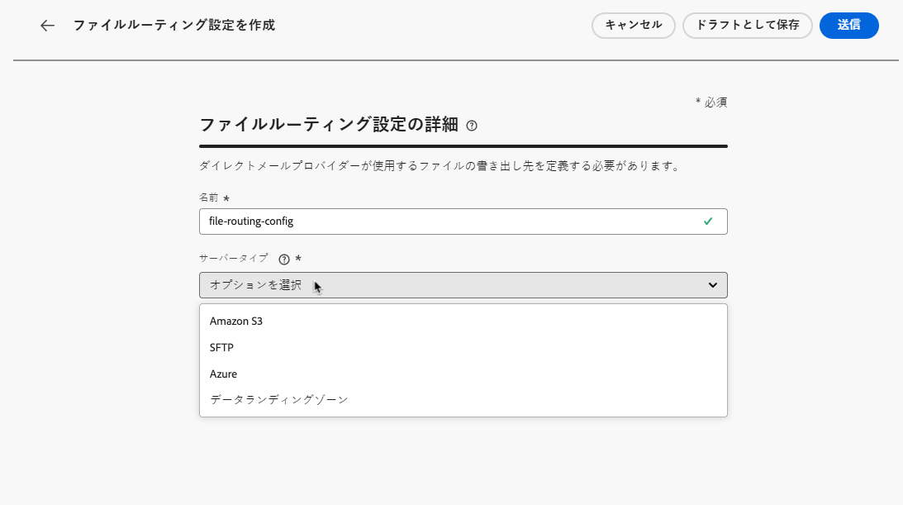
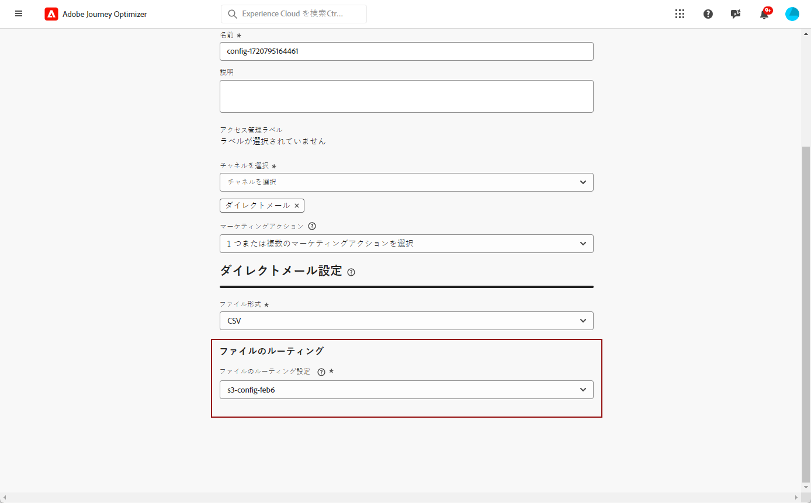

# ダイレクトメール設定 {#direct-mail-configuration}

[!DNL Journey Optimizer] ダイレクトメールプロバイダーが顧客に電子メールを送信するために必要なファイルをカスタマイズおよび生成できます。

ダイレクトメールメッセージ ](../direct-mail/create-direct-mail.md) を作成する際 [ には、選択した連絡先情報 (住所など) を指定することができます。これにより、このデータを含むファイルは自動的に生成され、サーバーに書き出されます。これにより、ダイレクトメールプロバイダーはこれを取得して実際の送信を実行することができます。

このファイルを生成する前に、次のものを作成する必要があります。

1. [ファイルの転送先サーバーを指定するには、ファイルのルーティング設定 ](#file-routing-configuration) を指定します。

1. [ファイルのルーティング設定を参照するダイレクトメールの面 ](#direct-mail-surface) 。

>[!CAUTION]
>
>ファイルのルーティングオプションをまだ設定していない場合は、ダイレクトメールの面を作成することはできません。

## ファイルルーティングの設定 {#file-routing-configuration}

>[!CONTEXTUALHELP]
>id="ajo_dm_file_routing_details"
>title="ファイルのルーティング設定を定義します。"
>abstract="ダイレクトメールメッセージを作成すると、対象となる対象ユーザーデータを含むファイルが生成され、サーバーに書き出されます。 ダイレクトメールプロバイダーがダイレクトメールを配信するためにそのファイルにアクセスして使用できるようにするには、サーバーの詳細を指定する必要があります。"

<!--
>additional-url="https://experienceleague.adobe.com/docs/journey-optimizer/using/direct-mail/create-direct-mail.html" text="Create a direct mail message"-->

>[!CONTEXTUALHELP]
>id="ajo_dm_file_routing_details_header"
>title="ファイルのルーティング設定を定義します。"
>abstract="このファイルを書き出す場所を定義しておく必要があります。この場合、ダイレクトメールプロバイダーが使用できるようになります。"

>[!CONTEXTUALHELP]
>id="ajo_dm_select_file_routing"
>title="ファイルのルーティング設定"
>abstract="選択したファイルのルーティング設定を選択します。これによって、ダイレクトメールプロバイダーが使用するファイルを書き出す場所を定義できます。"

>[!CONTEXTUALHELP]
>id="ajo_dm_file_routing_type"
>title="ファイルのサーバータイプを選択します。"
>abstract="ダイレクトメールファイルを書き出すために使用するサーバーの種類を選択します。 現在、Amazon S3 と SFTP は、旅のオプティマイザーによってサポートされています。"

>[!CONTEXTUALHELP]
>id="ajo_dm_file_routing_aws_region"
>title="AWS 領域を選択します。"
>abstract="ダイレクトメールファイルを書き出す AWS サーバーの地域を選択します。 一般的な方法として、ダイレクトメールプロバイダーの最も近い地域を選択することをお勧めします。"

ダイレクトメールメッセージを配信するには、を使用して、 [!DNL Journey Optimizer] 対象ユーザーデータを含むファイルをサーバーに生成し、書き出します。

ダイレクトメールプロバイダーが電子メールの配信に使用するファイルにアクセスして使用できるようにするには、そのサーバーの詳細を指定する必要があります。

ファイルのルーティングを設定するには、次の手順に従います。

1. **[!UICONTROL Administration]**> **[!UICONTROL Channels]** > **[!UICONTROL File routing configuration]** > **[!UICONTROL File Routing]** メニューにアクセスし、をクリック **[!UICONTROL Create routing configuration]** します。

   

1. 設定の名前を設定します。

1. **[!UICONTROL Server type]**&#x200B;ダイレクトメールファイルを書き出すために使用するを選択します。

   

   >[!NOTE]
   >
   >現在、で [!DNL Journey Optimizer] Amazon S3 と SFTP のみがサポートされています。

1. サーバーのアドレス、アクセスキーなど、サーバーの詳細情報や資格情報を入力します。

   

1. このオプションを選択 **[!UICONTROL Amazon S3]** した場合は、サーバーインフラストラクチャの配置先を選択 **[!UICONTROL AWS region]** します。

   

   >[!NOTE]
   >
   >AWS 領域は、AWS がクラウドインフラストラクチャのホストとして使用する地理的な領域です。 一般的な方法として、ダイレクトメールプロバイダーの位置に最も近い地域を選択することをお勧めします。

1. を選択 **[!UICONTROL Submit]** します。 ファイルのルーティング設定が、 **[!UICONTROL Active]** 状態と共に作成されます。 これで、ダイレクトメールの面 ](#direct-mail-surface) で [ 使用できるようになりました。

   >[!NOTE]
   >
   >ファイルのルーティング設定を作成するように選択 **[!UICONTROL Save as draft]** することもできますが、表示されるまでは **[!UICONTROL Active]** サーフェスで選択することはできません。

## ダイレクトメールの面の作成 {#direct-mail-surface}

>[!CONTEXTUALHELP]
>id="ajo_dm_surface_settings"
>title="ダイレクトメール設定の定義"
>abstract="ダイレクトメールの面には、対象の視聴ユーザーデータを含むファイルのフォーマットの設定が含まれています。これは、メールプロバイダーによって使用されます。 ファイルのルーティング設定を選択して、ファイルを書き出す場所も定義する必要があります。"
>additional-url="https://experienceleague.adobe.com/docs/journey-optimizer/using/direct-mail/direct-mail-configuration.html?lang=en#file-routing-configuration" text="ファイルルーティングの設定"

<!--
>[!CONTEXTUALHELP]
>id="ajo_dm_surface_sort"
>title="Define the sort order"
>abstract="If you select this option, the sort will be by profile ID, ascending or descending. If you unselect it, the sorting configuration defined when creating the direct mail message within a journey or a campaign."-->

>[!CONTEXTUALHELP]
>id="ajo_dm_surface_split"
>title="ファイル分割しきい値の定義"
>abstract="対象ユーザーデータを含む各ファイルに対して、レコードの最大数を設定する必要があります。 1 ~ 20万個のレコードを選択できます。 指定されたしきい値に達すると、残りのレコードについて別のファイルが作成されます。"

で [!DNL Journey Optimizer] ダイレクトメールを配信できるようにするには、チャネルサーフェスを作成して、メールプロバイダーが使用するファイルのフォーマットの設定を定義する必要があります。

ダイレクトメールの面には、ダイレクトメールファイルが書き出されるサーバーを定義するファイルルーティング設定も含まれている必要があります。

1. チャンネルサーフェスを作成します。 [詳細情報](../configuration/channel-surfaces.md)

1. **[!UICONTROL Direct mail]**&#x200B;チャンネルを選択します。

   

1. チャンネルサーフェス設定の専用セクションでダイレクトメール設定を定義します。

   

   <!---->

1. ファイル形式 **[!UICONTROL CSV]** **[!UICONTROL Text delimited]** を選択します。

1. **[!UICONTROL File routing configuration]**&#x200B;作成したテンプレートを選択します。これにより、ファイルが書き出される場所を指定してダイレクトメールプロバイダーが使用できるようになります。

   >[!CAUTION]
   >
   >ファイルのルーティングオプションをまだ設定していない場合は、ダイレクトメールの面を作成することはできません。 [詳細情報](#file-routing-configuration)

   

   <!---->

1. ダイレクトメールの面を送信します。

キャンペーン内にダイレクトメールメッセージ ](../direct-mail/create-direct-mail.md) を作成できるようになりまし [ た。キャンペーンが開始されると、対象ユーザーデータが格納されているファイルが、定義したサーバーに自動的に書き出されます。 これにより、ダイレクトメールプロバイダーは、そのファイルを取得してダイレクトメール配信を続行することができます。

>[!NOTE]
>
>重複する行は自動的に削除されます。
>
>プロファイルデータが格納されている各ファイルの最大レコード数 (行数) が非常に大きい場合は、残りのレコードに対して別のファイルが自動的に作成されます。

<!--
    In the **[!UICONTROL Insertion]** section, you can choose to automatically remove duplicate rows.

    Define the maximum number of records (i.e. rows) for each file containing profile data. After the specified threshold is reached, another file will be created for the remaining records.

    

    For example, if there are 100,000 records in the file and the threshold limit is set to 60,000, the records will be split into two files. The first file will contain 60,000 rows, and the second file will contain the remaining 40,000 rows.

    >[!NOTE]
    >
    >NOTE You can set any number between 1 and 200,000 records, meaning each file must contain at least 1 row and no more than 200,000 rows.

-->