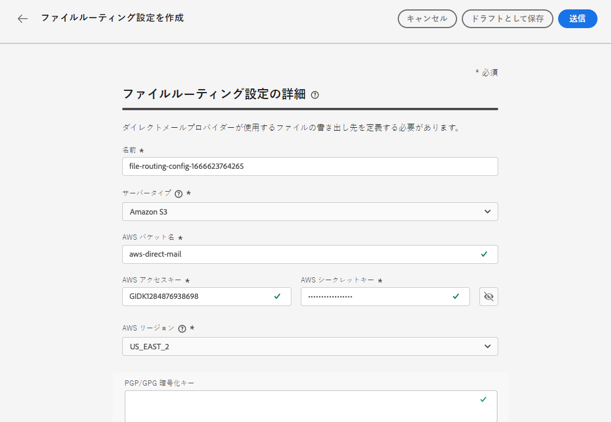
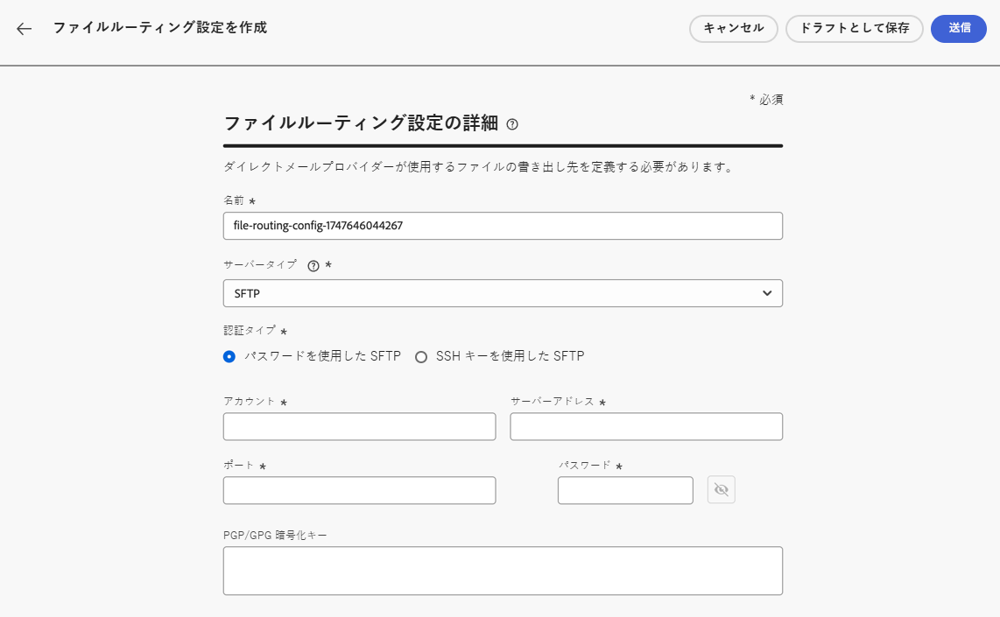
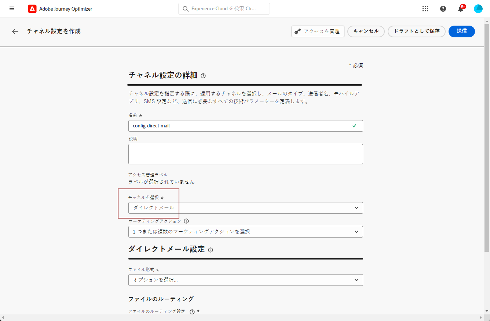
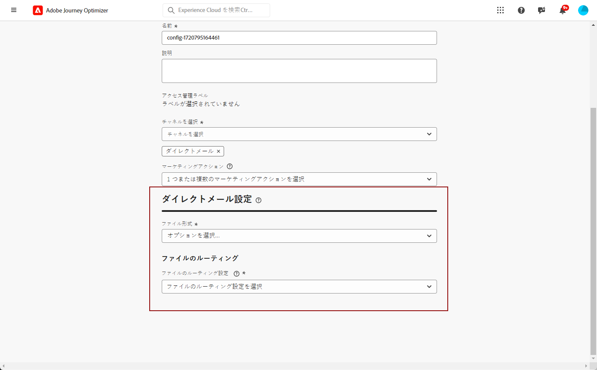
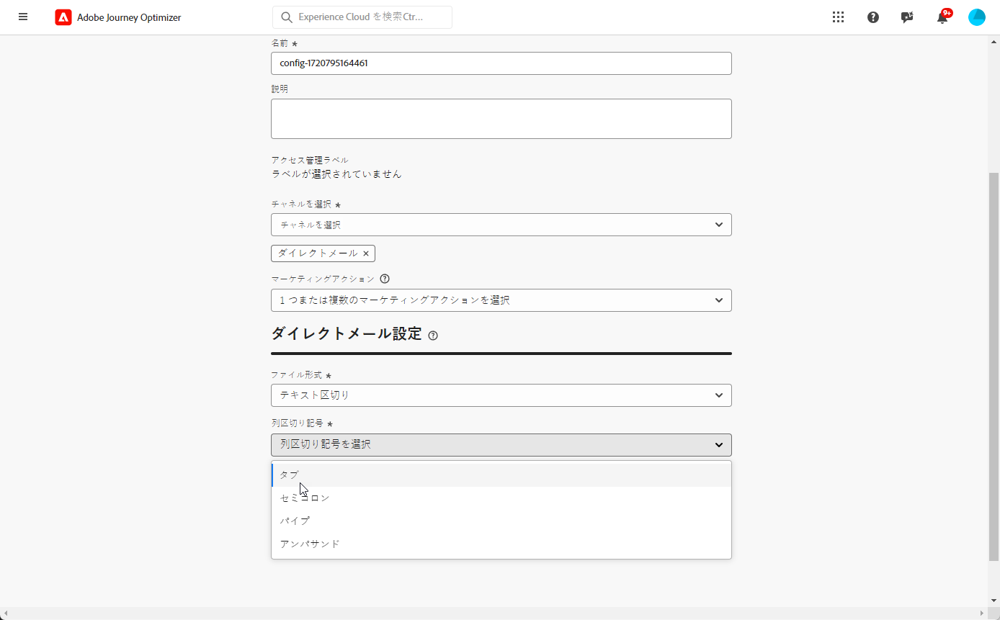

# ダイレクトメールの設定 {#direct-mail-configuration}

[!DNL Journey Optimizer] では、ダイレクトメールプロバイダーが顧客にメールを送信するために必要なファイルをパーソナライズおよび生成できます。

[ダイレクトメールメッセージの作成](../direct-mail/create-direct-mail.md)の場合は、選択した連絡先情報（住所など）を含む、ターゲットオーディエンスデータを定義します。このデータを含むファイルが自動的に生成され、サーバーに書き出されます。ダイレクトメールプロバイダーは、このファイルを取得して、実際の送信処理を行うことができます。

このファイルを生成する前に、以下を作成する必要があります。

1. [ファイルのルーティング設定](#file-routing-configuration)：ファイルの書き出し先となるサーバーを指定し、必要に応じてファイルを暗号化します。

   >[!CAUTION]
   >
   >ファイルルーティング設定を作成するには、**[!DNL Manage file routing]** 組み込みの権限が必要です。[詳細情報](../administration/ootb-product-profiles.md#content-library-manager)。

1. [ダイレクトメール設定](#direct-mail-configuration)：ファイルのルーティング設定を参照します。ファイルのルーティングオプションを設定していない場合、ダイレクトメール設定を作成できません。

## ファイルのルーティングを設定 {#file-routing-configuration}

>[!CONTEXTUALHELP]
>id="ajo_dm_file_routing_details"
>title="ファイルのルーティング設定を定義"
>abstract="ダイレクトメールメッセージを作成すると、ターゲットオーディエンスデータを含むファイルが生成され、サーバーに書き出されます。ダイレクトメールプロバイダーがそのファイルにアクセスして、ダイレクトメールの配信に使用できるように、サーバーの詳細を指定する必要があります。"
>additional-url="https://experienceleague.adobe.com/ja/docs/journey-optimizer/using/channels/direct-mail/create-direct-mail" text="ダイレクトメールメッセージの作成"

>[!CONTEXTUALHELP]
>id="ajo_dm_file_routing_details_header"
>title="ファイルのルーティング設定を定義"
>abstract="ダイレクトメールプロバイダーが使用するファイルの書き出し先を定義する必要があります。"

>[!CONTEXTUALHELP]
>id="ajo_dm_select_file_routing"
>title="ファイルのルーティング設定"
>abstract="任意のファイルのルーティング設定を選択します。この設定は、ダイレクトメールプロバイダーが使用するファイルの書き出し先を定義します。"

>[!CONTEXTUALHELP]
>id="ajo_dm_file_routing_type"
>title="ファイルのサーバータイプを選択"
>abstract="ダイレクトメールファイルの書き出しに使用するサーバーのタイプ（Amazon S3、SFTP、Azure）を選択します。"

>[!CONTEXTUALHELP]
>id="ajo_dm_file_routing_aws_region"
>title="AWS リージョンを選択"
>abstract="ダイレクトメールファイルの書き出し先となる AWS サーバーのリージョンを選択します。一般的には、ダイレクトメールプロバイダーの場所に最も近いリージョンを選択することをお勧めします。"

>[!NOTE]
>
>現在、[!DNL Journey Optimizer] では Amazon S3、SFTP、Azure がサポートされています。

ダイレクトメールメッセージを配信するために、[!DNL Journey Optimizer] はターゲットオーディエンスデータを含むファイルを生成し、サーバーに書き出します。

ダイレクトメールプロバイダーがそのファイルにアクセスして、メールの配信に使用できるように、そのサーバーの詳細を指定する必要があります。

ファイルのルーティングを設定するには、次の手順に従います。

>[!BEGINTABS]

>[!TAB Amazon S3]

1. **[!UICONTROL 管理]**／**[!UICONTROL チャネル]**／**[!UICONTROL ダイレクトメール設定]**／**[!UICONTROL ファイルのルーティング]**&#x200B;メニューにアクセスし、「**[!UICONTROL ルーティング設定を作成]**」をクリックします。

   {width="800" align="center"}

1. 設定の名前を設定します。

1. ダイレクトメールファイルの書き出しに使用する&#x200B;**[!UICONTROL サーバータイプ]**&#x200B;として「**Amazon S3**」を選択します。

   {width="800" align="center"}

1. サーバーの詳細と資格情報を入力します

   * **AWS バケット名**：AWS アクセスキー ID を見つける場所については、[このページ](https://docs.aws.amazon.com/AmazonS3/latest/userguide/UsingBucket.html)を参照してください。

   * **AWS アクセスキー**：AWS アクセスキー ID を見つける場所については、[このページ](https://docs.aws.amazon.com/IAM/latest/UserGuide/security-creds.html#access-keys-and-secret-access-keys)を参照してください。

   * **AWS 秘密鍵**：AWS 秘密鍵を見つける場所については、[このページ](https://aws.amazon.com/jp/blogs/security/wheres-my-secret-access-key/)を参照してください。

   * **AWS リージョン**：サーバーインフラストラクチャを配置する **[!UICONTROL AWS リージョン]**&#x200B;を選択します。AWS リージョンは、AWS がクラウドインフラストラクチャをホストするために使用する地理的エリアです。一般的には、ダイレクトメールプロバイダーの場所に最も近いリージョンを選択することをお勧めします。

   {width="800" align="center"}

1. ファイルを暗号化するには、暗号化キーををコピーして、「**[!UICONTROL PGP/GPG 暗号化キー]**」フィールドに貼り付けます。

1. 「**[!UICONTROL 送信]**」を選択します。ファイルのルーティング設定は、**[!UICONTROL アクティブ]**&#x200B;ステータスで作成されます。これで、[ダイレクトメール設定](#direct-mail-surface)で使用する準備が整いました。

   「**[!UICONTROL ドラフトとして保存]**」を選択してファイルのルーティング設定を作成することもできますが、**[!UICONTROL アクティブ]**&#x200B;になるまで設定で選択することはできません。

>[!TAB SFTP]

1. **[!UICONTROL 管理]**／**[!UICONTROL チャネル]**／**[!UICONTROL ダイレクトメール設定]**／**[!UICONTROL ファイルのルーティング]**&#x200B;メニューにアクセスし、「**[!UICONTROL ルーティング設定を作成]**」をクリックします。

   {width="800" align="center"}

1. 設定の名前を設定します。

1. ダイレクトメールファイルの書き出しに使用する **[!UICONTROL サーバータイプ]** として、「SFTP」を選択します。

   {width="800" align="center"}

1. サーバーの詳細と資格情報を入力します。

   * **アカウント**：SFTP サーバーへの接続に使用するアカウント名。

   * **サーバーアドレス**：SFTP サーバーの URL。

   * **ポート**：FTP 接続のポート番号。

   * **パスワード**：SFTP サーバーへの接続に使用するパスワード。

   

   >[!NOTE]
   >
   >ファイルを保存するサーバー上のパスを指定するには、ダイレクトメールキャンペーンの「**[!UICONTROL ファイル名]**」フィールドを更新して、目的のパスを含めます。[詳細情報](create-direct-mail.md#extraction-file)

1. ファイルを暗号化するには、暗号化キーををコピーして、「**[!UICONTROL PGP/GPG 暗号化キー]**」フィールドに貼り付けます。

1. 「**[!UICONTROL 送信]**」を選択します。ファイルのルーティング設定は、**[!UICONTROL アクティブ]**&#x200B;ステータスで作成されます。これで、[ダイレクトメール設定](#direct-mail-surface)で使用する準備が整いました。

   「**[!UICONTROL ドラフトとして保存]**」を選択してファイルのルーティング設定を作成することもできますが、**[!UICONTROL アクティブ]**&#x200B;になるまで設定で選択することはできません。

>[!TAB Azure]

1. **[!UICONTROL 管理]**／**[!UICONTROL チャネル]**／**[!UICONTROL ダイレクトメール設定]**／**[!UICONTROL ファイルのルーティング]**&#x200B;メニューにアクセスし、「**[!UICONTROL ルーティング設定を作成]**」をクリックします。

   {width="800" align="center"}

1. 設定の名前を設定します。

1. ダイレクトメールファイルの書き出しに使用する **[!UICONTROL サーバータイプ]** として、「Azure」を選択します。

   {width="800" align="center"}

1. サーバーの詳細と資格情報を入力します。

   * **Azure 接続文字列**：**Azure 接続文字列**&#x200B;を見つけるには、[このページ](https://learn.microsoft.com/ja-jp/azure/storage/common/storage-configure-connection-string#configure-a-connection-string-for-an-azure-storage-account)を参照してください。

     **Azure 接続文字列**&#x200B;は、以下の形式に従う必要があります。

     `DefaultEndpointsProtocol=[http|https];AccountName=myAccountName;AccountKey=myAccountKey`

   * **コンテナ名**：**コンテナ名**&#x200B;を見つけるには、[このページ](https://learn.microsoft.com/ja-jp/azure/storage/blobs/blob-containers-portal)を参照してください。

     **コンテナ名**&#x200B;には、コンテナ名のみをスラッシュなしで含める必要があります。ファイルを保存するコンテナ内のパスを指定するには、ダイレクトメールキャンペーンの「**[!UICONTROL ファイル名]**」フィールドを更新して、目的のパスを含めます。[詳細情報](create-direct-mail.md#extraction-file)

1. ファイルを暗号化するには、暗号化キーををコピーして、「**[!UICONTROL PGP/GPG 暗号化キー]**」フィールドに貼り付けます。

1. 「**[!UICONTROL 送信]**」を選択します。ファイルのルーティング設定は、**[!UICONTROL アクティブ]**&#x200B;ステータスで作成されます。これで、[ダイレクトメール設定](#direct-mail-surface)で使用する準備が整いました。

   「**[!UICONTROL ドラフトとして保存]**」を選択してファイルのルーティング設定を作成することもできますが、**[!UICONTROL アクティブ]**&#x200B;になるまで設定で選択することはできません。

>[!TAB  データランディングゾーン ]

1. **[!UICONTROL 管理]**／**[!UICONTROL チャネル]**／**[!UICONTROL ダイレクトメール設定]**／**[!UICONTROL ファイルのルーティング]**&#x200B;メニューにアクセスし、「**[!UICONTROL ルーティング設定を作成]**」をクリックします。

   {width="800" align="center"}

1. 設定の名前を設定します。

1. ダイレクトメールファイルの書き出しに使用する **[!UICONTROL サーバータイプ]** として、データランディングゾーンを選択します。

   {width="800" align="center"}

1. ファイルを暗号化するには、暗号化キーを **[!UICONTROL PGP/GPG 暗号化キー]** フィールドにコピー&amp;ペーストします。<!--To find it, ...-->

   

1. 「**[!UICONTROL 送信]**」を選択します。ファイルのルーティング設定は、**[!UICONTROL アクティブ]**&#x200B;ステータスで作成されます。これで、[ダイレクトメール設定](#direct-mail-surface)で使用する準備が整いました。

   「**[!UICONTROL ドラフトとして保存]**」を選択してファイルのルーティング設定を作成することもできますが、**[!UICONTROL アクティブ]**&#x200B;になるまで設定で選択することはできません。

データランディングゾーンについて詳しくは、[Adobe Experience Platform ドキュメント ](https://experienceleague.adobe.com/en/docs/experience-platform/sources/connectors/cloud-storage/data-landing-zone){target="_blank"} を参照してください。

>[!ENDTABS]

## ダイレクトメール設定の作成 {#direct-mail-surface}

>[!CONTEXTUALHELP]
>id="ajo_dm_surface_settings"
>title="ダイレクトメール設定を定義します。"
>abstract="ダイレクトメール設定には、ターゲットオーディエンスデータを含み、メールプロバイダーによって使用されるファイルの書式設定の設定が含まれています。また、ファイルのルーティング設定を選択して、ファイルの書き出し先を定義する必要があります。"
>additional-url="https://experienceleague.adobe.com/ja/docs/journey-optimizer/using/channels/direct-mail/direct-mail-configuration#file-routing-configuration" text="ファイルのルーティングを設定"

<!--
>[!CONTEXTUALHELP]
>id="ajo_dm_surface_sort"
>title="Define the sort order"
>abstract="If you select this option, the sort will be by profile ID, ascending or descending. If you unselect it, the sorting configuration defined when creating the direct mail message within a journey or a campaign."-->

>[!CONTEXTUALHELP]
>id="ajo_dm_surface_split"
>title="ファイル分割しきい値の定義"
>abstract="オーディエンスデータを含む各ファイルの最大レコード数を設定する必要があります。1 ～ 200,000 件のレコードを選択できます。指定したしきい値に達すると、残りのレコードに別のファイルが作成されます。"

[!DNL Journey Optimizer] でダイレクトメールを配信できるようにするには、チャネル設定を作成して、メールプロバイダーが使用するファイルの書式設定の設定を定義する必要があります。

ダイレクトメール設定には、ダイレクトメールファイルの書き出し先となるサーバーを定義するファイルのルーティング設定も含める必要があります。

1. 左側のパネルで、**[!UICONTROL 管理]**／**[!UICONTROL チャネル]**&#x200B;を参照し、**[!UICONTROL 一般設定]**／**[!UICONTROL チャネル設定]**&#x200B;を選択します。「**[!UICONTROL チャネル設定を作成]**」ボタンをクリックします。[詳細情報](../configuration/channel-surfaces.md)

   

1. 設定の名前と説明（オプション）を入力し、設定するチャネルを選択します。

   >[!NOTE]
   >
   > 名前は、文字（A ～ Z）で始める必要があります。使用できるのは英数字のみです。アンダースコア（`_`）、ドット（`.`）、ハイフン（`-`）も使用できます。

1. 設定にカスタムまたはコアのデータ使用ラベルを割り当てるには、「**[!UICONTROL アクセスを管理]**」を選択します。[オブジェクトレベルのアクセス制御（OLAC）について詳しくは、こちらを参照してください](../administration/object-based-access.md)。

1. 「**[!UICONTROL ダイレクトメール]**」チャネルを選択します。

   

1. この設定を使用してメッセージに同意ポリシーを関連付けるには、**[!UICONTROL マーケティングアクション]**&#x200B;を選択します。顧客の環境設定に従うために、そのマーケティングアクションに関連付けられているすべての同意ポリシーが活用されます。[詳細情報](../action/consent.md#surface-marketing-actions)

1. チャネル設定の専用セクションでダイレクトメール設定を定義します。

   {width="800" align="center"}

   <!---->

1. ファイル形式として **[!UICONTROL CSV]** または&#x200B;**[!UICONTROL テキスト区切り]**&#x200B;を選択します。

1. **[!UICONTROL テキスト区切り]**&#x200B;を選択した場合は、選択した列区切り記号（タブ、セミコロン、パイプ、アンパサンド）を定義します。

   

1. 作成したものの中から「**[!UICONTROL ファイルルーティング設定]**」を選択します。これにより、ダイレクトメールプロバイダーが使用するファイルの書き出し先が定義されます。

   >[!CAUTION]
   >
   >ファイルのルーティングオプションを設定していない場合、ダイレクトメール設定を作成できません。[詳細情報](#file-routing-configuration)

   {width="800" align="center"}

   <!---->

1. ダイレクトメール設定を送信します。

キャンペーン内で[ダイレクトメールメッセージの作成](../direct-mail/create-direct-mail.md)を行うことができるようになりました。キャンペーンが開始されると、ターゲットオーディエンスデータを含んだファイルが、定義したサーバーに自動的に書き出されます。その後、ダイレクトメールプロバイダーは、そのファイルを取得して、ダイレクトメール配信を続行できます。

>[!NOTE]
>
>行内のすべての値が同じ重複行は、自動的にファイルから削除されます。

<!--
    In the **[!UICONTROL Insertion]** section, you can choose to automatically remove duplicate rows.

    Define the maximum number of records (i.e. rows) for each file containing profile data. After the specified threshold is reached, another file will be created for the remaining records.

    

    For example, if there are 100,000 records in the file and the threshold limit is set to 60,000, the records will be split into two files. The first file will contain 60,000 rows, and the second file will contain the remaining 40,000 rows.

    >[!NOTE]
    >
    >NOTE You can set any number between 1 and 200,000 records, meaning each file must contain at least 1 row and no more than 200,000 rows.

-->