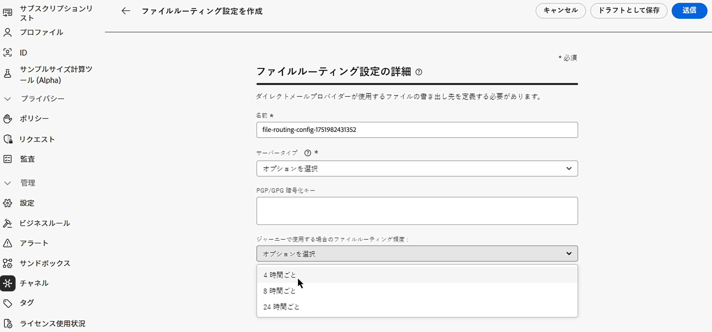

# ジャーニーでのダイレクトメールメッセージの送信 {#direct-mail-journeys}

>[!CONTEXTUALHELP]
>id="ajo_journey_direct_mail"
>title="終了アクティビティ"
>abstract="ダイレクトメールは、サードパーティのダイレクトメールプロバイダーが顧客にメールを送信するために必要な抽出ファイルをパーソナライズおよび生成できるオフラインチャネルです。"

>[!AVAILABILITY]
>
>この機能は、一連の組織でのみ使用できます（使用制限あり）。

ダイレクトメールは、サードパーティのダイレクトメールプロバイダーが顧客にメールを送信するために必要な抽出ファイルをパーソナライズおよび生成できるオフラインチャネルです。

ダイレクトメールメッセージの作成時に、[!DNL Journey Optimizer] は、すべてのターゲットプロファイルと、選択したデータ（住所やプロファイル属性など）を含むファイルを自動的に生成します。 このファイルは選択したサーバーに送信されるので、選択したサードパーティ（実際のメール送信プロセスを処理する）のダイレクトメールプロバイダーからアクセスできるようになります。

顧客がメールを受信できるようにするには、選択したサードパーティのダイレクトメールプロバイダーと協力して、必要な同意を顧客から得る必要があります（該当する場合）。 メールサービスを使用する場合は、該当するサードパーティのダイレクトメールプロバイダーから提供される追加の利用条件に従う必要があります。 サードパーティ製品の使用について、アドビは一切関係せず、責任も負いません。ダイレクトメールメッセージの送信に関する問題やサポートのリクエストについては、選択したサードパーティのダイレクトメールプロバイダーにお問い合わせください。

>[!NOTE]
>
>このページでは、ジャーニーでダイレクトメールメッセージを作成して送信するプロセスについて詳しく説明します。 ダイレクトメールチャネルとダイレクトメールキャンペーンの作成方法について詳しくは、この節 [ ダイレクトメールの基本を学ぶ ](../direct-mail/get-started-direct-mail.md) を参照してください。

## ファイルのルーティング設定を作成

>[!CONTEXTUALHELP]
>id="ajo_dm_file_routing_frequency"
>title="AWS リージョンを選択"
>abstract="ファイルのルーティング設定がジャーニーを使用して送信される場合、ファイルがサーバーに送信される頻度を指定できます。"

ダイレクトメールメッセージを作成する前に、抽出ファイルをアップロードして保存するサーバーを指定するファイルのルーティング設定が設定されていることを確認します。 それには、次の手順に従います。

1. **[!UICONTROL 管理]**／**[!UICONTROL チャネル]**／**[!UICONTROL ダイレクトメール設定]**／**[!UICONTROL ファイルのルーティング]**&#x200B;メニューにアクセスし、「**[!UICONTROL ファイルルーティング設定を作成]**」をクリックします。

1. ファイルのルーティング設定プロパティ（名前、使用するサーバーのタイプなど）を定義します。 ファイルのルーティング設定を設定する方法について詳しくは、「[ ダイレクトメール設定 ](../direct-mail/direct-mail-configuration.md#file-routing-configuration)」セクションを参照してください。

   ファイルのルーティング設定がジャーニーを使用して送信される場合、ファイルがサーバーに送信される頻度を指定できます。

   

1. 「**[!UICONTROL 送信]**」をクリックして、ファイルのルーティング設定の作成を確認します。 設定は **[!UICONTROL アクティブ]** ステータスで作成されます。 これで、ダイレクトメール設定で参照する準備が整いました。

## ダイレクトメール設定の作成 {#direct-mail-surface}

ダイレクトメール設定には、ターゲットオーディエンスデータを含み、メールプロバイダーによって使用されるファイルの書式設定の設定が含まれています。また、ファイルのルーティング設定を選択して、ファイルの書き出し先を定義する必要があります。 ダイレクトメール設定の作成方法について詳しくは、「[ ダイレクトメール設定 ](../direct-mail/direct-mail-configuration.md#file-routing-configuration)」セクションを参照してください。

ダイレクトメール設定の準備が整ったら、ダイレクトメールアクションをジャーニーに追加できます。

## ジャーニーへのダイレクトメールアクションの追加

ジャーニーにダイレクトメールアクションを追加するには、次の手順に従います。

1. ジャーニーを開いて、パレットの「**[!UICONTROL アクション]**」セクションから **ダイレクトメール** アクティビティをドラッグ&amp;ドロップします。

1. メッセージに関する基本情報（ラベル、説明、カテゴリ）を入力したあと、使用するメッセージ設定を選択します。 **[!UICONTROL configuration]** フィールドには、ユーザーがチャネルで最後に使用した設定がデフォルトで事前入力されます。 ジャーニーの設定方法について詳しくは、[このページ](../building-journeys/journey-gs.md)を参照してください。

1. 抽出ファイルを設定して、ダイレクトメールプロバイダーに送信します。 編集するには、「**[!UICONTROL コンテンツを編集]** ボタンをクリックします。

   

1. ファイル名や表示する列など、抽出ファイルのプロパティを調整します。 抽出ファイルのプロパティを設定する方法について詳しくは、次の節を参照してください。[ ダイレクトメールメッセージの作成 ](../direct-mail/create-direct-mail.md#extraction-file)。

   

1. 抽出ファイルの内容を定義したら、テストプロファイルを使用して内容をプレビューできます。パーソナライズされたコンテンツを挿入した場合は、そのコンテンツがメッセージにどのように表示されるかを、テストプロファイルデータを使用して確認できます。

   これを行うには、「**[!UICONTROL コンテンツをシミュレート]**」をクリックし、テストプロファイルを追加して、テストプロファイルデータを使用して抽出ファイルのレンダリング方法を確認します。 テストプロファイルの選択およびコンテンツのプレビュー方法について詳しくは、「[コンテンツ管理](../content-management/preview-test.md)」の節を参照してください。

   {width="800" align="center"}

抽出ファイルの準備が整ったら、[ ジャーニー ](../building-journeys/journey-gs.md) の設定を完了して送信します。
