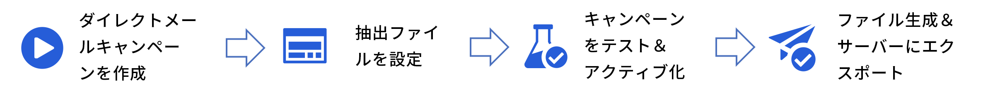

# ダイレクトメールの基本を学ぶ {#create-direct}

ダイレクトメールは、サードパーティのダイレクトメールプロバイダーが顧客にメールを送信するために必要な抽出ファイルをパーソナライズおよび生成できるオフラインチャネルです。

ダイレクトメールキャンペーンを作成すると、すべてのターゲットプロファイルと選択したデータ（住所やプロファイル属性など）を含むファイルが、Journey Optimizer によって自動的に生成されます。このファイルは選択したサーバーに送信されるので、選択したサードパーティ（実際のメール送信プロセスを処理する）のダイレクトメールプロバイダーからアクセスできるようになります。

該当する場合は、顧客がメールを受信できるように、選択したサードパーティのダイレクトメールプロバイダーと協力して、顧客から必要な同意を取得する必要があります。

メールサービスを使用した場合、該当するサードパーティのダイレクトメールプロバイダーが定める追加の利用条件に同意したとみなされます。サードパーティ製品の使用について、アドビは一切関係せず、責任も負いません。ダイレクトメールキャンペーンの送付に関する問題やサポートのリクエストについては、選択したサードパーティのダイレクトメールプロバイダーにお問い合わせください。

ダイレクトメールメッセージを送信する主な手順は次のとおりです。

>[!AVAILABILITY]
>
>ダイレクトメールメッセージは、スケジュールされたキャンペーンのコンテキストでのみ作成できます。オーケストレーションキャンペーンおよび API トリガーキャンペーン、まはたジャーニーでは使用できません。

