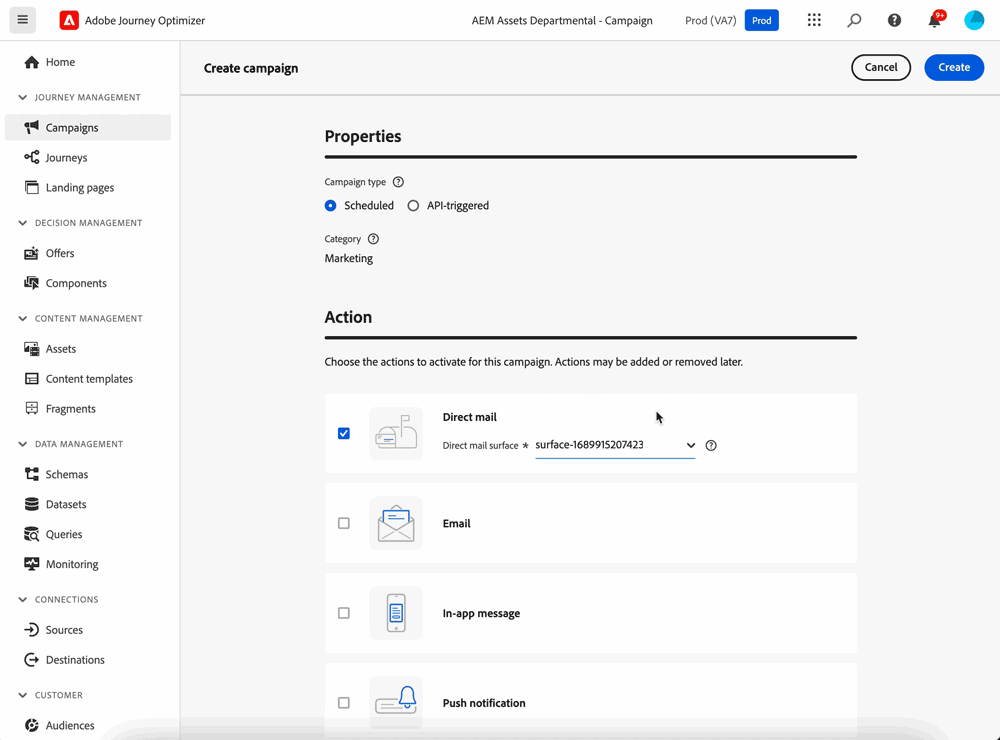

# ダイレクトメールの基本を学ぶ {#create-direct}

>[!BEGINSHADEBOX]

**このページ：** ダイレクトメールチャネルの仕組みを理解して、サードパーティプロバイダーが顧客に物理的なメールを送信するために使用する抽出ファイルを生成できます。

>[!ENDSHADEBOX]

ダイレクトメールは、サードパーティのダイレクトメールプロバイダーが顧客にメールを送信するために必要な抽出ファイルをパーソナライズおよび生成できるオフラインチャネルです。

ダイレクトメールキャンペーンやジャーニーを作成すると、すべてのターゲットプロファイルと選択したデータ（住所やプロファイル属性など）を含むファイルが、Journey Optimizer によって自動的に生成されます。 このファイルは選択したサーバーに送信されるので、選択したサードパーティ（実際のメール送信プロセスを処理する）のダイレクトメールプロバイダーからアクセスできるようになります。

該当する場合は、顧客がメールを受信できるように、選択したサードパーティのダイレクトメールプロバイダーと協力して、顧客から必要な同意を取得する必要があります。

メールサービスを使用した場合、該当するサードパーティのダイレクトメールプロバイダーが定める追加の利用条件に同意したとみなされます。  サードパーティ製品の使用について、アドビは一切関係せず、責任も負いません。 ダイレクトメールキャンペーンの送付に関する問題やサポートのリクエストについては、選択したサードパーティのダイレクトメールプロバイダーにお問い合わせください。

## 事前準備 {#before-you-start}

ダイレクトメールメッセージを作成する前に、[ファイルルーティングとダイレクトメールチャネル設定](direct-mail-configuration.md)を指定します。 また、Adobe Experience Platform には、オーディエンスデータとプロファイルデータ（郵便番号など）も必要です。

ダイレクトメールメッセージを送信する主な手順は、次のとおりです。

>[!AVAILABILITY]
>
>ダイレクトメールメッセージは、ジャーニーやキャンペーンのコンテキストで作成できます。 API トリガーキャンペーンでは使用できません。

## その他のリソース {#additional-resources}

* **[ダイレクトメールの作成](create-direct-mail.md)** - ダイレクトメール配信を作成し、オフラインチャネル用の抽出ファイルを設定する方法について説明します。
* **[ダイレクトメールチャネルの設定](direct-mail-configuration.md)** - ダイレクトメールサーフェスとファイルルーティング設定を指定します。
* **[ダイレクトメールでのバッチ決定](../experience-decisioning/batch-decisioning-direct-mail.md)** - ダイレクトメール用に抽出ファイルをパーソナライズしたり、下流システム用に決定データを書き出したりするために決定を使用します。
* **[ダイレクトメールのテストと送信](test-send-direct-mail.md)** - ダイレクトメール配信をテスト、検証、公開する方法について説明します。
* **[ダイレクトメールのチュートリアル](https://experienceleague.adobe.com/ja/docs/journey-optimizer-learn/tutorials/channels/direct-mail-channel/direct-mail){target="_blank"}** - ダイレクトメールの機能とベストプラクティスに関するステップバイステップのビデオチュートリアルを参照してください。

## チュートリアルビデオ {#how-to-video}

Adobe Journey Optimizer のダイレクトメールチャネルを活用して、ジャーニー内のダイレクトメールの配信を自動化およびスケジュールする方法について説明します。

+++ こちらのビデオをご覧ください

>[!VIDEO](https://video.tv.adobe.com/v/3479163?captions=jpn&quality=12)

+++

同じ手順の書き込み済みのチュートリアルについて詳しくは、[ダイレクトメールチャネルのチュートリアル](https://experienceleague.adobe.com/ja/docs/journey-optimizer-learn/tutorials/channels/direct-mail-channel/direct-mail){target="_blank"}を参照してください。

ダイレクトメールに関するよくある質問について詳しくは、上記の[その他のリソース](#additional-resources)の節を参照してください。
