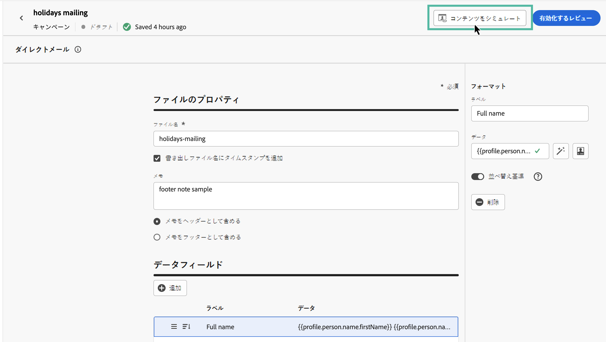
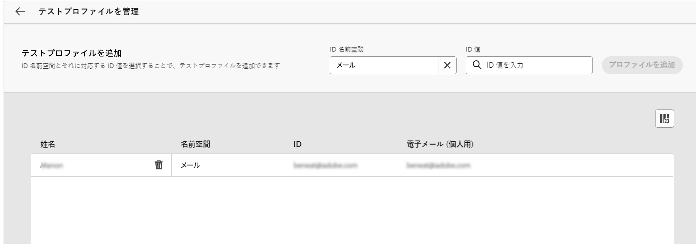

# ダイレクトメールメッセージのテストと送信 {#direct-mail-test-send}

## 抽出ファイルのプレビュー {#preview-dm}

抽出ファイルのコンテンツを定義したら、テストプロファイルを使用してプレビューできます。 パーソナライズされたコンテンツを挿入した場合は、そのコンテンツがメッセージにどのように表示されるかを、テストプロファイルデータを使用して確認できます。

1. 抽出ファイルのコンテンツ設定画面で、「 **[!UICONTROL コンテンツをシミュレート]**.

   {width="800" align="center"}

1. 「**[!UICONTROL テストプロファイルを管理]**」をクリックして、テストプロファイルを追加します。

1. 「**[!UICONTROL ID 名前空間]**」フィールドと「**[!UICONTROL ID 値]**」フィールドを使用して、テストプロファイルを検索します。そのあと、「**[!UICONTROL プロファイルを追加]**」をクリックします。

   {width="800" align="center"}

1. テストプロファイルを選択したら、**[!UICONTROL テストプロファイルを追加]**&#x200B;ウィンドウを閉じます。

1. 次から： **プレビューとテスト** ウィンドウで、抽出ファイルのコンテンツにテストプロファイルデータが追加され、ファイルのレンダリング方法をプレビューできます。

   {width="800" align="center"}

ファイルコンテンツの送信準備が整ったら、シミュレーション画面を閉じ、 **[!UICONTROL 有効化するレビュー]** 」ボタンをクリックします。

## ダイレクトメールキャンペーンの検証と有効化 {#dm-validate}

ダイレクトメールキャンペーンをアクティブ化する前に、キャンペーンと抽出ファイルが正しく設定されていることを確認してください。 これをおこなうには、エディターの上部のセクションで「アラート」をオンにします。 単純な警告もありますが、メッセージの送信を妨げる可能性のある警告もあります。発生する可能性のあるアラートには、警告とエラーの 2 種類があります。

* **警告**&#x200B;は、推奨事項とベストプラクティスを指します。例えば、SMS メッセージが空の場合は警告メッセージが表示されます。

* **エラー** は、解決されていない限り、キャンペーンのパブリッシュを禁止します。 例えば、件名がない場合は、それを警告するエラーメッセージが表示されます。

{width="800" align="center"}

ダイレクトメールキャンペーンの準備が整ったら、 **[!UICONTROL 有効化]** 」ボタンをクリックします。 キャンペーンの開始時に、抽出ファイルが自動的に生成され、 [ファイルルーティング設定](../direct-mail/direct-mail-configuration.md).

送信後は、キャンペーンレポート内でダイレクトメールキャンペーンの影響を測定できます。 レポートについて詳しくは、この節を参照してください。
