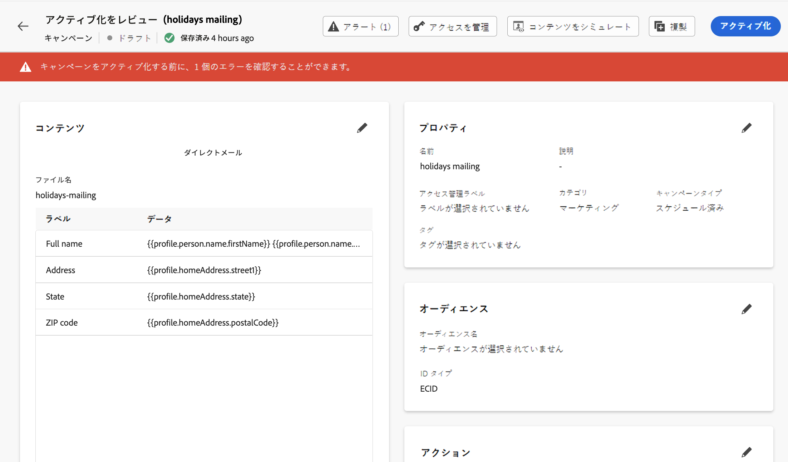

# ダイレクトメールメッセージの確認および送信 {#direct-mail-test-send}

## 抽出ファイルのプレビュー {#preview-dm}

抽出ファイルの内容を定義したら、テストプロファイルを使用して内容をプレビューできます。パーソナライズされたコンテンツを挿入した場合は、そのコンテンツがメッセージにどのように表示されるかを、テストプロファイルデータを使用して確認できます。

これを行うには、「**[!UICONTROL コンテンツをシミュレート]**」をクリックして、テストプロファイルを追加して、テストプロファイルデータを使用した抽出ファイルのレンダリング方法を確認します。

{width="800" align="center"}

テストプロファイルの選択およびコンテンツのプレビュー方法について詳しくは、[コンテンツ管理](../content-management/preview-test.md)の節を参照してください。

ファイルの内容を送信する準備が整ったら、シミュレート画面を閉じて、「**[!UICONTROL アクティブ化するレビュー]**」ボタンをクリックします。

## ダイレクトメールキャンペーンの検証とアクティブ化 {#dm-validate}

>[!IMPORTANT]
>
> キャンペーンが承認ポリシーの対象となっている場合、ダイレクトメールキャンペーンを送信できるようにするには、承認をリクエストする必要があります。[詳細情報](../test-approve/gs-approval.md)

ダイレクトメールキャンペーンをアクティブ化する前に、キャンペーンと抽出ファイルが正しく設定されていることを確認します。それには、エディターの上部セクションでアラートを確認します。単純な警告もありますが、メッセージの送信を妨げる可能性のある警告もあります。発生する可能性のあるアラートには、警告とエラーの 2 種類があります。

* **警告**&#x200B;は、レコメンデーションとベストプラクティスを指します。例えば、SMS メッセージが空の場合は警告メッセージが表示されます。

* **エラー**&#x200B;が解決されない限り、キャンペーンを公開できません。例えば、件名がない場合は、それを警告するエラーメッセージが表示されます。

{width="800" align="center"}

ダイレクトメールキャンペーンの準備が整ったら、「**[!UICONTROL アクティブ化]**」ボタンをクリックします。キャンペーンが開始されると、抽出ファイルが自動的に生成され、[ファイルのルーティング設定](../direct-mail/direct-mail-configuration.md)で指定されているサーバーに書き出されます。

>[!NOTE]
>
>デフォルトでは、書き出されたファイルは改行で終わります。これにより、標準のデータ処理ツールとの互換性が確保されます。

送信後は、キャンペーンレポート内でダイレクトメールキャンペーンの影響を測定できます。ダイレクトメールレポートについて詳しくは、[この節](../reports/campaign-global-report-cja-direct.md)を参照してください。

## ダイレクトメールへの同意の管理 {#dm-consent-management}

[!DNL Journey Optimizer] では、同意は Experience Platform [同意スキーマ](https://experienceleague.adobe.com/docs/experience-platform/xdm/field-groups/profile/consents.html?lang=ja){target="_blank"}で処理されます。デフォルトでは同意フィールドの値は空で、通信内容の受信に対する同意として扱われます。

プロファイルがダイレクトメールの受信をオプトアウトした場合、対応する Experience Platform プロファイル属性で、`consents.marketing.postalMail.val` は `n` となり、対応するプロファイルは後続の配信から除外されます。

再度有効にするには、プロファイル属性を `consents.marketing.postalMail.val` : `y` に戻す必要があります。

プロファイルの属性を管理するには、Experience Platform に移動し、ID 名前空間と対応する ID 値を選択して、プロファイルにアクセスします。詳しくは、[Experience Platform ドキュメント](https://experienceleague.adobe.com/docs/experience-platform/profile/ui/user-guide.html?lang=ja#getting-started){target="_blank"}を参照してください。

Journey Optimizer でのオプトアウトの管理について詳しくは、[この節](../privacy/opt-out.md)を参照してください。
