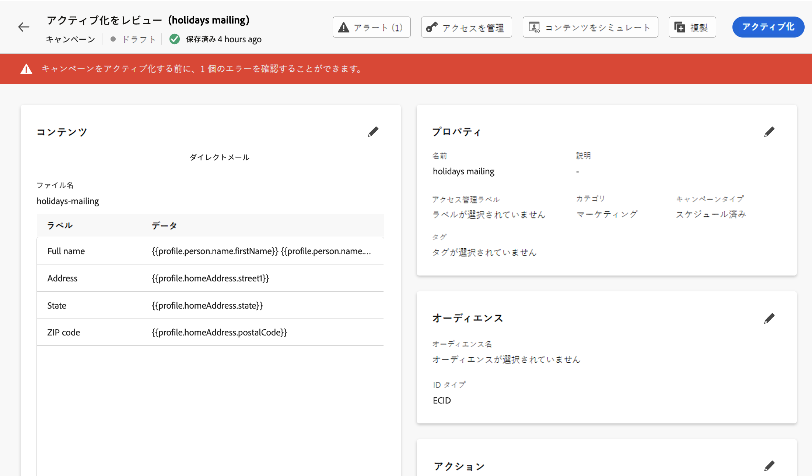

# ダイレクトメールメッセージの確認および送信 {#direct-mail-test-send}

>[!BEGINSHADEBOX]

**このページ：**&#x200B;抽出ファイルをプレビューし、キャンペーンまたはジャーニーを検証してアクティブ化し、ダイレクトメールが適切な受信者に正確に届くように郵便の同意を管理します。

>[!ENDSHADEBOX]

Journey Optimizerで抽出ファイルをプレビューし、ダイレクトメールキャンペーンまたはジャーニーを検証してアクティブ化し、郵便メールの同意を管理する方法について説明します。

## 事前準備 {#before-you-start}

ダイレクトメールメッセージをテストして送信する前に、[&#x200B; メッセージを作成し、抽出ファイルを設定します](create-direct-mail.md)。 [&#x200B; ダイレクトメールチャネル設定](direct-mail-configuration.md)も完了していることを確認してください。

## 抽出ファイルのプレビュー {#preview-dm}

抽出ファイルの内容を定義したら、次のいずれかのシミュレーション方法を使用してプレビューします。

* 「**[!UICONTROL コンテンツをシミュレート]**」をクリックして、サンプル入力データまたはAI自動生成を使用してコンテンツのバリエーションをテストします。 [コンテンツバリエーションのシミュレート方法を学ぶ](../test-approve/simulate-sample-input.md)
* 「**[!UICONTROL コンテンツをシミュレート]**」をクリックし、ドロップダウンから「**[!UICONTROL コンテンツをシミュレート（AEP プロファイル）]**」を選択してテストプロファイルを追加し、抽出ファイルがどのようにレンダリングされるかを確認します。

コンテンツをプレビューおよびテストする方法について詳しくは、[コンテンツ管理](../content-management/preview-test.md)の節を参照してください。

{width="800" align="center"}

ファイルの内容を送信する準備が整ったら、シミュレート画面を閉じて、「**[!UICONTROL アクティブ化するレビュー]**」ボタンをクリックします。

## ダイレクトメールキャンペーンの検証とアクティブ化 {#dm-validate}

>[!IMPORTANT]
>
> キャンペーンが承認ポリシーの対象となっている場合、ダイレクトメールキャンペーンを送信できるようにするには、承認をリクエストする必要があります。 [詳細情報](../test-approve/gs-approval.md)

ダイレクトメールキャンペーンをアクティブ化する前に、キャンペーンまたはジャーニーと抽出ファイルが正しく設定されていることを確認します。 それには、エディターの上部セクションでアラートを確認します。 単純な警告もありますが、メッセージの送信を妨げる可能性のある警告もあります。 発生する可能性のあるアラートには、警告とエラーの 2 種類があります。

* **警告**&#x200B;は、レコメンデーションとベストプラクティスを指します。 例えば、SMS メッセージが空の場合は警告メッセージが表示されます。

* **エラー**&#x200B;が解決されない限り、キャンペーンを公開できません。 例えば、件名がない場合は、それを警告するエラーメッセージが表示されます。

{width="800" align="center"}

ダイレクトメールキャンペーンの準備ができたら、[&#x200B; ジャーニー](../building-journeys/journey-gs.md)または[&#x200B; キャンペーン &#x200B;](../campaigns/create-campaign.md)の設定を完了して送信します。

>[!NOTE]
>
>デフォルトでは、エクスポートされたファイルは改行で終わります。 これにより、標準のデータ処理ツールとの互換性が確保されます。

送信したデータは、レポート内でダイレクトメールキャンペーンやジャーニーの影響を測定できます。 ダイレクトメールレポートについて詳しくは、次の節を参照してください。
* [ダイレクトメールキャンペーンレポート](../reports/campaign-global-report-cja-direct.md)
* [ダイレクトメールジャーニーレポート](../reports/journey-global-report-cja-direct.md)

## 書き出しのタイミングとファイル生成について {#dm-export-timing}

ダイレクトメールの書き出しは、**02:01**、**06:01**、**10:01**、**14:01**、**18:01**、**22:01**&#x200B;の固定4時間UTC サイクルで実行されます。

プロファイルは、ダイレクトメールアクティビティに到達した後、*次*&#x200B;の書き出しサイクルに含まれます。 つまり、プロファイルがダイレクトメールノードに到達した時点にもとづいてファイルを作成することになります。キャンペーンやジャーニーが最初にアクティブ化された時点ではありません。

* **1日に複数のファイルを受け取ることができる理由** - プロファイルが4時間の異なるウィンドウでダイレクトメールアクティビティに到達した場合、Journey Optimizerは各ウィンドウに対して個別の書き出しファイルを生成します。 これは想定されている動作です。

  次に例を示します。

   * **14:01**&#x200B;より前に到着したプロファイルは、**14:01**&#x200B;に書き出されます。
   * **14:02**&#x200B;から&#x200B;**18:01**&#x200B;に到達したプロファイルは、**18:01**&#x200B;に書き出されます。

  これはプロファイルを複製せず、到着ウィンドウでバッチ処理します。

* **プロファイル アクティビティのタイミングを更新** - ジャーニーで、**[!UICONTROL プロファイルの更新]** アクティビティは、プロファイルがそのアクティビティに達したジャーニー実行時にすぐに実行されます。 ダイレクトメールの書き出しサイクルを待つことはありません。

* **1 ファイル/日のシナリオに関する推奨事項** -1日に1 ファイルが必要な場合は、次のオプションを検討してください。

   * **24時間のルーティング頻度**:1日に1つのファイルを保証しますが、配信の遅延が発生します。
   * **時刻まで待つ**: プロファイルを同じ書き出しウィンドウに配置できますが、結果はジャーニーのタイミングによって異なります。
   * **4時間のルーティング頻度**：最も遅い遅延を提供しますが、1日に複数のファイルが生成される可能性があります。

## ダイレクトメールへの同意の管理 {#dm-consent-management}

[!DNL Journey Optimizer] では、同意は Experience Platform [同意スキーマ](https://experienceleague.adobe.com/docs/experience-platform/xdm/field-groups/profile/consents.html?lang=ja){target="_blank"}で処理されます。 デフォルトでは同意フィールドの値は空で、通信内容の受信に同意したものとして扱われます。

プロファイルがダイレクトメールの受信をオプトアウトした場合、対応する Experience Platform プロファイル属性で、`consents.marketing.postalMail.val` は `n` となり、対応するプロファイルは後続の配信から除外されます。

再度有効にするには、プロファイル属性を `consents.marketing.postalMail.val` : `y` に戻す必要があります。

プロファイルの属性を管理するには、Experience Platform に移動し、ID 名前空間と対応する ID 値を選択して、プロファイルにアクセスします。 詳しくは、[Experience Platform ドキュメント](https://experienceleague.adobe.com/docs/experience-platform/profile/ui/user-guide.html?lang=ja#getting-started){target="_blank"}を参照してください。

Journey Optimizer でのオプトアウトの管理について詳しくは、[この節](../privacy/opt-out.md)を参照してください。

## 関連トピック {#related-topics}

* [ダイレクトメールの基本を学ぶ](get-started-direct-mail.md)
* [ダイレクトメールメッセージの作成](create-direct-mail.md)
* [ダイレクトメールチャネルの設定](direct-mail-configuration.md)
* [コンテンツのプレビューとテスト](../content-management/preview-test.md)

ダイレクトメールに関するよくある質問については、[&#x200B; ダイレクトメールの基本を学ぶ](get-started-direct-mail.md)を参照してください。
