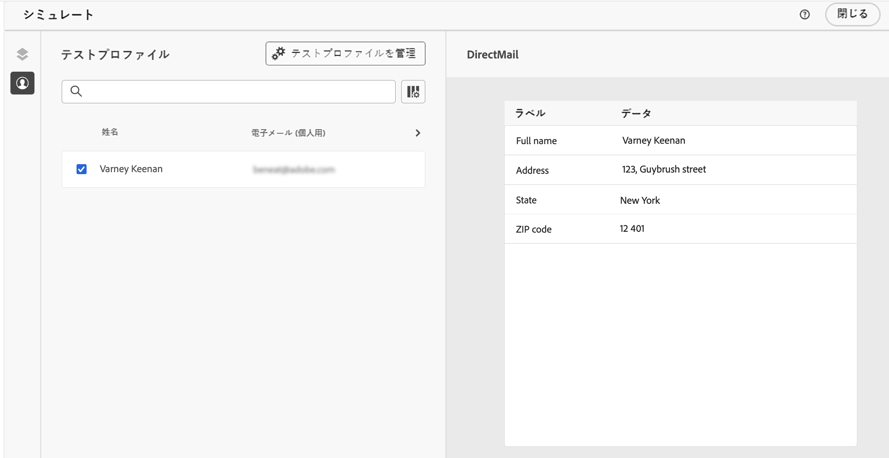

# ダイレクトメールメッセージのテストと送信 {#direct-mail-test-send}

## 抽出ファイルのプレビュー {#preview-dm}

抽出ファイルの内容を定義したら、テストプロファイルを使用して内容をプレビューできます。パーソナライズされたコンテンツを挿入した場合は、そのコンテンツがメッセージにどのように表示されるかを、テストプロファイルデータを使用して確認できます。

1. 抽出ファイルの内容設定画面で、「**[!UICONTROL コンテンツをシミュレート]**」をクリックします。

   {width="800" align="center"}

1. 「**[!UICONTROL テストプロファイルを管理]**」をクリックして、テストプロファイルを追加します。

1. 「**[!UICONTROL ID 名前空間]**」フィールドと「**[!UICONTROL ID 値]**」フィールドを使用して、テストプロファイルを検索します。そのあと、「**[!UICONTROL プロファイルを追加]**」をクリックします。

   {width="800" align="center"}

1. テストプロファイルを選択したら、**[!UICONTROL テストプロファイルを追加]**&#x200B;ウィンドウを閉じます。

1. **プレビューとテスト**&#x200B;ウィンドウから、抽出ファイルの内容にテストプロファイルデータが追加され、ファイルがどうレンダリングされるかをプレビューできるようになります。

   {width="800" align="center"}

ファイルの内容を送信する準備が整ったら、シミュレート画面を閉じて、「**[!UICONTROL アクティブ化するレビュー]**」ボタンをクリックします。

## ダイレクトメールキャンペーンの検証とアクティブ化 {#dm-validate}

ダイレクトメールキャンペーンをアクティブ化する前に、キャンペーンと抽出ファイルが正しく設定されていることを確認します。それには、エディターの上部セクションでアラートを確認します。単純な警告もありますが、メッセージの送信を妨げる可能性のある警告もあります。発生する可能性のあるアラートには、警告とエラーの 2 種類があります。

* **警告**&#x200B;は、推奨事項とベストプラクティスを指します。例えば、SMS メッセージが空の場合は警告メッセージが表示されます。

* **エラー**&#x200B;が解決されない限り、キャンペーンを公開できません。例えば、件名がない場合は、それを警告するエラーメッセージが表示されます。

{width="800" align="center"}

ダイレクトメールキャンペーンの準備が整ったら、「**[!UICONTROL アクティブ化]**」ボタンをクリックします。キャンペーンが開始すると、抽出ファイルが自動的に生成され、[ファイルのルーティング設定](../direct-mail/direct-mail-configuration.md)で指定されているサーバーに書き出されます。

送信後は、キャンペーンレポート内でダイレクトメールキャンペーンの影響を測定できます。レポートについて詳しくは、この節を参照してください。
