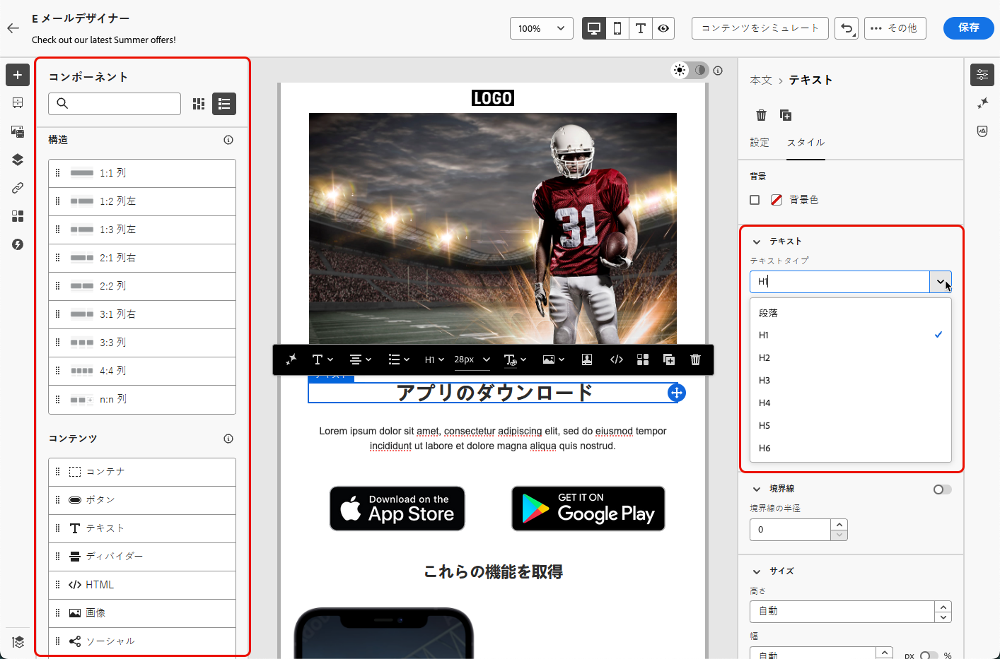

# アクセス可能なコンテンツのデザイン {#accessible-content}

[欧州アクセシビリティ法](https://eur-lex.europa.eu/legal-content/EN/TXT/?uri=CELEX%3A32019L0882){target="_blank"}は、加盟国間で異なる国のルールによって生じる障壁を排除することで、アクセス可能な製品およびサービスの内部市場を強化することを目的とした指令です。

この規制では、メール、ニュースレター、PDF、ダウンロード可能なコンテンツを含むすべてのデジタル通信にアクセス可能である必要があると規定されています。したがって、受信者向けのコンテンツを作成する際は、アクセス可能なフォントや読み取り可能な形式の使用、画像用の代替テキストの提供など、特定のガイドラインに従う必要があります。

[!DNL Journey Optimizer] [E メールデザイナー](content-from-scratch.md)を使用すると、マーケターは&#x200B;**メール**&#x200B;と&#x200B;**ランディングページ**&#x200B;の両方のコンテンツを作成でき、Web コンテンツアクセシビリティガイドライン（WCAG）2.1 レベル AA に基づいて、この指令に簡単に準拠できます。

これに沿って、[!DNL Journey Optimizer] を使用してアクセス可能なコンテンツをデザインするベストプラクティスを以下に示します。

>[!NOTE]
>
>このページでは、[!DNL Journey Optimizer] でデザインしたメールやランディングページを障害のある人物が読み、理解し、操作できるように、すべての受信者がコンテンツにアクセスできるようにする方法について説明します。
>
>一方、[!DNL Journey Optimizer] インターフェイス自体のアクセシビリティについて詳しくは、[この節](../start/accessibility.md)を参照してください。
> 
## テキストの読みやすさの確保 {#text-readability}

**[!UICONTROL テキスト]**&#x200B;コンポーネントの「**[!UICONTROL スタイル]**」タブを活用して、適切なカラーコントラストやシンプルなフォントを使用するなど、テキストの読みやすさを確保します。[詳細情報](content-components.md#text)

{width="80%"}

フォントとテキストについて詳しくは、以下のガイドラインに従ってください。

**フォントの選択**

* Arial、Verdana、Tahoma、Helvetica、Open Sans などのサンセリフフォントを使用します。
* 本文コンテンツには、セリフ体、筆記体、装飾体のフォントを回避します。
* 一貫性とフォールバックのために、限定的なフォントセットに固定します（例：`font-family: Arial, Helvetica, sans-serif;`）。

**フォントサイズ**

* 本文のフォントサイズは 16 px 以上を確保します。
* 見出しには適切な階層を使用します。

**カラーコントラスト**

* テキストと背景の間のコントラスト比を 4.5:1 以上に維持します。
* 大きなテキスト（24 px 以上または太字 18 px）の場合は、3:1 以上のコントラストを確保します。
* 白い背景では、ライトグレーまたはパステルのテキストは回避します。
* 意味を伝えるのに色だけに依存するのではなく、下線やアイコンなどを使用します。

**テキストのアクセシビリティ**

* 画像内のテキストは回避します。
* 本文では大文字を使用しないでください。
* レイアウトを崩さずに、テキストを最大 200％までズームできることを確認します。

## 視覚的なアクセシビリティの確保 {#visual-accessibility}

コンテンツが視覚的にアクセス可能であることを確認するには、以下のベストプラクティスに従ってください。

* 重要な情報に対しては色のみのインジケーターの使用は回避します。
* テキストラベルまたはアイコンを使用して、明確さを確保します。
* ボタンが大きく、適切な間隔が空いていることを確保して、モバイルおよびレスポンシブレイアウト向けにデザインを最適化します。
* デバイスや画面サイズをまたいで定期的にテストすることで、アクセシビリティを維持します。

[!DNL Journey Optimizer] では、E メールデザイナーの&#x200B;**[!UICONTROL スタイル]**&#x200B;パネルのスタイルパラメーターと属性を使用して、コンテンツ内の様々な要素のサイズと間隔をさらに細かく調整できます。[詳細情報](get-started-email-style.md)

例えば、[背景](backgrounds.md)を更新したり、余白、パディング、整列を変更したりして、コンテンツの視覚的なアクセシビリティを向上させることができます。[詳細情報](alignment-and-padding.md)

{width="80%"}

さらに、[!DNL Journey Optimizer] E メールデザイナーを使用すると、様々なデバイスや画面サイズに合わせてデザインをプレビューし、最適化できます。いつでも&#x200B;**[!UICONTROL ライブビューに切り替えて]**、様々なデバイスサイズでコンテンツがどのようにレンダリングされる可能性があるかを確認できます。

{width="80%"}

>[!CAUTION]
>
>ライブビューは、様々なデバイスサイズをまたいでレンダリングがどのように表示される可能性があるかを比較するのにデザインされた汎用プレビューです。最終的なレンダリングは、受信者のメールクライアントによって異なる場合があります。

## 画像用の代替テキストの使用 {#alt-text}

**[!UICONTROL 画像]**&#x200B;コンポーネントを使用して、画像用の代替テキストを指定します。[詳細情報](content-components.md#image)

{width="90%"}

デジタル製品で効果的な代替テキストを使用するには、以下のガイドラインに従ってください。

* 画像の目的を簡潔に文脈に沿って説明します。
* 「…の画像」のような冗長なフレーズを回避し、装飾的な画像には空の代替テキストを使用します。
* 意味のあるアイコンには分かりやすいラベルを付け、複雑な画像には簡潔な代替テキストと、別の場所でより長い説明を使用します。

## 読み取り可能な形式の使用 {#readable-format}

E メールデザイナーの関連する構造および[コンテンツコンポーネント](content-components.md)と、**[!UICONTROL スタイル]**&#x200B;パネルのオプションを使用して、すべてのユーザーがアクセス可能である明確、論理的、簡潔な方法でコンテンツを整理します。

{width="100%"}

* 適切な見出し、段落、リスト、テーブルを含む、構造化されたセマンティック HTML を使用します。
* コンテンツが左から右、上から下への論理的な流れに沿っていることを確認します。
* 明確で簡潔な言語を使用します。
* PDF とインフォグラフィックには代替形式を用意します。
* テキストのサイズ変更とリフローを可能にし、すべての形式で適切なカラーコントラストを使用して読み取り可能なテキスト編集を確保します。

## コンテンツの読みやすさの確保 {#readability}

読み取り可能にするには、明確で、適切に構造化され、視覚、認知、読み取りに困難がある人物や支援テクノロジーを使用している人物を含む全員が使用できるコンテンツにする必要があります。アクセス可能なコンテンツを作成する際に考慮すべき点を以下に示します。

* 文の単語数を 20 語以内に抑えます。
* 直接的で要点を押さえたコピーを編集します。
* 能動態を使用して、文の構造をよりシンプルに保持します。
* 一部の人にとってなじみのないスラングや専門用語、地域特有の言葉は回避します。

メールの読みやすさを評価するには、Microsoft Word に含まれている一番人気の [Flesch Reading Ease テスト](https://support.microsoft.com/ja-jp/office/get-your-document-s-readability-and-level-statistics-85b4969e-e80a-4777-8dd3-f7fc3c8b3fd2){target="_blank"}を使用します。このテストでは、コンテンツの読みやすさを 0～100 のスケールで計算します。

## コンテンツのテスト {#test}

コンテンツのアクセシビリティを検証するには、[!DNL Journey Optimizer] が提供するテスト機能を使用します。これらは、コンテンツが完全にアクセス可能かどうかを確認するのに特別に設計されたものではありませんが、第 1 レベルの検証を提供できます。

* テストプロファイルを使用してコンテンツをプレビューします。[詳細情報](../content-management/preview.md)

* Litmus を活用した「[メールレンダリング](../content-management/rendering.md)」オプションを使用して、主要なメールクライアント（Apple メール、Gmail、Outlook）でデザインをシミュレートし、テキスト、色、画像によってコンテンツがアクセス可能になるかどうかを確認します。<!--Litmus includes accessibility testing-->

* 実際のオーディエンスに送信する前に、コンテンツのレンダリングをテストする本配信前確認を送信します。[詳細情報](../content-management/proofs.md)

{width="90%"}

コンテンツに確実にアクセスできるかどうかをより一貫した方法で確認するには、次のような特定の外部ツールを使用します。

* コントラストとコンプライアンスを評価する [WebAim コントラストチェッカー](https://webaim.org/resources/contrastchecker/){target="_blank"}および [WAVE web アクセシビリティ評価ツール](https://wave.webaim.org/){target="_blank"}。

* 視覚障害のあるユーザーの視点からメールを体験するスクリーンリーダー（例：[NVDA](https://www.nvaccess.org/download/){target="_blank"}、iPhone の [VoiceOver](https://support.apple.com/ja-jp/guide/iphone/iph3e2e415f/ios){target="_blank"}）などの支援テクノロジー。

## ダークモードの使用 {#dark-mode}

<!--TO PUBLISH WHEN DARK MODE IS RELEASED-->

ダークモードは、光に敏感なユーザーや視覚障害のあるユーザーの視覚的なアクセシビリティを強化し、視聴エクスペリエンスを向上させます。

{width="90%"}

ダークモードでコンテンツをデザインするベストプラクティスとして、透明な PNG または SVG を使用し、適切なメタタグと CSS を設定して、ダークモードがサポートされていない場合はアクセス可能なフォールバックスタイルを指定することをお勧めします。最後に、すべてのメールコンテンツと UI 要素をライトモードとダークモードの両方でテストして、メールがダークモードで正しくレンダリングされることを確認します。

アクセシビリティを確保するガイドラインを含む、ダークモードに固有のベストプラクティスについて詳しくは、[この節](dark-mode.md#best-practices)を参照してください。<!--KEEP dark mode accessibility best practices IN ONE SINGLE LOCATION - for now listed on the Dark mode page.-->

## アクセシビリティに対する特定の属性の使用 {#attributes}

### 言語属性 {#language}

デザインを作成する際は、コンテンツ本体に `lang`（言語）属性と `dir`（テキスト方向）属性を含めます。これらの属性は、スクリーンリーダーなどの支援テクノロジーで、コンテンツを適切に解釈および表示するのに役立ちます。

* `lang` 属性は、支援テクノロジーに対するメールの言語を示し、単語が正しく発音されるようにします。

  +++例

  英語の例：

  ```
  <body lang="en">
  ```

  フランス語の例：

  ```
  <body lang="fr">
  ```

  +++

* `dir` 属性は、テキストの方向を指定します。英語やフランス語を含むほとんどの言語は左から右（ltr）に読みますが、アラビア語やヘブライ語などの言語は右から左（rtl）に読みます。

  +++例

  英語の例（左から右）：

  ```
  <body lang="en" dir="ltr">
  ```

  アラビア語の例（右から左）：

  ```
  <body lang="ar" dir="rtl">
  ```

  +++

スクリーンリーダーは、正しい発音ルールを適用するために `lang` 属性に依存し、テキストの方向によって、左から右または右から左の言語でコンテンツが自然に流れるようになります。これらの属性がないと、ユーザーは読み取り順序に混乱したり、発音が間違ったりする場合があります。その結果、メール本文は常に適切な `lang` 属性と `dir` 属性で囲むようにします。

>[!TIP]
>
>メールに複数の言語が含まれる場合は、特定のセクション（`<table>` または `<td>` ブロックなど）に適切な言語属性を割り当てて、各部分が正しく読み取られるようにします。

### テーブル {#tables}

HTML コンテンツでは、多くの場合、レイアウトにテーブルが使用されます。デフォルトでは、スクリーンリーダーはすべての `<table>` をデータテーブルとして処理し、行、列、構造を読み上げます。テーブルが書式設定のみに使用されている場合、混乱を招くことがあります。

レイアウトテーブルに `role="presentation"`（または `role="none"`）を追加して、支援テクノロジーが構造をスキップし、実際のコンテンツにのみ焦点を当てられるようにします。

+++例 - レイアウトテーブル（`role="presentation"` を使用する場合）

```
<table role="presentation" border="0" cellpadding="0" cellspacing="0" width="100%"> 

  <tr> 

    <td align="center"> 

      <h1>Hello World</h1> 

      <p>Welcome to our newsletter</p> 

    </td> 

  </tr> 

</table>
```

スクリーンリーダーは次のように内容を読み上げます。
「Hello World。ニュースレターへようこそ。」*（行、列、テーブルに関する読み上げはされません）*

+++

+++例 - データテーブル（`role="presentation"` を使用しない場合）

```
<table border="1" cellpadding="5" cellspacing="0"> 

  <tr> 

    <th scope="col">Name</th> 

    <th scope="col">Score</th> 

  </tr> 

  <tr> 

    <td>Alice</td> 

    <td>95</td> 

  </tr> 

  <tr> 

    <td>Bob</td> 

    <td>88</td> 

  </tr> 

</table> 
```

スクリーンリーダーは次ように内容を読み上げます。
「2 列 3 行のテーブルです。」

「名前、Alice。スコア、95。」

「名前、Bob。スコア、88。」

+++

>[!TIP]
>
>`role="presentation"` は、レイアウトテーブルにのみ使用します。データテーブルの場合、スクリーンリーダーがヘッダーと関係を正しく読み上げることができるように、セマンティック `<table>` 構造を保持します。

### リンクのテキスト {#links}

スクリーンリーダーは、リンクのテキストを使用してリンクを読み上げます。リンクに「こちらをクリック」または「詳細情報」のみのラベルが付いている場合、支援テクノロジーのユーザーは宛先を知りません。アクセシビリティを確保するには、ターゲットやアクションを明確に示す説明テキストが必要です。

E メールデザイナーを使用してコンテンツへの[リンクを追加](message-tracking.md#insert-links)し、ラベルを編集して識別可能（表示可能）で説明的（目的が明確）にします。「こちら」や「詳細」など、あいまいなラベルは回避します。

{width="70%"}

+++例 - 良いリンク（説明的）： 

```
<p>Learn more in the  

<a href="https://adobe.com/release-notes">August release notes</a>. 

</p>
```

スクリーンリーダーは次のように内容を読み上げます。
「リンク、8月リリースノート」

+++

+++例 - 悪いリンク（説明的ではない）

```
<p>Learn more about our new features.  

  <a href="https://adobe.com/release-notes">Click here</a>. 

</p>
```

スクリーンリーダーは次のように内容を読み上げます。
「リンク、こちらをクリック。」*（読み取り順序からコンテキストが提供されない）*

+++

<!--
>[!TIP]
>
>Always ensure link text is discernible (visible) and descriptive (clear about purpose). Avoid vague labels like 'here' or 'more'.-->

## キーボードナビゲーションとフォーカスサポートの提供 {#keyboard}

<!--for landing pages-->

キーボードナビゲーションとフォーカスサポートを提供することで、マウスを使用できない人物がコンテンツに完全にアクセスし、やり取りできます。また、すべてのユーザーに明確で一貫性のある情報移動方法を提供することで、全体的なユーザビリティも向上します。

* キーボード経由のフォーカス

   * すべてのインタラクティブ要素（ボタン、チェックボックス、リンクなど）に `tabindex="0"` を設定し、自然なタブ順序に含まれるようにします。

   * Tab キーと矢印キー（↑ ↓ ← →）によるナビゲーションを許可します。これにより、フォーカスされた要素が視覚的にハイライト表示されます。

* カスタムフォーカススタイル

   * 実用的な要素にフォーカスさせるには、明確で識別可能なスタイルを適用します。

     +++例（CSS）

     ```
     [tabindex="0"] : focus { 
     
     outline: 2px solid #00AEEF;  /* Cyan border */ 
     
     background-color: #20CEFF;   /* Optional background */ 
     
     }
     ```

     +++

   * フォーカスインジケーターが WCAG 2.2 のフォーカス外観標準を満たしていることを確認します。標準には以下が含まれます。

      * 最小領域：2 CSS ピクセルの太さのアウトライン。

      * コントラスト比：コントラスト比：フォーカス状態と非フォーカス状態の 3:1 以上。

* キーボードアクティブ化サポート

   * チェックボックスとボタンが Enter キーと Space キーに応答することを確認します。

   * キーボードのみを使用してインタラクションを検証します。

      * Enter キーまたは Space キーを押すと、チェックボックスが切り替わります。

      * Enter キーまたは Space キーを押すと、ボタンがトリガーされます。
