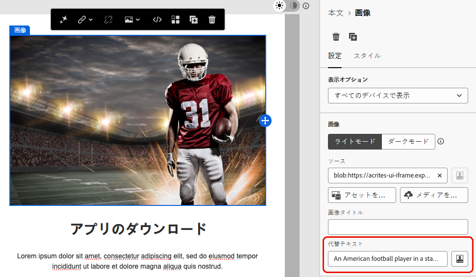
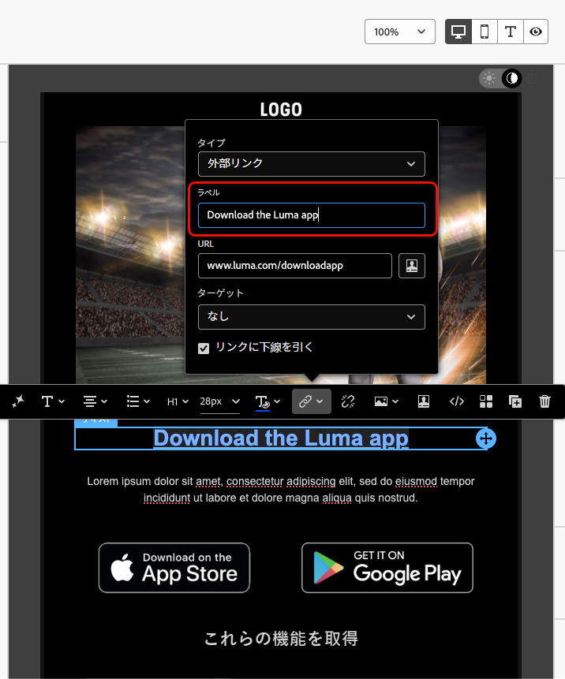

# アクセシブルなコンテンツの設計 {#accessible-content}

[ 欧州アクセシビリティ法 ](https://eur-lex.europa.eu/legal-content/EN/TXT/?uri=CELEX%3A32019L0882){target="_blank"} は、加盟国間の国のルールの違いによる障壁を取り除くことにより、アクセシブルな製品やサービスの内部市場を強化することを目的とした指令です。

この規制では、電子メール、ニュースレター、PDF、ダウンロード可能なコンテンツを含むすべてのデジタル通信にアクセスできると規定されています。 したがって、受信者用のコンテンツを作成する場合は、アクセシブルなフォントや読み取り可能な形式を使用するなど、特定のガイドラインに従い、画像用の代替テキストを提供する必要があります。

[!DNL Journey Optimizer][ メールDesigner](content-from-scratch.md) を使用すると、マーケターは、**メール** と **ランディングページ** の両方のコンテンツを作成できます。Web Content Accessibility Guidelines （WCAG） 2.1、レベル AA に基づいて、このディレクティブに簡単に準拠できます。

これに伴い、[!DNL Journey Optimizer] を使用してアクセス可能なコンテンツを設計するためのベストプラクティスを以下に示します。

>[!NOTE]
>
>このページは、すべての受信者がコンテンツにアクセスできるようにして、障害のあるユーザーが [!DNL Journey Optimizer] で設計されたメールやランディングページを読み、理解し、やり取りできるようにします。
>
>一方、[!DNL Journey Optimizer] インターフェイス自体のアクセシビリティについては、[ この節 ](../start/accessibility.md) で詳しく説明します。
> 
## テキストを読みやすくする {#text-readability}

**[!UICONTROL テキスト]** コンポーネントの「**[!UICONTROL スタイル]**」タブを活用して、適切なカラーコントラストやシンプルなフォントの使用など、テキストが読みやすいようにします。 [詳細情報](content-components.md#text)

{width="80%"}

フォントとテキストの場合は、必ず次のガイドラインに従ってください。

**フォントの選択**

* Arial、Verdana、Tahoma、Helvetica、Open Sans などのサンセリフフォントを使用します。
* 本文コンテンツには、セリフ、筆記体、装飾体のフォントを使用しないでください。
* 一貫性とフォールバックのために、限定的なフォントセットに固定します（例：`font-family: Arial, Helvetica, sans-serif;`）。

**フォントサイズ**

* 本文のフォントサイズは 16 px 以上にしてください。
* 見出しには適切な階層を使用します。

**カラーコントラスト**

* テキストと背景の間のコントラスト比を 4.5:1 以上に保ちます。
* 大きなテキスト（≥24px または太字 18px）の場合は、少なくとも 3 :1 のコントラストを確認します。
* 白い背景には明るいグレーやパステルテキストを使用しないでください。
* 意味を伝えるときに色だけに依存するのではなく、下線やアイコンなどを使用します。

**テキストのアクセシビリティ**

* 画像内のテキストは避けます。
* 本文ではすべて大文字を使用しないでください。
* レイアウトを中断することなく、テキストを最大 200% までズームできます。

## 視覚的なアクセシビリティの確保 {#visual-accessibility}

コンテンツが視覚的にアクセスしやすくするには、次のベストプラクティスに従います。

* 重要な情報に対しては色のみのインジケーターの使用は避けます。
* 明確にするためにテキストラベルまたはアイコンを使用します。
* デザインをモバイルやレスポンシブなレイアウト用に最適化し、ボタンのサイズを大きくして適切な間隔を確保します。
* アクセシビリティを維持するために、デバイスや画面サイズをまたいで定期的にテストします。

ま [!DNL Journey Optimizer]、メールDesigner **[!UICONTROL スタイル]** パネルのスタイルパラメーターと属性を使用して、コンテンツ内の様々な要素のサイズと間隔をさらに細かく設定することができます。 [詳細情報](get-started-email-style.md)

例えば、[ 背景 ](backgrounds.md) を更新したり、余白、パディングおよび整列を変更してコンテンツの視覚的なアクセシビリティを向上させることができます。 [詳細情報](alignment-and-padding.md)

{width="80%"}

さらに、[!DNL Journey Optimizer] Email Designerを使用すると、様々なデバイスや画面サイズに合わせてデザインをプレビューし最適化できます。 コンテンツが様々なデバイスサイズでどのようにレンダリングされるかを確認するには、いつでも **[!UICONTROL ライブビューに切り替える]** ことができます。

{width="80%"}

>[!CAUTION]
>
>ライブビューは、様々なデバイスサイズをまたいでレンダリングがどのように表示される可能性があるかを比較するのにデザインされた汎用プレビューです。最終的なレンダリングは、受信者のメールクライアントによって異なる場合があります。

## 画像に代替テキストを使用 {#alt-text}

**[!UICONTROL 画像]** コンポーネントを使用して、画像用の代替テキストを提供します。 [詳細情報](content-components.md#image)

{width="90%"}

デジタル製品で効果的な代替テキストを使用するには、次のガイドラインに従います。

* 画像の目的を簡潔に文脈的に説明します。
* 「画像の…」などの冗長なフレーズを避け、装飾画像には空の代替テキストを使用します。
* 意味のあるアイコンには意味のあるラベルを付け、複雑な画像には短い代替テキストと長い説明を別の場所で使用します。

## 読み取り可能な形式を使用 {#readable-format}

メールDesigner関連の構造および [ コンテンツコンポーネント ](content-components.md)、および **[!UICONTROL スタイル]** パネルのオプションを使用して、すべてのユーザーがアクセスできる明確、論理的かつ簡潔な方法でコンテンツを整理します。

{width="100%"}

* 適切な見出し、段落、リストおよびテーブルを持つ、構造化されたセマンティック HTMLを使用します。
* コンテンツが、左から右、上から下への論理的なフローに従っていることを確認します。
* 明確で簡潔な言語を使用する。
* PDF とインフォグラフィックの代替形式を提供します。
* テキストのサイズ変更と折り返しを許可し、すべての形式で適切なカラーコントラストを使用してタイポグラフィが読み取れるようにします。

## コンテンツのわかりやすさの確保 {#readability}

コンテンツを読みやすくするには、明確で、適切に構造化され、誰でも使用できる必要があります。これには、視覚、認知または読み取りに問題があるユーザーや支援テクノロジーを使用しているユーザーも含まれます。 アクセシブルなコンテンツを作成する際に考慮すべき点を以下に示します。

* 文の単語数を 20 語以内に抑えます。
* 直接、要点になるようにコピーを編集します。
* 能動態を使用して、文の構造をよりシンプルにします。
* 一部の人にとってなじみのないスラングや専門用語、地域用語は避けます。

メールの読みやすさを評価するには、Microsoft Word に含まれている一般的な [Flesch Reading Ease test](https://support.microsoft.com/en-us/office/get-your-document-s-readability-and-level-statistics-85b4969e-e80a-4777-8dd3-f7fc3c8b3fd2){target="_blank"} を使用します。このテストでは、コンテンツが 0 ～ 100 のスケールで読みやすくなるかどうかを計算します。

## コンテンツのテスト {#test}

コンテンツのアクセシビリティを検証するには、[!DNL Journey Optimizer] が提供するテスト機能を使用できます。 コンテンツが完全にアクセス可能かどうかを確認するように特別に設計されているわけではありませんが、第 1 レベルの検証を提供できます。

* テストプロファイルを使用したコンテンツのプレビュー。 [詳細情報](../content-management/preview.md)

* Litmus を活用した [ メールのレンダリング ](../content-management/rendering.md) オプションを使用して、主要なメールクライアント（Apple Mail、Gmail、Outlook）をまたいでデザインをシミュレーションし、テキスト、カラー、画像によってコンテンツにアクセスできるかどうかを確認します。<!--Litmus includes accessibility testing-->

* 配達確認を送信して、実際のオーディエンスに送信する前にコンテンツのレンダリングをテストします。 [詳細情報](../content-management/proofs.md)

{width="90%"}

コンテンツに確実にアクセスできるかどうかをより一貫した方法で確認するには、次のような特定の外部ツールを使用します。

* コントラストとコンプライアンスを評価するための [WebAim コントラストチェッカー ](https://webaim.org/resources/contrastchecker/){target="_blank"} および [WAVE web アクセシビリティ評価ツール ](https://wave.webaim.org/){target="_blank"}

* スクリーンリーダー（iPhoneの [NVDA](https://www.nvaccess.org/download/){target="_blank"} や [VoiceOver](https://support.apple.com/en-ie/guide/iphone/iph3e2e415f/ios){target="_blank"} など）などの支援テクノロジーを使用して、視覚に障害のあるユーザーの観点からメールを操作できます。

## ダークモードを使用 {#dark-mode}

<!--TO PUBLISH WHEN DARK MODE IS RELEASED-->

ダークモードは、明るい感度や視覚障害のあるユーザーの視覚的なアクセシビリティを強化し、視聴体験を向上させます。

{width="90%"}

ダークモードでコンテンツをデザインするためのベストプラクティスとして、透明な PNG または SVG を使用し、適切なメタタグと CSS を設定し、ダークモードがサポートされていない場合はアクセス可能なフォールバックスタイル設定を提供します。 最後に、すべてのメールコンテンツと UI 要素をライトモードとダークモードの両方でテストして、メールがダークモードで正しくレンダリングされていることを確認します。

アクセシビリティを確保するためのガイドラインなど、ダークモードに固有の詳細なベストプラクティスについては、[ この節 ](dark-mode.md#best-practices) を参照してください。<!--KEEP dark mode accessibility best practices IN ONE SINGLE LOCATION - for now listed on the Dark mode page.-->

## アクセシビリティへの特定の属性の使用 {#attributes}

### 言語属性 {#language}

デザインを作成する場合は、コンテンツ本文に `lang` （言語）属性と `dir` （テキスト方向）属性を含めます。 これらの属性は、スクリーンリーダーなどの支援テクノロジーで、コンテンツを適切に解釈および表示するのに役立ちます。

* `lang` 属性は、支援テクノロジーに対するメールの言語を示し、単語が正しく発音されるようにします。

  +++例

  例：英語

  ```
  <body lang="en">
  ```

  フランス語の例：

  ```
  <body lang="fr">
  ```

  +++

* `dir` 属性は、テキストの方向を指定します。 英語やフランス語を含むほとんどの言語は左から右（ltr）で読まれますが、アラビア語やヘブライ語などの言語は右から左（rtl）で読まれます。

  +++例

  例：英語（左から右）:

  ```
  <body lang="en" dir="ltr">
  ```

  アラビア語の例（右から左）:

  ```
  <body lang="ar" dir="rtl">
  ```

  +++

スクリーンリーダーは、正しい発音ルールを適用するために `lang` 属性に依存しますが、テキストの方向は、左から右または右から左に記述する言語の場合にはコンテンツが自然に流れ込むようにしています。 これらの属性がないと、読み取り順序が混乱したり、発音が誤ったりする可能性があります。 その結果、メール本文には常に適切な `lang` と `dir` 属性を含めます。

>[!TIP]
>
>メールに複数の言語が含まれる場合、各パーツが確実に正しく読み取れるように、適切な言語属性を特定のセクション（`<table>` や `<td>` ブロックなど）に割り当てます。

### テーブル {#tables}

HTML コンテンツでは、レイアウトにテーブルが使用されることがよくあります。 デフォルトでは、スクリーンリーダーはすべての `<table>` をデータテーブルとして扱い、行、列、構造を読み上げます。 テーブルを書式設定のみに使用すると、混乱を招く可能性があります。

`role="presentation"` （または `role="none"`）をレイアウトテーブルに追加して、支援テクノロジーが構造をスキップして、実際のコンテンツにのみ集中できるようにします。

+++例 – レイアウトテーブル（`role="presentation"` 付き）

```
<table role="presentation" border="0" cellpadding="0" cellspacing="0" width="100%"> 

  <tr> 

    <td align="center"> 

      <h1>Hello World</h1> 

      <p>Welcome to our newsletter</p> 

    </td> 

  </tr> 

</table>
```

スクリーンリーダーは次の内容を読み上げます。
「こんにちは、世界。 ニュースレターへようこそ。」 *（行、列、テーブルに関する記載なし）*

+++

+++例 – データテーブル（`role="presentation"` なし）

```
<table border="1" cellpadding="5" cellspacing="0"> 

  <tr> 

    <th scope="col">Name</th> 

    <th scope="col">Score</th> 

  </tr> 

  <tr> 

    <td>Alice</td> 

    <td>95</td> 

  </tr> 

  <tr> 

    <td>Bob</td> 

    <td>88</td> 

  </tr> 

</table> 
```

スクリーンリーダーは次の内容を読み上げます。
「2 列 3 行のテーブル。」

「名前は、アリス。 95 点だ。」

「名前は、ボブ。 得点は 88 点。」

+++

>[!TIP]
>
>`role="presentation"` は、レイアウトテーブルにのみ使用します。 データテーブルの場合、スクリーンリーダーがヘッダーと関係を正しく読み上げることができるように、セマンティック `<table>` 構造を維持します。

### リンクのテキスト {#links}

スクリーンリーダーは、テキストを使用してリンクを読み上げます。 リンクに「ここをクリック」または「詳細を読む」のみのラベルが付いている場合、支援テクノロジーのユーザーはリンク先を知りません。 アクセシビリティを確保するには、ターゲットやアクションを明確に示す説明テキストが必要です。

メールDesignerを使用してコンテンツに [ リンクを追加 ](message-tracking.md#insert-links) し、ラベルを編集して識別可能（表示可能）かつ説明的（目的が明確）にします。 「here」や「more」など、あいまいなラベルは使用しないでください。

{width="70%"}

+++例 – 良いリンク（説明的）: 

```
<p>Learn more in the  

<a href="https://adobe.com/release-notes">August release notes</a>. 

</p>
```

スクリーンリーダーは次の内容を読み上げます。
「リンク、8 月のリリースノート」

+++

+++例 – 無効なリンク（説明的ではない）

```
<p>Learn more about our new features.  

  <a href="https://adobe.com/release-notes">Click here</a>. 

</p>
```

スクリーンリーダーは次の内容を読み上げます。
「リンク、ここをクリックしてください。」 *（読み取り順序からコンテキストが提供されません）*

+++

<!--
>[!TIP]
>
>Always ensure link text is discernible (visible) and descriptive (clear about purpose). Avoid vague labels like 'here' or 'more'.-->

## キーボードナビゲーションとフォーカスサポートの提供 {#keyboard}

<!--for landing pages-->

キーボードナビゲーションとフォーカスサポートを提供することで、マウスを使用できないユーザーがコンテンツに完全にアクセスして操作できるようになります。 また、すべてのユーザーに対して、情報の流れを明確かつ一貫した方法で示すことで、全体的な使いやすさを向上させます。

* キーボードを使用したフォーカス

   * すべてのインタラクティブ要素（ボタン、チェックボックス、リンクなど）に `tabindex="0"` が含まれていることを確認して、自然なタブ順に含まれるようにします。

   * Tab キーと矢印キー（↑ ↓ ← →）を使用したナビゲーションを許可します。これにより、フォーカスされた要素が視覚的にハイライト表示されます。

* カスタムフォーカスのスタイル設定

   * 実用的な要素に焦点を当てるために、明確で区別可能なスタイルを適用します。

     +++例（CSS）

     ```
     [tabindex="0"] : focus { 
     
     outline: 2px solid #00AEEF;  /* Cyan border */ 
     
     background-color: #20CEFF;   /* Optional background */ 
     
     }
     ```

     +++

   * フォーカス指標が WCAG 2.2 フォーカス外観基準を満たすことを確認する。基準には以下が含まれる：

      * 最小領域：2 CSS ピクセルの太いアウトライン。

      * コントラスト比：焦点状態と非焦点状態の≥ 3:1。

* キーボードアクティベーションサポート

   * チェックボックスとボタンが Enter キーと Space キーに応答することを確認します。

   * キーボードのみを使用してインタラクションを検証します。

      * Enter キーまたは Space キーを押すと、チェックボックスが切り替わります。

      * Enter キーまたは Space キーを押すと、トリガーボタンが表示されます。
