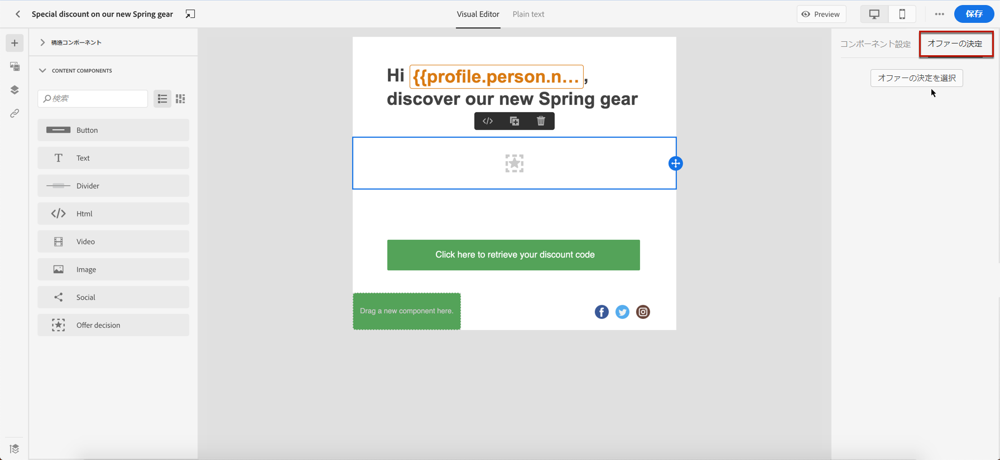
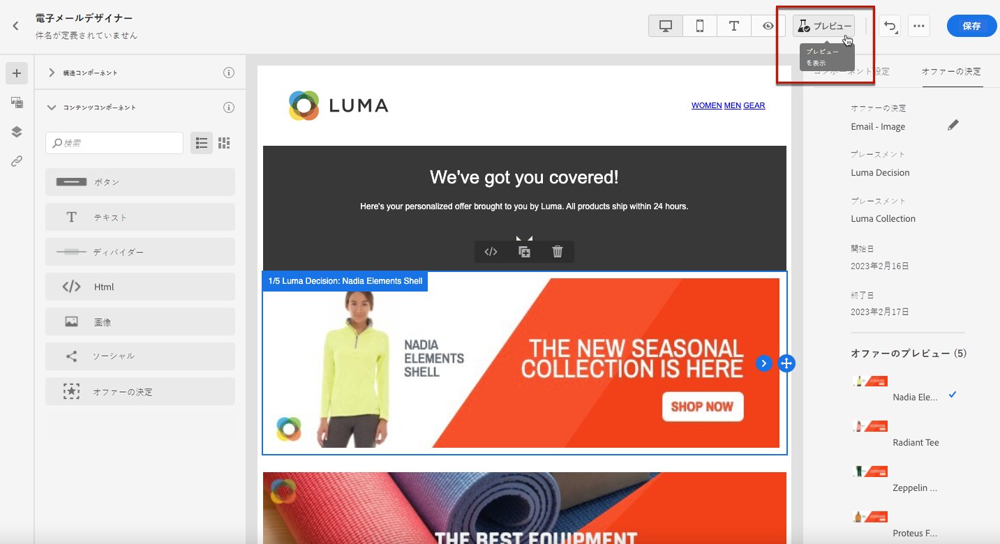
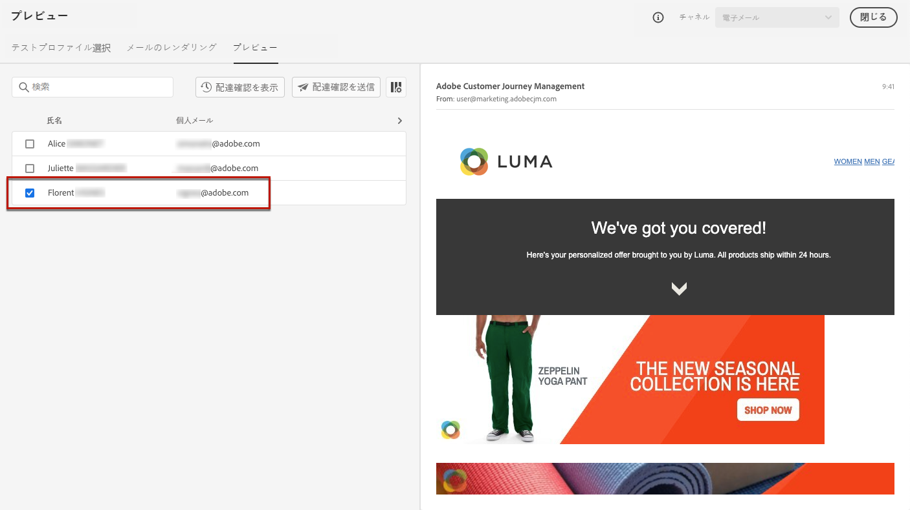

# パーソナライズされたキャンペーンの追加 {#deliver-personalized-offers}

電子メールで [!DNL Journey Optimizer] は、意思決定管理エンジンを活用して、顧客に納品する最適なオファーを選択することができます。

例えば、受取人のロイヤルティの種類に応じて、電子メールで特別な割引オファーが表示されるようにするための意思決定を追加することができます。

オファーの作成および管理方法について詳しくは、ここ ](../offers/get-started/starting-offer-decisioning.md) を [ 参照してください。

**オファーを設定する方法を示すエンドツーエンドの例** については、この ](../offers/offers-e2e.md#insert-decision-in-email) ような決定に使用し、この決定を電子メール [ で活用してください。

➡️ [ このビデオで、個人用設定としてオファーを追加する方法について説明します。](#video-offers)

## 電子メールによる意思決定の挿入 {#insert-offers}

>[!CAUTION]
>
>開始する前に、オファーの決定 ](../offers/offer-activities/create-offer-activities.md) を定義しておく必要があり [ ます。

電子メールメッセージに意思決定を挿入するには、次の手順を実行します。

1. 電子メールを作成し、そのコンテンツを設定する電子メールデザイナーを開きます。

1. コンテンツコンポーネントを **[!UICONTROL Offer decision]** 追加します。

   

   この節 ](content-components.md) では、コンテンツの [ コンポーネントを使用する方法について説明します。

1. タブは **[!UICONTROL Offer decision]** 右側のパレットに表示されます。 をクリック **[!UICONTROL Select Offer decision]** します。

   

1. 表示されるウィンドウで、表示するオファーに対応する場所を選択します。

   配置は、オファーを示すために使用されるコンテナです。この例では、「email top イメージ」という配置を使用します。 この配置は、メッセージの上部に表示されるイメージタイプの機能を提供するために、オファーライブラリ内に作成されています。

1. 選択された配置表示に一致する意思決定。 コンテンツコンポーネントで使用する意思決定を選択し、をクリック **[!UICONTROL Add]** します。

   >[!NOTE]
   >
   >リストには、選択した配置と互換性のある決定のみが表示されます。 この例では、「電子メールのトップイメージ」の配置と一致するのは、1つの offer アクティビティのみです。

   

これで、決定がコンポーネントに追加されました。

変更を保存した後は、メッセージを旅の一部として送信する際に、関連するプロフィールに表示することができます。

>[!NOTE]
>
>オファー、フォールバックオファー、オファーコレクション、または直接または間接的にメッセージ内で参照されている意思決定を更新すると、更新は対応するメッセージに自動的に反映されます。

## 電子メールでのプレビューの表示 {#preview-offers-in-email}

「セクション」または「コンテンツコンポーネント」の矢印を使用して **[!UICONTROL Offers]** 、電子メールに追加された意思決定の一部である様々なオファーをプレビューできます。

お客様のプロファイルに、決定に含まれる様々な機能を表示するには、次の手順に従います。

1. をクリック **[!UICONTROL Preview]** します。

   

   >[!NOTE]
   >
   >メッセージをプレビューできるようにするには、使用可能なテストプロファイルを用意する必要があります。 テストプロファイル ](../segment/creating-test-profiles.md) の作成方法に [ ついて説明します。

1. テストプロファイルの識別に使用する名前空間を選択するには、フィールドを **[!UICONTROL Identity namespace]** 選択 **[!UICONTROL Email]** します。

   >[!NOTE]
   >
   >この例では、電子メール **名前空間を使用** します。この節 ](../segment/get-started-identity.md) では、Adobe エクスペリエンス Platform identity 名前空間 [ について詳しく説明しています。

1. Id 名前空間のリストで、を選択 **[!UICONTROL Email]** してをクリック **[!UICONTROL Select]** します。

1. **[!UICONTROL Identity value]**「」フィールドに、テストプロファイルを識別する値を入力します。この例では、テストプロファイルの電子メールアドレスを入力します。

   <!--For example enter smith@adobe.com and click the **[!UICONTROL Add profile]** button.-->

1. プロファイルデータに応じて異なるバリエーションのメッセージをテストできるように、他のプロファイルを追加します。

   

1. **[!UICONTROL Preview]**&#x200B;タブをクリックすると、メッセージをテストできます。

1. テストプロファイルを選択します。 選択されているプロファイル (女性) に対応するオファーが表示されます。

   

1. メッセージの各バリエーションの電子メールコンテンツをプレビューするには、他のテストプロファイルを選択します。 メッセージコンテンツには、選択されたテストプロファイル (現在は man) に対応するオファーが表示されるようになりました。

   

この節 ](#preview-your-messages) で [ は、メッセージプレビューを確認するための詳細な手順について説明します。

## 操作方法のビデオ{#video-offers}

の [!DNL Journey Optimizer] メッセージにデシジョン管理コンポーネントを追加する方法について説明します。

>[!VIDEO](https://video.tv.adobe.com/v/334088?quality=12)

