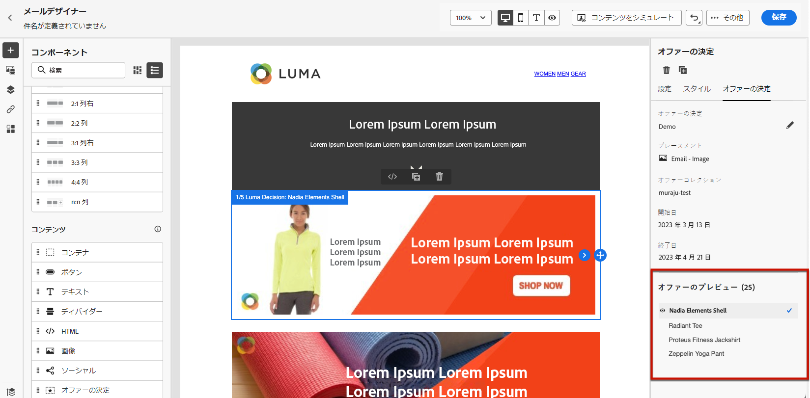

# パーソナライズされたオファーの追加 {#deliver-personalized-offers}

[!DNL Journey Optimizer] メールでは、意思決定管理エンジンを活用して顧客に提供する最適なオファーを選択する決定を挿入できます。

例えば、受信者のロイヤルティレベルに応じて変わる特別割引オファーを、メールに表示する決定を追加できます。

>[!IMPORTANT]
>
>ジャーニーのメッセージで使用されるオファーの決定に変更が加えられた場合は、ジャーニーを非公開にして、再公開する必要があります。これにより、変更がジャーニーのメッセージに取り込まれ、メッセージが最新の更新と一致するようになります。

* オファーの管理および作成方法について詳しくは、[この節](../offers/get-started/starting-offer-decisioning.md)を参照してください。

* [こちらの節](../offers/offers-e2e.md#insert-decision-in-email)では、オファーを設定して決定機能で使用し、その決定結果を電子メールで活用する方法を示した&#x200B;**完全なエンドツーエンドの例**&#x200B;を紹介しています。

➡️ [オファーをパーソナライゼーションとして追加する方法については、このビデオをご覧ください](#video-offers)

## メールへの決定の挿入 {#insert-offers}

>[!CAUTION]
>
>開始する前に、[オファーの決定を定義](../offers/offer-activities/create-offer-activities.md)する必要があります。

メールメッセージに決定を挿入するには、次の手順に従います。

1. メールを作成し、E メールデザイナーを開いてそのコンテンツを設定します。

1. **[!UICONTROL オファー決定]**&#x200B;コンテンツコンポーネントを追加します。

   

   コンテンツコンポーネントの使用方法については、[この節](content-components.md)を参照してください。

1. 右側のパレットに「**[!UICONTROL オファーの決定]**」タブが表示されます。「**[!UICONTROL オファーの決定を選択]**」をクリックします。

   1. 表示されるウィンドウで、表示するオファーに対応するプレースメントを選択します。

      [プレースメント](../offers/offer-library/creating-placements.md)は、オファーの表示に使用するコンテナです。この例では、「メールトップ画像」のプレースメントを使用しますこのプレースメントは、メッセージの上部に配置された画像タイプオファーを表示するために、オファーライブラリで作成されました。

   1. 選択したプレースメントに一致する決定が表示されます。コンテンツコンポーネントで使用する決定を選択し、「**[!UICONTROL 追加]**」をクリックします。

      >[!NOTE]
      >
      >選択したプレースメントと互換性のある決定のみがリストに表示されます。この例では、「メールのトップ画像」プレースメントに一致するオファーアクティビティは 1 つだけです。

      

これで、決定がコンポーネントに追加されました。変更内容を保存すると、ジャーニーの一環としてメッセージを送信した際に、該当するプロファイルに対してオファーが表示されるようになります。

>[!NOTE]
>
>メッセージで直接または間接的に参照されるオファー、フォールバックオファー、オファーコレクションまたはオファー決定を更新すると、その更新は、対応するメッセージに自動的に反映されます。

## メール内のオファーのプレビュー {#preview-offers-in-email}

「**[!UICONTROL オファー]**」セクションまたはコンテンツコンポーネントの矢印を使用して、メールに追加した決定に含まれる様々なオファーをプレビューできます。

決定に含まれる様々なオファーを顧客プロファイルで表示するには、次の手順に従います。

1. オファーのプレビューに使用するテストプロファイルを選択します。

   1. 「**[!UICONTROL コンテンツをシミュレート]**」ボタンをクリックして、テストプロファイルを識別するために使用する名前空間を **[!UICONTROL ID 名前空間]**&#x200B;フィールドから選択します。

      >[!NOTE]
      >
      >以下の例では、**メール**&#x200B;名前空間を使用します。Adobe Experience Platform の ID 名前空間については、[この節](../audience/get-started-identity.md)を参照してください。

   1. **[!UICONTROL ID 値]**&#x200B;フィールドに、テストプロファイルを識別する値を入力します。この例では、テストプロファイルのメールアドレスを入力します。

   <!--For example enter smith@adobe.com and click the **[!UICONTROL Add profile]** button.-->

   1. 他のプロファイルを追加して、プロファイルデータに応じて様々なバリエーションのメッセージをテストできるようにします。

      

1. 「**[!UICONTROL プレビュー]**」タブをクリックしてメッセージをテストし、テストプロファイルを選択します。選択したプロファイル（女性）に対応するオファーが表示されます。

   

   メッセージの各バリエーションに対してメールの内容をプレビューするには、他のテストプロファイルを選択します。メッセージコンテンツに、選択したテストプロファイル（現在は男性）に対応するオファーが表示されます。

メッセージプレビューを確認する詳細な手順について詳しくは、[この節](#preview-your-messages)を参照してください。

## チュートリアルビデオ{#video-offers}

[!DNL Journey Optimizer] でメッセージに意思決定管理コンポーネントを追加する方法を説明します。

>[!VIDEO](https://video.tv.adobe.com/v/3416051?captions=jpn&quality=12)
