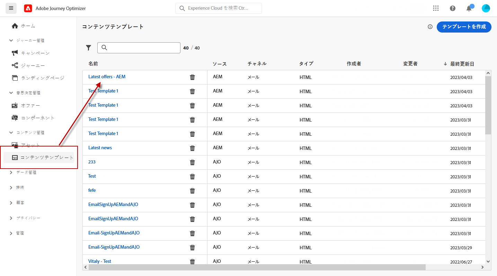
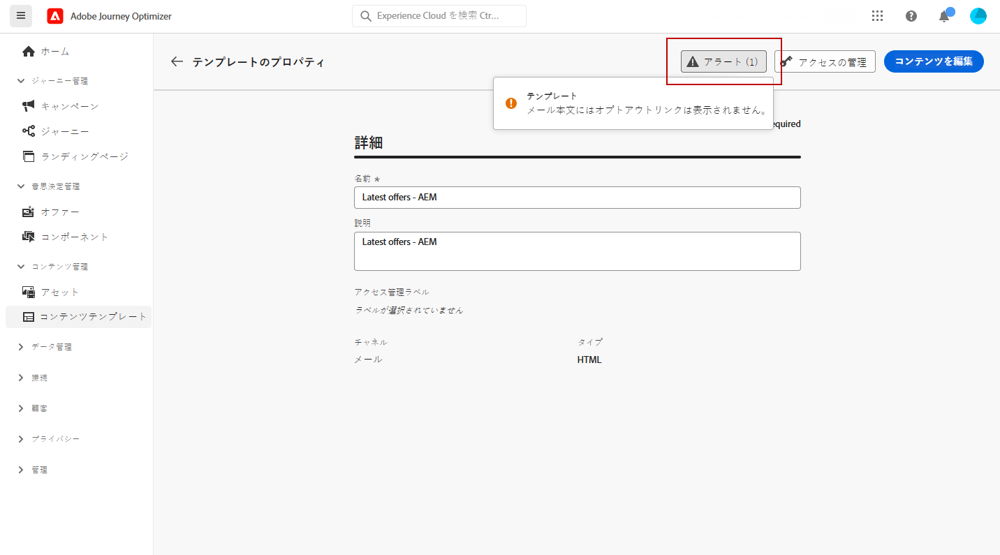
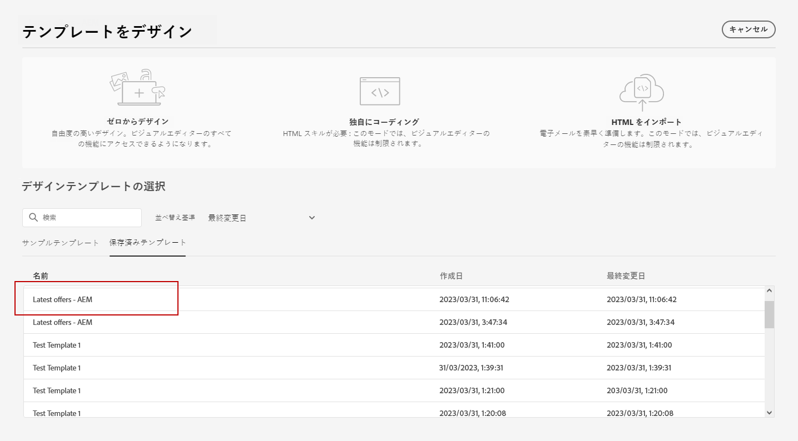

# Adobe Experience Managerテンプレートの操作 {#aem-templates}

>[!AVAILABILITY]
>
>現在、Adobe Experience Managerとの統合は、一部のユーザーのみがベータ版として利用できます。
> ベータ版のユーザーは、 [このフォーム](https://forms.office.com/pages/responsepage.aspx?id=Wht7-jR7h0OUrtLBeN7O4Wf0cbVTQ3tCpW_unE-w8-JUN1FaNlAzNkhPSUdaSkJXVFRCNTRJNVRFSy4u){target="_blank"} フィードバックを共有する

Adobe Journey Optimizerを使用すると、Adobe Experience Managerサイトを通じてカスタムにカスタマイズしたメッセージを作成できます。 まず、Adobe Experience Managerのコンテンツソースを使用してテンプレートをデザインし、それらをAdobe Journey Optimizerに送信します。 共有後、これらのテンプレートにAdobe Journey Optimizerの E メールデザイナーでアクセスできるようになり、目的のオーディエンスにメッセージを簡単に作成して送信できます。

## 前提条件 {#prerequisites}

この機能の使用を開始する前に、次の要件に従っていることを確認してください。

* **Experience Manager設定**

   この機能は、Adobe Experience Manager 6.5.14 以降で使用できます。Managed Servicesオーサー環境でAdobe Experience Manager Sitesに接続する必要があります。

   ベータ版プログラムの一環として、Cloud Service設定は、Adobe Experience ManagerのAdobeがAdobe Journey Optimizerに接続するために実行しました。

* **権限**

   Adobe Journey Optimizerでコンテンツテンプレートを作成、編集および削除するには、 **[!DNL Manage Library Items]** 次に含まれる権限 **[!DNL Content Library Manager]** 製品プロファイル。 [詳細情報](../administration/ootb-product-profiles.md#content-library-manager)

## ガードレールと制限{#aem-templates-limitations}

Adobe Journey OptimizerでのAdobe Experience Managerの使用をさらに最適化するには、次の追加のガードレールおよび制限事項に注意する必要があります。

* Experience Managerテンプレートにパーソナライゼーションを含めることはできません。 パーソナライゼーションは、Journey Optimizerでのみ実行する必要があります。

* 一括テンプレートの書き出しは現在サポートされていません。テンプレートは個別に書き出す必要があります。

* Experience ManagerとJourney Optimizerの同期は現在使用できません。 Journey Optimizerにテンプレートを送信した後でExperience Managerテンプレートに変更を加えた場合、ユーザーはテンプレートを再度エクスポートし、Journey Optimizerに再送信する必要があります。

## テンプレートをJourney Optimizerに送信{#aem-templates-send}

Adobe Experience ManagerテンプレートをAdobe Journey Optimizerに書き出すには、次の手順に従います。

1. Adobe Experience Managerのホームページで、 **[!UICONTROL アウトバウンドマーケティング]**.

   

1. コンテンツライブラリにアクセスし、Journey Optimizerに書き出すテンプレートを選択します。

   新しいページを最初から作成することもできます。 [詳細情報](https://experienceleague.adobe.com/docs/experience-manager-65/authoring/authoring/managing-pages.html?lang=en#creating-a-new-page)

   

1. テンプレートを選択した後、 **[!UICONTROL 送信先]** を選択します。

   

1. 次を入力します。 **[!UICONTROL 名前]** 」をクリックし、ターゲットを選択します。 **[!UICONTROL サンドボックス]**.

   

1. をクリックした後、 **[!UICONTROL 送信]** 」ボタンをクリックし、書き出し処理を開始します。 書き出しが完了すると、ユーザーインターフェイスに次のメッセージが表示されます。&quot;テンプレート&quot;XX&quot;が AJO に正常に送信されました。&quot;

テンプレートは、選択したサンドボックスのAdobe Journey Optimizerコンテンツテンプレートに追加されます。

## Adobe Experience Managerテンプレートの使用とパーソナライズ{#aem-templates-perso}

Journey OptimizerでExperience Managerテンプレートをコンテンツテンプレートとして使用できるようになったら、パーソナライゼーションを含め、E メールに必要なコンテンツを特定して組み込むことができます。

1. Journey Optimizerで、 **[!UICONTROL コンテンツテンプレート]** メニューから、インポートしたテンプレートにアクセスします。

   

1. この **[!UICONTROL アラート]** 」ボタンをクリックすると、重要な設定が見つからないかどうかをすばやく確認できます。 これにより、メッセージが正しく設定され、潜在的なエラーや問題が発生しないようにすることができます。

   

1. テンプレートのプロパティウィンドウで、 **[!UICONTROL アクセスを管理]** ボタンを使用して、カスタムまたはコアのデータ使用ラベルをテンプレートに割り当てます。 [オブジェクトレベルのアクセス制御（OLAC）について詳しくはこちらから](../administration/object-based-access.md)

1. AEMテンプレートをさらにパーソナライズし、コンテンツにカスタムパーソナライゼーションを追加するには、 **[!UICONTROL コンテンツを編集]**. これにより、簡単に変更を加え、特定のニーズに合わせてテンプレートを調整できます。 [詳細情報](get-started-email-design.md)

   >[!NOTE]
   >
   > テンプレートを編集およびパーソナライズする場合は、互換モードのみを使用できます。

1. コンテンツテンプレートの準備が整ったら、 [テストと検証](content-templates.md#test-template).

1. コンテンツが定義されたら、 **[!UICONTROL 保存済みのテンプレート]** コレクション。 次に、 **[!UICONTROL このテンプレートを使用]**.

   で E メールコンテンツを編集およびパーソナライズする方法について説明します。 [この節](content-from-scratch.md).

   

メールの準備ができたら、[ジャーニー](../building-journeys/journey-gs.md)または[キャンペーン](../campaigns/create-campaign.md)を設定し、アクティブ化して、メッセージが送信されるようにします。
