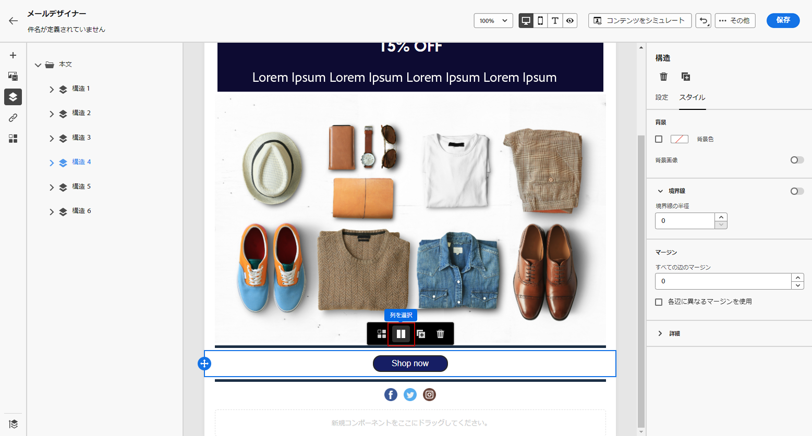
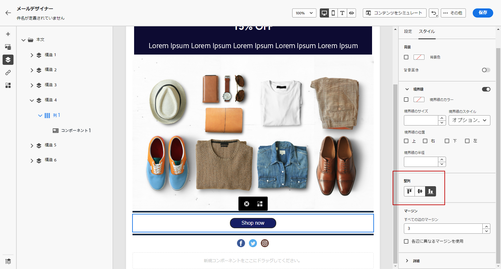
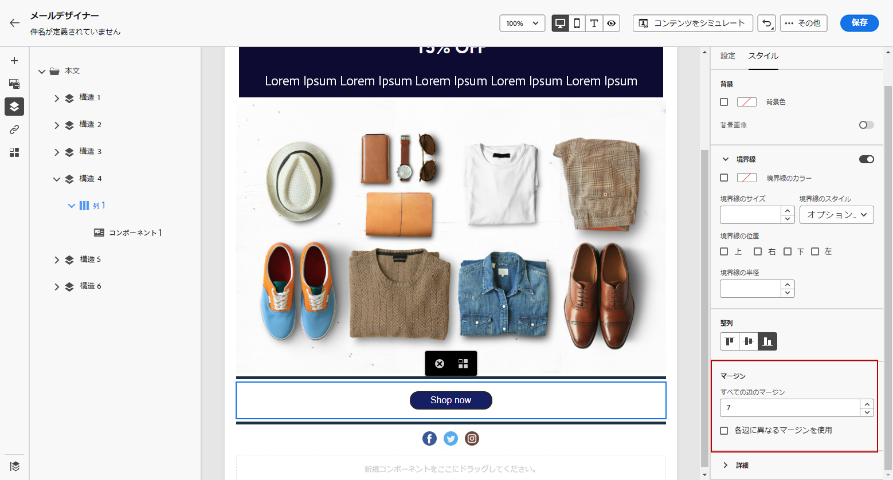

# 垂直方向の整列とパディングの調整 {#alignment-and-padding}

この例では、3 つの列で構成される構造コンポーネント内のパディングと垂直方向の整列を調整します。

1. メール内で構造コンポーネントを直接選択するか、左側のメニューで使用可能な&#x200B;**[!UICONTROL ナビゲーションツリー]**&#x200B;を使用します。

1. ツールバーから、「**[!UICONTROL 列を選択]**」をクリックし、編集する列を選択します。構造ツリーから選択することもできます。

   その列の編集可能なパラメーターが、「**[!UICONTROL スタイル]**」タブに表示されます。

   

1. **[!UICONTROL 整列]**&#x200B;で、「**[!UICONTROL 上]**」、「**[!UICONTROL 中央]**」、または「**[!UICONTROL 下]**」を選択します。

   

1. 「**[!UICONTROL パディング]**」で、すべての辺のパディングを定義します。

   パディングを微調整する場合は、「**[!UICONTROL 各辺に異なるパディングを使用]**」を選択します。鍵アイコンをクリックして、同期を解除します。

   

1. 同じようにして、他の列の位置揃えとパディングを調整します。

1. 変更を保存します。

>[!TIP]
>
>Android デバイスで Gmail 用のメールコンテンツをデザインする場合は、画像や分割線で、大きな固定マージンではなく、列のパディングが使用されていることを確認します。 Android上の Gmail では、多くの場合、画像や余白のサイズを誤ってレンダリングするので、レイアウトがオーバーフローしたり、ディバイダーの行が減ったりします。 画像の幅を小さくするか、列ベースのパディングに依存して一貫性のある表示を行います。
