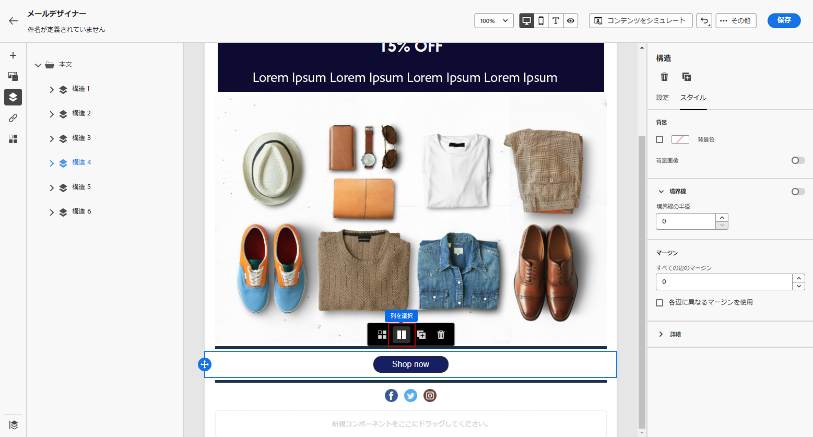
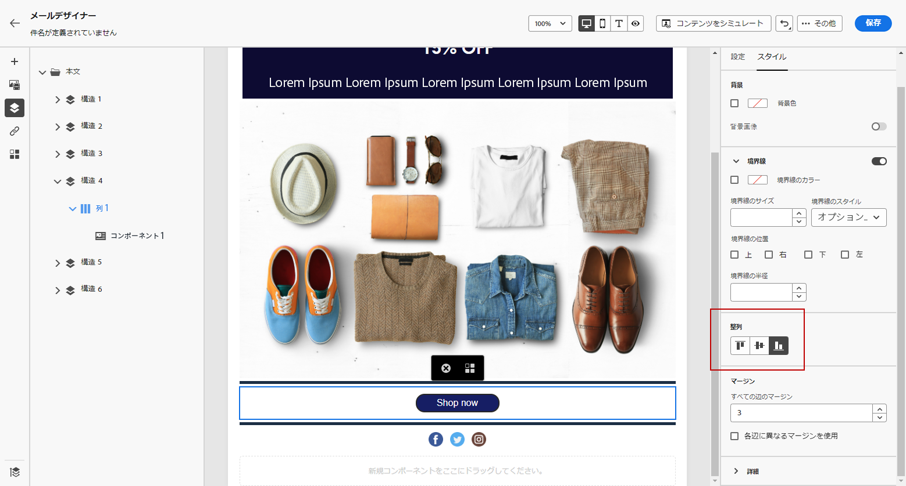
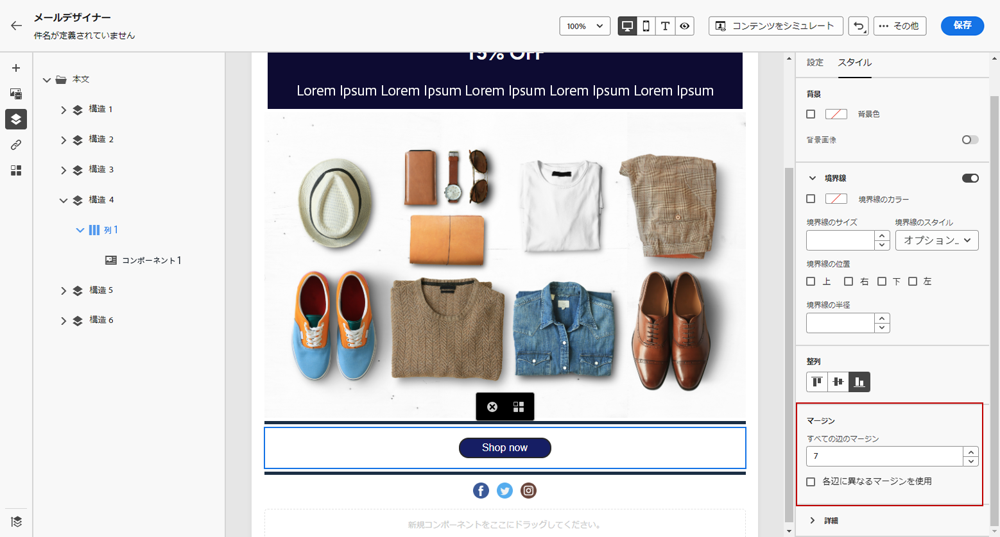

# 垂直方向の整列とパディングの調整 {#alignment-and-padding}

この例では、3 つの列で構成される構造コンポーネント内のパディングと垂直方向の整列を調整します。

1. メール内で構造コンポーネントを直接選択するか、左側のメニューで使用可能な&#x200B;**[!UICONTROL ナビゲーションツリー]**&#x200B;を使用します。

1. ツールバーから、「**[!UICONTROL 列を選択]**」をクリックし、編集する列を選択します。 構造ツリーから選択することもできます。

   その列の編集可能なパラメーターが、「**[!UICONTROL スタイル]**」タブに表示されます。

   

1. **[!UICONTROL 整列]**&#x200B;で、「**[!UICONTROL 上]**」、「**[!UICONTROL 中央]**」、または「**[!UICONTROL 下]**」を選択します。

   

1. 「**[!UICONTROL パディング]**」で、すべての辺のパディングを定義します。

   パディングを微調整する場合は、「**[!UICONTROL 各辺に異なるパディングを使用]**」を選択します。 鍵アイコンをクリックして、同期を解除します。

   

1. 同じようにして、他の列の位置揃えとパディングを調整します。

1. 変更を保存します。

>[!TIP]
>
>Android デバイスの Gmail のメールコンテンツを設計する際は、画像と区切り線に大きな固定マージンではなく列パディングを使用します。 Android の Gmail では、多くの場合、大きすぎる画像やマージンが誤ってレンダリングされ、レイアウトがオーバーフローしたり、区切り線が短くなったりすることがあります。 一貫性のある表示を実現するには、画像の幅を小さくするか、列ベースのパディングに依存します。

## パンくずナビゲーションを使用したフラグメントのパディングの管理 {#fragment-padding-breadcrumb}

E メールデザイナーで[フラグメント](../content-management/fragments.md)を操作する際に、デスクトップとは異なるモバイルレンダリングに影響を与える非表示のパディングや残余のパディングが発生する場合があります。 これは、フラグメントがロック解除されている場合や[継承が破損している](use-visual-fragments.md#break-inheritance)場合に特によく発生し、残りのスタイルが基になる列やテキストコンポーネントに残ることがあります。

フラグメントの残りのパディングを特定して編集するには：

1. **[!UICONTROL ナビゲーションツリー]**&#x200B;を使用するか、エディターで要素を直接クリックして、フラグメント内の各親構造または列を選択します。 これにより、モバイルデバイスに固有の非表示のパディングやマージンを見つけることができます。

1. パンくずリストの要素を選択したら、右側の「**[!UICONTROL スタイル]**」タブに移動します。

1. **[!UICONTROL パディング]**&#x200B;設定を確認し、必要に応じてパディングを削除または再調整して、モバイル上の表示を正しく調整します。

1. フラグメントを再利用しても整列の問題が解決しない場合は、フラグメント内の他の列またはテキストコンポーネントに対してこのプロセスを繰り返します。

>[!NOTE]
>
>フラグメントを繰り返し挿入および削除すると、スタイルルールが蓄積される場合があるので、この動作が予想されます。 特にモバイルデバイスをターゲットにする場合は、常にパンくずナビゲーションを使用してパディング値を確認します。