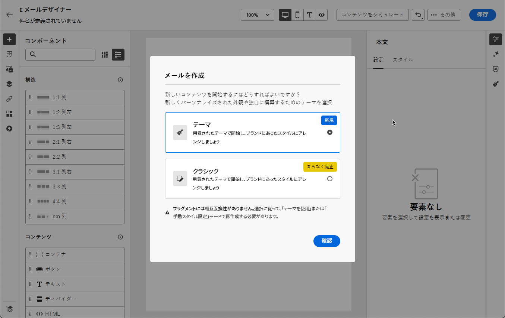
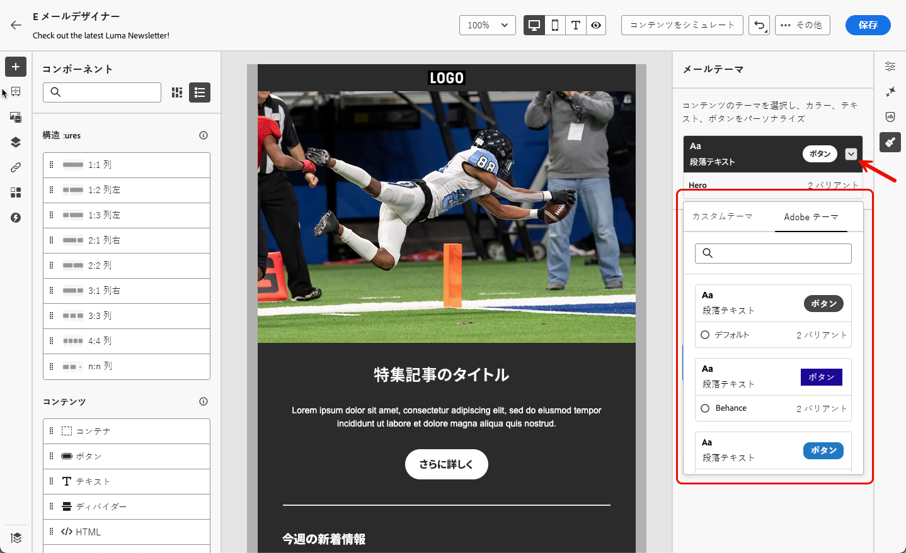
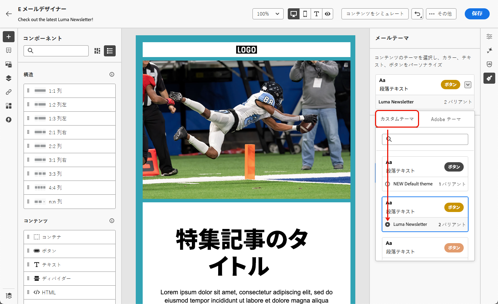
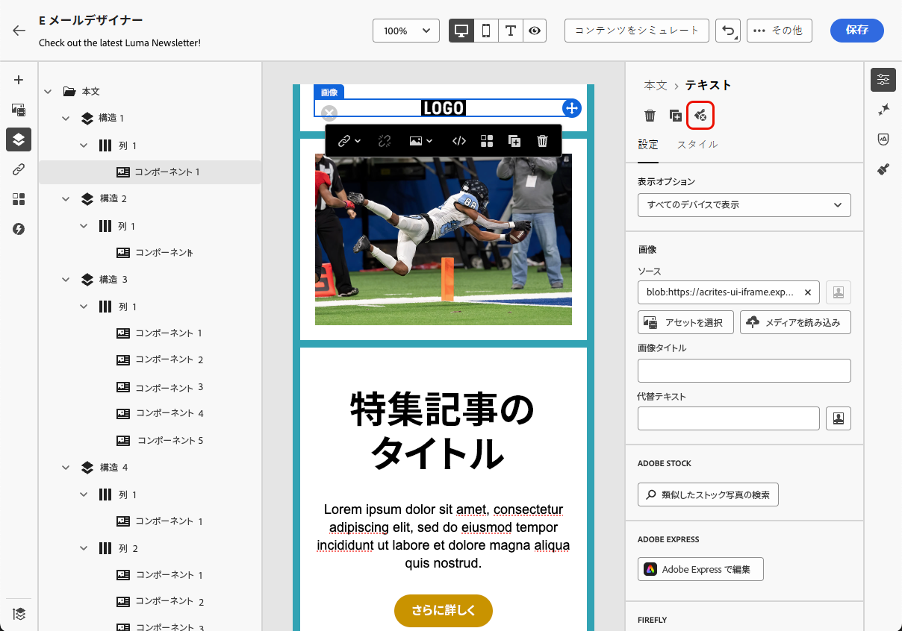

# メールコンテンツへのテーマの追加 {#apply-email-themes}

>[!CONTEXTUALHELP]
>id="ajo_use_theme"
>title="メールへのテーマの適用"
>abstract="メールのテーマを選択して、ブランドやデザインに合った特定のスタイル設定をすばやく適用します。"

>[!AVAILABILITY]
>
>この機能は限定提供（LA）です。 アクセス権を取得するには、アドビ担当者にお問い合わせください。

テーマを使用すると、技術ユーザー以外でも、標準テンプレートの上にカスタムスタイルを追加することで、特定のブランドやデザイン言語に適合する再利用可能なコンテンツを作成できます<!-- to achieve brand specific results-->。

この機能により、マーケターは、一意のデザインニーズに合わせた高度なカスタマイズオプションを提供しながら、視覚的に魅力的でブランドの一貫性のあるメールをより迅速かつ少ない労力で活用できます。

## ガードレールと制限 {#themes-guardrails}

* メールをゼロから作成する際に、ブランドやデザインに合った特定のスタイルをすばやく適用するには、テーマを使用してコンテンツの作成の開始を選択します。

  手動スタイルモードを選択した場合は、メールをリセットしない限り、テーマを適用できません。

* [フラグメント](../content-management/fragments.md)には、テーマを使用モードと手動スタイルモード間で相互互換性がありません。

   * テーマを使用せずに作成されたメールコンテンツでは、テーマフラグメントを使用できません。

   * テーマの設定されたコンテンツで [ フラグメント ](../content-management/fragments.md) を活用するには、このフラグメント自体がテーマを使用して作成されている必要があります。 [詳細情報](#leverage-themes-fragment)

   * メールコンテンツでフラグメントを使用する場合は、このフラグメントに定義したテーマを適用していることを確認します。 これを怠ると、特に Outlook 2021 以前のバージョンで、表示の問題が発生する可能性があります。 [詳細情報](#leverage-themes-fragment)

* HTMLで作成したコンテンツを使用する場合は、[ 互換モード ](existing-content.md) になり、そのコンテンツにテーマを直接適用することはできません。

   * テーマを適用するには、まず読み込んだコンテンツを [ 新しいテンプレートとして ](../content-management/create-content-templates.md#save-as-template) 保存し、次にこのテンプレートをテーマ互換コンテンツに変換する必要があります。 その後、このテンプレートを使用してメールコンテンツを作成できます。 手動スタイル設定で作成されたテンプレートを変換する方法については、[ この節 ](#theme-convertor) を参照してください。

   * 読み込んだHTML コンテンツを変換することもできます。 [詳細情報](existing-content.md)

  <!--To fully leverage all the capabilities of the Email Designer, including themes, you must either create a new content in Use Themes mode, or convert your imported HTML content. [Learn more](existing-content.md)-->

<!--If you apply a theme to a content using a [fragment](../content-management/fragments.md) created with Manual Styling mode, the rendering may not be optimal.-->

## テーマの作成 {#create-and-edit-themes}

今後のメールコンテンツで活用できるテーマを定義するには、次の手順に従います。

1. まず、新しい[コンテンツテンプレート](../content-management/create-content-templates.md)を作成します。

1. 「**[!UICONTROL テーマを作成または編集]**」オプションを選択します。

   

1. Adobe テーマを選択します。 この例では、「**[!UICONTROL デフォルトのテーマ]** を選択し、「**[!UICONTROL 作成]** をクリックします。

   

1. また、「**[!UICONTROL マイテーマ]**」タブからカスタムテンプレートを選択し、「**[!UICONTROL 編集]** をクリックして更新することもできます。

   

1. 「**[!UICONTROL 一般設定]**」タブで、ブランドに合った特定の名前を付けてテーマの定義を開始します。 メールのデフォルトのビューポート幅を調整したり、現在のテーマを書き出して [ サンドボックス間で共有 ](../configuration/copy-objects-to-sandbox.md) したりできます。

   <!---->

1. 右側のパネルを使用して、様々なタブを移動し、デザイン設定を更新します。

   

1. 「**[!UICONTROL カラー]**」タブから、次の操作を行います。

   * 「**[!UICONTROL 編集]**」ボタンを使用して、ブランドのデフォルトカラーを含む&#x200B;**[!UICONTROL カラーパレット]**&#x200B;を設定します。**[!UICONTROL プリセット]**&#x200B;を選択して、カラースキームをすばやく作成するか、テーマの各カラーを個別に調整します。また、両方の組み合わせを使用することもできます。

     

   * 「**[!UICONTROL バリアントを追加]**」をクリックして、テーマの各バリアントに独自のカラーパレットとニュアンスを持つ複数のカラーバリアント（明暗モードなど）を作成します。

     

   * 各バリアントについて、「**[!UICONTROL 編集]**」アイコンをクリックして、個々の要素を編集します。 作成したデフォルトのパレットや、任意のカスタムカラーを使用できます。

     

1. **[!UICONTROL テキスト設定]**&#x200B;では、テーマ全体に使用するグローバルフォントを設定できます。より精度の高い制御を行うには、各見出しと段落のタイプを編集して、フォント、サイズ、スタイルなどを調整することもできます。

   

1. 「**[!UICONTROL 間隔]**」タブで、リストから個々の要素を選択し、様々なコンポーネント間の間隔を適切に調整します。

   <!---->

1. 右側の他のタブを使用すると、このテーマの各ボタン要素、ディバイダー、追加の画像書式設定、グリッドレイアウト間隔を個別に管理できます。

   

1. **[!UICONTROL 保存]** をクリックして、今後の使用のためにこのテーマを保存します。 これで、「マイテーマ **[!UICONTROL タブに表示さ]** ました。

<!--A little strange upon hitting Save, because once the theme is created, you need to hit Close to go back to Design your template screen, then click Cancel if you don't want to proceed with template creation.-->

## メールコンテンツへのテーマの適用 {#apply-themes-email}

コンテンツテンプレートまたはメールにデフォルトまたはカスタムのスタイルテーマを適用するには、次の手順に従います。

1. [!DNL Journey Optimizer] では、[ メールの追加 ](create-email.md) ジャーニーまたはキャンペーンへのアクション、メールの作成 [ コンテンツテンプレート ](../content-management/create-content-templates.md#create-template-from-scratch)、[ メール本文の編集 ](get-started-email-design.md#key-steps) を行います。

1. 次のいずれかのアクションを選択できます。

   * ビルトインの[メールテンプレート](use-email-templates.md)を選択して、E メールデザイナーを開きます。各テンプレートに固有のデフォルトのテーマが自動的に適用されます。

   * [新しいコンテンツをゼロから](content-from-scratch.md)デザインし、「**[!UICONTROL テーマを使用]**」を選択して、定義済みのスタイルテーマから開始します。

     

     >[!CAUTION]
     >
     >手動スタイル設定モードを選択した場合、デザインをリセットしない限り、テーマを適用することはできません。
     >
     >テーマの設定されたコンテンツで [ フラグメント ](../content-management/fragments.md) を活用するには、このフラグメント自体がテーマを使用して作成されている必要があります。 [詳細情報](#leverage-themes-fragment)

1. E メールデザイナーに移動したら、右側のパネルにある「**[!UICONTROL テーマ]**」ボタンをクリックします。デフォルトのテーマまたはテンプレートのテーマが表示されます。このテーマでは、2 つのカラーバリアントを切り替えることができます。

   

1. 現在使用しているテーマの横にある矢印をクリックします。使用可能なカスタムテーマとアドビテーマのリストが表示されます。

   

1. **[!UICONTROL マイテーマ]** をクリックし、作成したテーマを選択します。

   

1. ドロップダウンリストの外側をクリックします。新しく選択したカスタムテーマのスタイルは、すべてのメールコンポーネントに自動的に適用されます。カラーバリアントがある場合は、それを切り替えることができます。

1. コンテンツテンプレートでテーマを選択したら、「**[!UICONTROL テーマを編集]** ボタンをクリックして更新できます。 [詳細情報](#create-and-edit-themes)

   {width="40%"}

   >[!NOTE]
   >
   >このオプションは、メールコンテンツでテーマを使用する場合には使用できません。

1. 複数のカラーバリアントを使用するテーマを活用する場合、特定の構造コンポーネントに特定のバリアントを選択できます。 これにより、コンテンツ全体にカラーバリアントを定義し、1 つの特定の構造にのみ異なるバリアントを使用できます。

   >[!NOTE]
   >
   >コンテンツコンポーネントに対しては、このアクションを実行できません。

   これを行うには、構造コンポーネントを選択し、右側の **[!UICONTROL スタイル]** タブから「**[!UICONTROL 特定のテーマのバリアントを使用]** オプションをクリックして、目的のバリアントをその構造に適用します。

   

   この例では、現在のテーマの最初のカラーバリアントがメールコンテンツ全体に適用されますが、3 番目のカラーバリアントが選択した構造に適用されます。 その特定の構造のボディとビューポートの背景色が、その他のコンテンツとは異なることがわかります。

テーマはいつでも切り替えることができます。メールコンテンツは変更されませんが、スタイルは新しいテーマを反映して更新されます。

### スタイルのロック解除 {#unlocking-styles}

コンポーネントを選択したら、「**[!UICONTROL スタイル]** タブの専用アイコンを使用してスタイルのロックを解除できます。

{width="90%"}

選択したテーマはそのコンポーネントに引き続き適用されますが、スタイル設定要素を上書きすることもできます。 テーマを変更すると、新しいテーマは、上書きされなかったスタイル設定要素にのみ適用されます。<!--can you revert this action?-->

例えば、テキストコンポーネントのロックを解除した場合、<!--the font size from 11 to 14 and --> フォントカラーを黒から赤に変更できます。

{width="80%" align="center" zoomable="yes"}

テーマを変更した場合 <!--the font size is still 14 and --> コンポーネントのフォントカラーは赤のままですが、このコンポーネントの背景色は新しいテーマに合わせて変更されます。

{width="80%"}

## フラグメントでのテーマの活用 {#leverage-themes-fragment}

[ テーマが適用 ](#apply-themes-email) されたテンプレートまたはメールでフラグメントを活用するには、このフラグメント自体がテーマを使用して作成されている必要があります。 そうでない場合、テーマの設定されたコンテンツでこのフラグメントを使用することはできません。

テーマと互換性のあるフラグメントを作成するには、次の手順に従います。

1. [!DNL Journey Optimizer] で、ビジュアルフラグメントを作成し、**[!UICONTROL 作成]** をクリックして、フラグメントのコンテンツをデザインします。 [詳細情報](../content-management/create-fragments.md)

1. 定義済みのスタイル設定テーマから始めるには、「**[!UICONTROL テーマを使用]**」を選択します。

   {width="100%"}

   >[!CAUTION]
   >
   >手動スタイル設定モードを選択した場合、フラグメントデザインをリセットしない限り、テーマを適用することはできません。

1. メールDesignerを送信したら、フラグメントの作成を開始できます。

1. 右側のパネルにある **[!UICONTROL テーマ]** ボタンをクリックします。 デフォルトのテーマが表示されます。 このテーマの様々なカラーバリエーションを切り替えることができます。

   {width="100%" align="center" zoomable="yes"}

1. 他のテーマを選択して、フラグメントコンテンツをプレビューできます。 これを行うには、デフォルトのテーマの横にある矢印を選択し、「**[!UICONTROL テーマを選択]**」をクリックします。

   {width="40%"}

1. 「**[!UICONTROL Adobeテーマ]**」タブと「**[!UICONTROL マイテーマ]**」タブ間を移動し、フラグメントに対して（両方のタブから）最大 5 つの互換性のあるテーマを選択できます。

   {width=70%}

   >[!CAUTION]
   >
   >メールコンテンツでフラグメントを使用する場合は、このフラグメントに定義した [ テーマを適用 ](#apply-themes-email) ことを確認します。 これを怠ると、特に Outlook 2021 以前のバージョンで、表示の問題が発生する可能性があります。

1. 「**[!UICONTROL 閉じる]**」をクリックします。

1. **[!UICONTROL デフォルトテーマ]** の横にある矢印を再度選択します。 選択したテーマを切り替えて、各スタイル レンダリングをプレビューできるようになりました。

   {width=90%}

1. もう一度 **[!UICONTROL テーマを選択]** をクリックして、テーマを追加したり、選択を変更したりします。

## テンプレートをテーマと互換性のあるものにする {#theme-convertor}

[!DNL Journey Optimizer] を使用すると、手動のスタイル設定を使用して作成されたテンプレートを、テーマ互換のコンテンツに変換できます。 これは、テーマを [!DNL Journey Optimizer] に取り込む前にコンテンツテンプレートを作成した場合や、外部コンテンツを読み込む場合に特に便利です。

>[!NOTE]
>
> テーマに対応するように変換できるのは **メールテンプレート** のみです。 個々のメールを変換することはできません。まず、コンテンツをテンプレートとして保存する必要があります。

1. メール [ コンテンツテンプレート ](../content-management/create-content-templates.md) を開き、メールDesignerを使用してそのコンテンツを編集します。

1. 右側のパネルで **[!UICONTROL テーマ]** アイコンを選択し、「**[!UICONTROL コンテンツからテーマを生成]** ボタンをクリックします。

   {width=100%}

1. **[!UICONTROL テーマを作成]** ウィンドウが開きます。 [!DNL Journey Optimizer] は、スタイル設定要素を自動的に検出し、それらを新しいテーマに統合します。

   {width=90%}

1. テーマの名前を指定します。

1. カラーバリアントの追加やフォントの編集など、ゼロからテーマを作成する場合と同様に、必要に応じて独自の調整を行います。 [詳細情報](#create-and-edit-themes)

   {width=90%}

1. **[!UICONTROL 保存]** をクリックして、再利用するためにこの新しいテーマを保存します。 これで、このテーマを他のテーマなどのコンテンツに適用できます。 [詳細情報](#leverage-themes-fragment)