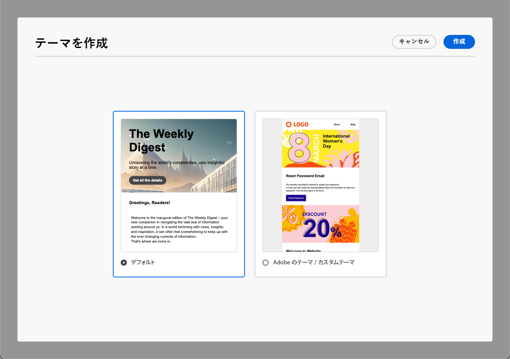
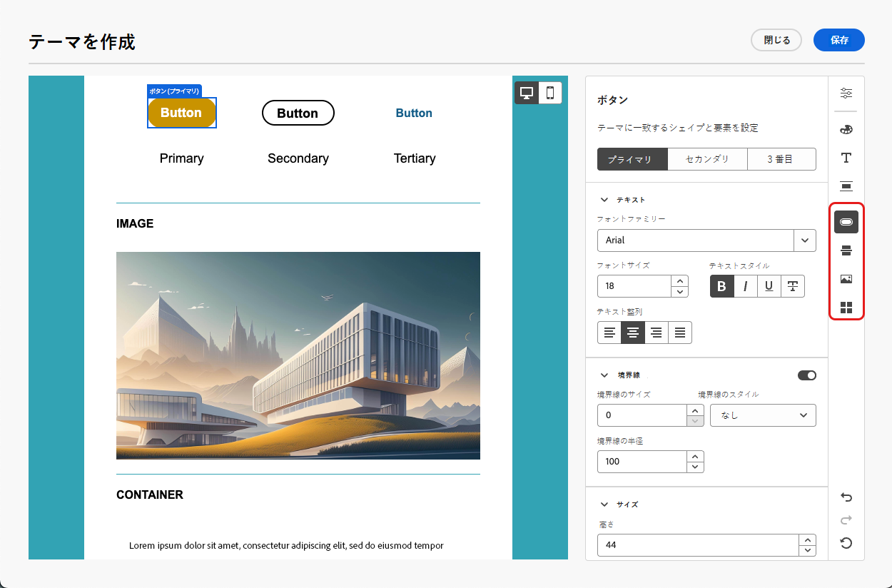
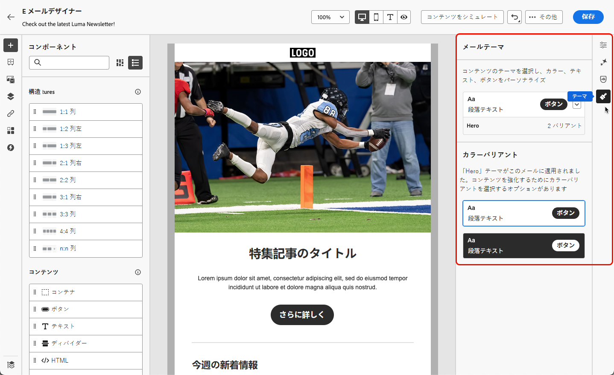

# メールコンテンツへのテーマの追加 {#apply-email-themes}

>[!CONTEXTUALHELP]
>id="ajo_use_theme"
>title="メールへのテーマの適用"
>abstract="メールのテーマを選択して、ブランドやデザインに合った特定のスタイル設定をすばやく適用します。"

<!--This documentation provides a comprehensive guide to using themes to streamline your email creation process. With the ability to define reusable themes and leverage pre-designed modules, marketers can create professional, brand-aligned emails faster and with less effort.-->

>[!AVAILABILITY]
>
>この機能は現在ベータ版で、ベータ版のお客様のみご利用いただけます。ベータ版プログラムに参加するには、アドビ担当者にお問い合わせください。

テーマを使用すると、技術者以外のユーザーは、標準のテンプレート <!-- to achieve brand specific results--> の上にカスタムスタイルを追加することで、特定のブランドとデザイン言語に適合する再利用可能なコンテンツを作成できます。

この機能を使用すると、マーケターは視覚的に魅力的でブランドと一貫性のあるメールを、より迅速かつ少ない労力で活用しながら、独自のデザインニーズに合わせた高度なカスタマイズオプションを提供できます。

<!--What is the Enhanced Email Authoring Experience?

This feature introduces two key components to simplify and enhance email creation:

* **Theme Management System**: A centralized system for creating, customizing, and applying reusable themes to emails. Themes ensure consistent styling across campaigns and eliminate the need for repetitive manual styling.

* **Modules**: Pre-designed, reusable content blocks that abstract common email elements (e.g., titles, descriptions, images, and links). Modules are built using customizable low-level components, offering flexibility while maintaining design standards.

Key Benefits:

- **Consistency**: Ensure all emails align with your brand's design guidelines.
- **Efficiency**: Save time by reusing themes and modules across campaigns.
- **Customization**: Add custom CSS and mobile-specific styles for advanced designs.
- **Scalability**: Eliminate repetitive styling tasks, enabling faster email creation.-->

## ガードレールと制限 {#themes-guardrails}

* メールをゼロから作成する場合、テーマを使用してコンテンツの作成を開始し、ブランドとデザインに合った特定のスタイル設定をすばやく適用することができます。

  クラシックモードを選択した場合、メールをリセットしない限り、テーマを適用できません。

* [ フラグメント ](../content-management/fragments.md) は、テーマモードとクラシックモード間で相互互換性がありません。

  テーマが適用されるコンテンツでフラグメントを使用できるようにするには、このフラグメントをテーマモードで作成する必要があります。

* HTMLで作成したコンテンツを使用する場合は、[ 互換モード ](existing-content.md) になり、このコンテンツにテーマを適用することはできません。

  テーマを含むメールDesignerのすべての機能を最大限に活用するには、テーマモードで新しいコンテンツを作成するか、読み込んだHTML コンテンツを変換する必要があります。 [詳細情報](existing-content.md)

<!--If using a content created in Classic mode or HTML, you cannot apply themes to this content. You must create a new content in Theme mode.

If you apply a theme to a content using a [fragment](../content-management/fragments.md) created in Classic mode, the rendering may not be optimal.-->

## テーマの作成 {#create-and-edit-themes}

今後のメールコンテンツで活用できるテーマを定義するには、次の手順に従います。

1. 開始するには、新しい [ コンテンツテンプレート ](../content-management/create-content-templates.md) を作成します。

1. 「**[!UICONTROL テーマを作成または編集]**」オプションを選択します。

   

1. デフォルトのテーマを選択するか、Adobeまたはカスタムテンプレートを使用できます。 この例では、デフォルトのテーマを選択し、「**[!UICONTROL 作成]**」をクリックします。

   

1. 「**[!UICONTROL 一般設定]**」タブで、ブランドに特定の名前を付けてテーマの定義を開始します。 メールのデフォルトの幅を調整したり、現在のテーマを書き出して [ サンドボックス間で共有 ](../configuration/copy-objects-to-sandbox.md) したりできます。

   <!---->

1. 右側のパネルを使用して様々なタブ間を移動し、デザイン設定を更新します。

   

1. **[!UICONTROL カラー]** タブから：

   * **[!UICONTROL 編集]** ボタンを使用して、ブランドのデフォルトカラーで **[!UICONTROL カラーパレット]** を設定します。 **[!UICONTROL プリセット]** を選択すると、カラースキームをすばやく作成したり、テーマの各色を個別に調整したりできます。 また、両方の組み合わせを使用することもできます。

     

   * 「**[!UICONTROL バリアントを追加]**」をクリックして、明るいモードと暗いモードなど、複数のカラーバリアントを作成します。各バリアントには、独自のカラーパレットとニュアンスのコントロールがあります。

     

   * 各バリアントについて、編集アイコンをクリックして個々の要素を編集します。 作成した既定のパレット、または任意のカスタム カラーを使用できます。

     

1. **[!UICONTROL テキスト設定]** では、テーマ全体に使用するグローバルフォントを設定できます。 コントロールをよりきめ細かく制御するために、各見出しおよび段落タイプを編集して、フォント、サイズ、スタイルなどを調整することもできます。

   

1. 「**[!UICONTROL 間隔]**」タブで、リストから個々の要素を選択して、異なるコンポーネント間の間隔を適切に設定します。

   <!---->

1. 右側の他のタブを使用すると、このテーマの各ボタン要素、区切り線、追加の画像書式、グリッドレイアウトの間隔を個別に管理できます。

   <!---->

1. **[!UICONTROL 保存]** をクリックして、今後の使用のためにこのテーマを保存します。

## メールへのテーマの適用 {#apply-themes}

メールにデフォルトまたはカスタムのスタイルテーマを適用するには、次の手順に従います。

1. [!DNL Journey Optimizer] では、[ メールの追加 ](create-email.md) ジャーニーまたはキャンペーンへのアクション、[ メール本文の編集 ](get-started-email-design.md#key-steps) を行います。

1. 次のいずれかのアクションを選択できます。

   * 組み込み [ メールテンプレート ](use-email-templates.md) を選択して、メールDesignerを開きます。 各テンプレートに固有のデフォルトのテーマが自動的に適用されます。

   * [ 新規コンテンツをゼロから ](content-from-scratch.md) デザインし、「**[!UICONTROL テーマ]** を選択して、事前定義済みのスタイル設定テーマから始めます。

     

     >[!CAUTION]
     >
     >クラシックモードを選択した場合、メールをリセットしない限り、テーマを適用できません。
     >
     >テーマモードで [ フラグメント ](../content-management/fragments.md) を使用するには、このフラグメント自体がテーマモードを使用して作成されている必要があります。

1. メールDesignerに移動したら、右側のパネルにある **[!UICONTROL テーマ]** ボタンをクリックします。 デフォルトのテーマまたはテンプレートのテーマが表示されます。 このテーマでは、2 つのカラーバリエーションを切り替えることができます。

   

1. 現在使用しているテーマの横にある矢印をクリックします。 使用可能なカスタムテーマとAdobe テーマのリストが表示されます。

   

1. **[!UICONTROL カスタムテーマ]** をクリックし、作成したテーマを選択します。

   

1. ドロップダウンリストの外側をクリックします。 新しく選択したカスタムテーマは、すべてのメールコンポーネントにスタイルを自動的に適用します。 2 つのカラーバリアントを切り替えることができます。

1. コンポーネントを選択しても、専用のアイコンを使用してスタイルのロックを解除できます。

   

テーマはいつでも切り替えることができます。 メールコンテンツは変更されませんが、スタイルが更新されて、新しいテーマが反映されます。

<!--
>[!NOTE]
> - Themes apply styles globally. Ensure your theme is finalized before applying it to multiple emails.
> - Switching themes may override custom styles applied to individual components.

>[!CAUTION]
> - When using fragments, the email's theme will override the fragment's styles. A warning will be displayed in the editor if there is a conflict.

## Example Use Cases {#example-use-cases}

### 1. Creating a New Theme
- A marketer creates a theme with their brand's colors, fonts, and button styles.
- The theme is saved and reused across multiple email campaigns.

### 2. Switching Themes
- A marketer applies a holiday-themed design to an existing email by switching to a pre-designed holiday theme.-->
