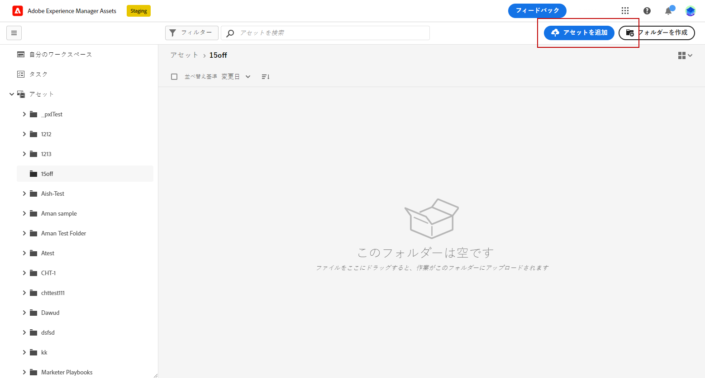
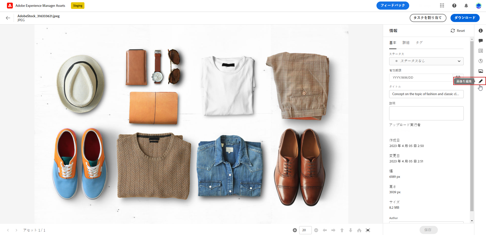
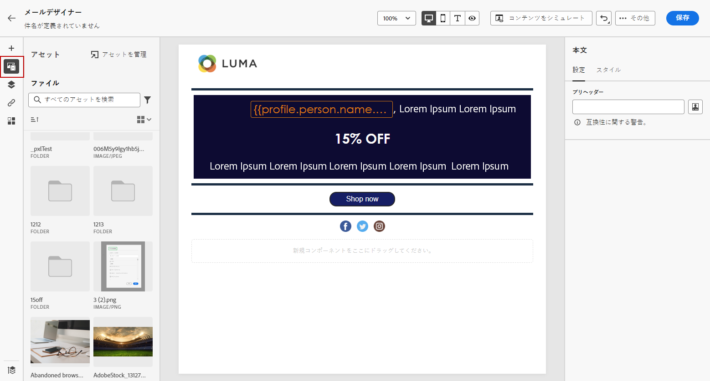
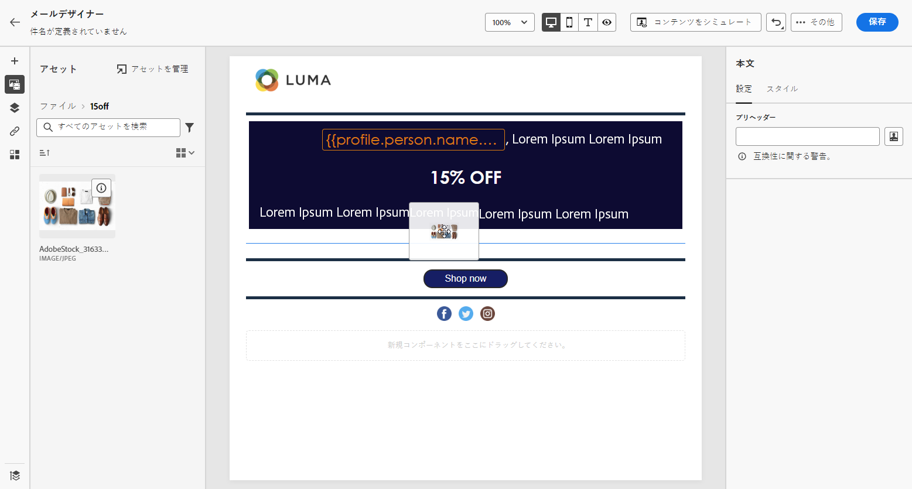
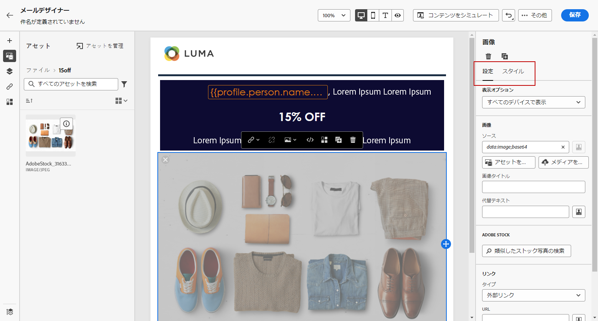

# でのアセットの作成と管理 [!DNL Assets Essentials]{#experience-manager-assets}

## での作業の開始 [!DNL Assets Essentials] {#get-started-assets-essentials}

を使用して、マーケティングおよびクリエイティブなワークフローを [!DNL Adobe Experience Manager Assets Essentials] 統合できます。 ネイティブに統合 [!DNL Adobe Journey Optimizer] され、デジタルアセットの保存、管理、検索および distributee にアクセス [!DNL Assets Essentials] できます。 これによって、メッセージを作成するために使用できるアセットが一元的に格納されます。

[!DNL Adobe Experience Manager Assets Essentials] は、コラボレーティブな一元化されたアセットを使用して、クリエイティブシステムを拡張し、デジタルアセットを利用した経験により統合します。 承認された生産アセットの整理、タグ付け、検索が容易に行えるようになりました。 直観的なユーザーエクスペリエンスを利用 [!DNL Assets Essentials] すれば、Adobe Creative でアセットを共有したり、クラウドアプリを体験したりすることができます。

Adobe Experience Manager アセット Essentials マニュアル ](https://experienceleague.adobe.com/docs/experience-manager-assets-essentials/help/introduction.html) の詳細については、{target = &quot;_blank 「}」を [ 参照してください。

[!DNL Adobe Experience Manager Assets Essentials]左のメニュー **[!UICONTROL Assets]** セクションから [!DNL Adobe Journey Optimizer] 直接アクセスすることができます。電子メールコンテンツ ](get-started-email-design.md) をデザインするときに、アセットやフォルダーに [ アクセスすることもできます。

## 知識{#assets-prerequisites}

を使用 [!DNL Adobe Experience Manager Assets Essentials] する前に、「アセット Essentials コンシューマーユーザー **」または** 「アセット essentials ユーザー **」製品プロファイルにユーザーを** 追加する必要があります。アセットの基礎ドキュメント ](https://experienceleague.adobe.com/docs/experience-manager-assets-essentials/help/deploy-administer.html) の詳細を [ 確認 {target = &quot;_blank&quot;}。

>[!NOTE]
>2022年1月6日より前に購入した、旅オプティマイザー製品については、組織で展開 [!DNL Adobe Experience Manager Assets Essentials] する必要があります。 詳しくは、アセットの展開の要点 ](https://experienceleague.adobe.com/docs/experience-manager-assets-essentials/help/deploy-administer.html) {target = &quot;_blank&quot;} セクションを参照して [ ください。

## アセットのアップロードと挿入{#add-asset}

に [!DNL Assets Essentials] ファイルを読み込むには、まず保存先のフォルダーを参照するか、作成する必要があります。 これにより、そのコンテンツを電子メールコンテンツに挿入できるようになります。

アセットをアップロードする方法について詳しくは、Adobe Experience Manager アセット Essentials マニュアル ](https://experienceleague.adobe.com/docs/experience-manager-assets-essentials/help/add-delete.html) {target = &quot;_blank&quot;} を [ 参照してください。

1. 「ホームページから [!DNL Adobe Journey Optimizer] 」にアクセス [!DNL Assets Essentials] するには、メニューの **[!UICONTROL Content management]** タブを選択し **[!UICONTROL Assets]** ます。

   

1. 中央のセクションまたはツリービューからフォルダーをダブルクリックして開きます。

   また、をクリックし **[!UICONTROL Create folder]** て新しいフォルダーを作成することもできます。

   

1. ファイルを選択または作成したフォルダーに追加し、をクリック **[!UICONTROL Add Assets]** して、新しいアセットをフォルダーにアップロードします。

   

1. **[!UICONTROL Upload files]**&#x200B;でをクリック **[!UICONTROL Browse]** し、または **[!UICONTROL Browse folders]** を **[!UICONTROL Browse files]** 使用するかどうかを選択します。

   

1. アップロードするファイルを選択します。 終了したら、をクリック **[!UICONTROL Upload]** します。

   アセットを管理する方法について詳しくは、この [ ページ ](https://experienceleague.adobe.com/docs/experience-manager-assets-essentials/help/manage-organize.html) を参照してください。

1. アセットがアップロードされると、電子メールを使用して、メッセージのいずれかにアセットを挿入できるようになりました。

   の [!DNL Assets Essentials] 編集 **モードで** アセットを編集することもできます。詳しくは、「target = &quot;_blank&quot;}」を参照してください。

   

1. [!DNL Adobe Journey Optimizer]で、電子メールデザイナーの左側のペインからを選択 **[!UICONTROL Asset picker]** します。

   

1. **[!UICONTROL Assets]**&#x200B;フォルダーを選択します。検索バーでは、アセットまたはフォルダーを検索することもできます。

1. 電子メールコンテンツにアセットをドラッグ &amp; ドロップします。

   

1. を使用して **[!UICONTROL Components settings]** 、外部リンクまたはテキストを追加するなど、アセットをさらにカスタマイズすることもできます。 [コンポーネント設定について詳しくは、ここを参照してください。](content-components.md)

   

   <!--
    After adding your asset to your email, use the **[!UICONTROL Find similar Stock photos]** option to locate Stock photos that match the content, color, and composition of your image. [Learn more about Adobe Stock](stock.md).

    Note that this option is available for licensed/unlicensed Stock images and images from your Assets folder. 

    
    -->