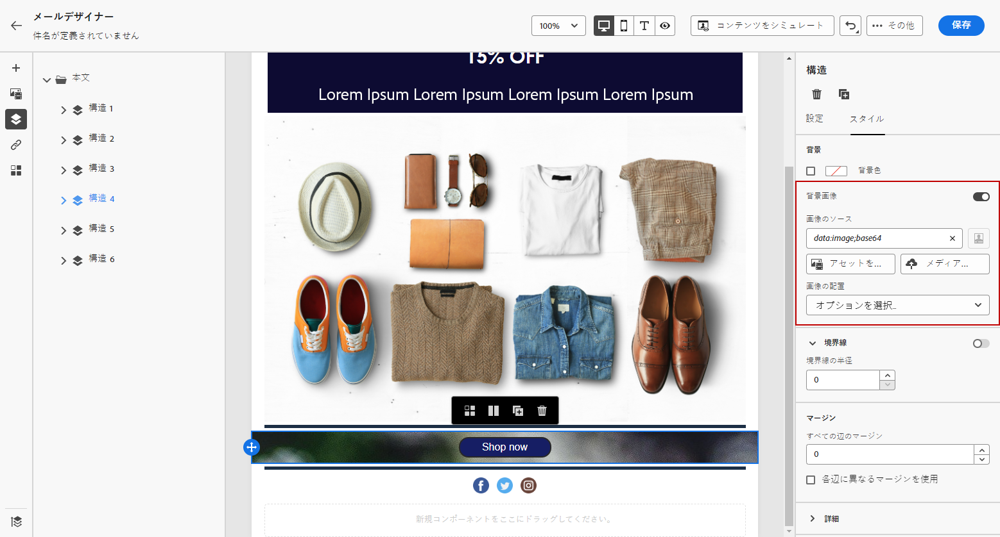

# 電子メールの背景の個人用設定 {#backgrounds}

>[!CONTEXTUALHELP]
>id="ac_edition_backgroundimage"
>title="背景の設定"
>abstract="コンテンツの背景色や背景画像をカスタマイズすることができます。 背景イメージは、すべての電子メールクライアントでサポートされるわけではありません。"

電子メールデザイナーで背景を設定する方法については、次の項目をお勧めします。

1. デザインで必要に応じて、電子メールの本文に背景色を適用します。
1. 通常は、背景色を列レベルに設定します。
1. 管理が困難なので、画像やテキストコンポーネントに背景色を使用しないようにします。

使用できる背景設定には、次のようなものがあります。

* 電子メール全体に a **[!UICONTROL Background color]** を設定します。 左側のパレットからアクセス可能なナビゲーションツリーで、body 設定を選択していることを確認してください。

   

* 「」を選択 **[!UICONTROL Viewport background color]** して、すべての構造コンポーネントに同じ背景色を設定します。 このオプションを使用すると、背景色とは異なる設定を選択できます。

   

* 構造構成部品ごとに異なる背景色を設定します。 特定の背景色をその構造に適用するには、左側のパレットからアクセス可能なナビゲーションツリー内の構造を選択します。

   構造の背景色を非表示にすることができるので、ビューポートの背景色を設定しないように注意してください。

   

* **[!UICONTROL Background image]** Structure コンポーネントのコンテンツにを設定します。

   >[!NOTE]
   >
   >電子メールの一部のプログラムでは、バックグラウンドイメージはサポートされていません。 サポートされていない場合は、代わりに行の背景色が使用されます。 イメージを表示できない場合に備えて、適切な代替背景色を選択していることを確認してください。

   

* 「列レベル」に背景色を設定します。

   >[!NOTE]
   >
   >これは、最も一般的なユースケースです。 Adobe では、電子メールコンテンツ全体を編集するときにより柔軟に設定できるように、列のレベルに背景色を設定することをお勧めします。

   また、列レベルに背景イメージを設定することもできますが、これはめったに使用されません。

   
