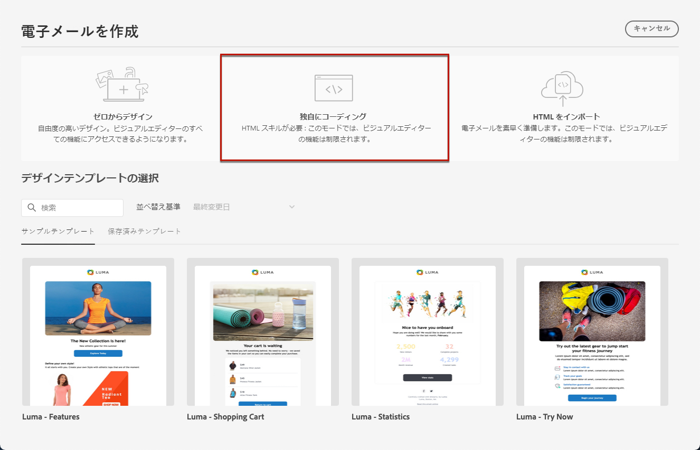
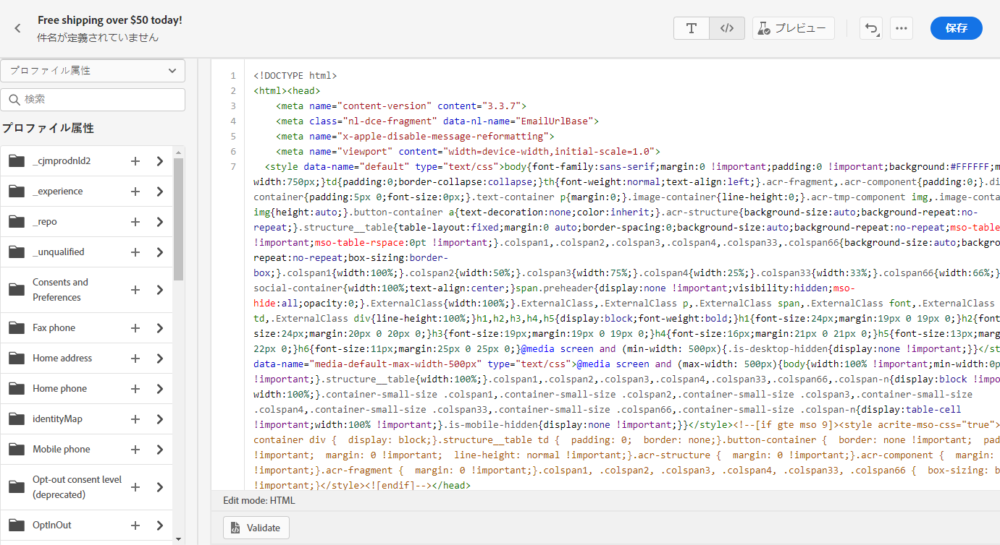
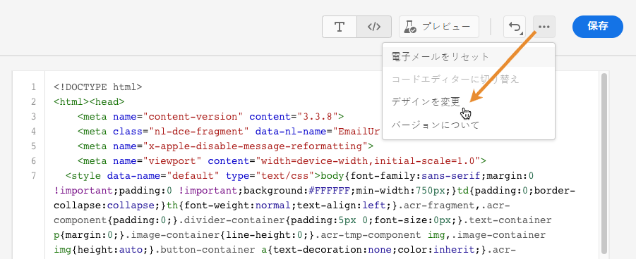
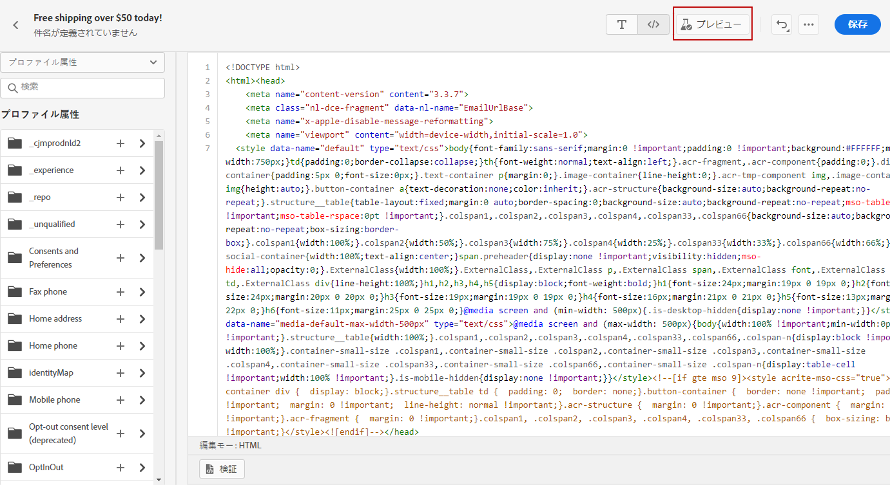
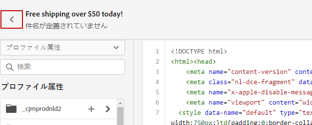

# コンテンツを独自にコーディング {#code-content}

**[!UICONTROL 独自のコードを作成]** Raw HTMLを書き込みまたは貼り付けて、[!DNL Journey Optimizer] Email Designerで直接メールコンテンツを作成できます。 このモードは、マークアップを完全に制御する必要がある場合や、既存のHTMLを読み込む場合に使用します。

HTMLのスキルが必要です。このモードを選択すると、コードエディターが表示されるので、ビジュアルエディターに切り替えることはできません。

➡️ [この機能をビデオで確認](#video)

>[!NOTE]
>
>**[!UICONTROL 独自にコーディング]** は、コンテンツテンプレートの高度なHTML エディターとは異なります。 高度なHTMLエディターを使用すると、コードエディターではなく、HTML ビューとビジュアル（デスクトップ）ビューをいつでも切り替えることができます。 [ 高度なHTML エディターの詳細情報 ](../content-management/email-template-expert-mode.md)。

## コードエディターの使用 {#use-code-editor}

コードエディターを使用してメールコンテンツを作成または編集するには、次の手順に従います。

1. [ メールDesigner](get-started-email-design.md) ホームページで、「**[!UICONTROL 独自のコーディング]**」を選択します。

   

1. Raw HTML コードを入力または貼り付けます。

1. 左側のペインを使用して、[!DNL Journey Optimizer] パーソナライゼーション機能を利用します。
[詳細情報](../personalization/personalize.md)

   

   >[!NOTE]
   >
   >E メールデザイナーのパーソナライゼーションエディターには、ジャーニー式と比較して、いくつかの関数制限があります。 [日時関数の制限の詳細情報](#date-time-limitations)

1. メールの内容をクリアして新しいデザインからメールを開始する場合は、オプション メニューから「**[!UICONTROL デザインを変更]**」を選択します。

   

   >[!NOTE]
   >
   >このアクションにより、E メールデザイナーで選択したテンプレートが開きます。ここから、メールのデザインを完成させるか、「**[!UICONTROL コードエディターに切り替え]**」オプションを使用してコードエディターに戻ることができます。

1. 「**[!UICONTROL プレビュー]**」ボタンをクリックし、テストプロファイルを使用したメッセージデザインとパーソナライゼーションを確認します。[詳細情報](../content-management/preview-test.md)

   

1. コードの準備が整ったら、「**[!UICONTROL 保存]**」をクリックし、メッセージ作成画面に戻ってメッセージを完成させます。

   

>[!CAUTION]
>
>[Adobe Experience Manager Assets](../integrations/assets.md) の画像は、独自のコードを作成するメソッドを使用している場合は参照できません。 HTML コードで参照されている画像を公開場所に保存します。

## 日時関数の制限 {#date-time-limitations}

E メールデザイナーのコードエディターでパーソナライゼーションを使用する際、`now()` 関数は動的な日付計算には使用できません。

>[!IMPORTANT]
>
>`now()` 関数は、メールビルダーの式言語では&#x200B;**サポートされていません**。`now()` はジャーニー条件で使用できますが、メールコンテンツやコードエディター内では使用できません。

**使用可能な代替手段：**

メールのパーソナライゼーションで現在の日時を操作するには、以下の関数を使用します。

* **`getCurrentZonedDateTime()`** - タイムゾーン情報を含む現在の日時を返します。`now()` の代わりに使用することをお勧めします。

  例：`` は、`2024-12-06T17:22:02.281067+05:30[Asia/Kolkata]` を返します

* **`currentTimeInMillis()`** - 現在の時刻をエポックミリ秒単位で返します。

  例：``

**推奨される回避策：**

メールコンテンツで日付計算を実行する必要がある場合：

* **日付フィールドを事前計算** - メールを送信する前に、データパイプラインまたはプロファイル属性で必要な日付値を計算し、パーソナライゼーションでこれらの事前計算値を参照します。

  例：``

* **日付操作関数を使用** - プロファイル属性の日付値に対して、`dayOfYear()` や `diffInDays()` などの[日時関数](../personalization/functions/dates.md)を使用します。

  例：``

* **計算属性を使用** - 複雑な日付計算を実行する[計算属性](../audience/computed-attributes.md)を作成し、その結果をプロファイル属性として使用できるようにします。

サポートされる関数の完全なリストについては、[ 日付および時刻関数 ](../personalization/functions/dates.md) を参照してください。
