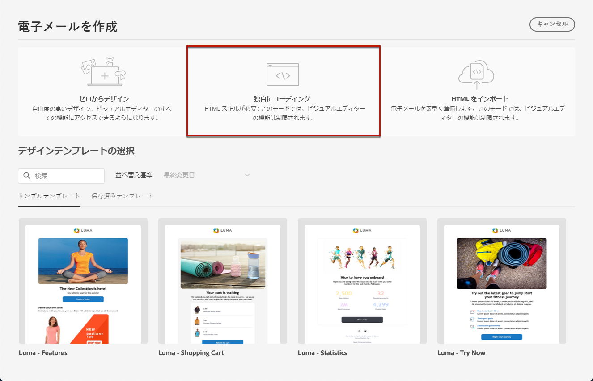
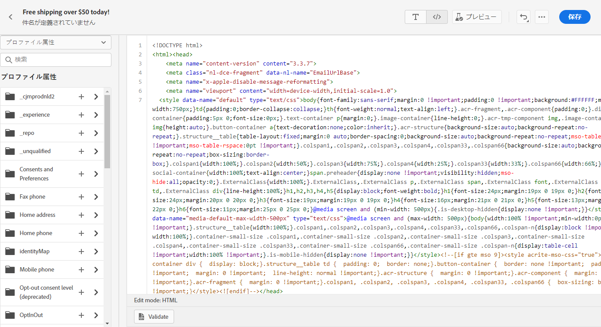
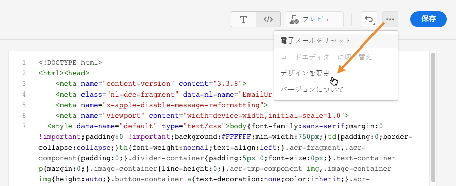
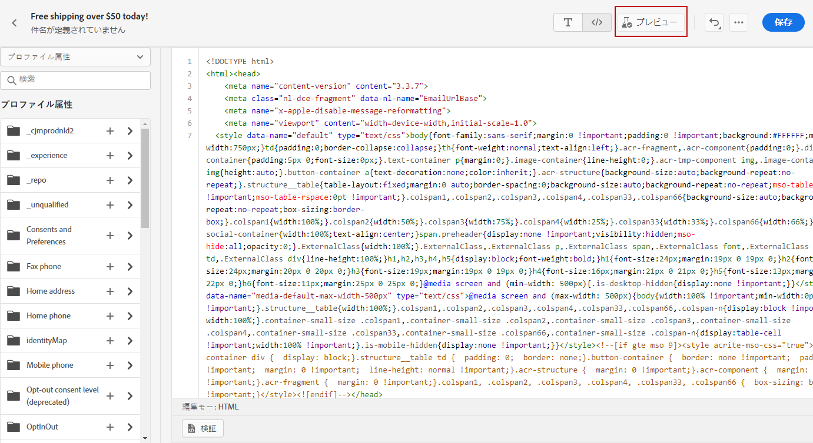
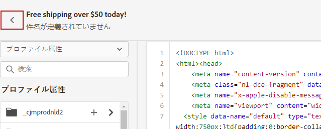

# コンテンツを独自にコーディング {#code-content}

>[!BEGINSHADEBOX]

**このページでは、**&#x200B;生のHTMLを電子メールDesigner コードエディターに書き込んだり貼り付けたりして、電子メールコンテンツを作成する方法（パーソナライゼーションの追加方法や使用可能な日時の関数など）について説明します。

>[!ENDSHADEBOX]

**[!UICONTROL 独自のコードを作成]**&#x200B;すると、生のHTMLを書き込んだり貼り付けたりして、[!DNL Journey Optimizer] メール Designerで直接メールコンテンツを作成できます。 このモードは、マークアップを完全に制御する必要がある場合や、既存のHTMLを読み込む場合に使用します。

HTMLのスキルが必要です。このモードを選択すると、コードエディターに留まり、ビジュアルエディターに切り替えることはできません。

➡️ [ビデオでこの機能を確認する](#video)

>[!NOTE]
>
>**[!UICONTROL 独自の]**&#x200B;のコードは、電子メール Designerの高度なHTML エディターと同じではありません。 高度なHTML エディターを使用すると、コードエディターではなく、いつでもHTML ビューとビジュアル（デスクトップ）ビューを切り替えることができます。 [高度なHTML エディターの詳細](email-expert-mode.md)。

## コードエディターの使用 {#use-code-editor}

コードエディターを使用してメールコンテンツを作成または編集するには、次の手順に従います。

1. [&#x200B; メール Designer](get-started-email-design.md)のホームページから、**[!UICONTROL 自分のコード]**&#x200B;を選択します。

   

1. Raw HTML コードを入力または貼り付けます。

1. 左側のペインを使用して、[!DNL Journey Optimizer] パーソナライゼーション機能を利用します。 [詳細情報](../personalization/personalize.md)

   

   >[!NOTE]
   >
   >E メールデザイナーのパーソナライゼーションエディターには、ジャーニー式と比較して、いくつかの関数制限があります。 [日時関数の制限の詳細情報](#date-time-limitations)

1. メールの内容をクリアして新しいデザインからメールを開始する場合は、オプション メニューから「**[!UICONTROL デザインを変更]**」を選択します。

   

   >[!NOTE]
   >
   >このアクションにより、E メールデザイナーで選択したテンプレートが開きます。 ここから、メールのデザインを完成させるか、「**[!UICONTROL コードエディターに切り替え]**」オプションを使用してコードエディターに戻ることができます。

1. 「**[!UICONTROL プレビュー]**」ボタンをクリックし、テストプロファイルを使用したメッセージデザインとパーソナライゼーションを確認します。 [詳細情報](../content-management/preview-test.md)

   

1. コードの準備が整ったら、「**[!UICONTROL 保存]**」をクリックし、メッセージ作成画面に戻ってメッセージを完成させます。

   

>[!CAUTION]
>
>独自のメソッドをコードで使用する場合、[Adobe Experience Manager Assets](../integrations/assets.md)の画像を参照できません。 HTML コードで参照されている画像を公開場所に保存します。

## 日時関数の制限 {#date-time-limitations}

E メールデザイナーのコードエディターでパーソナライゼーションを使用する際、`now()` 関数は動的な日付計算には使用できません。

>[!IMPORTANT]
>
>`now()` 関数は、メールビルダーの式言語では&#x200B;**サポートされていません**。 `now()` はジャーニー条件で使用できますが、メールコンテンツやコードエディター内では使用できません。

**使用可能な代替手段：**

メールのパーソナライゼーションで現在の日時を操作するには、以下の関数を使用します。

* **`getCurrentZonedDateTime()`** - タイムゾーン情報を含む現在の日時を返します。 `now()` の代わりに使用することをお勧めします。

  例：`` は、`2024-12-06T17:22:02.281067+05:30[Asia/Kolkata]` を返します

* **`currentTimeInMillis()`** - 現在の時刻をエポックミリ秒単位で返します。

  例：``

**推奨される回避策：**

メールコンテンツで日付計算を実行する必要がある場合：

* **日付フィールドを事前計算** - メールを送信する前に、データパイプラインまたはプロファイル属性で必要な日付値を計算し、パーソナライゼーションでこれらの事前計算値を参照します。

  例：``

* **日付操作関数を使用** - プロファイル属性の日付値に対して、`dayOfYear()` や `diffInDays()` などの[日時関数](../personalization/functions/dates.md)を使用します。

  例：``

* **計算属性を使用** - 複雑な日付計算を実行する[計算属性](../audience/computed-attributes.md)を作成し、その結果をプロファイル属性として使用できるようにします。

サポートされている関数の完全なリストについては、[日付と時刻の関数](../personalization/functions/dates.md)を参照してください。
