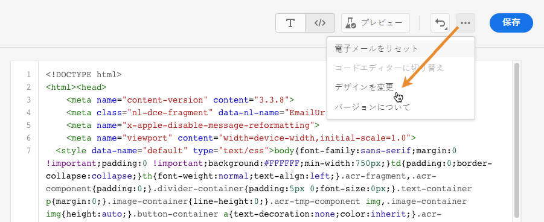
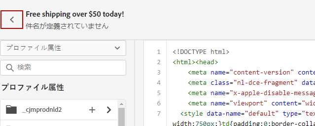

# コンテンツを独自にコーディング {#code-content}

**[!UICONTROL 独自にコーディング]**&#x200B;モードを使用すると、Raw HTML をインポートしたり、メールコンテンツをコーディングしたりできます。この方法を使用するには、HTML に関するスキルが必要です。

➡️ [この機能をビデオで確認](#video)

>[!CAUTION]
>
> [Adobe Experience Manager Assets](../content-management/assets.md) の画像は、このメソッドを使用する場合は参照できません。HTML コードで参照される画像は、公開場所に保存する必要があります。

1. E メールデザイナーのホームページで、「**[!UICONTROL 独自にコーディング]**」を選択します。

   

1. Raw HTML コードを入力または貼り付けます。

1. 左側のペインを使用して、[!DNL Journey Optimizer] パーソナライゼーション機能を利用します。
[詳細情報](../personalization/personalize.md)

   

1. メールの内容をクリアして新しいデザインからメールを開始する場合は、オプション メニューから「**[!UICONTROL デザインを変更]**」を選択します。

   

   >[!NOTE]
   >
   >このアクションにより、E メールデザイナーで選択したテンプレートが開きます。ここから、メールのデザインを完成させるか、「**[!UICONTROL コードエディターに切り替え]**」オプションを使用してコードエディターに戻ることができます。

1. 「**[!UICONTROL プレビュー]**」ボタンをクリックし、テストプロファイルを使用したメッセージデザインとパーソナライゼーションを確認します。[詳細情報](../content-management/preview-test.md)

   

1. コードの準備が整ったら、「**[!UICONTROL 保存]**」をクリックし、メッセージ作成画面に戻ってメッセージを完成させます。

   
