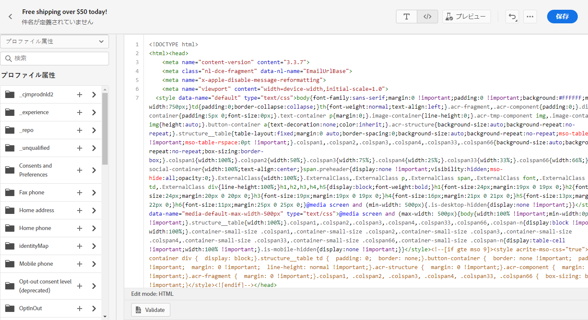

# コンテンツのコード化 {#code-content}

**[!UICONTROL Code your own]**&#x200B;このモードを使用して、未加工の HTML をインポートしたり、電子メールのコンテンツをコードしたりすることができます。この方法には HTML スキルが必要です。

➡️ [ ビデオでのこの機能の検出](#video)

>[!CAUTION]
>
> Adobe エクスペリエンスマネージャアセットの [ 基礎 ](assets-essentials.md) となるイメージは、このメソッドを使用する場合には参照できません。 HTML コード内で参照されているイメージは、パブリックに格納されている必要があります。

1. 電子メールデザイナーのホームページから、を選択 **[!UICONTROL Code your own]** します。

   

1. 生の HTML コードを入力またはペーストします。

1. 左側のペインを使用して、パーソナル化機能を利用 [!DNL Journey Optimizer] します。 [詳細情報](../personalization/personalize.md)

   

1. 電子メールデザイナーを開き、新しいデザインから電子メールを開始するには、オプションメニューからを選択し **[!UICONTROL Change your design]** ます。

   

1. **[!UICONTROL Preview]**&#x200B;ボタンをクリックすると、「テストプロファイル」を使用してメッセージデザインおよびカスタマイズが確認されます。[詳細情報](preview.md)

   

1. コードの準備が完了したら、 **[!UICONTROL Save]** メッセージ作成画面に戻って、メッセージを確定することもできます。

   
