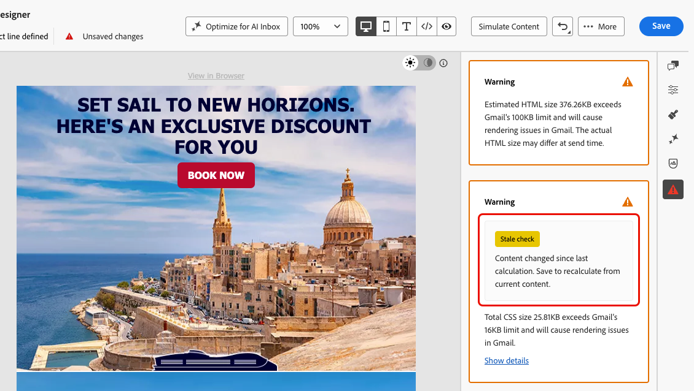

# E メールDesignerでのコンテンツチェック {#content-checks}

>[!CONTEXTUALHELP]
>id="ajo_email_content_check"
>title="コンテンツチェック"
>abstract="メールを送信する前に、メール内のHTMLとCSSの問題を検出して修正します。 GmailまたはMicrosoft Outlookでトリガーレンダリングのエラーが発生した場合に、サポートされていないタグ、空のdiv、サイズのしきい値を確認します。 問題は、エラー、警告、または情報通知として表示されます。"

[!DNL Journey Optimizer]には、電子メール Designerで直接自動技術検証が含まれており、送信前にHTMLとCSSの問題を検出するのに役立ちます。

結果は、オーサリングパネルでエラー、警告、または情報に関する通知として表示され、コンテキストの詳細とワンクリック修正が可能な場合は表示されるので、電子メールDesignerを離れることなく問題を解決できます。

## コンテンツの確認にアクセス {#access-content-checks}

コンテンツチェックは、常に電子メールDesignerで使用できます。 これらを表示するには、右側のパネルの「イシュー」アイコンをクリックして&#x200B;**[!UICONTROL コンテンツチェック]** ペインを開きます。検出されたすべてのイシューがここに表示されます。

>[!NOTE]
>
>チェックは、メールの現在の状態に対して、および各編集後に自動的に実行されます。 [詳細情報](#recalculation)

チェックは、次の3つの重大度レベルで表示されます。

| 重大度 | カラー | 説明 |
|---|---|---|
| **エラー** | 赤 | 配信またはレンダリングの失敗の原因となる重大な問題。 送信前に解決。 |
| **警告** | Orange | 特定のメールクライアントでのレンダリングに影響を与える可能性のある問題。 確認して解決することをお勧めします。 |
| **情報** | 青 | 送信をブロックしないが、コンテンツの長期的なメンテナンス性に影響を与える可能性のある条件に関する情報のお知らせ。 |

問題が検出されない場合、ペインに&#x200B;**問題が検出されず**&#x200B;が表示され、対応するアイコンが緑色になります。

問題に応じて、より多くのコンテキストを表示したり、ワンクリック修正を適用したり、メールを保存してチェック結果を更新したりできます。

* 検出された問題については、**[!UICONTROL 詳細を表示]** ボタンをクリックして詳細なコンテキストを表示できます。「**[!UICONTROL 詳細を非表示]**」をクリックして折りたたみます。
  {width="80%"}
* 同様に、「**[!UICONTROL 修正を表示]**」ボタンをクリックし、利用可能な場合はワンクリック修正を適用できます。修正を自動的に適用できない場合は、メッセージが表示され、手動で問題を解決する必要があります。
  {width="80%"}

### チェックの再計算 {#recalculation}

サポートされていないHTML要素、空のDiv、HTMLサイズなど、ほとんどのチェックはメールを編集するたびに再計算されるため、常に現在のコンテンツが反映されます。

CSS サイズなどの他のチェックは、シリアル化されたコンテンツ（メールの読み込みまたは保存時のバージョン）から計算されます。メールDesignerのライブエディターのステータスからは計算されません。 この場合、保存されたコンテンツは、編集中に表示されるものとは少し異なる場合があります。 保存せずに編集を行うと、**[!UICONTROL 古いチェック]** ラベルが表示され、結果が正確でなくなる可能性があることを示します。 計算を更新するには、電子メールを保存します。

{width="100%"}

## 検出された問題の修正 {#fix-issues}

次の表は、すべての可能なメッセージとそれぞれの推奨アクションを示しています。 **[!UICONTROL コンテンツ チェック]** ペインに表示されているメッセージに一致するカテゴリを展開します。

+++ サポートされていないHTML要素

| メッセージ | 重大度 | 今後の施策 |
|---|---|---|
| コンテンツに`<script>` タグが含まれていますが、どの電子メールシステムでもサポートされていません。 配信とレンダリングの問題を回避するために削除します。 | エラー | HTML コンテンツからすべての`<script>` タグを見つけて削除します。 |
| コンテンツに`<base>` タグが含まれているので、メール Designerでリンクとリソースの解決に関する問題が発生する可能性があります。 修正するには、それを削除する必要があります。 | エラー | HTMLから`<base>` タグを削除します。 |
| コンテンツに更新付きのHTML メタタグが含まれていますが、これはメールDesignerではサポートされていません。 予期しない動作を防ぐために削除します。 | 警告 | HTMLからメタリフレッシュタグを削除します。 |
| コンテンツに空のdivが含まれているので、Microsoft Outlook （MSO）でレイアウトの問題が発生する可能性があります。 これを修正するには、空のdivを削除し、代わりに兄弟エレメントの間隔を使用します。 | 警告 | 空の`
`要素を削除し、周囲の要素の余白または余白を調整して、間隔を維持します。 |

+++

+++ CSSの問題

| メッセージ | 重大度 | 今後の施策 |
|---|---|---|
| CSSの合計サイズがGmailの16 KB制限を超えているため、Gmailでレンダリングの問題が発生します。 | エラー | 未使用のCSS ルールを自動的に削除するか、手動でスタイルを簡素化するには、**[!UICONTROL 修正を適用]**&#x200B;してください。 |
| CSSの合計サイズはGmailの16 KB制限に近く、より多くのCSSを追加するとレンダリングの問題が発生する可能性があります。 | 警告 | 未使用のCSS ルールを削除するか、スタイルを減らしてからコンテンツを追加するには、**[!UICONTROL 修正]**&#x200B;を適用します。 |
| このフラグメントのCSS サイズの合計が3 KBを超えています。 これを他のフラグメントと組み合わせると、メール CSSの合計がGmailの16 KB制限を超え、レンダリングの問題が発生する可能性があります。 | 警告 | このフラグメントのCSSを簡略化して、結合されたメール CSSを16 KB未満に保ちます。 |
| コンテンツに未使用のCSS ルールが含まれています。 これにより、Gmailでレンダリングの問題が発生する可能性があります。 | 警告 | **[!UICONTROL 修正を適用]**&#x200B;して、電子メールに存在しない要素を参照するCSS ルールを自動的に削除します。 |

<!--
| Message | Severity | What to do |
|---|---|---|
| Your content has modifications to the system-generated default CSS. These changes may be overridden by future Email Designer updates. To preserve your styles, add them using the Custom CSS feature instead. | Info | Move your custom styles to [Custom CSS](custom-css.md) to ensure they are preserved across Email Designer updates. |
-->

+++

+++ HTML サイズ

| メッセージ | 重大度 | 今後の施策 |
|---|---|---|
| HTMLの推定サイズはGmailの100 KB制限を超えており、Gmailでレンダリングの問題が発生します。 実際のHTML サイズは、送信時に異なる場合があります。 | エラー | メールコンテンツの削減 – 不要な要素を削除したり、構造を簡素化したり、複数の送信にコンテンツを分割したりできます。 |
| HTMLの推定サイズはGmailの100 KB制限に近く、HTMLを追加するとレンダリングの問題が発生する可能性があります。 実際のHTML サイズは、送信時に異なる場合があります。 | 警告 | コンテンツを追加する前に簡略化する。 Gmailの制限を超える電子メールは、受信者のためにクリップされます。 |
| このフラグメントの推定HTML サイズは20 KBを超えています。 これを他のフラグメントと組み合わせると、メール HTMLの合計がGmailの100 KB制限を超え、レンダリングの問題が発生する可能性があります。 実際のHTML サイズは、送信時に異なる場合があります。 | 警告 | このフラグメントのHTMLを減らして、結合されたメールサイズをGmailの100 KB制限の下に保ちます。 |

+++

## HTMLとCSS サイズについて {#size-estimation}

HTMLとCSS サイズの値は、オーサリング時に計算される&#x200B;**推定値**&#x200B;であり、受信者に配信される実際のサイズとは異なる場合があります。例えば、電子メールでコンディショナルブロックを使用する場合（受信者ごとに1つのブランチレンダリングのみ）、送信時にHTMLの縮小が有効になっている場合などです。

サイズの警告は、ハードブロックではなく、送信前にコンテンツを最適化するための先見的なシグナルです。
