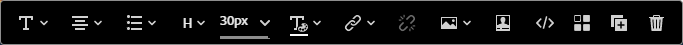
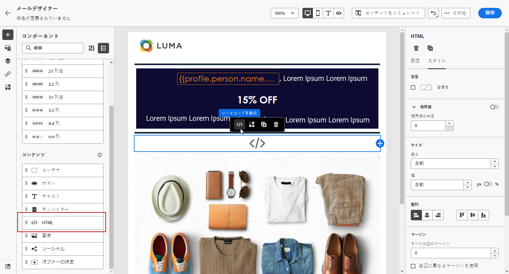

# 電子メールデザイナーのコンテンツコンポーネントを使用する {#content-components}

>[!CONTEXTUALHELP]
>id="ac_content_components_email"
>title="コンテンツコンポーネントについて"
>abstract="コンテンツコンポーネントは、メールのレイアウト作成に使用できる空のコンテンツプレースホルダーです。"

>[!CONTEXTUALHELP]
>id="ac_content_components_landing_page"
>title="コンテンツコンポーネントについて"
>abstract="コンテンツコンポーネントは、ランディングページのレイアウトの作成に使用できる空のコンテンツプレースホルダーです。"

>[!CONTEXTUALHELP]
>id="ac_content_components_fragment"
>title="コンテンツコンポーネントについて"
>abstract="コンテンツコンポーネントは、フラグメントのレイアウトの作成に使用できる空のコンテンツプレースホルダーです。"

>[!CONTEXTUALHELP]
>id="ac_content_components_template"
>title="コンテンツコンポーネントについて"
>abstract="コンテンツコンポーネントは、テンプレートのレイアウトの作成に使用できる空のコンテンツプレースホルダーです。"

メールコンテンツを作成する際は、**[!UICONTROL コンテンツコンポーネント]**&#x200B;を使用すると、メールに配置して編集できる生のコンポーネントで、メールをさらにパーソナライズできます。

メールのレイアウトを定義する 1 つ以上の構造コンポーネント内には、必要な数だけコンテンツコンポーネントを追加できます。

## コンテンツコンポーネントの追加 {#add-content-components}

コンテンツコンポーネントをメールに追加し、必要に応じて調整するには、次の手順に従います。

1. 電子メールデザイナーで、既存のコンテンツを使用するか、**[!UICONTROL 構造コンポーネント]**&#x200B;を空のコンテンツにドラッグ＆ドロップして、メールのレイアウトを定義します。 [方法についてはこちらを参照](content-from-scratch.md)

1. 「**[!UICONTROL コンテンツ コンポーネント]**」セクションにアクセスするには、電子メールデザイナーの左パネルから対応するボタンを選択します。

   

1. 選択したコンテンツコンポーネントを、関連する構造コンポーネント内にドラッグ＆ドロップします。

   

   >[!NOTE]
   >
   >単一の構造コンポーネントおよび構造コンポーネントの各列に複数のコンポーネントを追加できます。

1. 右側の&#x200B;**[!UICONTROL コンポーネント設定]**&#x200B;パネルを使用して、各コンポーネントのスタイル属性を調整します。例えば、コンポーネントのテキストスタイル、パディングまたは余白を変更できます。[詳しくは、整列とパディングを参照してください](alignment-and-padding.md)

   

## コンテナ {#container}

シンプルなコンテナを追加し、その中に別のコンテンツコンポーネントを追加できます。これにより、コンテナに特定のスタイルを適用できます（内部で使用されるコンポーネントとは異なります）。

例えば、**[!UICONTROL コンテナ]**&#x200B;コンポーネントを追加してから、 [ボタン](#button)コンポーネントをそのコンテナ内に追加します。コンテナには特定の背景を使用し、ボタンには別の背景を指定することができます。

## ボタン {#button}

**[!UICONTROL ボタン]**&#x200B;コンポーネントを使用すると、メールに 1 つ以上のボタンを挿入し、メールのオーディエンスを別のページにリダイレクトできます。

1. **[!UICONTROL コンテンツコンポーネント]**&#x200B;から、**[!UICONTROL ボタン]**&#x200B;コンポーネントを&#x200B;**[!UICONTROL 構造コンポーネント]**&#x200B;にドラッグ＆ドロップします。

1. 新しく追加したボタンをクリックして、テキストをパーソナライズし、電子メールデザイナーの右側のパネルにある&#x200B;**[!UICONTROL コンポーネント設定]**&#x200B;にアクセスできるようにします。

   

1. 「**[!UICONTROL リンク]**」フィールドに、ボタンをクリックしたときにリダイレクトする URL を追加します。

1. **[!UICONTROL ターゲット]**&#x200B;ドロップダウンリストで、オーディエンスのリダイレクト方法を選択します。

   * **[!UICONTROL なし]**：クリックしたフレームと同じフレームでリンクを開きます（デフォルト）。
   * **[!UICONTROL 空白]**：リンクを新しいウィンドウまたは新しいタブで開きます。
   * **[!UICONTROL セルフ]**：クリックしたフレームと同じフレームでリンクを開きます。
   * **[!UICONTROL 親]**：親フレームでリンクを開きます。
   * **[!UICONTROL トップ]**：ウィンドウ全体でリンクを開きます。

   

1. ボタンをさらにパーソナライズするには、**[!UICONTROL 境界線]**、**[!UICONTROL サイズ]**、**[!UICONTROL 余白]**&#x200B;などのスタイル属性を&#x200B;**[!UICONTROL コンポーネント設定]**&#x200B;パネルから変更します。

## テキスト {#text}

**[!UICONTROL テキスト]**&#x200B;コンポーネントを使用してメールにテキストを挿入し、スタイル（境界線、サイズ、パディングなど）を&#x200B;**[!UICONTROL コンポーネント設定]**&#x200B;パネルを使用して調整します。

1. **[!UICONTROL コンテンツコンポーネント]**&#x200B;から、**[!UICONTROL テキスト]**&#x200B;コンポーネントを&#x200B;**[!UICONTROL 構造コンポーネント]**&#x200B;にドラッグ＆ドロップします。

1. 新しく追加したコンポーネントをクリックして、テキストをパーソナライズし、電子メールデザイナーの右側のパネルにある&#x200B;**[!UICONTROL コンポーネント設定]**&#x200B;にアクセスできるようにします。

1. ツールバーで次のオプションを使用して、テキストを変更します。

   

   * **[!UICONTROL テキストスタイルの変更]**：テキストに太字、斜体、下線、取り消し線を適用します。
   * **配置の変更**：テキストの行揃えを左揃え、右揃え、中央揃えまたは両端揃えから選択します。
   * **[!UICONTROL リストの作成]**：テキストに箇条書きまたは番号リストを追加します。
   * **[!UICONTROL 見出しの設定]**：テキストに最大 6 つのレベルの見出しを追加します。
   * **フォントサイズ**：テキストのフォントサイズをピクセル単位で選択します。
   * **[!UICONTROL 画像の編集]**：テキストコンポーネントに画像またはアセットを追加します。[詳しくは、アセット管理を参照してください](assets-essentials.md)
   * **[!UICONTROL ソースコードの表示]**：テキストのソースコードを表示します。変更はできません。
   * **[!UICONTROL 複製]**：テキストコンポーネントのコピーを追加します。
   * **[!UICONTROL 削除]**：選択したテキストコンポーネントをメールから削除します。
   * **[!UICONTROL パーソナライズの追加]**：パーソナライゼーションフィールドを追加し、プロファイルデータを使用してコンテンツをカスタマイズできます。[詳しくは、コンテンツのパーソナライゼーションを参照してください](../personalization/personalize.md)
   * **[!UICONTROL 条件付きコンテンツを有効にする]**：条件付きコンテンツを追加して、コンポーネントのコンテンツをターゲットプロファイルに適応させます。[詳しくは、動的コンテンツを参照してください。](../personalization/get-started-dynamic-content.md)

1. その他のスタイル属性（テキストの色、フォントファミリー、境界線、パディング、余白など）を&#x200B;**[!UICONTROL コンポーネント設定]**&#x200B;ペインから調整します。

## ディバイダー {#divider}

**[!UICONTROL ディバイダー]**&#x200B;コンポーネントを使用すると、分割線を挿入してメールのレイアウトと内容を整理できます。

線の色、スタイル、高さなどのスタイル属性は、**[!UICONTROL コンポーネント設定]**&#x200B;ペインから調整できます。

## HTML {#HTML}

**[!UICONTROL HTML]** コンポーネントを使用して、既存の HTML の別の部分をコピーして貼り付けることができます。これにより、無料のモジュラー HTML コンポーネントを作成して、一部の外部コンテンツを再利用できます。

1. **[!UICONTROL コンテンツコンポーネント]**&#x200B;から、**[!UICONTROL HTML]** コンポーネントを&#x200B;**[!UICONTROL 構造コンポーネント]**&#x200B;にドラッグ＆ドロップします。

1. 新しく追加したコンポーネントをクリックし、コンテキストツールバーから「**[!UICONTROL ソースコードを表示]**」選択して HTML を追加します。

   

1. 追加する HTML コードをメールにコピー＆ペーストし、「**[!UICONTROL 保存]**」をクリックします。

   

>[!NOTE]
>
>外部のコンテンツを簡単に電子メールデザイナーに準拠させるには、一からメッセージを作成し、既存のメールのコンテンツをコンポーネントにコピーすることをお勧めします。

## 画像 {#image}

**[!UICONTROL 画像]**&#x200B;コンポーネントを使用して、コンピューターからメールコンテンツに画像ファイルを挿入します。

1. **[!UICONTROL コンテンツコンポーネント]**&#x200B;から、**[!UICONTROL 画像]**&#x200B;コンポーネントを&#x200B;**[!UICONTROL 構造コンポーネント]**&#x200B;にドラッグ＆ドロップします。

1. 「**[!UICONTROL 参照]**」をクリックして、アセットから画像ファイルを選択します。

   [!DNL Assets Essentials] について詳しくは、[Adobe Experience Manager Assets Essentials のドキュメント](https://experienceleague.adobe.com/docs/experience-manager-assets-essentials/help/introduction.html?lang=ja){target=&quot;_blank&quot;}を参照してください。

1. 新しく追加したコンポーネントをクリックし、**[!UICONTROL コンポーネント設定]**&#x200B;ペインを使用して画像プロパティを設定します。

   * 「**[!UICONTROL 画像タイトル]**」で画像のタイトルを指定します。
   * **[!UICONTROL 代替テキスト]**&#x200B;を使用すると、画像にリンクするキャプションを定義できます。これは alt HTML 属性に対応します。

   

1. 余白や境界線など、他のスタイル属性を調整します。または、別のコンテンツにオーディエンスをリダイレクトするためのリンクを&#x200B;**[!UICONTROL コンポーネント設定]**&#x200B;ペインで追加します。

## ビデオ {#Video}

>[!CONTEXTUALHELP]
>id="ac_edition_video_email"
>title="ビデオ設定"
>abstract="このコンポーネントを使用すると、メールにビデオを挿入できます。ビデオが機能しないメールクライアントもあります。フォールバック画像を設定することをお勧めします。"

>[!CONTEXTUALHELP]
>id="ac_edition_video_landing_page"
>title="ビデオ設定"
>abstract="このコンポーネントを使用すると、ランディングページにビデオを挿入できます。なお、ビデオは必ずしもすべてのメッセージクライアントで機能するわけではありません。フォールバック画像を設定することをお勧めします。"

>[!CONTEXTUALHELP]
>id="ac_edition_video_fragment"
>title="ビデオ設定"
>abstract="このコンポーネントを使用すると、フラグメントにビデオを挿入できます。なお、ビデオは必ずしもすべてのメッセージクライアントで機能するわけではありません。フォールバック画像を設定することをお勧めします。"

>[!CONTEXTUALHELP]
>id="ac_edition_video_template"
>title="ビデオ設定"
>abstract="このコンポーネントを使用すると、テンプレートにビデオを挿入できます。なお、ビデオは必ずしもすべてのメッセージクライアントで機能するわけではありません。フォールバック画像を設定することをお勧めします。"

**[!UICONTROL ビデオ]**&#x200B;コンポーネントを使用すると、URL リンクを介してメールコンテンツにビデオを挿入できます。

1. **[!UICONTROL コンテンツコンポーネント]**&#x200B;から、**[!UICONTROL ビデオ]**&#x200B;コンポーネントを&#x200B;**[!UICONTROL 構造コンポーネント]**&#x200B;にドラッグ＆ドロップします。

   

1. 新しく追加したコンポーネントをクリックします。

1. **[!UICONTROL コンポーネント設定]**&#x200B;ペインの「**[!UICONTROL ビデオリンク]**」フィールドに、ビデオの URL を追加します。

   

1. ビデオに&#x200B;**[!UICONTROL ポスター画像]**&#x200B;を追加すると、オーディエンスが再生ボタンをクリックするまで表示する画像を指定できます。

1. スタイル、余白、境界線などのその他のスタイル属性を&#x200B;**[!UICONTROL コンポーネント設定]**&#x200B;ペインから調整します。

## ソーシャル {#social}

**[!UICONTROL ソーシャル]**&#x200B;コンポーネントを使用すると、メールコンテンツにソーシャルメディアページへのリンクを挿入できます。

1. **[!UICONTROL コンテンツコンポーネント]**&#x200B;から、**[!UICONTROL ソーシャル]**&#x200B;コンポーネントを&#x200B;**[!UICONTROL 構造コンポーネント]**&#x200B;にドラッグ＆ドロップします。

1. 新しく追加したコンポーネントをクリックします。

1. **[!UICONTROL コンポーネント設定]**&#x200B;パネルの「**[!UICONTROL ソーシャル]**」フィールドで、追加または削除するソーシャルメディアを選択します。

   

1. 専用フィールドでアイコンのサイズを選択します。

1. 各ソーシャルメディアアイコンをクリックして、オーディエンスのリダイレクト先の **[!UICONTROL URL]** を設定します。

   

1. 必要に応じて、「**[!UICONTROL 画像]**」フィールドで各ソーシャルメディアのアイコンを変更することもできます。

1. スタイル、余白、境界線などのその他のスタイル属性を&#x200B;**[!UICONTROL コンポーネント設定]**&#x200B;ペインから調整します。

## オファーの決定 {#offer-decision}

**[!UICONTROL オファーの決定]**&#x200B;コンポーネントを使用すると、メッセージにオファーを挿入できます。[意思決定管理](../offers/get-started/starting-offer-decisioning.md)エンジンが、顧客に提示する最適なオファーを選択します。

パーソナライズされたオファーをメールに追加する方法については、[この節](add-offers-email.md)を参照してください。

