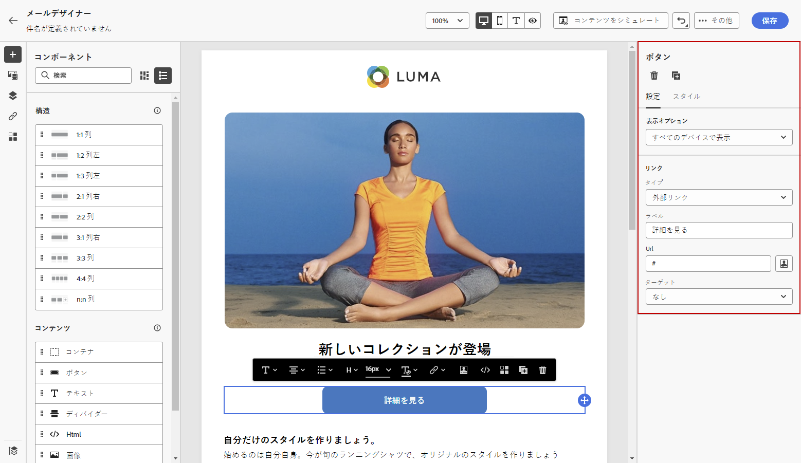
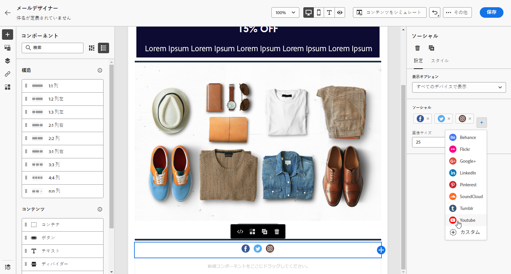

# E メールデザイナーのコンテンツコンポーネントを使用する {#content-components}

>[!CONTEXTUALHELP]
>id="ac_content_components_email"
>title="コンテンツコンポーネントについて"
>abstract="コンテンツコンポーネントは、メールのレイアウト作成に使用できる空のコンテンツプレースホルダーです。"

>[!CONTEXTUALHELP]
>id="ac_content_components_landing_page"
>title="コンテンツコンポーネントについて"
>abstract="コンテンツコンポーネントは、ランディングページのレイアウトの作成に使用できる空のコンテンツプレースホルダーです。"

>[!CONTEXTUALHELP]
>id="ac_content_components_fragment"
>title="コンテンツコンポーネントについて"
>abstract="コンテンツコンポーネントは、フラグメントのレイアウトの作成に使用できる空のコンテンツプレースホルダーです。"

>[!CONTEXTUALHELP]
>id="ac_content_components_template"
>title="コンテンツコンポーネントについて"
>abstract="コンテンツコンポーネントは、テンプレートのレイアウトの作成に使用できる空のコンテンツプレースホルダーです。"

メールコンテンツを作成する際は、**[!UICONTROL コンテンツコンポーネント]**&#x200B;を使用すると、メールに配置して編集できる生のコンポーネントで、メールをさらにパーソナライズできます。

メールのレイアウトを定義する 1 つ以上の構造コンポーネント内には、必要な数だけコンテンツコンポーネントを追加できます。

## コンテンツコンポーネントの追加 {#add-content-components}

コンテンツコンポーネントをメールに追加し、必要に応じて調整するには、次の手順に従います。

1. E メールデザイナーで、既存のコンテンツを使用するか、**[!UICONTROL 構造コンポーネント]**&#x200B;を空のコンテンツにドラッグ＆ドロップして、メールのレイアウトを定義します。[方法についてはこちらを参照](content-from-scratch.md)

1. 「**[!UICONTROL コンテンツコンポーネント]**」セクションにアクセスするには、E メールデザイナーの左パネルから対応するボタンを選択します。

   

1. 選択したコンテンツコンポーネントを、関連する構造コンポーネント内にドラッグ＆ドロップします。

   

   >[!NOTE]
   >
   >単一の構造コンポーネントおよび構造コンポーネントの各列に複数のコンポーネントを追加できます。

1. 右側の「**[!UICONTROL 設定]**」タブと「**[!UICONTROL スタイル]**」タブを使用して、コンポーネントごとに属性とスタイルを調整します。例えば、コンポーネントのテキストスタイル、パディングまたは余白を変更できます。[詳しくは、整列とパディングを参照してください](alignment-and-padding.md)

   

1. **[!UICONTROL コンテンツコンポーネント]**&#x200B;の詳細メニューから、必要に応じてコンテンツコンポーネントを簡単に削除または複製できます。

   

## コンテナ {#container}

コンテンツコンポーネントのグループに特定のスタイルを適用するには、**[!UICONTROL コンテナ]**&#x200B;コンポーネントを追加してから、目的のコンテンツコンポーネントをその中に追加します。これにより、コンテナ内のコンテンツコンポーネントに適用されるスタイルとは異なる、独自のスタイルをコンテナに適用できます。

例えば、**[!UICONTROL コンテナ]**&#x200B;コンポーネントを追加してから、 [ボタン](#button)コンポーネントをそのコンテナ内に追加します。コンテナには特定の背景を使用し、ボタンには別の背景を指定することができます。

## ボタン {#button}

**[!UICONTROL ボタン]**&#x200B;コンポーネントを使用すると、メールに 1 つ以上のボタンを挿入し、メールのオーディエンスを別のページにリダイレクトできます。

1. **[!UICONTROL コンテンツコンポーネント]**&#x200B;から、**[!UICONTROL ボタン]**&#x200B;コンポーネントを&#x200B;**[!UICONTROL 構造コンポーネント]**&#x200B;にドラッグ＆ドロップします。

1. 新しく追加したボタンをクリックして、テキストをパーソナライズし、E メールデザイナーの右側のパネルにある「**[!UICONTROL 設定]**」タブと「**[!UICONTROL スタイル]**」タブにアクセスできるようにします。

   

1. 「**[!UICONTROL リンク]**」メニューから、ボタンをクリックした際にリダイレクトする URL を追加します。

1. **[!UICONTROL ターゲット]**&#x200B;ドロップダウンリストで、オーディエンスのリダイレクト方法を選択します。

   * **[!UICONTROL なし]**：クリックしたフレームと同じフレームでリンクを開きます（デフォルト）。
   * **[!UICONTROL 空白]**：リンクを新しいウィンドウまたは新しいタブで開きます。
   * **[!UICONTROL セルフ]**：クリックしたフレームと同じフレームでリンクを開きます。
   * **[!UICONTROL 親]**：親フレームでリンクを開きます。
   * **[!UICONTROL トップ]**：ウィンドウ全体でリンクを開きます。

   

1. ボタンをさらにパーソナライズするには、**[!UICONTROL 境界線]**、**[!UICONTROL サイズ]**、**[!UICONTROL 余白]**&#x200B;などのスタイル属性を&#x200B;**[!UICONTROL コンポーネント設定]**&#x200B;パネルから変更します。

## テキスト {#text}

**[!UICONTROL テキスト]**&#x200B;コンポーネントを使用してメールにテキストを挿入し、スタイル（境界線、サイズ、パディングなど）を「**[!UICONTROL スタイル]**」タブを使用して調整します。

1. **[!UICONTROL コンテンツコンポーネント]**&#x200B;から、**[!UICONTROL テキスト]**&#x200B;コンポーネントを&#x200B;**[!UICONTROL 構造コンポーネント]**&#x200B;にドラッグ＆ドロップします。

1. 新しく追加したコンポーネントをクリックして、テキストをパーソナライズし、E メールデザイナーの右側のパネルにある「**[!UICONTROL 設定]**」タブと「**[!UICONTROL スタイル]**」タブにアクセスできるようにします。

1. ツールバーで次のオプションを使用して、テキストを変更します。

   

   * **[!UICONTROL テキストスタイルの変更]**：テキストに太字、斜体、下線、取り消し線を適用します。
   * **配置の変更**：テキストの行揃えを左揃え、右揃え、中央揃えまたは両端揃えから選択します。
   * **[!UICONTROL リストの作成]**：テキストに箇条書きまたは番号リストを追加します。
   * **[!UICONTROL 見出しの設定]**：テキストに最大 6 つのレベルの見出しを追加します。
   * **フォントサイズ**：テキストのフォントサイズをピクセル単位で選択します。
   * **[!UICONTROL フォントカラーを変更]**：フォントの色を選択します。
   * **[!UICONTROL リンクを挿入]**：コンテンツに任意のタイプのリンクを追加します。
   * **[!UICONTROL 画像の編集]**：テキストコンポーネントに画像またはアセットを追加します。[詳しくは、アセット管理を参照してください](../integrations/assets.md)
   * **[!UICONTROL フォントカラーを変更]**：フォントの色を選択します。
   * **[!UICONTROL パーソナライゼーションを追加]**：パーソナライゼーションフィールドを追加し、プロファイルデータを使用してコンテンツをカスタマイズできます。[詳しくは、コンテンツのパーソナライゼーションを参照してください](../personalization/personalize.md)
   * **[!UICONTROL ソースコードの表示]**：テキストのソースコードを表示します。変更はできません。
   * **[!UICONTROL 条件付きコンテンツを有効にする]**：条件付きコンテンツを追加して、コンポーネントのコンテンツをターゲットプロファイルに適応させます。[詳しくは、動的コンテンツを参照してください。](../personalization/get-started-dynamic-content.md)
   * **[!UICONTROL 複製]**：テキストコンポーネントのコピーを追加します。
   * **[!UICONTROL 削除]**：選択したテキストコンポーネントをメールから削除します。

1. その他のスタイル属性（テキストの色、フォントファミリー、境界線、パディング、余白など）を「**[!UICONTROL スタイル]**」タブから調整します。

   

## ディバイダー {#divider}

**[!UICONTROL ディバイダー]**&#x200B;コンポーネントを使用すると、分割線を挿入してメールのレイアウトと内容を整理できます。

線の色、スタイル、高さなどのスタイル属性は、「**[!UICONTROL 設定]**」タブと「**[!UICONTROL スタイル]**」タブから調整できます。

## HTML {#HTML}

**[!UICONTROL HTML]** コンポーネントを使用して、既存の HTML のさまざまな部分をコピーして貼り付けることができます。これにより、無料のモジュラー HTML コンポーネントを作成して、一部の外部コンテンツを再利用できます。

1. **[!UICONTROL コンテンツコンポーネント]**&#x200B;から、**[!UICONTROL HTML]** コンポーネントを&#x200B;**[!UICONTROL 構造コンポーネント]**&#x200B;にドラッグ＆ドロップします。

1. 新しく追加したコンポーネントをクリックし、コンテキストツールバーから「**[!UICONTROL ソースコードを表示]**」選択して HTML を追加します。

   

1. 追加する HTML コードをメールにコピー＆ペーストし、「**[!UICONTROL 保存]**」をクリックします。

   

>[!NOTE]
>
>外部コンテンツを簡単に E メールデザイナーに準拠させるには、ゼロからメッセージを作成し、既存のメールのコンテンツをコンポーネントにコピーすることをお勧めします。

## 画像 {#image}

**[!UICONTROL 画像]**&#x200B;コンポーネントを使用して、コンピューターからメールコンテンツに画像ファイルを挿入します。

1. **[!UICONTROL コンテンツコンポーネント]**&#x200B;から、**[!UICONTROL 画像]**&#x200B;コンポーネントを&#x200B;**[!UICONTROL 構造コンポーネント]**&#x200B;にドラッグ＆ドロップします。

   

1. 「**[!UICONTROL 設定]**」タブで「**[!UICONTROL 参照]**」をクリックしてアセットから画像ファイルを選択するか、「**[!UICONTROL メディアを読み込み]**」をクリックしてアセットを Adobe Experience Manager Assets にアップロードします。

   [!DNL Adobe Experience Manager Assets] について詳しくは、[Adobe Experience Manager Assets ドキュメント](https://experienceleague.adobe.com/docs/experience-manager-assets-essentials/help/introduction.html?lang=ja){target="_blank"}を参照してください。

   >[!NOTE]
   >
   > リンクをアクティブなままにし、有効期限の問題を回避するには、画像のソース URL に依存する代わりに、Adobe Assets を使用することをお勧めします。

1. また、「**[!UICONTROL Adobe Stock フォトを検索]**」オプションを使用して、Adobe Stock で直接検索することもできます。

1. 新しく追加したコンポーネントをクリックし、画像プロパティを設定します。

   * 「**[!UICONTROL 画像タイトル]** 」に画像のタイトルを入力します。
   * **[!UICONTROL 代替テキスト]**&#x200B;を使用すると、画像にリンクするキャプションを設定できます。これは HTML の alt 属性に対応します。

   

1. また、「**[!UICONTROL 類似のストックフォトを検索]**」を選択することもできます。[詳細情報](../integrations/stock.md)

1. 「**[!UICONTROL スタイル]**」タブから、余白、境界線などの他のスタイル属性を調整します。または、別のコンテンツにオーディエンスをリダイレクトするためのリンクを&#x200B;**[!UICONTROL コンポーネント設定]**&#x200B;ペインで追加します。

## ソーシャル {#social}

**[!UICONTROL ソーシャル]**&#x200B;コンポーネントを使用すると、メールコンテンツにソーシャルメディアページへのリンクを挿入できます。

1. **[!UICONTROL コンテンツコンポーネント]**&#x200B;から、**[!UICONTROL ソーシャル]**&#x200B;コンポーネントを&#x200B;**[!UICONTROL 構造コンポーネント]**&#x200B;にドラッグ＆ドロップします。

1. 新しく追加したコンポーネントを選択します。

1. 「**[!UICONTROL 設定]**」タブの「**[!UICONTROL ソーシャル]**」フィールドで、追加または削除するソーシャルメディアを選択します。

   

1. 専用フィールドでアイコンのサイズを選択します。

1. 各ソーシャルメディアアイコンをクリックして、オーディエンスのリダイレクト先の **[!UICONTROL URL]** を設定します。

   

1. 必要に応じて、アセットから各ソーシャルメディアのアイコンを変更することもできます。

1. スタイル、余白、境界線などのその他のスタイル属性を「**[!UICONTROL スタイル]**」タブから調整します。

## オファーの決定 {#offer-decision}

**[!UICONTROL オファーの決定]**&#x200B;コンポーネントを使用すると、メッセージにオファーを挿入できます。[意思決定管理](../offers/get-started/starting-offer-decisioning.md)エンジンが、顧客に提示する最適なオファーを選択します。

1. **[!UICONTROL コンテンツコンポーネント]**&#x200B;から、**[!UICONTROL オファーの決定]**&#x200B;コンポーネントを&#x200B;**[!UICONTROL 構造コンポーネント]**&#x200B;にドラッグ＆ドロップします。

1. 「**[!UICONTROL 追加]**」をクリックして、「**[!UICONTROL オファーの決定]**」を選択します。

   

1. ドロップダウンから、「**[!UICONTROL プレースメント]**」を選択します。次に、コンテンツに追加する&#x200B;**[!UICONTROL オファーの決定]**&#x200B;を選択し、「**[!UICONTROL 追加]**」をクリックします。

   

1. 「**[!UICONTROL オファーの決定]**」タブから、挿入したオファーをプレビューまたは変更できます。

パーソナライズされたオファーをメールに追加する方法については、[この節](add-offers-email.md)を参照してください。

>[!IMPORTANT]
>
>ジャーニーのメッセージで使用されるオファーの決定に変更が加えられた場合は、ジャーニーを非公開にして、再公開する必要があります。これにより、変更がジャーニーのメッセージに取り込まれ、メッセージが最新の更新と一致するようになります。
