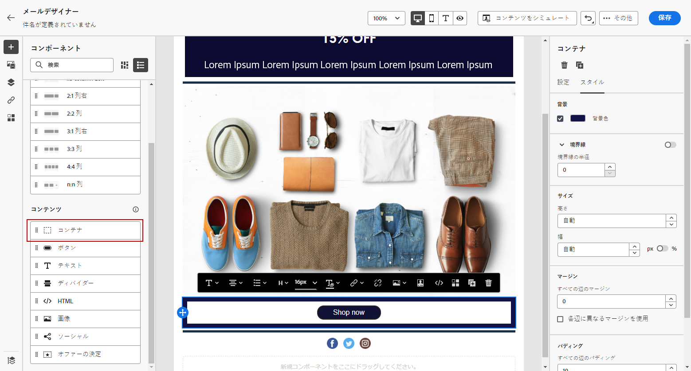

# E メールデザイナーのコンテンツコンポーネントの使用 {#content-components}

>[!CONTEXTUALHELP]
>id="ac_content_components_email"
>title="コンテンツコンポーネントについて"
>abstract="コンテンツコンポーネントは、メールのレイアウト作成に使用できる空のコンテンツプレースホルダーです。"

>[!CONTEXTUALHELP]
>id="ac_content_components_landing_page"
>title="コンテンツコンポーネントについて"
>abstract="コンテンツコンポーネントは、ランディングページのレイアウトの作成に使用できる空のコンテンツプレースホルダーです。"

>[!CONTEXTUALHELP]
>id="ac_content_components_fragment"
>title="コンテンツコンポーネントについて"
>abstract="コンテンツコンポーネントは、フラグメントのレイアウトの作成に使用できる空のコンテンツプレースホルダーです。"

>[!CONTEXTUALHELP]
>id="ac_content_components_template"
>title="コンテンツコンポーネントについて"
>abstract="コンテンツコンポーネントは、テンプレートのレイアウトの作成に使用できる空のコンテンツプレースホルダーです。"

E メールコンテンツを作成する場合、 **[!UICONTROL コンテンツコンポーネント]** を使用すると、生のコンポーネントを使用して e メールをさらにパーソナライズでき、e メールに配置した後に編集できます。

コンテンツコンポーネントは、必要な数だけ 1 つ以上の構造コンポーネント内に追加できます。このコンポーネントは、E メールのレイアウトを定義します。

## コンテンツコンポーネントの追加 {#add-content-components}

コンテンツコンポーネントを E メールに追加し、必要に応じて調整するには、次の手順に従います。

1. E メールデザイナーで、既存のコンテンツを使用するか、ドラッグ&amp;ドロップします **[!UICONTROL 構造コンポーネント]** を空のコンテンツに追加して、e メールのレイアウトを定義します。 [方法についてはこちらを参照](content-from-scratch.md)

1. 次の手順で **[!UICONTROL コンテンツコンポーネント]** 「 」セクションで、「 E メールデザイナー」の左ペインから対応するボタンを選択します。

   

1. 目的のコンテンツコンポーネントを、関連する構造コンポーネント内にドラッグ&amp;ドロップします。

   

   >[!NOTE]
   >
   >1 つの構造コンポーネントに、また構造コンポーネントの各列に、複数のコンポーネントを追加できます。

1. を使用して、各コンポーネントのスタイル属性を調整します。 **[!UICONTROL コンポーネント設定]** 右側のパネル 例えば、各コンポーネントのテキストスタイル、パディングまたはマージンを変更できます。 [整列とパディングの詳細を表示](alignment-and-padding.md)

   

## コンテナ {#container}

シンプルなコンテナを追加し、その中に別のコンテンツコンポーネントを追加できます。 これにより、コンテナに特定のスタイルを適用できます（内部で使用されるコンポーネントとは異なります）。

例えば、 **[!UICONTROL コンテナ]** コンポーネントを追加してから、 [ボタン](#button) コンポーネントをそのコンテナ内に配置します。 コンテナには特定の背景を使用できますが、ボタンには別の背景を使用できます。

## ボタン {#button}

以下を使用： **[!UICONTROL ボタン]** 1 つまたは複数のボタンを e メールに挿入し、e メールのオーディエンスを別のページにリダイレクトするためのコンポーネント。

1. 送信者 **[!UICONTROL コンテンツコンポーネント]**、ドラッグ&amp;ドロップ **[!UICONTROL ボタン]** コンポーネントを **[!UICONTROL 構造コンポーネント]**.

1. 新しく追加したボタンをクリックして、テキストをパーソナライズし、 **[!UICONTROL コンポーネント設定]** （「E メールデザイナー」の右側のウィンドウ）

   

1. 内 **[!UICONTROL リンク]** 「 」フィールドで、「 」ボタンをクリックしたときにリダイレクト先の URL を追加します。

1. でのオーディエンスのリダイレクト方法を選択 **[!UICONTROL ターゲット]** ドロップダウンリスト：

   * **[!UICONTROL なし]**：クリックしたフレームと同じフレームでリンクを開きます（デフォルト）。
   * **[!UICONTROL 空白]**：リンクを新しいウィンドウまたは新しいタブで開きます。
   * **[!UICONTROL セルフ]**：クリックしたフレームと同じフレームでリンクを開きます。
   * **[!UICONTROL 親]**：親フレームでリンクを開きます。
   * **[!UICONTROL トップ]**：ウィンドウ全体でリンクを開きます。

   

1. 次のようなスタイル属性を変更することで、ボタンをさらにパーソナライズできます。 **[!UICONTROL 境界線]**, **[!UICONTROL サイズ]**, **[!UICONTROL 余白]**&#x200B;など から **[!UICONTROL コンポーネント設定]** ウィンドウ

## テキスト {#text}

以下を使用： **[!UICONTROL テキスト]** 電子メールにテキストを挿入し、スタイル（境界線、サイズ、パディングなど）を調整するコンポーネント の使用 **[!UICONTROL コンポーネント設定]** ウィンドウ

1. 送信者 **[!UICONTROL コンテンツコンポーネント]**、ドラッグ&amp;ドロップ **[!UICONTROL テキスト]** コンポーネントを **[!UICONTROL 構造コンポーネント]**.

1. 新しく追加したコンポーネントをクリックして、テキストをパーソナライズし、 **[!UICONTROL コンポーネント設定]** （E メールデザイナーの右側のウィンドウ）

1. ツールバーで次のオプションを使用して、テキストを変更します。

   

   * **[!UICONTROL テキストスタイルの変更]**：テキストに太字、斜体、下線、取り消し線を適用します。
   * **配置の変更**：テキストの行揃えを左揃え、右揃え、中央揃えまたは両端揃えから選択します。
   * **[!UICONTROL リストの作成]**：テキストに箇条書きまたは番号リストを追加します。
   * **[!UICONTROL 見出しの設定]**：テキストに最大 6 つのレベルの見出しを追加します。
   * **フォントサイズ**：テキストのフォントサイズをピクセル単位で選択します。
   * **[!UICONTROL 画像の編集]**：テキストコンポーネントに画像またはアセットを追加します。[アセット管理の詳細](assets-essentials.md)
   * **[!UICONTROL ソースコードの表示]**：テキストのソースコードを表示します。変更はできません。
   * **[!UICONTROL 複製]**：テキストコンポーネントのコピーを追加します。
   * **[!UICONTROL 削除]**：選択したテキストコンポーネントをメールから削除します。
   * **[!UICONTROL パーソナライズの追加]**：パーソナライゼーションフィールドを追加し、プロファイルデータを使用してコンテンツをカスタマイズできます。[コンテンツのパーソナライゼーションの詳細](../personalization/personalize.md)
   * **[!UICONTROL 条件付きコンテンツを有効にする]**：条件付きコンテンツを追加して、コンポーネントのコンテンツをターゲットプロファイルに適応させます。[動的コンテンツの詳細を説明します](../personalization/get-started-dynamic-content.md)

1. その他のスタイル属性（テキストの色、フォントファミリ、境界線、パディング、余白など）を調整します。 から **[!UICONTROL コンポーネント設定]** ウィンドウ

## ディバイダー {#divider}

**[!UICONTROL ディバイダー]**コンポーネントを使用すると、分割線を挿入してメールのレイアウトと内容を整理できます。

線の色、スタイル、高さなどのスタイル属性は、 **[!UICONTROL コンポーネント設定]** ウィンドウ

## HTML {#HTML}

以下を使用： **[!UICONTROL HTML]** コンポーネントを使用して、既存のHTMLの異なる部分をコピー&amp;ペーストします。 これにより、無料のモジュラーHTMLコンポーネントを作成して、一部の外部コンテンツを再利用できます。

1. 送信者 **[!UICONTROL コンテンツコンポーネント]**、ドラッグ&amp;ドロップ **[!UICONTROL HTML]** コンポーネントを **[!UICONTROL 構造コンポーネント]**.

1. 新しく追加されたコンポーネントをクリックし、「 」を選択します。 **[!UICONTROL ソースコードを表示]** コンテキストツールバーからHTMLを追加します。

   

1. 追加する HTML コードをメールにコピー＆ペーストし、「**[!UICONTROL 保存]**」をクリックします。

   

>[!NOTE]
>
>外部のコンテンツを簡単に E メールデザイナーに準拠させるには、一からメッセージを作成し、既存のメールのコンテンツをコンポーネントにコピーすることをお勧めします。

## 画像 {#image}

以下を使用： **[!UICONTROL 画像]** コンポーネントを使用して、コンピューターから電子メールコンテンツに画像ファイルを挿入します。

1. 送信者 **[!UICONTROL コンテンツコンポーネント]**、ドラッグ&amp;ドロップ **[!UICONTROL 画像]** コンポーネントを **[!UICONTROL 構造コンポーネント]**.

1. 「**[!UICONTROL 参照]**」をクリックして、アセットから画像ファイルを選択します。

   [!DNL Assets Essentials] について詳しくは、[Adobe Experience Manager Assets Essentials のドキュメント](https://experienceleague.adobe.com/docs/experience-manager-assets-essentials/help/introduction.html?lang=ja){target=&quot;_blank&quot;}を参照してください。

1. 新しく追加したコンポーネントをクリックし、 **[!UICONTROL コンポーネント設定]** ペイン：

   * **[!UICONTROL 画像タイトル]** 画像のタイトルを定義できます。
   * **[!UICONTROL 代替テキスト]**&#x200B;を使用すると、画像にリンクするキャプションを定義できます。これは alt HTML 属性に対応します。

   

1. 余白、境界線など、他のスタイル属性を調整します。 または、 **[!UICONTROL コンポーネント設定]** ウィンドウ

## ビデオ {#Video}

>[!CONTEXTUALHELP]
>id="ac_edition_video_email"
>title="ビデオ設定"
>abstract="このコンポーネントを使用すると、メールにビデオを挿入できます。ビデオが機能しないメールクライアントもあります。フォールバック画像を設定することをお勧めします。"

>[!CONTEXTUALHELP]
>id="ac_edition_video_landing_page"
>title="ビデオ設定"
>abstract="このコンポーネントを使用すると、ランディングページにビデオを挿入できます。なお、ビデオは必ずしもすべてのメッセージクライアントで機能するわけではありません。フォールバック画像を設定することをお勧めします。"

>[!CONTEXTUALHELP]
>id="ac_edition_video_fragment"
>title="ビデオ設定"
>abstract="このコンポーネントを使用すると、フラグメントにビデオを挿入できます。なお、ビデオは必ずしもすべてのメッセージクライアントで機能するわけではありません。フォールバック画像を設定することをお勧めします。"

>[!CONTEXTUALHELP]
>id="ac_edition_video_template"
>title="ビデオ設定"
>abstract="このコンポーネントを使用すると、テンプレートにビデオを挿入できます。なお、ビデオは必ずしもすべてのメッセージクライアントで機能するわけではありません。フォールバック画像を設定することをお勧めします。"

以下を使用： **[!UICONTROL ビデオ]** URL リンクを使用して e メールコンテンツにビデオを挿入するコンポーネントです。

1. 送信者 **[!UICONTROL コンテンツコンポーネント]**、ドラッグ&amp;ドロップ **[!UICONTROL ビデオ]** コンポーネントを **[!UICONTROL 構造コンポーネント]**.

   

1. 新しく追加したコンポーネントをクリックします。

1. 内 **[!UICONTROL ビデオリンク]** フィールド **[!UICONTROL コンポーネント設定]** パネルにビデオの URL を追加します。

   

1. 次の項目を追加できます： **[!UICONTROL ポスター画像]** をビデオに追加して、オーディエンスが再生ボタンをクリックするまで表示する画像を指定します。

1. スタイル、余白、境界線など、他のスタイル属性を調整します。 から **[!UICONTROL コンポーネント設定]** ウィンドウ

## ソーシャル {#social}

以下を使用： **[!UICONTROL Social]** ソーシャルメディアページへのリンクを電子メールコンテンツに挿入するコンポーネントです。

1. 送信者 **[!UICONTROL コンテンツコンポーネント]**、ドラッグ&amp;ドロップ **[!UICONTROL Social]** コンポーネントを **[!UICONTROL 構造コンポーネント]**.

1. 新しく追加したコンポーネントをクリックします。

1. 内 **[!UICONTROL Social]** フィールド **[!UICONTROL コンポーネント設定]** ウィンドウで、追加または削除するソーシャルメディアを選択します。

   

1. 専用フィールドでアイコンのサイズを選択します。

1. 各ソーシャルメディアアイコンをクリックして、 **[!UICONTROL URL]** オーディエンスのリダイレクト先となるもの。

   

1. 必要に応じて、「**[!UICONTROL 画像]**」フィールドで各ソーシャルメディアのアイコンを変更することもできます。

1. スタイル、余白、境界線など、他のスタイル属性を調整します。 から **[!UICONTROL コンポーネント設定]** ウィンドウ

## オファーの決定 {#offer-decision}

以下を使用： **[!UICONTROL オファーの決定]** メッセージにオファーを挿入するコンポーネント この [決定管理](../offers/get-started/starting-offer-decisioning.md) エンジンは、顧客に提供する最適なオファーを選択します。

パーソナライズされたオファーを [この節](add-offers-email.md).

