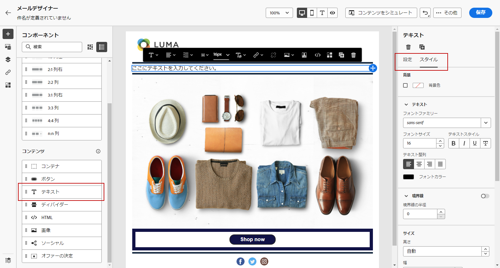
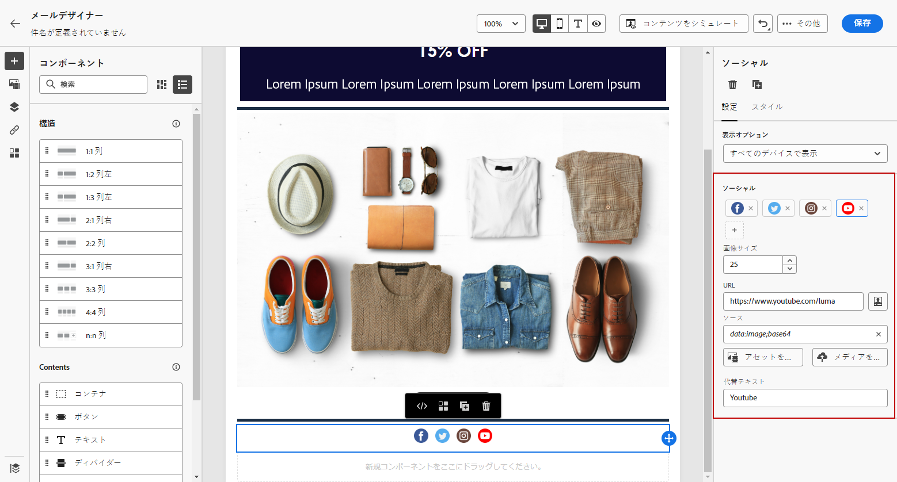

# 電子メールデザイナーのコンテンツコンポーネントの使用 {#content-components}

>[!CONTEXTUALHELP]
>id="ac_content_components_email"
>title="コンテンツのコンポーネントについて"
>abstract="コンテンツコンポーネントは、電子メールのレイアウトを作成するために使用できる空のコンテンツプレースホルダーです。"

>[!CONTEXTUALHELP]
>id="ac_content_components_landing_page"
>title="コンテンツのコンポーネントについて"
>abstract="コンテンツコンポーネントは、ランディングページのレイアウトを作成するために使用できる空のコンテンツプレースホルダーです。"

>[!CONTEXTUALHELP]
>id="ac_content_components_fragment"
>title="コンテンツのコンポーネントについて"
>abstract="コンテンツコンポーネントは、フラグメントのレイアウトを作成するために使用できる空のコンテンツプレースホルダーです。"

>[!CONTEXTUALHELP]
>id="ac_content_components_template"
>title="コンテンツのコンポーネントについて"
>abstract="コンテンツコンポーネントは、テンプレートのレイアウトを作成するために使用できる空のコンテンツプレースホルダーです。"

電子メールのコンテンツを作成するときに、では、電子メールを電子メールで送信したときに、 **[!UICONTROL Content components]** 編集可能な未処理のコンポーネントを使用して電子メールをさらにカスタマイズできるようになっています。

コンテンツコンポーネントは、電子メールのレイアウトを定義する1つまたは複数の構造構成部品内に、必要な数だけ追加できます。

## コンテンツコンポーネントの追加 {#add-content-components}

電子メールにコンテンツコンポーネントを追加して、必要に応じて調整するには、次の手順を実行します。

1. 電子メールデザイナーで、既存のコンテンツを使用するか、空のコンテンツにドラッグ &amp; ドロップ **[!UICONTROL Structure components]** して、電子メールのレイアウトを定義します。 [方法について説明します。](content-from-scratch.md)

1. セクションに **[!UICONTROL Content components]** アクセスするには、電子メールデザイナーの左側のペインで、対応するボタンを選択します。

   

1. 適切な構造コンポーネント内の任意のコンテンツコンポーネントをドラッグ &amp; ドロップします。

   

   >[!NOTE]
   >
   >1つの構造体コンポーネントに複数のコンポーネントを追加することも、structure コンポーネントの各列に追加することもできます。

1. 右側のペインを使用して **[!UICONTROL Component settings]** 、各コンポーネントのスタイル属性を調整します。 例えば、各コンポーネントのテキストのスタイル、余白、余白を変更することができます。 [配置と余白について詳しくは、](alignment-and-padding.md)

   

## コンテナ {#container}

その中に単純なコンテナを追加すると、その中に別のコンテンツコンポーネントを追加することができます。 これにより、コンテナーに特定のスタイルを適用することができます。これは、コンテナ内で使用されるコンポーネントとは異なります。

例えば、コンポーネントを **[!UICONTROL Container]** 追加してから、そのコンテナ内に Button ](#button) コンポーネントを [ 追加することができます。コンテナには、特定の背景とボタンの背景を使用できます。

## タン {#button}

**[!UICONTROL Button]**&#x200B;コンポーネントを使用して、1つまたは複数のボタンを電子メールに挿入し、電子メールの利用者を別のページにリダイレクトします。

1. から **[!UICONTROL Content components]** に、コンポーネント **[!UICONTROL Structure component]** をドラッグ &amp; ドロップ **[!UICONTROL Button]** します。

1. 新しく追加したボタンをクリックして、テキストを個人用に設定します。また、 **[!UICONTROL Components settings]** 電子メールデザイナーの右側のペインでにアクセスできます。

   

1. **[!UICONTROL Link]**&#x200B;ボタンをクリックすると、リダイレクト先の URL がフィールドに追加されます。

1. ドロップダウンリストを使用して参加者をどのように **[!UICONTROL Target]** リダイレクトするかを選択します。

   * **[!UICONTROL None]**: クリックしたのと同じフレーム内でリンクを開きます (初期設定)。
   * **[!UICONTROL Blank]**: 新しいウィンドウまたはタブにリンクを表示します。
   * **[!UICONTROL Self]**: クリックしたのと同じフレーム内でリンクを開きます。
   * **[!UICONTROL Parent]**: 親フレーム内のリンクを開きます。
   * **[!UICONTROL Top]**: ウィンドウの本文全体にリンクを表示します。

   

1. 、、などのスタイル属性 **[!UICONTROL Border]** **[!UICONTROL Size]** **[!UICONTROL Margin]** を変更することによって、ボタンをカスタマイズすることができます。 が **[!UICONTROL Component settings]** 表示されます。

## 折り返す {#text}

**[!UICONTROL Text]**&#x200B;コンポーネントを使用して、テキストを電子メールに挿入します。また、スタイル (境界線、サイズ、余白など) を調整することができます。**[!UICONTROL Component settings]**&#x200B;ウィンドウを使用します。

1. から **[!UICONTROL Content components]** に、コンポーネント **[!UICONTROL Structure component]** をドラッグ &amp; ドロップ **[!UICONTROL Text]** します。

1. 新しく追加したコンポーネントをクリックして、テキストを個人用に設定したり、 **[!UICONTROL Components Settings]** 電子メールデザイナーの右側のペインにあるにアクセスしたりすることができます。

1. ツールバーで使用できる次のオプションを使用して、テキストを変更します。

   

   * **[!UICONTROL Change text style]**: ボールド、イタリック、アンダーライン、または打ち消し線がテキストに適用されます。
   * **整列** の変更: テキストの左、右、中央、または揃えのどちらかを選択します。
   * **[!UICONTROL Create list]**: テキストにブレットリストまたはナンバーリストを追加します。
   * **[!UICONTROL Set heading]**: テキストに最大6つの見出しレベルを追加します。
   * **「フォントサイズ** 」: テキストのフォントサイズをピクセル単位で指定します。
   * **[!UICONTROL Edit image]**: テキストコンポーネントにイメージまたはアセットを追加します。 [アセットの管理について詳しくは、](assets-essentials.md)
   * **[!UICONTROL Show the source code]**: テキストのソースコードを表示します。 これを変更することはできません。
   * **[!UICONTROL Duplicate]**: テキストコンポーネントのコピーを追加します。
   * **[!UICONTROL Delete]**: 選択したテキストコンポーネントを電子メールから削除します。
   * **[!UICONTROL Add personalization]**: プロフィールデータのコンテンツをカスタマイズするには、「パーソナライズ」フィールドを追加します。 [コンテンツの個人用設定について詳しくは、](../personalization/personalize.md)
   * **[!UICONTROL Enable conditional content]**: コンポーネントのコンテンツを対象のプロファイルに適合させるための条件付きコンテンツを追加します。 [動的コンテンツについて詳しくは、](../personalization/get-started-dynamic-content.md)

1. テキストカラー、フォントファミリー、境界線、余白、マージンなど、その他のスタイル属性を調整します。 が **[!UICONTROL Component settings]** 表示されます。

## 境界 {#divider}

**[!UICONTROL Divider]**&#x200B;コンポーネントを使用して、区切り線を挿入し、電子メールのレイアウトと内容を整理します。

線のカラー、スタイル、高さなどのスタイル属性は、 **[!UICONTROL Component settings]** ペインから調節できます。

## .HTML {#HTML}

**[!UICONTROL HTML]**&#x200B;コンポーネントを使用して、既存の HTML の様々な部分をコピー &amp; ペーストします。これにより、無料のモジュラー HTML コンポーネントを作成して、いくつかの外部コンテンツを再利用できます。

1. から **[!UICONTROL Content Components]** に、コンポーネント **[!UICONTROL Structure component]** をドラッグ &amp; ドロップ **[!UICONTROL HTML]** します。

1. 新しく追加したコンポーネントをクリックし、次に、状況に応じたツールバーからを選択 **[!UICONTROL Show the source code]** して、HTML を追加します。

   

1. コピー &amp; e メールに追加する HTML コードをペーストして、をクリック **[!UICONTROL Save]** します。

   

>[!NOTE]
>
>電子メールデザイナーに適合した外部コンテンツを作成するには、メッセージを一から作成し、既存の電子メールのコンテンツをコンポーネントにコピーすることをお勧めします。

## 絵 {#image}

**[!UICONTROL Image]**&#x200B;コンポーネントを使用して、コンピューターから電子メールコンテンツにイメージファイルを挿入します。

1. から **[!UICONTROL Content components]** に、コンポーネント **[!UICONTROL Structure component]** をドラッグ &amp; ドロップ **[!UICONTROL Image]** します。

1. アセットからイメージファイルを選択するには、これをクリック **[!UICONTROL Browse]** します。

   詳細 [!DNL Assets Essentials] については、Adobe Experience Manager アセット Essentials マニュアル ](https://experienceleague.adobe.com/docs/experience-manager-assets-essentials/help/introduction.html) {target = &quot;_blank&quot;} を [ 参照してください。

1. 新しく追加したコンポーネントをクリックし、次の **[!UICONTROL Components settings]** ウィンドウを使用してイメージのプロパティを設定します。

   * **[!UICONTROL Image title]** イメージにタイトルを定義できます。
   * **[!UICONTROL Alt text]** イメージにリンクされたキャプションを定義できます。 これは、代替 HTML 属性に対応しています。

   

1. マージン、境界線など、その他のスタイル属性を調整します。 または、リンクを追加すると、ペインから **[!UICONTROL Component settings]** 他のコンテンツに参加者がリダイレクトされます。

## S-video {#Video}

>[!CONTEXTUALHELP]
>id="ac_edition_video_email"
>title="ビデオ設定"
>abstract="このコンポーネントを使用して、電子メールにビデオを挿入します。 ビデオはすべての電子メールクライアントで動作するとは限りません。 フォールバックイメージを設定することをお勧めします。"

>[!CONTEXTUALHELP]
>id="ac_edition_video_landing_page"
>title="ビデオ設定"
>abstract="このコンポーネントを使用して、ランディングページにビデオを挿入します。 ビデオはすべてのメッセージクライアントで動作するわけではありません。 フォールバックイメージを設定することをお勧めします。"

>[!CONTEXTUALHELP]
>id="ac_edition_video_fragment"
>title="ビデオ設定"
>abstract="このコンポーネントを使用して、フラグメントにビデオを挿入します。 ビデオはすべてのメッセージクライアントで動作するわけではありません。 フォールバックイメージを設定することをお勧めします。"

>[!CONTEXTUALHELP]
>id="ac_edition_video_template"
>title="ビデオ設定"
>abstract="このコンポーネントを使用して、テンプレートにビデオを挿入します。 ビデオはすべてのメッセージクライアントで動作するわけではありません。 フォールバックイメージを設定することをお勧めします。"

URL リンクを使用して電子メールコンテンツにビデオを挿入するには、 **[!UICONTROL Video]** コンポーネントを使用します。

1. 「」から **[!UICONTROL Content Components]** 、「compnent」を a **[!UICONTROL Structure component]** にドラッグ &amp; ドロップ **[!UICONTROL Video]** します。

   

1. 新しく追加したコンポーネントをクリックします。

1. **[!UICONTROL Video link]**&#x200B;ペインの **[!UICONTROL Components settings]** フィールドに、ビデオの URL を追加します。

   

1. をビデオに追加して、 **[!UICONTROL Poster image]** 視聴者が再生ボタンをクリックするまで表示されるイメージを指定することができます。

1. スタイル、マージン、ボーダーなど、その他のスタイル属性を調整します。 が **[!UICONTROL Component settings]** 表示されます。

## 社会 {#social}

**[!UICONTROL Social]**&#x200B;コンポーネントを使用して、ソーシャルメディアページへのリンクを電子メールコンテンツに挿入します。

1. から **[!UICONTROL Content Components]** に、コンポーネント **[!UICONTROL Structure component]** をドラッグ &amp; ドロップ **[!UICONTROL Social]** します。

1. 新しく追加したコンポーネントをクリックします。

1. **[!UICONTROL Social]**&#x200B;ペインの **[!UICONTROL Components settings]** フィールドで、追加または削除するソーシャルメディアを選択します。

   

1. 専用フィールドでアイコンのサイズを選択します。

1. 各ソーシャルメディアアイコンをクリックして、 **[!UICONTROL URL]** 出席者がリダイレクトされるように設定します。

   

1. また、必要に応じ **[!UICONTROL Image]** て、各ソーシャルメディアのアイコンを変更することもできます。

1. スタイル、マージン、ボーダーなど、その他のスタイル属性を調整します。 が **[!UICONTROL Component settings]** 表示されます。

## 特典の決定 {#offer-decision}

**[!UICONTROL Offer decision]**&#x200B;コンポーネントを使用して、メッセージにオファーを挿入します。[意思決定管理 ](../offers/get-started/starting-offer-decisioning.md) エンジンは、お客様に提供するために最適なオファーを選択します。

この節 ](add-offers-email.md) で [ は、パーソナライズされたサービスを電子メールに追加する方法について説明します。

