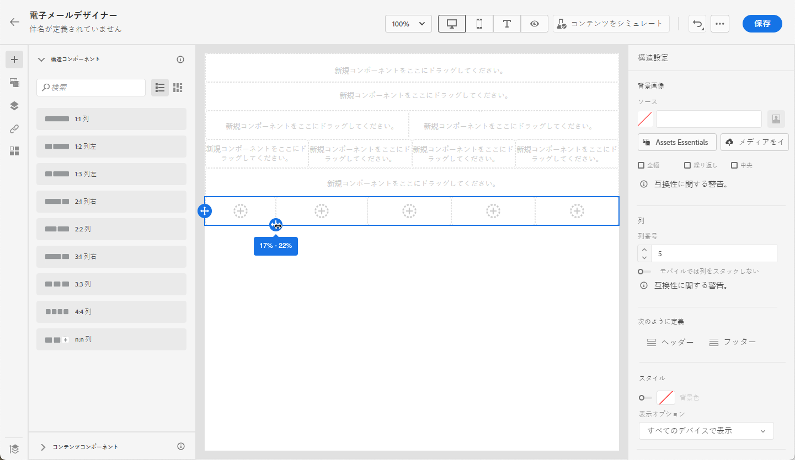
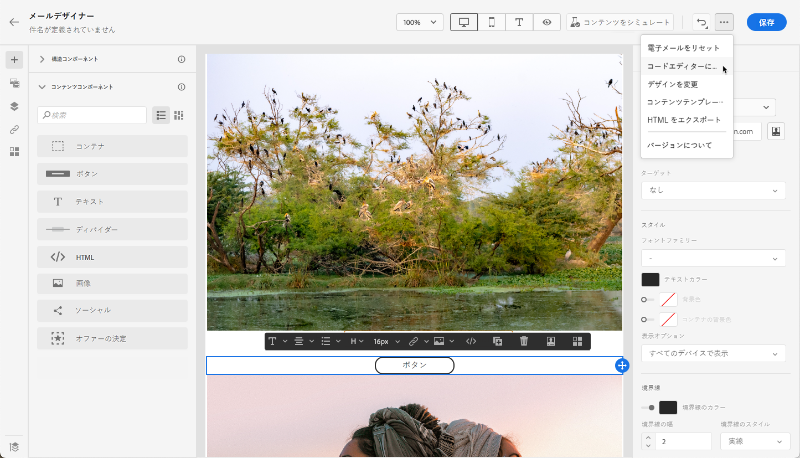

# ゼロから開始 {#content-from-scratch}

>[!CONTEXTUALHELP]
>id="ac_structure_components_email"
>title="構造コンポーネントについて"
>abstract="構造コンポーネントはメールのレイアウトを定義します。"

>[!CONTEXTUALHELP]
>id="ac_structure_components_landing_page"
>title="構造コンポーネントについて"
>abstract="構造コンポーネントはランディングページのレイアウトを定義します。"

>[!CONTEXTUALHELP]
>id="ac_structure_components_fragment"
>title="構造コンポーネントについて"
>abstract="構造コンポーネントはフラグメントのレイアウトを定義します。"

>[!CONTEXTUALHELP]
>id="ac_structure_components_template"
>title="構造コンポーネントについて"
>abstract="構造コンポーネントはテンプレートのレイアウトを定義します。"

>[!CONTEXTUALHELP]
>id="ac_edition_columns_email"
>title="メール列の定義"
>abstract="E メールデザイナーを使用すると、列構造を定義することで、メールのレイアウトを簡単に定義できます。"

>[!CONTEXTUALHELP]
>id="ac_edition_columns_landing_page"
>title="ランディングページ列の定義"
>abstract="電子メールデザイナーを使用すると、列構造を定義することで、ランディングページのレイアウトを簡単に定義できます。"

>[!CONTEXTUALHELP]
>id="ac_edition_columns_fragment"
>title="フラグメント列の定義"
>abstract="電子メールデザイナーを使用すると、列構造を定義することで、フラグメントのレイアウトを簡単に定義できます。"

>[!CONTEXTUALHELP]
>id="ac_edition_columns_template"
>title="テンプレート列の定義"
>abstract="電子メールデザイナーを使用すると、列構造を定義することで、テンプレートのレイアウトを簡単に定義できます。"

E メールデザイナーを使用すると、メールの構造を簡単に定義できます。単純なドラッグ＆ドロップ操作で構造要素を追加したり移動したりして、メールの形を数秒でデザインすることができます。

メールコンテンツの作成を開始するには、次の手順に従います。

1. 電子メールデザイナーのホームページで、「**[!UICONTROL ゼロからデザイン]**」オプションを選択します。

   

1. **[!UICONTROL 構造コンポーネント]**&#x200B;をキャンバスにドラッグ＆ドロップしてメールコンテンツのデザインを開始し、メールのレイアウトを定義します。

   >[!NOTE]
   >
   >列の積み重ねは、すべてのメールプログラムと互換性があるわけではありません。サポートされていない場合、列は積み重ねられません。

   <!--Once placed in the email, you cannot move nor remove your components unless there is already a content component or a fragment placed inside. This is not true in AJO - TBC?-->

1. 必要に応じて&#x200B;**[!UICONTROL 構造コンポーネント]**&#x200B;を追加し、右側の専用ペインで設定を編集します。

   

   「**[!UICONTROL n:n 列]**」コンポーネントを選択して、列数（3～10）を任意に定義します。各列の下部にある矢印を動かして、各列の幅を定義することもできます。

   

   >[!NOTE]
   >
   >各列のサイズを構造コンポーネントの全幅の 10％未満にすることはできません。空でない列は削除できません。

1. **[!UICONTROL コンテンツコンポーネント]**&#x200B;セクションを展開し、必要な数の要素を 1 つ以上の構造コンポーネントに追加します。[詳しくは、コンテンツコンポーネントを参照してください](content-components.md)

1. 各コンポーネントは、**[!UICONTROL コンポーネント設定]**&#x200B;の右側のペインを使用すると、さらにカスタマイズできます。例えば、コンポーネントのテキストスタイル、パディングまたは余白を変更できます。[詳しくは、整列とパディングを参照してください](alignment-and-padding.md)

   

1. **[!UICONTROL アセットピッカー]**&#x200B;から、**[!UICONTROL Assets ライブラリ]**&#x200B;に保存されたアセットを直接選択できます。[詳しくは、アセット管理を参照してください](assets-essentials.md)

   アセットを含むフォルダーをダブルクリックします。それらを構造コンポーネントにドラッグ＆ドロップします。

   

1. パーソナライゼーションフィールドを挿入して、プロファイルデータからメールコンテンツをカスタマイズします。[詳しくは、コンテンツのパーソナライゼーションを参照してください](../personalization/personalize.md)

   

1. 動的コンテンツを追加して、条件付きルールに基づいてコンテンツをターゲットプロファイルに適応させます。[動的コンテンツの基本を学ぶ](../personalization/get-started-dynamic-content.md)

   

1. 左側のペインから「**[!UICONTROL リンク]**」タブをクリックし、トラッキングするコンテンツのすべての URL を表示します。必要に応じて、**[!UICONTROL トラッキングタイプ]**、**[!UICONTROL ラベル]**&#x200B;を変更して、**[!UICONTROL タグ]**&#x200B;を追加できます。[詳しくは、リンクとメッセージトラッキングを参照してください](message-tracking.md)

   

1. 必要に応じて、詳細メニューの「**[!UICONTROL コードエディターに切り替え]**」をクリックしてコードエディターに切り替え、メールをさらにパーソナライズできます。[詳しくは、コードエディターを参照してください](code-content.md)

   

   >[!CAUTION]
   >
   >コードエディターに切り替えた後で、このメールのビジュアルデザイナーは戻すことはできません。

1. コンテンツの準備が整ったら、「**[!UICONTROL コンテンツをシミュレート]**」をクリックして、メールのレンダリングを確認します。デスクトップまたはモバイル表示を選択できます。[詳しくは、メールのプレビューを参照してください](preview.md)

   

1. メールの準備が整ったら、「**[!UICONTROL 保存]**」をクリックします。

