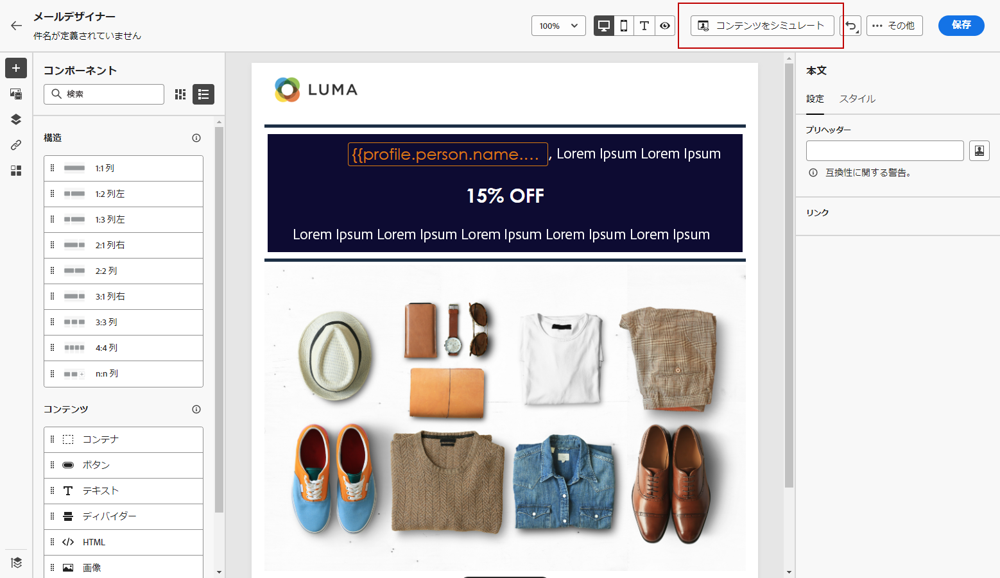

# 最初から作成 {#content-from-scratch}

>[!CONTEXTUALHELP]
>id="ac_structure_components_email"
>title="Structure コンポーネントについて"
>abstract="Structure コンポーネントは、電子メールのレイアウトを定義します。"

>[!CONTEXTUALHELP]
>id="ac_structure_components_landing_page"
>title="Structure コンポーネントについて"
>abstract="Structure コンポーネントは、ランディングページのレイアウトを定義します。"

>[!CONTEXTUALHELP]
>id="ac_structure_components_fragment"
>title="Structure コンポーネントについて"
>abstract="Structure コンポーネントでは、フラグメントのレイアウトを定義します。"

>[!CONTEXTUALHELP]
>id="ac_structure_components_template"
>title="Structure コンポーネントについて"
>abstract="Structure コンポーネントは、テンプレートのレイアウトを定義します。"

>[!CONTEXTUALHELP]
>id="ac_edition_columns_email"
>title="電子メール列の定義"
>abstract="電子メールデザイナーを使用すると、列の構造を定義することによって、電子メールのレイアウトを簡単に定義できます。"

>[!CONTEXTUALHELP]
>id="ac_edition_columns_landing_page"
>title="ランディングページの列の定義"
>abstract="電子メールデザイナーを使用すると、列の構造を定義することによって、ランディングページのレイアウトを簡単に定義できます。"

>[!CONTEXTUALHELP]
>id="ac_edition_columns_fragment"
>title="フラグメント列の定義"
>abstract="電子メールデザイナーを使用すると、列の構造を定義することによって、フラグメントのレイアウトを簡単に定義できます。"

>[!CONTEXTUALHELP]
>id="ac_edition_columns_template"
>title="テンプレート列の定義"
>abstract="電子メールデザイナーを使用すると、列の構造を定義することによって、テンプレートのレイアウトを簡単に定義できます。"

電子メールデザイナーを使用すると、電子メールの構造を簡単に定義できます。 単純なドラッグ &amp; ドロップ操作で構造化エレメントを追加および移動することによって、電子メールのシェイプを数秒のうちに作成することができます。

電子メールコンテンツの作成を開始するには、次の手順に従います。

1. 電子メールデザイナーのホームページからオプションを選択 **[!UICONTROL Design from scratch]** します。

   

1. 電子メールコンテンツのデザインを開始するには、canvas にドラッグ &amp; ドロップ **[!UICONTROL Structure components]** して、電子メールのレイアウトを定義します。

   >[!NOTE]
   >
   >スタック列は、すべての電子メールプログラムと互換性がありません。 サポートされていない場合は、列はスタックされません。

   <!--Once placed in the email, you cannot move nor remove your components unless there is already a content component or a fragment placed inside. This is not true in AJO - TBC?-->

1. 必要な数だけ **[!UICONTROL Structure components]** 追加し、右側にある専用のペインでその設定を編集します。

   

   **[!UICONTROL n:n column]**&#x200B;コンポーネントを選択して、選択した列の数 (3 ~ 10) を指定します。各列の下部にある矢印を移動して、各列の幅を定義することもできます。

   

   >[!NOTE]
   >
   >各列のサイズは、structure コンポーネントの全体幅の10% 未満ではありません。 空白ではない列を削除することはできません。

1. セクションを展開して、1つ以上の構造コンポーネントに必要な数の **[!UICONTROL Content components]** エレメントを追加します。 [コンテンツコンポーネントについて詳しくは、](content-components.md)

1. 右側のペインを使用して、 **[!UICONTROL Component settings]** 各コンポーネントをさらにカスタマイズできます。 例えば、各コンポーネントのテキストのスタイル、余白、余白を変更することができます。 [配置と余白について詳しくは、](alignment-and-padding.md)

   

1. **[!UICONTROL Asset picker]**&#x200B;を使用して、に保存されて **[!UICONTROL Assets library]** いるアセットを直接選択することができます。[アセットの管理について詳しくは、](assets-essentials.md)

   アセットが含まれているフォルダーをダブルクリックします。 ストラクチャーコンポーネントにドラッグ &amp; ドロップします。

   

1. プロファイルデータを使用して電子メールのコンテンツをカスタマイズするには、個人用設定フィールドを挿入します。 [コンテンツの個人用設定について詳しくは、](../personalization/personalize.md)

   

1. 動的コンテンツを追加することで、条件付きルールに基づいて、コンテンツを対象のプロファイルに適合させることができます。 [動的コンテンツについて学習します。](../personalization/get-started-dynamic-content.md)

   

1. **[!UICONTROL Links]**&#x200B;左側のペインでタブをクリックすると、トラックされるコンテンツのすべての url が表示されます。必要に応じて、または **[!UICONTROL Label]** を **[!UICONTROL Tags]** 変更 **[!UICONTROL Tracking Type]** することができます。[リンクとメッセージ追跡について詳しくは、ここを参照してください。](message-tracking.md)

   

1. 必要に応じて、「詳細設定」メニューからクリック **[!UICONTROL Switch to code editor]** して電子メールをカスタマイズすることもできます。 [コードエディターについて詳しくは、](code-content.md)

   

   >[!CAUTION]
   >
   >コードエディターに切り替えた後で、この電子メールのビジュアルデザイナーに戻すことはできません。

1. コンテンツの準備ができたら、をクリックし **[!UICONTROL Simulate content]** て、電子メールのレンダリングをオンにします。 デスクトップビューまたはモバイルビューを選択できます。 [電子メールのプレビューについて詳しくは、](preview.md)

   

1. 電子メールの準備ができたら、をクリック **[!UICONTROL Save]** します。

