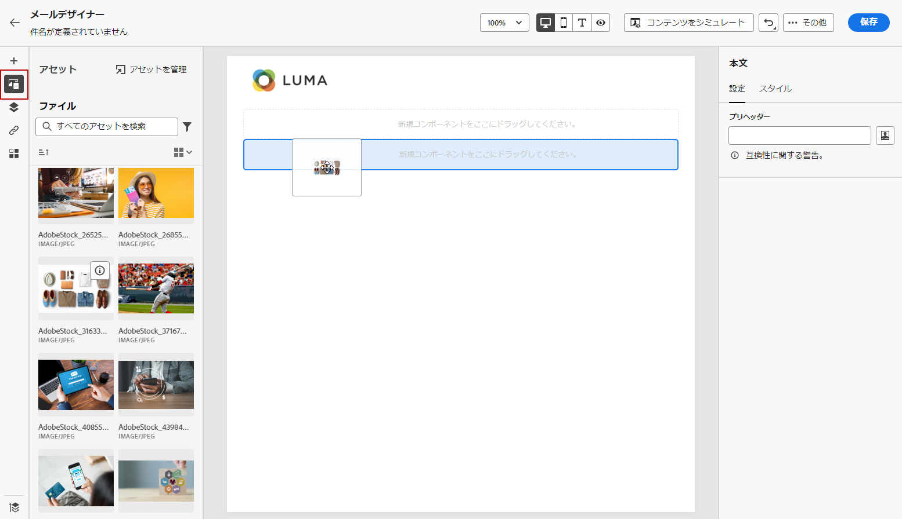
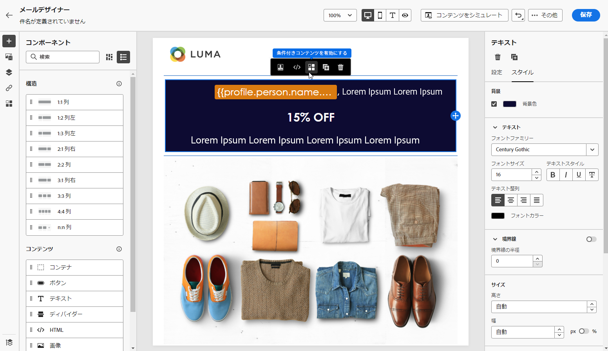

# コンテンツをゼロからデザイン {#content-from-scratch}

>[!CONTEXTUALHELP]
>id="ac_structure_components_email"
>title="構造コンポーネントを追加"
>abstract="構造コンポーネントはメールのレイアウトを定義します。ドラッグ&amp;ドロップ **構造** コンポーネントをキャンバスに追加して、e メールコンテンツのデザインを開始します。"

>[!CONTEXTUALHELP]
>id="ac_structure_components_landing_page"
>title="構造コンポーネントを追加"
>abstract="構造コンポーネントはランディングページのレイアウトを定義します。ドラッグ&amp;ドロップ **構造** コンポーネントをキャンバスに追加して、ランディングページのコンテンツのデザインを開始します。"

>[!CONTEXTUALHELP]
>id="ac_structure_components_fragment"
>title="構造コンポーネントを追加"
>abstract="構造コンポーネントはフラグメントのレイアウトを定義します。ドラッグ&amp;ドロップ **構造** コンポーネントをキャンバスに埋め込んで、フラグメントのコンテンツのデザインを開始します。"

>[!CONTEXTUALHELP]
>id="ac_structure_components_template"
>title="構造コンポーネントを追加"
>abstract="構造コンポーネントはテンプレートのレイアウトを定義します。ドラッグ&amp;ドロップ **構造** コンポーネントをキャンバスに追加して、テンプレートのコンテンツのデザインを開始します。"

>[!CONTEXTUALHELP]
>id="ac_edition_columns_email"
>title="電子メール列を定義"
>abstract="E メールデザイナーを使用すると、列構造を選択することで、E メールのレイアウトを簡単に定義できます。"

>[!CONTEXTUALHELP]
>id="ac_edition_columns_landing_page"
>title="ランディングページ列の定義"
>abstract="Designer では、列構造を選択することで、ランディングページのレイアウトを簡単に定義できます。"

>[!CONTEXTUALHELP]
>id="ac_edition_columns_fragment"
>title="フラグメント列を定義"
>abstract="Designer では、列構造を選択することで、フラグメントのレイアウトを簡単に定義できます。"

>[!CONTEXTUALHELP]
>id="ac_edition_columns_template"
>title="テンプレート列を定義"
>abstract="デザイナーを使用すると、列構造を選択することで、テンプレートのレイアウトを簡単に定義できます。"

Adobe Journey Optimizer Designer を使用して、コンテンツの構造を簡単に定義できます。 単純なドラッグ&amp;ドロップ操作で構造要素を追加して移動することで、数秒以内にコンテンツの形状をデザインできます。

コンテンツの作成を開始するには、次の手順に従います。

1. Designer のホームページで、 **[!UICONTROL ゼロからデザイン]** オプション。

   

1. ドラッグ&amp;ドロップでコンテンツのデザインを開始 **[!UICONTROL 構造]** をキャンバスにドラッグして、e メールのレイアウトを定義します。

   >[!NOTE]
   >
   >列の積み重ねは、すべてのメールプログラムと互換性があるわけではありません。サポートされていない場合、列は積み重ねられません。

   <!--Once placed in the email, you cannot move nor remove your components unless there is already a content component or a fragment placed inside. This is not true in AJO - TBC?-->

1. 追加する数 **[!UICONTROL 構造]** 必要に応じて、右側の専用パネルで設定を編集します。

   

   「**[!UICONTROL n:n 列]**」コンポーネントを選択して、列数（3～10）を任意に定義します。各列の下部にある矢印を動かして、各列の幅を定義することもできます。

   >[!NOTE]
   >
   >各列のサイズを構造コンポーネントの全幅の 10％未満にすることはできません。空でない列は削除できません。

1. を展開します。 **[!UICONTROL 内容]** セクションを開き、必要な数の要素を 1 つ以上の構造コンポーネントに追加します。 [詳しくは、コンテンツコンポーネントを参照してください](content-components.md)

1. 各コンポーネントは、 **[!UICONTROL 設定]** または **[!UICONTROL スタイル]** 」タブを右側のメニューに表示します。 例えば、コンポーネントのテキストスタイル、パディングまたは余白を変更できます。[詳しくは、整列とパディングを参照してください](alignment-and-padding.md)

   

1. **[!UICONTROL アセットピッカー]**&#x200B;から、**[!UICONTROL Assets ライブラリ]**&#x200B;に保存されたアセットを直接選択できます。[詳しくは、アセット管理を参照してください](assets-essentials.md)

   アセットを含むフォルダーをダブルクリックします。それらを構造コンポーネントにドラッグ＆ドロップします。

   

1. パーソナライゼーションフィールドを挿入して、プロファイル属性、セグメントメンバーシップ、コンテキスト属性などからコンテンツをカスタマイズします。 [詳しくは、コンテンツのパーソナライゼーションを参照してください](../personalization/personalize.md)

   

1. クリック **[!UICONTROL 条件の内容を有効にする]** ：動的コンテンツを追加し、条件ルールに基づいてターゲットプロファイルにコンテンツを適応させます。 [動的コンテンツの基本を学ぶ](../personalization/get-started-dynamic-content.md)

   

1. 左側のペインから「**[!UICONTROL リンク]**」タブをクリックし、トラッキングするコンテンツのすべての URL を表示します。必要に応じて、**[!UICONTROL トラッキングタイプ]**、**[!UICONTROL ラベル]**&#x200B;を変更して、**[!UICONTROL タグ]**&#x200B;を追加できます。[リンクとトラッキングの詳細](message-tracking.md)

   

1. 必要に応じて、「 **[!UICONTROL コードエディターに切り替え]** 上から **詳細** 」ボタンをクリックします。 [詳しくは、コードエディターを参照してください](code-content.md)

   

   >[!CAUTION]
   >
   >コードエディターに切り替えた後で、このコンテンツのビジュアルデザイナーに戻すことはできません。

1. コンテンツの準備が整ったら、 **[!UICONTROL コンテンツをシミュレート]** ボタンをクリックしてレンダリングを確認します。 デスクトップまたはモバイル表示を選択できます。[詳しくは、メールのプレビューを参照してください](preview.md)

   

1. コンテンツの準備が整ったら、 **[!UICONTROL 保存]**.

