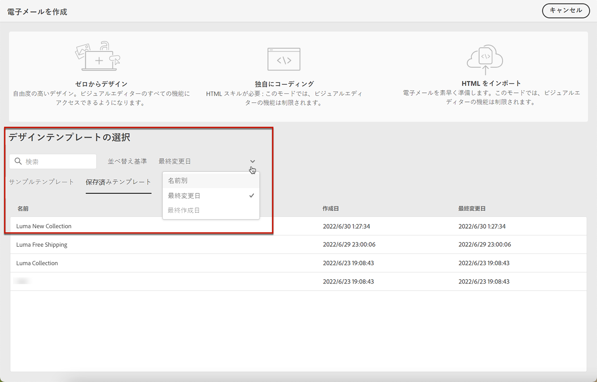

# コンテンツテンプレートの作成 {#content-templates}

>[!CONTEXTUALHELP]
>id="ajo_content_templates"
>title="コンテンツテンプレートの作成"
>abstract="スタンドアロンテンプレートを作成して、ジャーニーやキャンペーンをまたいでコンテンツを再利用します。"

高度で改善されたデザインプロセスを実現するために、スタンドアロンテンプレートを作成して、カスタムコンテンツを簡単に再利用できます。 [!DNL Journey Optimizer] キャンペーンとジャーニー。

この機能により、コンテンツ指向のユーザーは、キャンペーンやジャーニーの外部でテンプレートを操作できます。 その後、マーケティングユーザーは、これらのスタンドアロンコンテンツテンプレートを、独自のジャーニーまたはキャンペーン内で再利用および調整できます。

>[!CAUTION]
>
>コンテンツテンプレートを作成、編集、削除するには、 **[!DNL Manage Library Items]** 次に含まれる権限 **[!DNL Content Library Manager]** 製品プロファイル。 ([詳細情報](../administration/ootb-product-profiles.md#content-library-manager))

例えば、会社内のユーザーがコンテンツのみを担当しているので、キャンペーンやジャーニーにはアクセスできません。 ただし、このユーザーは、組織のマーケターがすべてのメールで使用するために選択できる E メールテンプレートを作成できます。

>[!NOTE]
>
>* コンテンツテンプレートに対して行われた変更は、ライブかドラフトかに関わらず、キャンペーンやジャーニーには反映されません。
>
>* 同様に、テンプレートをキャンペーンやジャーニーで使用する場合、キャンペーンやジャーニーのコンテンツに対して行った編集は、以前に使用したコンテンツテンプレートには影響しません。

➡️ [テンプレートの作成と使用方法については、このビデオを参照してください。](#video-templates)

コンテンツテンプレートを作成するには、次の手順に従います。

1. コンテンツテンプレートリストにアクセスするには、 **[!UICONTROL コンテンツ管理]** > **[!UICONTROL コンテンツテンプレート]** を選択します。

   

1. 現在のサンドボックスで作成されたすべてのテンプレート ( ジャーニー、キャンペーン、 **[!UICONTROL コンテンツテンプレート]** メニュー — が表示されます。

   >[!NOTE]
   >
   >作成日または変更日に基づいてコンテンツテンプレートを並べ替えることができます。

1. 選択 **[!UICONTROL テンプレートを作成]**.

1. テンプレートの詳細を入力します。

   

   >[!NOTE]
   >
   >現在、 **電子メール** チャネルと **HTML** タイプがサポートされています。

1. カスタムまたはコアのデータ使用ラベルをテンプレートに割り当てるには、「 **[!UICONTROL アクセスを管理]**. [オブジェクトレベルのアクセス制御 (OLAC) の詳細](../administration/object-based-access.md).

1. クリック **[!UICONTROL 作成]** 次のオプションから、メールのデザイン方法を選択します。

   * **[!UICONTROL ゼロからデザイン]**
   * **[!UICONTROL 独自のコーディング]**
   * **[!UICONTROL HTML の読み込み]**
   * **[!UICONTROL デザインテンプレートを選択]**

   

   >[!NOTE]
   >
   >テンプレートを選択する場合は、次の中から選択できます。 **[!UICONTROL サンプルテンプレート]**（標準の電子メールテンプレート） **[!UICONTROL 保存済みのテンプレート]**：ジャーニー、キャンペーン、または **[!UICONTROL コンテンツテンプレート]** メニュー ([詳細情報](email-templates.md#save-as-template))

1. E メールデザイナーが表示されます。 選択したオプションに従って、ジャーニーやキャンペーン内の E メールと同じ方法で、必要に応じてコンテンツを編集します。

   * [メールをゼロからデザイン](content-from-scratch.md) デザイナーのインターフェイスを通じて、 [Adobe Experience Manager Assets Essentials](assets-essentials.md).

   * [コードまたはコピー&amp;ペーストの生のHTML](code-content.md) を直接 E メールデザイナーに追加します。

   * ファイルまたは .zip フォルダーから[既存の HTML コンテンツを読み込み](existing-content.md)ます。

   * [既存のコンテンツを使用](email-templates.md) 組み込みテンプレートまたはカスタムテンプレートのリストから。

   

1. クリック **[!UICONTROL コンテンツをシミュレート]** 電子メールのレンダリングを確認する場合。 デスクトップまたはモバイル表示を選択できます。([詳細情報](preview.md))

   >[!CAUTION]
   >
   >コンテンツをシミュレートするには、 **[!DNL Manage Simulate Content]** 次に含まれる権限 **[!DNL Content Library Manager]** 製品プロファイル。 ([詳細情報](../administration/ootb-product-profiles.md#content-library-manager))

   

1. 配達確認を送信してコンテンツをテストし、一部の内部ユーザーが承認してから、ジャーニーやキャンペーンで使用することができます。

   * これをおこなうには、 **[!UICONTROL 配達確認を送信]** ボタンをクリックし、 [この節](preview.md#send-proofs).

   * 配達確認を送信する前に、 [電子メール表面](../configuration/channel-surfaces.md) コンテンツのテストに使用する

      

1. テンプレートの準備が整ったら、「 **[!UICONTROL 保存]**.

1. 必要に応じて、テンプレート名の横にある矢印をクリックし、 **[!UICONTROL 詳細]** 画面を開いて、テンプレートを編集します。

   

1. これで、このコンテンツテンプレートを、 [電子メール](get-started-email-design.md) 範囲 [!DNL Journey Optimizer]. 詳細情報： [保存済みテンプレートの使用](email-templates.md#use-saved-template).

   

## チュートリアルビデオ{#video-templates}

でコンテンツテンプレートを作成、編集、使用する方法について説明します。 [!DNL Journey Optimizer].

>[!VIDEO](https://video.tv.adobe.com/v/3413743/?quality=12)