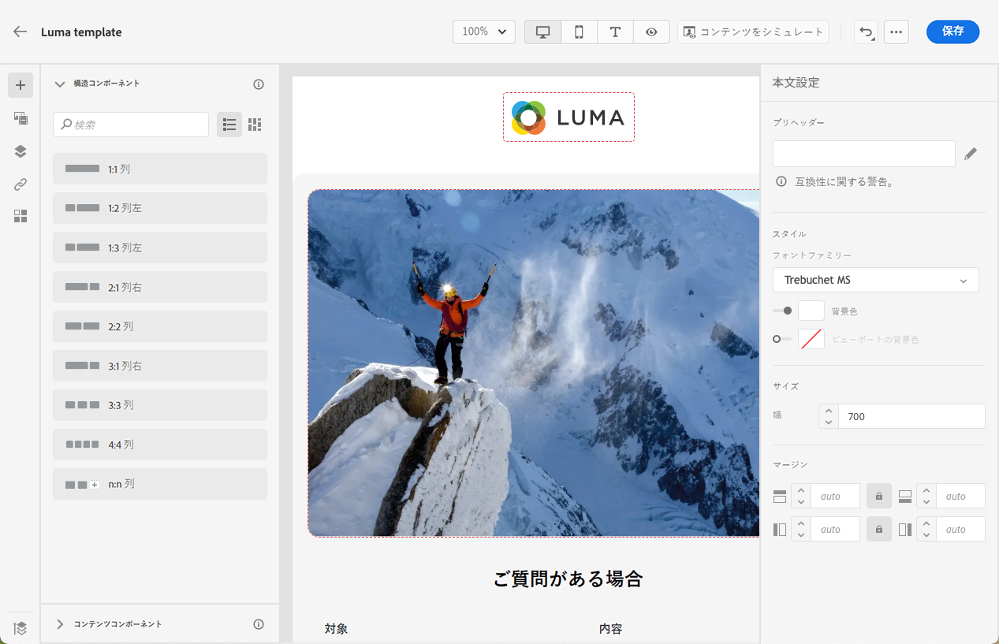

# コンテンツテンプレートの使用 {#content-templates}

高速で改善された設計プロセスを実現するために、スタンドアロンテンプレートを作成して、カスタムコンテンツを簡単に再利用できます。 [!DNL Journey Optimizer] キャンペーンとジャーニー。

この機能により、コンテンツ指向のユーザーは、キャンペーンやジャーニーの外部でテンプレートを操作できます。 その後、マーケティングユーザーは、これらのスタンドアロンコンテンツテンプレートを、独自のジャーニーまたはキャンペーン内で再利用および調整できます。

例えば、会社内のユーザーがコンテンツのみを担当しているので、キャンペーンやジャーニーにはアクセスできません。 ただし、このユーザーは、組織のマーケターがすべてのメールで使用するために選択できる E メールテンプレートを作成できます。

➡️ [テンプレートの作成と使用方法については、このビデオを参照してください。](#video-templates)

>[!CAUTION]
>
>コンテンツテンプレートを作成、編集、削除するには、 **[!DNL Manage Library Items]** 次に含まれる権限 **[!DNL Content Library Manager]** 製品プロファイル。 [詳細情報](../administration/ootb-product-profiles.md#content-library-manager)

## テンプレートへのアクセスと管理 {#access-manage-templates}

コンテンツテンプレートリストにアクセスするには、 **[!UICONTROL コンテンツ管理]** > **[!UICONTROL コンテンツテンプレート]** を選択します。

現在のサンドボックスで作成されたすべてのテンプレート ( ジャーニーまたは [テンプレートとして保存](#save-as-template) オプション ( **[!UICONTROL コンテンツテンプレート]** メニュー — が表示されます。

作成日または変更日に基づいてコンテンツテンプレートを並べ替えることができます。 また、自分が作成または変更した項目のみを表示するように選択することもできます。

テンプレートコンテンツを編集するには、リストから目的の項目をクリックし、「 」を選択します。 **[!UICONTROL コンテンツを編集]**.

テンプレートを削除するには、目的のテンプレートの横にあるごみ箱アイコンを選択します。

>[!NOTE]
>
>テンプレートを編集または削除しても、このテンプレートを使用して作成された E メールを含むキャンペーンまたはジャーニーは影響を受けません。

## コンテンツテンプレートの作成 {#create-content-templates}

>[!CONTEXTUALHELP]
>id="ajo_create_template"
>title="独自のコンテンツテンプレートを定義する"
>abstract="複数のジャーニーやキャンペーンでコンテンツを再利用可能にするために、スタンドアロンのカスタムテンプレートをゼロから作成します。"

コンテンツテンプレートを作成する方法は 2 つあります。

* 左側のレールを使用して、最初からコンテンツテンプレートを作成する **[!UICONTROL コンテンツテンプレート]** メニュー [方法についてはこちらを参照](#create-template-from-scratch)

* キャンペーンまたはジャーニー内で E メールをデザインする際は、E メールのコンテンツをテンプレートとして保存します。 [方法についてはこちらを参照](#save-as-template)

保存すると、コンテンツテンプレートをキャンペーンやジャーニーで使用できるようになります。 ゼロから作成した場合も、以前の E メールから作成した場合も、 [電子メール](get-started-email-design.md) 範囲 [!DNL Journey Optimizer]. [方法についてはこちらを参照](email-templates.md)

>[!NOTE]
>
>* コンテンツテンプレートに対して行われた変更は、ライブかドラフトかに関わらず、キャンペーンやジャーニーには反映されません。
>
>* 同様に、テンプレートをキャンペーンやジャーニーで使用する場合、キャンペーンやジャーニーのコンテンツに対して行った編集は、以前に使用したコンテンツテンプレートには影響しません。

### 最初からテンプレートを作成 {#create-template-from-scratch}

コンテンツテンプレートを最初から作成するには、次の手順に従います。

1. でコンテンツテンプレートリストにアクセス **[!UICONTROL コンテンツ管理]** > **[!UICONTROL コンテンツテンプレート]** 左メニュー

   

1. 選択 **[!UICONTROL テンプレートを作成]**.

1. テンプレートの詳細を入力します。

   

   >[!NOTE]
   >
   >現在、 **電子メール** チャネルと **HTML** タイプがサポートされています。

1. カスタムまたはコアのデータ使用ラベルをテンプレートに割り当てるには、「 **[!UICONTROL アクセスを管理]**. [オブジェクトレベルのアクセス制御 (OLAC) の詳細](../administration/object-based-access.md).

1. クリック **[!UICONTROL 作成]** さまざまなオプションからメールのデザイン方法を選択します。

   * [メールをゼロからデザイン](content-from-scratch.md) 電子メールデザイナーのインターフェイスを使用する。

   * [コードまたはコピー&amp;ペーストの生のHTML](code-content.md) を直接 E メールデザイナーに追加します。

   * ファイルまたは .zip フォルダーから[既存の HTML コンテンツを読み込み](existing-content.md)ます。

   * 組み込みテンプレートまたはカスタムテンプレートのリストの既存のコンテンツを使用します。 E メールでコンテンツテンプレートを使用する手順については、 [この節](email-templates.md).

   

1. この [メールデザイナー](get-started-email-design.md) が表示されます。 選択したオプションに従って、ジャーニーやキャンペーン内の E メールと同じ方法で、必要に応じてコンテンツを編集します。

   

1. 必要に応じて、コンテンツをテストできます。 [方法についてはこちらを参照](#test-template)

1. テンプレートの準備が整ったら、「 **[!UICONTROL 保存]**.

1. 必要に応じて、テンプレート名の横にある矢印をクリックし、 **[!UICONTROL 詳細]** 画面を開いて、テンプレートを編集します。

   

これで、内で E メールを作成する際に、このテンプレートを使用する準備が整いました。 [!DNL Journey Optimizer]. [方法についてはこちらを参照](email-templates.md)

### テンプレートとして保存 {#save-as-template}

>[!CONTEXTUALHELP]
>id="ajo_messages_depecrated_inventory"
>title="メッセージの移行方法を説明します。"
>abstract="2022年7月25日（PT）より、メッセージメニューが表示されなくなり、ジャーニーから直接メッセージが作成されます。 従来のメッセージをジャーニーで再利用する場合は、それらをテンプレートとして保存する必要があります。"

を設計する際に [電子メール](get-started-email-design.md) キャンペーンまたはジャーニーでは、e メールのコンテンツを保存して、後で再利用できます。 それには、次の手順に従います。

1. E メールデザイナーで、画面の右上にある省略記号をクリックします。

1. 選択 **[!UICONTROL コンテンツテンプレートとして保存]** を選択します。

   

1. このテンプレートの名前と説明を追加します。

   

1. 「**[!UICONTROL 保存]**」をクリックします。

1. テンプレートは、 **[!UICONTROL コンテンツテンプレート]** リスト（からアクセス可能） [!DNL Journey Optimizer] 専用のメニュー。 これは、そのリスト上の他の項目としてアクセス、編集、削除が可能なスタンドアロンコンテンツテンプレートになります。 [詳細情報](#access-manage-templates)

これで、このテンプレートを使用して、 [電子メール](get-started-email-design.md) 範囲 [!DNL Journey Optimizer]. [方法についてはこちらを参照](email-templates.md)

>[!NOTE]
>
>その新しいテンプレートに対する変更は、元の電子メールには反映されません。 同様に、元のコンテンツがその E メール内で編集された場合、新しいテンプレートは変更されません。

## コンテンツテンプレートをテストする {#test-template}

E メールコンテンツテンプレートのレンダリングを、新規作成でも E メールでもテストできます。 これを行うには、以下の手順に従います。

>[!CAUTION]
>
>コンテンツをシミュレートするには、 **[!DNL Manage Simulate Content]** 次に含まれる権限 **[!DNL Content Library Manager]** 製品プロファイル。 [詳細情報](../administration/ootb-product-profiles.md#content-library-manager)

1. でコンテンツテンプレートリストにアクセス **[!UICONTROL コンテンツ管理]** > **[!UICONTROL コンテンツテンプレート]** メニューを開き、任意のテンプレートを選択します。

1. クリック **[!UICONTROL コンテンツを編集]** から **[!UICONTROL テンプレートのプロパティ]**.

1. クリック **[!UICONTROL コンテンツをシミュレート]** テストプロファイルを選択して、e メールのレンダリングを確認します。 デスクトップまたはモバイル表示を選択できます。[詳細情報](preview.md)

   

1. 配達確認を送信してコンテンツをテストし、一部の内部ユーザーが承認してから、ジャーニーやキャンペーンで使用することができます。

   * これをおこなうには、 **[!UICONTROL 配達確認を送信]** ボタンをクリックし、 [この節](preview.md#send-proofs).

   * 配達確認を送信する前に、 [電子メール表面](../configuration/channel-surfaces.md) コンテンツのテストに使用する

      

## チュートリアルビデオ {#video-templates}

でコンテンツテンプレートを作成、編集、使用する方法について説明します。 [!DNL Journey Optimizer].

>[!VIDEO](https://video.tv.adobe.com/v/3413743/?quality=12)