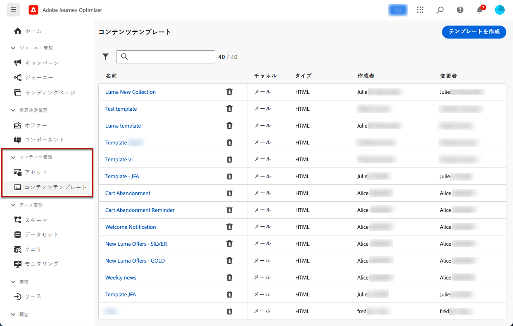
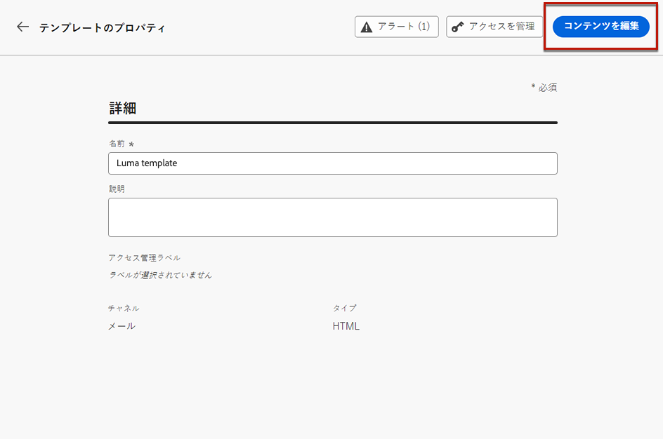
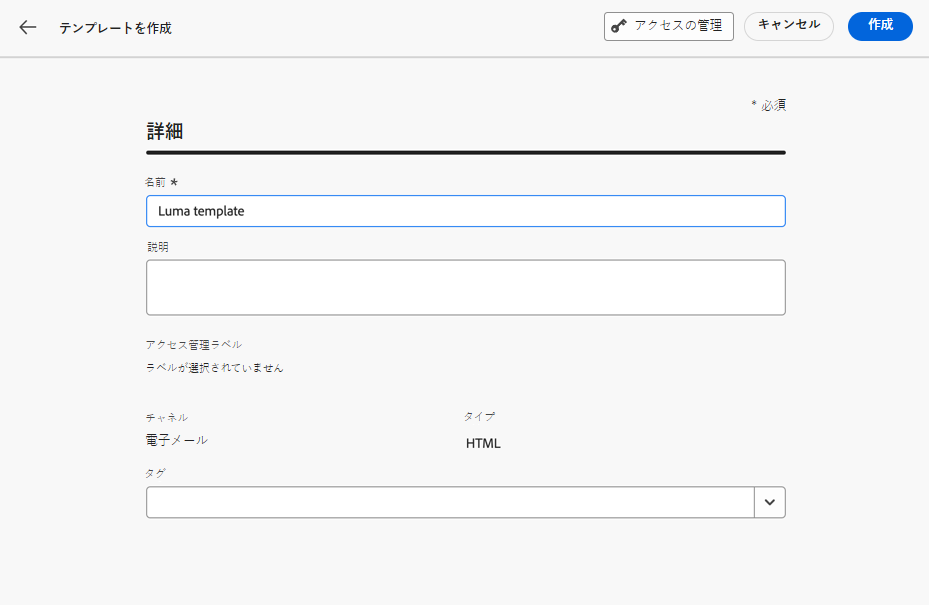
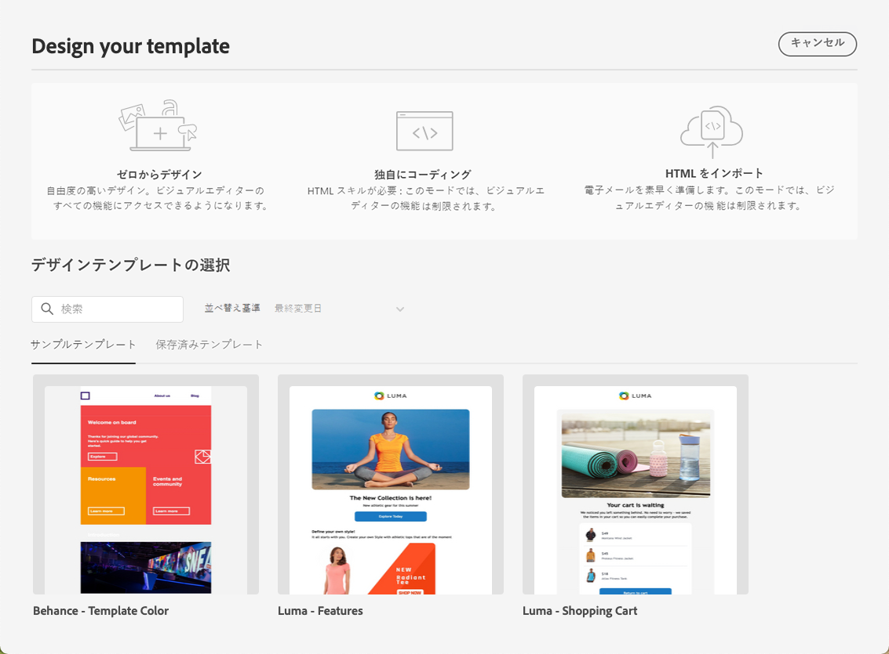
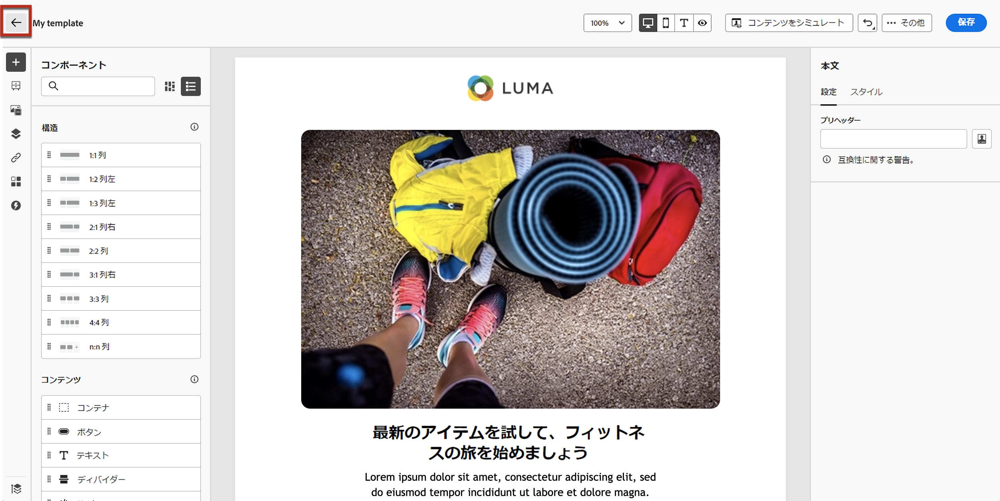
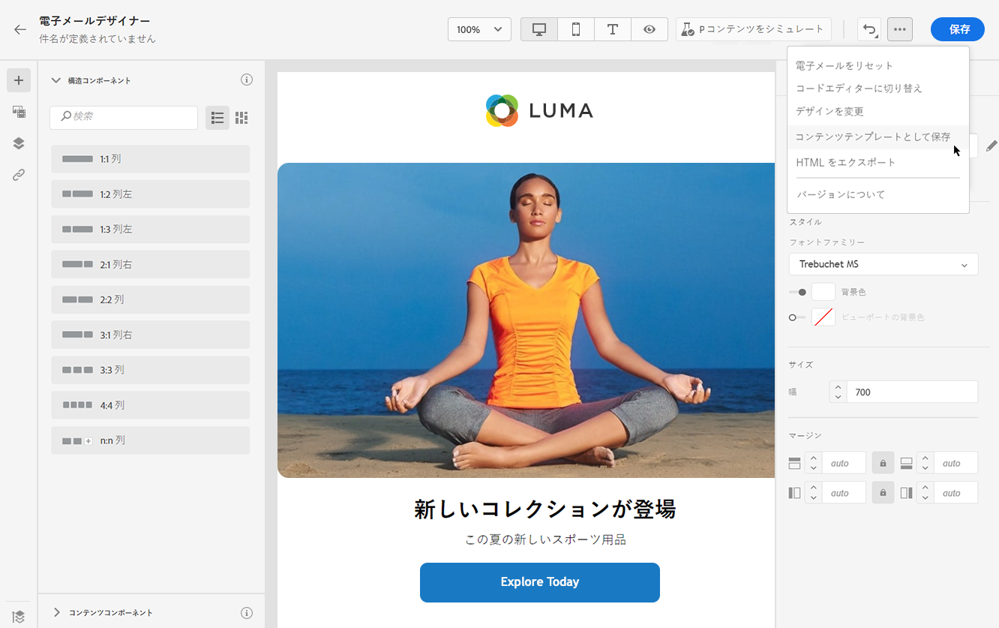
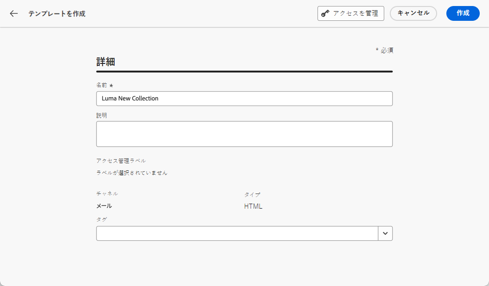
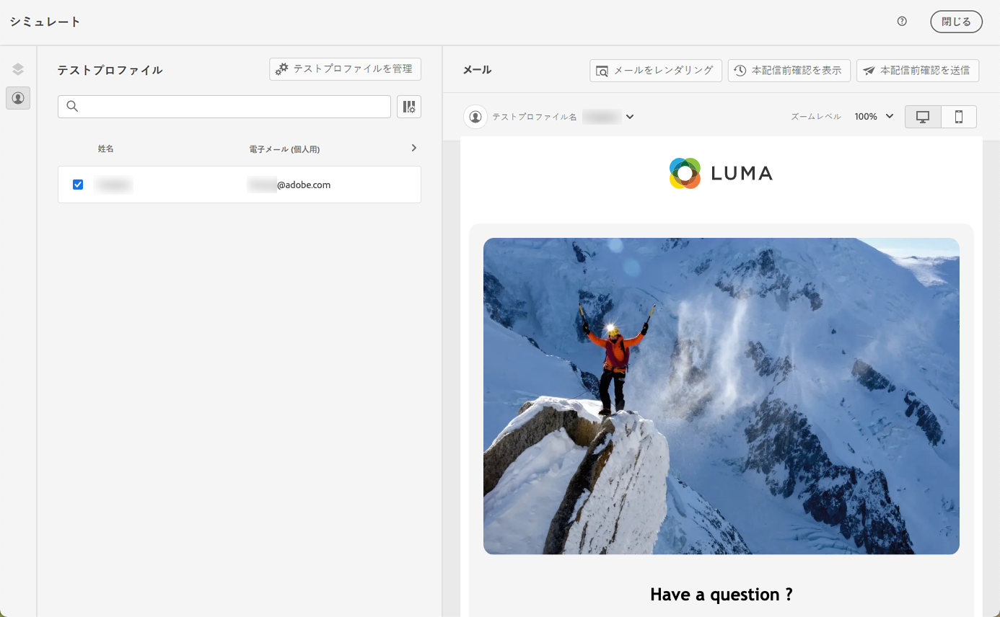

# コンテンツテンプレートの操作 {#content-templates}

高速で改善された設計プロセスを実現するために、スタンドアロンテンプレートを作成して、[!DNL Journey Optimizer] キャンペーンやジャーニー全体でカスタムコンテンツを簡単に再利用できます。

この機能により、コンテンツ指向のユーザーは、キャンペーンやジャーニーの外部でテンプレートを操作できます。それから、マーケティングユーザーは、これらのスタンドアロンコンテンツテンプレートを自分のジャーニーやキャンペーン内で再利用、調整できます。

例えば、会社内のユーザーはコンテンツのみを担当しているので、キャンペーンやジャーニーにはアクセスできません。ただし、このユーザーがメールテンプレートを作成し、組織のマーケターはすべてのメールの出発点としてそのメールテンプレートを使用できます。

➡️ [テンプレートの作成および使用方法については、このビデオをご覧ください](#video-templates)

>[!CAUTION]
>
>コンテンツテンプレートを作成、編集、削除するには、**[!DNL Content Library Manager]** 製品プロファイルに含まれる&#x200B;**[!DNL Manage Library Items]** 権限を付与されている必要があります。[詳細情報](../administration/ootb-product-profiles.md#content-library-manager)

## テンプレートへのアクセスと管理 {#access-manage-templates}

コンテンツテンプレートリストにアクセスするには、左のメニューで&#x200B;**[!UICONTROL コンテンツ管理]**／**[!UICONTROL コンテンツテンプレート]**&#x200B;を選択します。

現在のサンドボックスで作成されたすべてのテンプレート（「[テンプレートとして保存](#save-as-template)」オプションを使ったジャーニーやキャンペーンまたは「**[!UICONTROL コンテンツテンプレート]**」メニューから）が表示されます。

作成日または変更日に基づいてコンテンツテンプレートを並べ替えることができます。 また、自分が作成または変更した項目のみを表示するように選択することもできます。

テンプレートコンテンツを編集するには、リストから目的の項目をクリックし、「**[!UICONTROL コンテンツを編集]**」を選択します。

テンプレートを削除するには、目的のテンプレートの横にあるごみ箱アイコンを選択します。

>[!NOTE]
>
>テンプレートを編集または削除しても、このテンプレートを使用して作成されたメールを含むキャンペーンやジャーニーは影響を受けません。

## コンテンツテンプレートを作成 {#create-content-templates}

>[!CONTEXTUALHELP]
>id="ajo_create_template"
>title="独自のコンテンツテンプレートを定義"
>abstract="スタンドアロンのカスタムテンプレートをゼロから作成して、複数のジャーニーやキャンペーンでコンテンツを再利用できるようにします。"

コンテンツテンプレートを作成する方法は 2 つあります。

* 左パネルの「**[!UICONTROL コンテンツテンプレート]**」メニューを使用して、ゼロからコンテンツテンプレートを作成する。[方法についてはこちらを参照](#create-template-from-scratch)

* キャンペーンやジャーニー内でメールをデザインする際に、メールのコンテンツをテンプレートとして保存する。 [方法についてはこちらを参照](#save-as-template)

保存すると、コンテンツテンプレートをキャンペーンやジャーニーで使用できるようになります。 ゼロから作成した場合でも、以前のメールから作成した場合でも、[!DNL Journey Optimizer] 内で[メール](get-started-email-design.md)を作成する際にこのテンプレートを使用できます。[方法についてはこちらを参照](email-templates.md)

>[!NOTE]
>
>* コンテンツテンプレートに加えられた変更は、ライブかドラフトかに関わらず、キャンペーンやジャーニーには反映されません。
>
>* 同様に、キャンペーンやジャーニーでテンプレートを使用する場合、キャンペーンやジャーニーのコンテンツにを編集しても、以前に使用したコンテンツテンプレートには影響しません。

### テンプレートをゼロから作成 {#create-template-from-scratch}

コンテンツテンプレートをゼロから作成するには、次の手順に従います。

1. **[!UICONTROL コンテンツ管理]**／**[!UICONTROL コンテンツテンプレート]**&#x200B;の左側のメニューからコンテンツテンプレートリストにアクセスします。

   

1. 「**[!UICONTROL テンプレートの作成]**」を選択します。

1. テンプレートの詳細を入力します。

   

   >[!NOTE]
   >
   >現在、**メール**&#x200B;チャネルと **HTML** タイプのみがサポートされています。

1. テンプレートにカスタムまたはコアのデータ使用ラベルを割り当てるには、「**[!UICONTROL アクセスを管理]**」を選択します。[オブジェクトレベルのアクセス制御（OLAC）についての詳細はこちらを参照してください](../administration/object-based-access.md)。

1. 「**[!UICONTROL 作成]**」をクリックし、さまざまなオプションからメールのデザイン方法を選択します。

   * メールデザイナーのインターフェースを使用して、[ゼロからメールをデザインします](content-from-scratch.md)。

   * メールデザイナーに直接 [Raw HTML をコーディングまたはコピーして貼り付け](code-content.md)ます。

   * ファイルまたは .zip フォルダーから[既存の HTML コンテンツを読み込み](existing-content.md)ます。

   * 組み込みまたはカスタムテンプレートのリストから既存のコンテンツを使用します。メールでコンテンツテンプレートを使用する手順については、[この節](email-templates.md)で説明します。

   

1. [メールデザイナー](get-started-email-design.md)が表示されます。選択したオプションに従って、ジャーニーやキャンペーン内のメールと同じ方法で、必要に応じてコンテンツを編集します。

   必要に応じて、コンテンツをテストできます。[方法についてはこちらを参照](#test-template)

1. テンプレートの準備が整ったら、「**[!UICONTROL 保存]**」をクリックします。

1. 必要に応じて、テンプレート名の横にある矢印をクリックして&#x200B;**[!UICONTROL 詳細]**&#x200B;画面に戻り、テンプレートを編集します。

   

このテンプレートを、[!DNL Journey Optimizer] 内でメールを作成するときに使用できるようになりました。[方法についてはこちらを参照](email-templates.md)

### テンプレートとして保存 {#save-as-template}

>[!CONTEXTUALHELP]
>id="ajo_messages_depecrated_inventory"
>title="メッセージの移行方法を説明します。"
>abstract="2022年7月25日（PT）より、メッセージメニューが表示されなくなり、ジャーニーから直接メッセージが作成されます。 従来のメッセージをジャーニーで再利用する場合は、それらをテンプレートとして保存する必要があります。"

キャンペーンやジャーニーで[メール](get-started-email-design.md)をデザインする際、メールコンテンツを保存しておくと、後で再利用できます。それには、次の手順に従います。

1. メールデザイナーで、画面の右上にある「...」をクリックします。

1. ドロップダウンメニューから「**[!UICONTROL コンテンツテンプレートとして保存]**」を選択します。

   

1. このテンプレートの名前と説明を追加します。

   

1. 「**[!UICONTROL 保存]**」をクリックします。

1. テンプレートは&#x200B;**[!UICONTROL コンテンツテンプレート]**&#x200B;リストに保存され、[!DNL Journey Optimizer] 専用メニューからアクセスできます。このテンプレートは、そのリストの他の項目と同様に、アクセス、編集、削除できるスタンドアロンのコンテンツテンプレートになります。[詳細情報](#access-manage-templates)

[!DNL Journey Optimizer] 内で[メール](get-started-email-design.md)を作成する際に、このテンプレートを使用できるようになりました。[方法についてはこちらを参照](email-templates.md)

>[!NOTE]
>
>その新しいテンプレートに対する変更は、送信元のメールには反映されません。同様に、そのメール内で元のコンテンツを編集しても、新しいテンプレートは変更されません。

## コンテンツテンプレートのテスト {#test-template}

ゼロから作成した場合でも、メールから作成した場合でも、メールコンテンツのテンプレートのレンダリングをテストできます。これを行うには、以下の手順に従います。

>[!CAUTION]
>
>コンテンツをシミュレートするには、**[!DNL Content Library Manager]** 製品プロファイルに含まれる **[!DNL Manage Simulate Content]** 権限を付与されているが必要があります。[詳細情報](../administration/ootb-product-profiles.md#content-library-manager)

1. **[!UICONTROL コンテンツ管理]**／**[!UICONTROL コンテンツテンプレート]**&#x200B;メニューからコンテンツテンプレートリストにアクセスし、任意のテンプレートを選択します。

1. **[!UICONTROL テンプレートのプロパティ]**&#x200B;から「**[!UICONTROL コンテンツを編集]**」をクリックします。

1. 「**[!UICONTROL コンテンツをシミュレート]**」をクリックし、テストプロファイルを選択して、メールのレンダリングを確認します。デスクトップまたはモバイル表示を選択できます。[詳細情報](preview.md)

   

1. ジャーニーやキャンペーンで使用する前に、コンテンツをテストするための配達確認を送信し、一部の内部ユーザーから承認を得ることができます。

   * これを行うには、「**[!UICONTROL 配達確認を送信]**」ボタンをクリックし、[この節](preview.md#send-proofs)で説明されている手順に従います。

   * 配達確認を送信する前に、コンテンツのテストに使用する[メールサーフェス](../configuration/channel-surfaces.md)を選択する必要があります。

      

## チュートリアルビデオ {#video-templates}

[!DNL Journey Optimizer] でコンテンツテンプレートを作成、編集、使用する方法について説明します。

>[!VIDEO](https://video.tv.adobe.com/v/3413743/?quality=12)
