# メールの作成 {#create-email}

>[!BEGINSHADEBOX]

**このページ：** Adobe Journey Optimizerでジャーニーまたはキャンペーンにメールアクションを追加する方法、件名と内容を定義する方法、アラートを確認する方法、送信前にプレビューする方法を説明します。

>[!ENDSHADEBOX]

>[!CONTEXTUALHELP]
>id="ajo_message_email"
>title="メールの作成"
>abstract="メールの件名を定義し、E メールデザイナーを開いてメールのコンテンツを作成します。"

## メールアクションの追加 {#email-action}

>[!CONTEXTUALHELP]
>id="ajo_journey_action_email"
>title="メールアクション"
>abstract="メールチャネルアクションでは、プロファイルがジャーニーのこの手順に到達した際に、メールをプロファイルに送信します。 ラベルはジャーニーキャンバス内のアクティビティを識別し、アクションは提供されるコンテンツを定義するメール設定を参照します。 「**最適化**」セクションでは、コンテンツ実験やターゲティングルールを含めることができ、「**多言語**」セクションでは、コンテンツを複数の言語で配信でき、「**タイムアウトまたはエラー**」セクションでは、アクションが失敗した場合に代替パスを定義できます。"
>additional-url="https://experienceleague.adobe.com/ja/docs/journey-optimizer/using/orchestrate-journeys/about-journey-building/journey-action#add-action" text="チャネルアクションの基本を学ぶ"

[!DNL Journey Optimizer] でメールを作成するには、**[!UICONTROL メール]**&#x200B;アクションをジャーニーまたはキャンペーンに追加します。 次に、ケースに応じて、次の手順に従います。

>[!BEGINTABS]

>[!TAB ジャーニーへのメールの追加]

1. ジャーニーを開き、パレットの「**[!UICONTROL アクション]**」セクションから「**[!UICONTROL アクション]**」アクティビティをドラッグ&amp;ドロップします。 [&#x200B; アクションアクティビティ &#x200B;](../building-journeys/journey-action.md)の詳細をご覧ください。

   >[!IMPORTANT]
   >
   >従来のネイティブチャネルアクティビティ（電子メール、プッシュ、SMS、アプリ内、web、コードベースのエクスペリエンス、コンテンツカード）は、2026年3月のリリースで廃止されました。 これらのアクティビティを使用する既存のジャーニーは、変更なしで引き続き機能します。移行は必要ありません。

1. アクションタイプとして「**[!UICONTROL 電子メール]**」を選択します。

   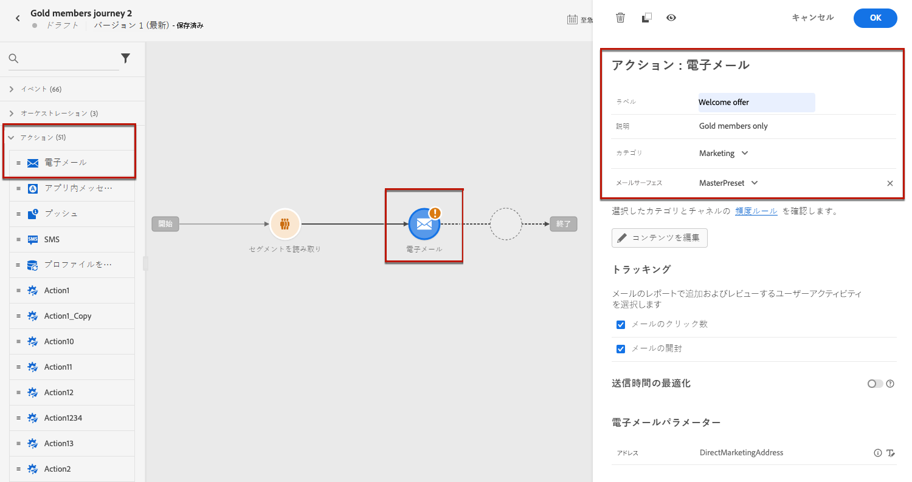

1. ジャーニーキャンバスでアクションを識別するには、**[!UICONTROL ラベル]**&#x200B;を入力します。

1. 「**[!UICONTROL 設定アクション]**」ボタンをクリックします。

1. 「**[!UICONTROL アクション]**」タブに移動します。 そこから、使用するメール設定を選択または作成します。 [詳細情報](email-settings.md)

   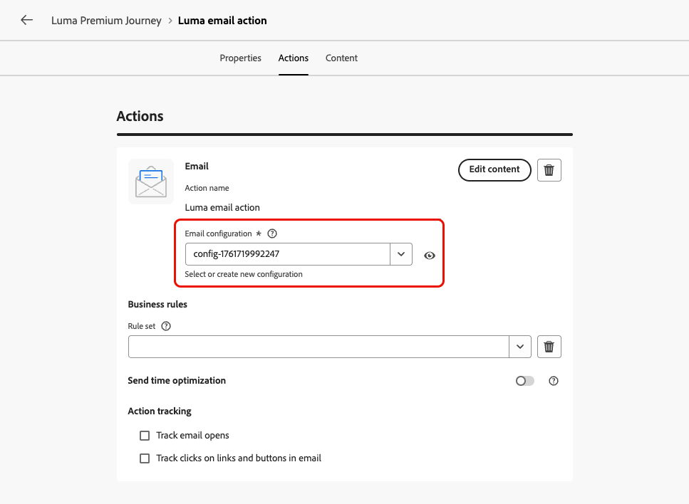

1. さらに：

   * キャッピングルールをメールアクションに適用するには、**[!UICONTROL ビジネスルール]** ドロップダウンリストでルールセットを選択します。 [詳細情報](../conflict-prioritization/channel-capping.md)

   * **[!DNL Send time optimization]** オプションを使用して、過去の開封率とクリック率に基づいて、メッセージを送信する最適な時間を予測し、エンゲージメントを最大化できます。 [詳細情報](../building-journeys/send-time-optimization.md)

1. 「**[!UICONTROL コンテンツを編集]**」ボタンを選択し、電子メールDesignerを使用して必要に応じてコンテンツを作成します。 [詳細情報](#define-email-content)

1. ジャーニーキャンバスに戻ります。 必要に応じて、追加のアクションまたはイベントをドラッグ＆ドロップして、ジャーニーフローを完了します。 [詳細情報](../building-journeys/about-journey-activities.md)

ジャーニーの作成、設定、公開の方法について詳しくは、[このページ &#x200B;](../building-journeys/journey-gs.md)を参照してください。

>[!TAB キャンペーンへのメールの追加]

1. [キャンペーンを作成](../campaigns/create-campaign.md)し、アクションとして「**[!UICONTROL メール]**」を選択します。

1. キャンペーンプロパティ、[オーディエンス](../audience/about-audiences.md)、[スケジュール](../campaigns/campaign-schedule.md)など、メールキャンペーンを作成する手順を完了します。

   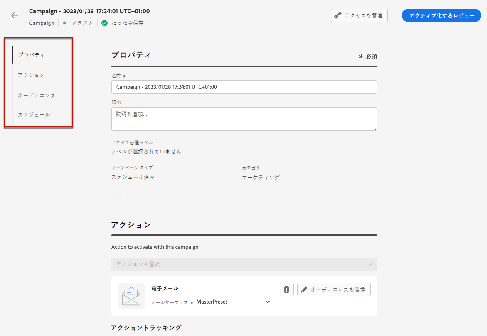

1. **[!UICONTROL メール]**&#x200B;アクションを選択します。

1. メール設定を選択または作成します。 [詳細情報](email-settings.md)

   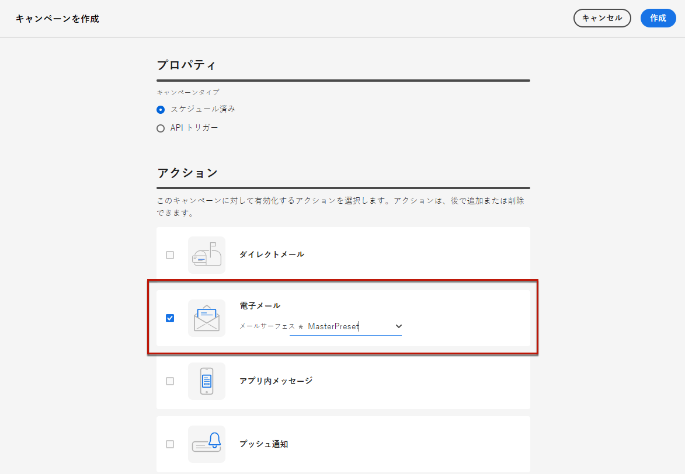

<!--
From the **[!UICONTROL Action]** section, specify if you want to track how your recipients react to your delivery: you can track email opens, and/or clicks on links and buttons in your email.

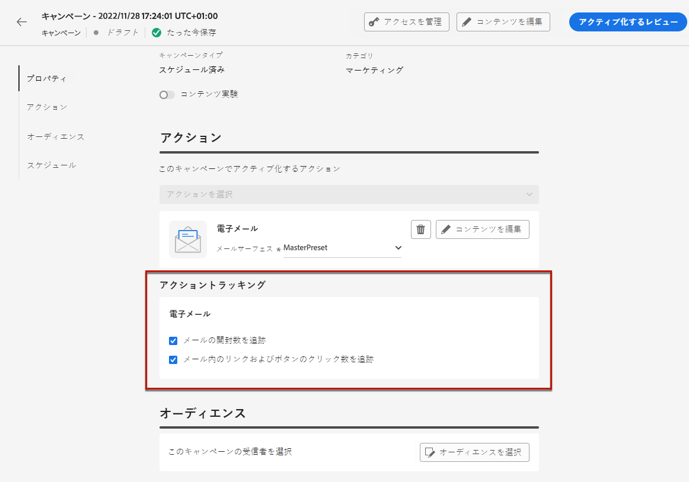
-->
キャンペーンの作成、設定およびアクティベート方法について詳しくは、[このページ &#x200B;](../campaigns/get-started-with-campaigns.md)を参照してください。

>[!ENDTABS]

## メールコンテンツの定義 {#define-email-content}

<!-- update the quarry component with right ID value-->

>[!CONTEXTUALHELP]
>id="test_id"
>title="メールコンテンツの設定"
>abstract="メールのコンテンツを作成します。 件名を定義してから、E メールデザイナーを活用してメールの本文を作成およびパーソナライズします。"

ジャーニーやキャンペーンにメールアクションを追加したら、E メールデザイナーを使用して、件名、送信者情報、メール本文などのメールコンテンツを定義する必要があります。 次の手順に従います。

1. ジャーニーまたはキャンペーンの設定画面で、「**[!UICONTROL コンテンツを編集]**」ボタンをクリックして、メールコンテンツを設定します。 [詳細情報](get-started-email-design.md)

   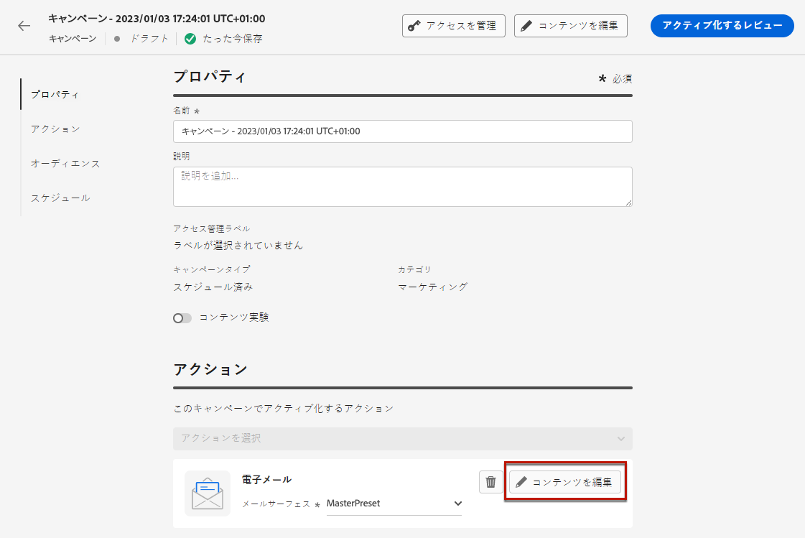

1. メールに決定ポリシーを追加する場合は、**[!UICONTROL 決定を有効にする]**&#x200B;を切り替えます。

   決定ポリシーは、各オーディエンスメンバーに配信する最適なコンテンツを動的に返すことを目的に、決定エンジンを活用するオファーのコンテナです。 [メールでの決定ポリシーの作成方法の詳細情報](../experience-decisioning/create-decision.md#create-decision)

   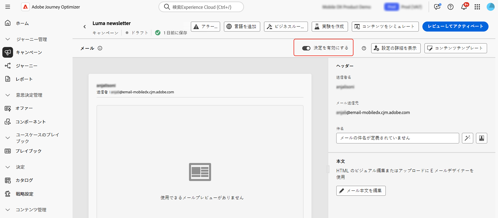

   >[!AVAILABILITY]
   >
   >現時点では、メールでの決定ポリシー作成は限定提供で使用できます。 アクセス権を取得するには、アドビ担当者にお問い合わせください。

1. 「**[!UICONTROL ヘッダー]**」セクションで、「**[!UICONTROL 送信者名]**」、「**[!UICONTROL 送信元メール]**」および「**[!UICONTROL BCC]**」の各フィールドを確認します。 これらは、選択したメール設定で指定されます。 [詳細情報](email-settings.md) <!--check if same for journey-->

   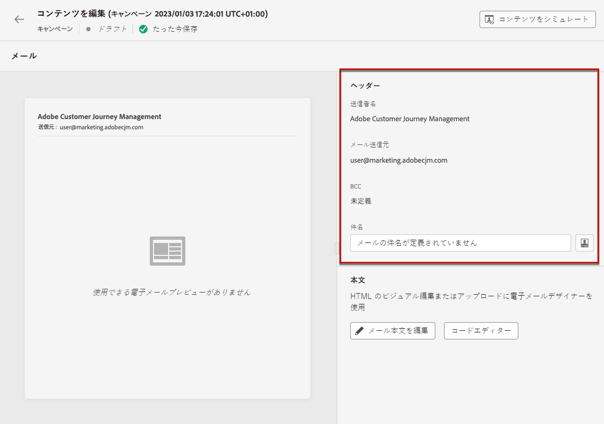

1. メッセージの件名を追加します。 パーソナライゼーションエディターを使用して件名を設定およびパーソナライズするには、「**[!UICONTROL パーソナライゼーションダイアログを開く]**」アイコンをクリックします。 [詳細情報](../personalization/personalization-build-expressions.md)

   >[!NOTE]
   >
   >件名は必須です。 改行を含めることはできません。

1. 「**[!UICONTROL メール本文を編集]**」ボタンをクリックしてE メールデザイナーにアクセスし、コンテンツの作成を開始します。 [詳細情報](get-started-email-design.md)

   

1. キャンペーンで作業している場合は、「**[!UICONTROL コードエディター]**」ボタンをクリックし、表示されるポップアップウィンドウを使用してプレーン HTML で独自のコンテンツをコーディングすることもできます。

   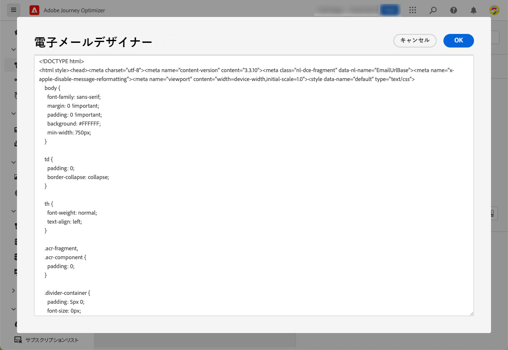

   >[!NOTE]
   >
   >E メールデザイナーで既にコンテンツを作成または読み込んでいる場合は、そのコンテンツが HTML で表示されます。

1. 必要に応じて、「**[!UICONTROL HTML サイズを最適化]**」オプションを有効にして、公開プロセス中にメール HTMLのサイズを小さくします。 [詳細情報](#optimize-html-size)

## アラートの確認 {#check-email-alerts}

メッセージをデザインする際、重要な設定が見つからない場合は、インターフェイス（画面の右上）にアラートが表示されます。

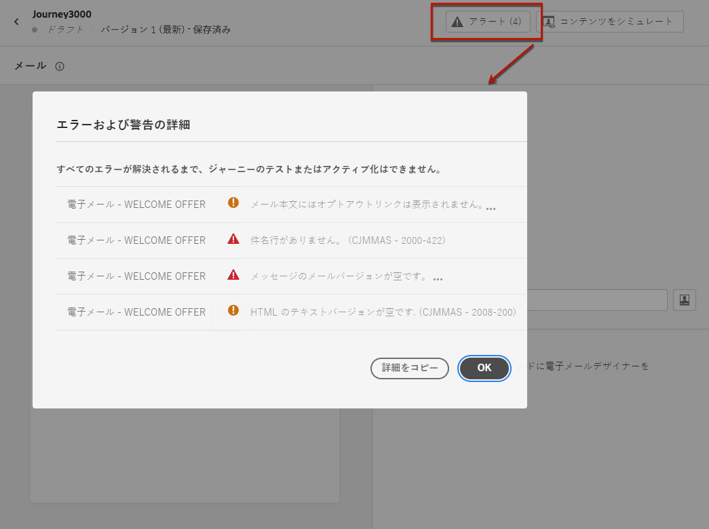

>[!NOTE]
>
>このボタンが表示されない場合、アラートは検出されていません。

システムでチェックされる設定と要素は以下のとおりです。 また、設定を調整して対応する問題を解決する方法に関する情報もあります。

次の 2 種類のアラートが発生する可能性があります。

* **警告**&#x200B;は、次のようなレコメンデーションやベストプラクティスを示しています。

   * **[!UICONTROL メール本文にオプトアウトンクがありません]**：購読解除リンクをメール本文に追加するのがベストプラクティスです。 設定方法について詳しくは、[この節](../privacy/opt-out.md#opt-out-decision-management)を参照してください。

     >[!NOTE]
     >
     >マーケティングタイプのメールメッセージには、オプトアウトリンクを含める必要があります。これはトランザクションメッセージには必要ありません。 メッセージカテゴリ（**[!UICONTROL マーケティング]**&#x200B;または&#x200B;**[!UICONTROL トランザクション]**）は、[チャネル設定](email-settings.md#email-type)レベルで、ジャーニーまたはキャンペーンから[メッセージの作成](#create-email-journey-campaign)時に定義されます。

   * **[!UICONTROL HTML のテキストバージョンが空です]**：メール本文のテキストバージョンを必ず定義してください。このバージョンは、HTML コンテンツを表示できない場合に使用されます。 テキストバージョンの作成方法については、[この節](text-version-email.md)を参照してください。

   * **[!UICONTROL メールの本文に空のリンクが存在します]**：メール内のすべてのリンクが正しいことを確認します。 コンテンツとリンクの管理方法については、[この節](content-from-scratch.md)を参照してください。

   * **[!UICONTROL メールのサイズが 100KB の制限を超えています]**：配信を最適化するには、メールのサイズが 100KB を超えないようにしてください。 HTML サイズを小さくするには、**[!UICONTROL HTML サイズを最適化]** オプションを使用します。 [詳細情報](#optimize-html-size)

* **エラー**（例えば次のようなもの）が解決されない限り、ジャーニー／キャンペーンのテストやアクティブ化はできません。

   * **[!UICONTROL 件名行がありません]**：電子メールの件名は必須です。 定義およびパーソナライズの方法については、[この節](create-email.md)で説明します。

  <!--HTML is empty when Amp HTML is present-->

   * **[!UICONTROL メッセージの電子メールバージョンが空です]**：このエラーは、電子メールのコンテンツが設定されていない場合に表示されます。 メールコンテンツの設計方法については、[この節](get-started-email-design.md)を参照してください。

   * **[!UICONTROL 設定が存在しません]**：選択した設定がメッセージの作成後に削除された場合は、メッセージを使用できません。 このエラーが発生した場合は、メッセージ&#x200B;**[!UICONTROL プロパティ]**&#x200B;で別の設定を選択します。 チャネル設定について詳しくは、[この節](../configuration/channel-surfaces.md)を参照してください。

>[!CAUTION]
>
>メールを使用してジャーニー／キャンペーンをテストまたはアクティブ化できるようにするには、すべての&#x200B;**エラー**&#x200B;アラートを解決する必要があります。

## メールHTMLサイズの最適化 {#optimize-html-size}

>[!CONTEXTUALHELP]
>id="ajo_email_minification"
>title="HTMLのサイズを小さくする"
>abstract="このオプションを有効にすると、不要な空白、インデント、必須ではないコメントを削除して、公開中にメール HTMLを圧縮できます。 これにより、100 KBを超えるメッセージを切り捨てるGmailなどのクライアントでのメールクリッピングを防ぐことができます。 多言語メールを使用する場合、このオプションはすべてのロケールに対してデフォルトで有効になっています。"

[!DNL Journey Optimizer]を使用すると、不要な空白、インデント、必須ではないコメントを削除して、公開プロセス中にメール HTMLのバージョンを圧縮できます。 HTMLのサイズを小さくすると、次のことが可能になります。

* **電子メールクリッピング**&#x200B;を避けます。Gmailなどの一部のクライアントでは、100 KBを超えるメッセージが切り捨てられ、受信者が完全なコンテンツを表示できなくなります。
* 受信者の受信トレイに&#x200B;**メールの読み込み時間**&#x200B;を短縮します。
* **配信品質**&#x200B;を向上させ、帯域幅の使用を減らします。

この最適化は自動的に適用されません。[&#x200B; コンテンツを編集](#define-email-content)画面で手動で有効にする必要があります。

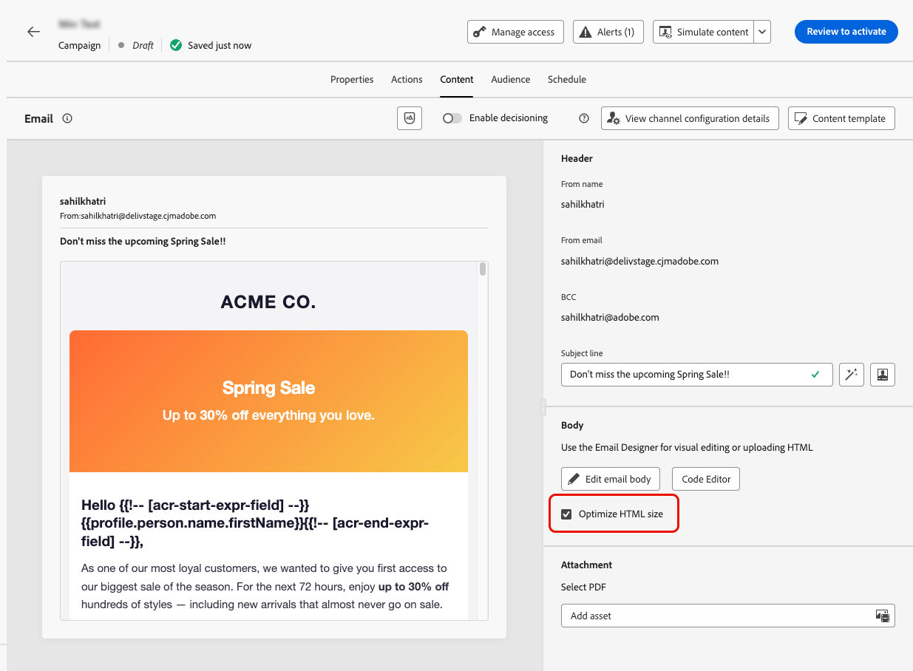

>[!IMPORTANT]
>
> HTML サイズの縮小は、公開時にのみ適用されます。

最適化はメールクライアントセーフです。

* MSO/Outlookの条件付きコメントが保持されます。
* 実際のコンテンツ、画像、動画に変更を加えることはありません。

>[!NOTE]
>
>メールサイズの削減は、メールの元のHTML構造によって異なります。 コンテンツが既にコンパクトになっている場合や、メールペイロードが非常に大きい場合、削減は最小限に抑えられ、すべての場合でクリッピングが完全に妨げられないことがあります。

プルーフを送信する際は、公開前にHTML サイズの最適化の影響をテストできます。 [詳細情報](#optimize-html-proof)

### 多言語メールでのHTMLのサイズの最適化 {#optimize-html-multilingual}

[多言語メールのバリエーション &#x200B;](../content-management/multilingual-gs.md)を操作する場合、**[!UICONTROL HTML サイズの最適化]**&#x200B;設定は、ロケールではなく、メールレベルで追跡されます。

したがって、任意のロケールでこの設定を有効にすると、公開時にその電子メールのすべてのロケールに適用されます。UIでチェックボックスがまだオフになっているロケールも含まれます。 ロケールごとにアクションを繰り返す必要はありません。

HTML サイズの最適化を無効にするには、すべてのロケールで&#x200B;**[!UICONTROL HTML サイズの最適化]**&#x200B;のチェックを外す必要があります。 1つのロケールでも有効にしておくと、最適化をすべてのロケールに適用するのに十分です。

>[!NOTE]
>
>[&#x200B; コンテンツ実験](../content-management/content-experiment.md)を実行している場合、各処理は個別のメッセージと見なされるため、**[!UICONTROL HTML サイズの最適化]**&#x200B;設定は各処理ごとに個別に管理されます。

## メールの確認および送信

メッセージコンテンツを定義したら、次のいずれかのシミュレーション方法を使用してコンテンツをプレビューできます。

* 「**[!UICONTROL コンテンツをシミュレート]**」をクリックして、サンプル入力データまたはAI自動生成を使用してコンテンツのバリエーションをテストします。 [コンテンツバリエーションのシミュレート方法を学ぶ](../test-approve/simulate-sample-input.md)
* 「**[!UICONTROL コンテンツをシミュレート]**」をクリックし、ドロップダウンから「**[!UICONTROL コンテンツをシミュレート（AEP プロファイル）]**」を選択して、テストプロファイルでプレビューし、プルーフを送信し、メールのレンダリングを確認します。

また、コンテンツの品質を検証して、読みやすさ、効果、コンテンツの包括性を評価することもできます。 [コンテンツ品質の検証の詳細情報](../content-management/brands-score.md#validate-quality)

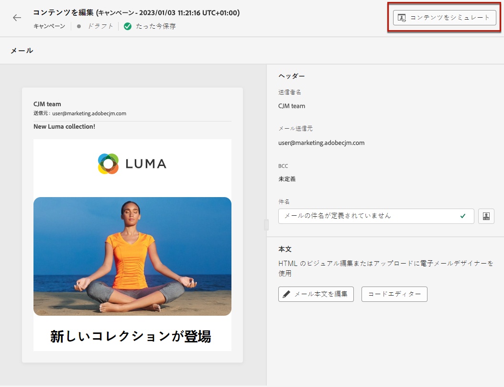

テストプロファイルの選択およびコンテンツのプレビュー方法について詳しくは、「[コンテンツ管理](../content-management/preview-test.md)」の節を参照してください。

メールの準備ができたら、[ジャーニー](../building-journeys/journey-gs.md)または[キャンペーン](../campaigns/create-campaign.md)を設定し、アクティブ化して、メッセージが送信されるようにします。

>[!NOTE]
>
>メールの開封やインタラクションを通じて受信者の行動を追跡するには、ジャーニーの[メールアクティビティ](../building-journeys/journey-action.md)またはメール[キャンペーン](../campaigns/create-campaign.md)で「**[!UICONTROL トラッキング]**」セクションの専用オプションが有効になっていることを確認してください。<!--to move?-->

### HTML サイズの最適化をテストする {#optimize-html-proof}

「[HTML サイズの最適化](#optimize-html-size)」オプションを有効にしている場合は、プルーフを送信する際に、公開前にその影響を評価できます。 次の手順に従います。

1. 電子メールDesignerで、右側のパネルの「イシュー」アイコンをクリックします。 レンダリングされた電子メールサイズが100 KBを超える場合、一部の電子メールクライアントで切り捨てが発生する可能性があることを警告するメッセージが表示されます。<!--Learn more about content checks in [this section](#check-email-alerts).-->

   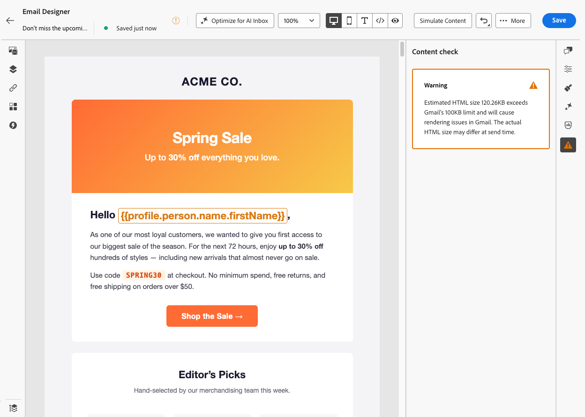

1. 「**[!UICONTROL コンテンツをシミュレート]**」をクリックします。

   <!--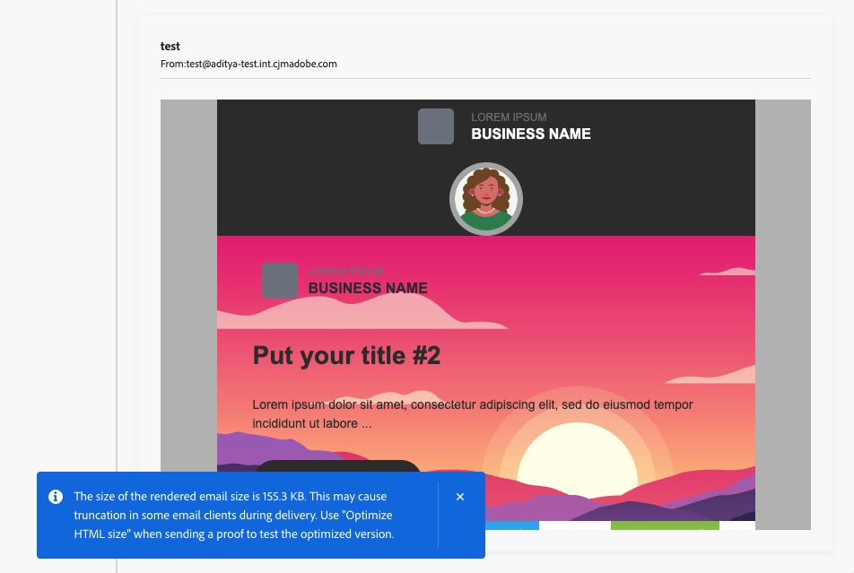-->

1. 最適化されたバージョンをテストするには、「**[!UICONTROL プルーフを送信]**」ボタンをクリックし、「**[!UICONTROL HTML サイズを最適化]**」オプションを選択します。 これにより、HTML サイズを小さくしたプルーフがテスト受信者に送信されます。

   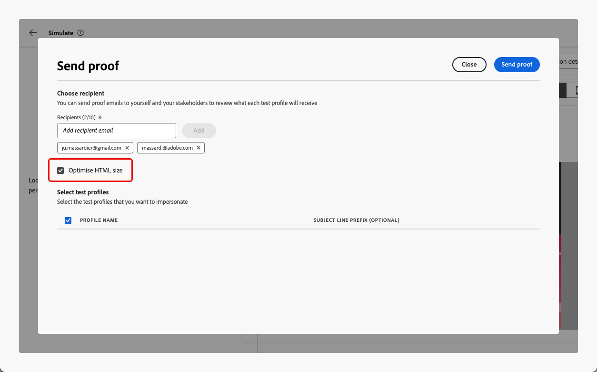

   >[!NOTE]
   >
   >この設定はメールエディターとは独立しています。プルーフは、オプションがメール自体で有効または無効になっているかどうかにかかわらず、プルーフで選択した内容を反映します。

1. テスト受信者を選択し、**[!UICONTROL プルーフを送信]** ボタンをクリックします。 プルーフの送信について詳しくは、この節[を参照してください](../content-management/proofs.md)。
1. 送信したら、**[!UICONTROL シミュレーション]**&#x200B;画面に戻り、**[!UICONTROL プルーフを表示]** ボタンをクリックします。
1. プルーフのステータスの横にある情報アイコンをクリックします。 最適化の詳細は、元のHTML サイズ、最適化されたHTML サイズ、サイズ縮小率など、ポップアップウィンドウに表示されます。

   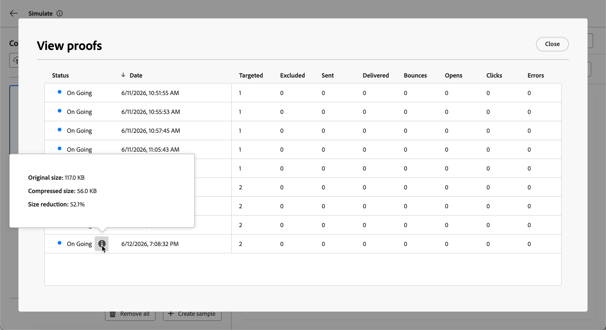

   この情報を使用して、最適化された出力を検証し、電子メールが公開前に推奨される100 KBのしきい値内に収まることを確認します。

<!--
## Define your email content {#email-content}

Use [!DNL Journey Optimizer] Email Designer to [design your email from scratch](../email/content-from-scratch.md). If you have an existing content, you can [import it in the Email Designer](../email/existing-content.md), or [code your own content](../email/code-content.md) in [!DNL Journey Optimizer]. 

[!DNL Journey Optimizer] comes with a set of [built-in templates](email-templates.md) to help you start. Any email can also be saved as a template.

Use [!DNL Journey Optimizer] personalization editor to personalize your messages with profiles' data. For more on personalization, refer to [this section](../personalization/personalize.md).

Adapt the content of your messages to the targeted profiles by using [!DNL Journey Optimizer] dynamic content capabilities. [Get started with dynamic content](../personalization/get-started-dynamic-content.md)

## Email tracking {#email-tracking}

If you want to track the behavior of your recipients through openings and/or clicks on links, enable the following options: **[!UICONTROL Email opens]** and **[!UICONTROL Click on email]**. 

Learn more about tracking in [this section](message-tracking.md).

## Validate your email content {#email-content-validate}

Control the rendering of your email, and check personalization settings with test profiles, using the preview section on the left-hand side. For more on this, refer to [this section](preview.md).

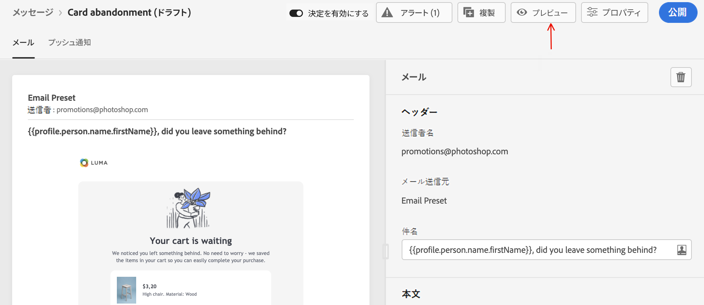

You must also check alerts in the upper section of the editor.  Some of them are simple warnings, but others can prevent you from using the message. 
-->
