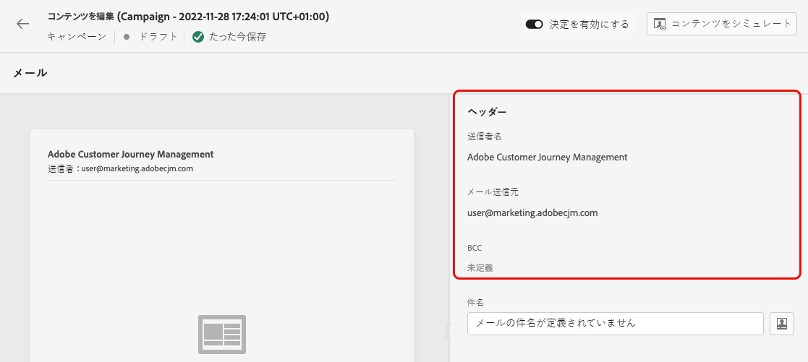

# 電子メールの作成 {#create-email}

>[!CONTEXTUALHELP]
>id="ajo_message_email"
>title="電子メールの作成"
>abstract="電子メールパラメーターは、次の3つの単純な手順で定義します。"

で [!DNL Journey Optimizer] 電子メールを作成するには、以下の手順に従います。

## 1つの旅またはキャンペーンでの電子メールの作成 {#create-email-journey-campaign}

**[!UICONTROL Email]**&#x200B;旅またはキャンペーンにアクションを追加し、次の手順に従ってください。

>[!BEGINTABS]

>[!TAB 旅への電子メールの追加]

1. 目的のフライトを開き、パレットのセクションから **[!UICONTROL Actions]** アクティビティをドラッグ &amp; ドロップ **[!UICONTROL Email]** します。

1. メッセージに基本的な情報を指定します (ラベル、説明、カテゴリー)。

1. [使用する電子メールサーフェス ](email-settings.md) を選択します。

   

>[!NOTE]
>
>このような旅において電子メールを送信する場合は、Adobe 旅オプティマイザーの送信時最適化機能を利用して、メッセージを送信するのにかかる時間を短縮し、「クリックレート」に基づいて最大限の時間をかけることができます。 [送信時最適化の操作方法について説明します。](../building-journeys/journeys-message.md#send-time-optimization)

フライトの設定方法について詳しくは、このページ ](../building-journeys/journey-gs.md) を [ 参照してください。

>[!TAB キャンペーンへの電子メールの追加]

1. 新しくスケジュール設定された、または API トリガキャンペーンを作成して、「操作として」を選択 **[!UICONTROL Email]** します。

1. [使用する電子メールサーフェス ](email-settings.md) を選択します。

   

1. をクリック **[!UICONTROL Create]** します。

1. 電子メールキャンペーンを作成する手順について説明します。キャンペーンプロパティ、 [ 対象ユーザー ](../segment/about-segments.md) 、 [ スケジュール ](../campaigns/create-campaign.md#schedule) などが挙げられます。

   

<!--
From the **[!UICONTROL Action]** section, specify if you want to track how your recipients react to your delivery: you can track email opens, and/or clicks on links and buttons in your email.

-->

キャンペーンの設定方法について詳しくは、このページ ](../campaigns/get-started-with-campaigns.md) を [ 参照してください。

>[!ENDTABS]

## 電子メールコンテンツの定義 {#define-email-content}

1. 「その他の設定」画面で、ボタンをクリック **[!UICONTROL Edit content]** して電子メールのコンテンツを設定します。 [詳細情報](get-started-email-design.md)

   

1. **[!UICONTROL Header]**&#x200B;画面 **[!UICONTROL From email]** **[!UICONTROL From name]** の **[!UICONTROL Edit content]** セクションで、「」および **[!UICONTROL BCC]** 「」フィールドは、選択した電子メールの面から取得されます。詳しくは、 <!--check if same for journey-->

   

1. 題名行を追加することができます。 対応するフィールドにプレーンテキストを直接入力するか、式エディター ](../personalization/personalization-build-expressions.md) を使用 [ して件名をカスタマイズします。

1. **[!UICONTROL Edit email body]**&#x200B;ボタンをクリックすると、電子メールデザイナーを使用した [!DNL Journey Optimizer] コンテンツの作成が開始されます。[詳細情報](get-started-email-design.md)

   

1. キャンペーン中の場合は、表示されるポップアップウィンドウを使用して、ボタンをクリック **[!UICONTROL Code Editor]** して、コンテンツを HTML 形式でコード化することもできます。

   

   >[!NOTE]
   >
   >電子メールデザイナーを使用してコンテンツを既に作成またはインポートした場合、このコンテンツは HTML で表示されます。

## アラートの確認 {#check-email-alerts}

メッセージをデザインしているときに、キー設定が見つからない場合は、画面の上部に表示されるインターフェイスにアラートが表示されます。

>[!NOTE]
>
>このボタンが表示されていない場合は、警告が検出されていません。

システムによってチェックされる設定とエレメントについては、以下のとおりです。 また、設定を適合させることによって、対応する問題を解決する方法についても説明します。

アラートは、次の2種類の方法で発生する可能性があります。

* **警告** は、次のような推奨事項とベストプラクティスを示しています。

   * **[!UICONTROL The opt-out link is not present in the email body]** unsubscription のリンクを電子メールの本文に追加することをお勧めします。 この節 ](../privacy/opt-out.md#opt-out-management) では [ 、この方法を設定する方法について説明しています。

      >[!NOTE]
      >
      >マーケティングタイプの電子メールメッセージには脱退リンクが含まれている必要があります。これは、トランザクションメッセージには必要ありません。 メッセージカテゴリー **[!UICONTROL Marketing]** **[!UICONTROL Transactional]** は、チャンネルのサーフェス ](email-settings.md#email-type) レベルで [ 定義されているか、または、旅またはキャンペーンからメッセージ ](#create-email-journey-campaign) を作成するとき [ に定義されます。

   * **[!UICONTROL Text version of HTML is empty]**: HTML コンテンツを表示できないときに使用される電子メール本文のテキストバージョンを定義してください。 この節 ](text-version-email.md) で [ は、テキストのバージョンを作成する方法について説明します。

   * **[!UICONTROL Empty link is present in email body]**: 電子メール内のすべてのリンクが正しいかどうかを確認してください。 この節 ](content-from-scratch.md) では [ 、コンテンツとリンクを管理する方法について説明しています。

   * **[!UICONTROL Email size has exceeded the limit of 100KB]**: 配信する場合は、電子メールのサイズが100KB を超えていないことを確認してください。 この節 ](content-from-scratch.md) では、電子メールの [ 内容を編集する方法について説明します。

* **エラーが発生すると、次のようなエラー** が解決されていない限り、それらが解決されます。

   * **[!UICONTROL The subject line is missing]**: 電子メールの件名行は必須です。 この節 ](create-email.md) では [ 、この方法を定義およびカスタマイズする方法を説明しています。

   <!--HTML is empty when Amp HTML is present-->

   * **[!UICONTROL The email version of the message is empty]**&#x200B;このエラーは、電子メールコンテンツが設定されていない場合に表示されます。 この節 ](get-started-email-design.md) では、電子メールの [ コンテンツをデザインする方法を説明しています。

   * **[!UICONTROL Surface doesn't exist]**: メッセージの作成後に、選択したサーフェスが削除された場合は、メッセージを使用できません。 このエラーが発生した場合は、メッセージ **[!UICONTROL Properties]** 内の別の面を選択します。 この節 ](../configuration/channel-surfaces.md) では、 [ チャネルのサーフェスについて詳しく説明しています。

>[!CAUTION]
>
>電子メールを使用して、旅やキャンペーンのテストやアクティブ化を可能にするには、すべて **のエラー** 警告を解決する必要があります。

## 電子メールのプレビューと送信

作成したメッセージコンテンツは、プレビューして電子メールの表示を制御することができます。また、テストプロファイルを使用して、パーソナライズ設定を確認することもできます。 [詳細情報](preview.md)

電子メールの準備ができたら、旅 ](../building-journeys/journey-gs.md) または [ キャンペーン ](../campaigns/create-campaign.md) の [ 設定を完了し、メッセージを送信するにはアクティブ化してください。

>[!NOTE]
>
>電子メールのオープニングまたは操作によって、宛先の動作を追跡するには、その **[!UICONTROL Tracking]** セクション内の専用オプションが、旅の [ 電子メール活動 ](../building-journeys/journeys-message.md) または電子メール [ キャンペーン ](../campaigns/create-campaign.md) で有効になっていることを確認してください。<!--to move?-->

<!--

## Define your email content {#email-content}

Use [!DNL Journey Optimizer] Email Designer to [design your email from scratch](../email/content-from-scratch.md). If you have an existing content, you can [import it in the Email Designer](../email/existing-content.md), or [code your own content](../email/code-content.md) in [!DNL Journey Optimizer]. 

[!DNL Journey Optimizer] comes with a set of [built-in templates](email-templates.md) to help you start. Any email can also be saved as a template.

Use [!DNL Journey Optimizer] Expression editor to personalize your messages with profiles' data. For more on personalization, refer to [this section](../personalization/personalize.md).

Adapt the content of your messages to the targeted profiles by using [!DNL Journey Optimizer] dynamic content capabilities. [Get started with dynamic content](../personalization/get-started-dynamic-content.md)

## Email tracking {#email-tracking}

If you want to track the behavior of your recipients through openings and/or clicks on links, enable the following options: **[!UICONTROL Email opens]** and **[!UICONTROL Click on email]**. 

Learn more about tracking in [this section](message-tracking.md).

## Validate your email content {#email-content-validate}

Control the rendering of your email, and check personalization settings with test profiles, using the preview section on the left-hand side. For more on this, refer to [this section](preview.md).

You must also check alerts in the upper section of the editor.  Some of them are simple warnings, but others can prevent you from using the message. 

-->

