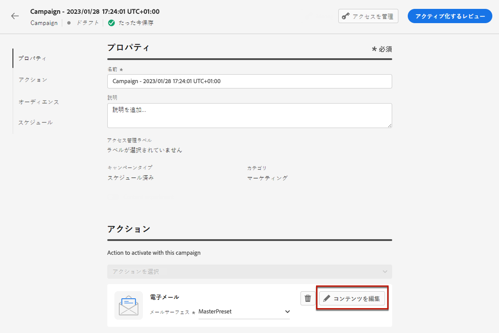
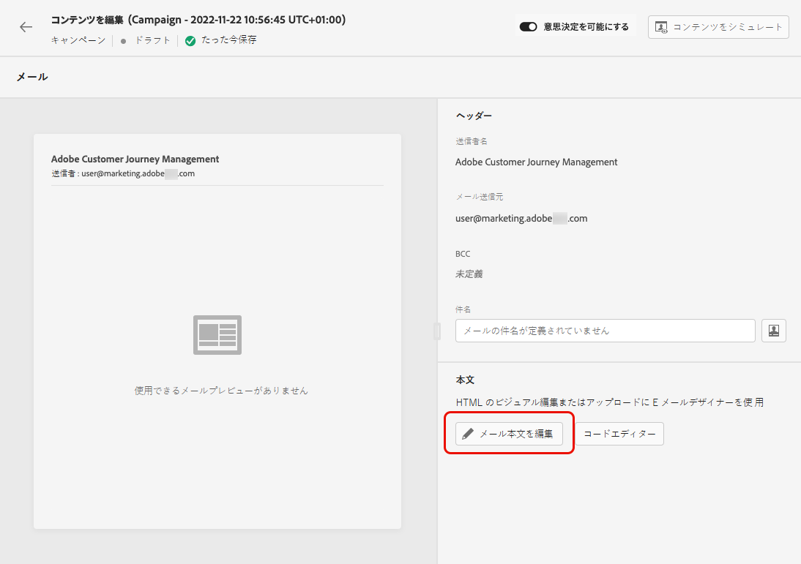
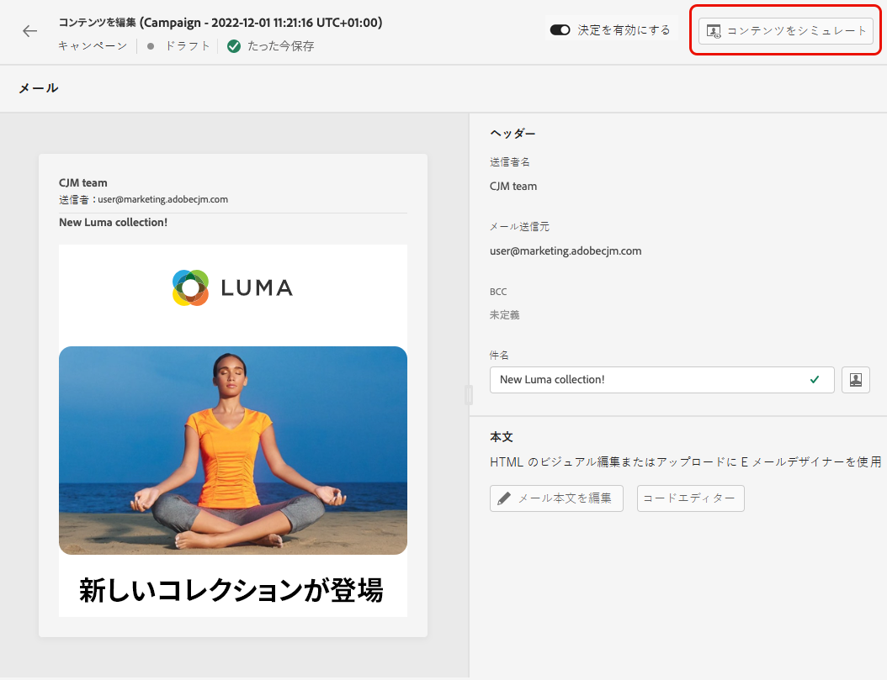

# メールの作成 {#create-email}

>[!CONTEXTUALHELP]
>id="ajo_message_email"
>title="メールの作成"
>abstract="メールのパラメーターを 3 つの簡単な手順で定義します。"

[!DNL Journey Optimizer] でメールを作成するには、次の手順に従います。

## ジャーニーまたはキャンペーンでのメールの作成 {#create-email-journey-campaign}

**[!UICONTROL メール]**&#x200B;アクションをジャーニーまたはキャンペーンに追加し、場合に応じて次の手順に従います。

>[!BEGINTABS]

>[!TAB ジャーニーへのメールの追加]

1. ジャーニーを開き、パレットの「**[!UICONTROL アクション]**」セクションから&#x200B;**[!UICONTROL メール]**&#x200B;アクティビティをドラッグ＆ドロップします。

1. メッセージに関する基本情報（ラベル、説明、カテゴリ）を入力します。

1. 使用する[メールサーフェス](email-settings.md)を選択します。

   

>[!NOTE]
>
>ジャーニーからメールを送信する場合、Adobe Journey Optimizer の送信時間最適化機能を活用して、メッセージを送信する最適な時間を予測し、過去の開封率とクリック率に基づいてエンゲージメントを最大化することができます。詳しくは、[送信時間の最適化](../building-journeys/journeys-message.md#send-time-optimization)を参照してください。

ジャーニーの設定方法について詳しくは、[このページ](../building-journeys/journey-gs.md)を参照してください。

>[!TAB キャンペーンへのメールの追加]

1. スケジュール済みキャンペーンまたは API トリガーキャンペーンを新規作成し、アクションとして「**[!UICONTROL メール]**」を選択します。

1. 使用する[メールサーフェス](email-settings.md)を選択します。

   

1. 「**[!UICONTROL 作成]**」をクリックします。

1. キャンペーンプロパティ、[オーディエンス](../segment/about-segments.md)、[スケジュール](../campaigns/create-campaign.md#schedule)など、メールキャンペーンを作成する手順を完了します。

   

<!--
From the **[!UICONTROL Action]** section, specify if you want to track how your recipients react to your delivery: you can track email opens, and/or clicks on links and buttons in your email.

-->

キャンペーンの設定方法について詳しくは、[このページ](../campaigns/get-started-with-campaigns.md)を参照してください。

>[!ENDTABS]

## メールコンテンツの定義 {#define-email-content}

<!-- update the quarry component with right ID value-->

>[!CONTEXTUALHELP]
>id="test_id"
>title="E メールコンテンツの設定"
>abstract="E メールのコンテンツを作成します。 件名を定義してから、E メールデザイナーを活用して E メールの本文を作成およびパーソナライズします。"

1. ジャーニーまたはキャンペーンの設定画面で、「**[!UICONTROL コンテンツを編集]**」ボタンをクリックして、メールコンテンツを設定します。[詳細情報](get-started-email-design.md)

   

1. **[!UICONTROL コンテンツを編集]**&#x200B;画面の「**[!UICONTROL ヘッダー]**」セクションで、「**[!UICONTROL 差出人名]**」、「**[!UICONTROL 差出人メールアドレス]**」、「**[!UICONTROL BCC]**」の各フィールドは、選択したメールサーフェスから取得されます。[詳細情報](email-settings.md) <!--check if same for journey-->

   

1. 件名を追加できます。該当するフィールドに直接プレーンテキストを入力するか、[式エディター](../personalization/personalization-build-expressions.md)を使用して件名をパーソナライズします。

1. 「**[!UICONTROL メール本文を編集]**」ボタンをクリックして、[!DNL Journey Optimizer] 電子メールデザイナーでコンテンツの作成を開始します。[詳細情報](get-started-email-design.md)

   

1. キャンペーンで作業している場合は、「**[!UICONTROL コードエディター]**」ボタンをクリックし、表示されるポップアップウィンドウを使用してプレーン HTML で独自のコンテンツをコーディングすることもできます。

   

   >[!NOTE]
   >
   >電子メールデザイナーで既にコンテンツを作成または読み込んでいる場合は、そのコンテンツが HTML で表示されます。

## アラートの確認 {#check-email-alerts}

メッセージをデザインする際、重要な設定が見つからない場合は、インターフェイス（画面の右上）にアラートが表示されます。

>[!NOTE]
>
>このボタンが表示されない場合、アラートは検出されていません。

システムでチェックされる設定と要素は以下のとおりです。また、設定を調整して対応する問題を解決する方法に関する情報もあります。

次の 2 種類のアラートが発生する可能性があります。

* **警告**&#x200B;は、次のような推奨事項やベストプラクティスを示しています。

   * **[!UICONTROL メール本文にオプトアウトンクがありません]**：購読解除リンクをメール本文に追加するのがベストプラクティスです。設定方法について詳しくは、[この節](../privacy/opt-out.md#opt-out-management)を参照してください。

      >[!NOTE]
      >
      >マーケティングタイプのメールメッセージには、オプトアウトリンクを含める必要があります。これはトランザクションメッセージには必要ありません。メッセージカテゴリ（**[!UICONTROL マーケティング]**&#x200B;または&#x200B;**[!UICONTROL トランザクション]**）は、[チャネルサーフェス](email-settings.md#email-type)レベルで、ジャーニーまたはキャンペーンから[メッセージを作成](#create-email-journey-campaign)するときに定義されます。

   * **[!UICONTROL HTML のテキストバージョンが空です]**：メール本文のテキストバージョンを必ず定義してください。このバージョンは、HTML コンテンツを表示できない場合に使用されます。テキストバージョンの作成方法については、[この節](text-version-email.md)を参照してください。

   * **[!UICONTROL メールの本文に空のリンクが存在します]**：メール内のすべてのリンクが正しいことを確認します。コンテンツとリンクの管理方法については、[この節](content-from-scratch.md)を参照してください。

   * **[!UICONTROL メールのサイズが 100KB の制限を超えています]**：配信を最適化するには、メールのサイズが 100KB を超えないようにしてください。メールコンテンツの編集方法については、[この節](content-from-scratch.md)を参照してください。

* **エラー**（例えば次のようなもの）が解決されない限り、ジャーニー／キャンペーンのテストやアクティブ化はできません。

   * **[!UICONTROL 件名行がありません]**：電子メールの件名は必須です。定義およびパーソナライズの方法については、[この節](create-email.md)で説明します。

   <!--HTML is empty when Amp HTML is present-->

   * **[!UICONTROL メッセージの電子メールバージョンが空です]**：このエラーは、電子メールのコンテンツが設定されていない場合に表示されます。メールコンテンツの設計方法については、[この節](get-started-email-design.md)を参照してください。

   * **[!UICONTROL サーフェスが存在しません]**：選択したサーフェスがメッセージの作成後に削除された場合は、メッセージを使用できません。このエラーが発生した場合は、メッセージの&#x200B;**[!UICONTROL プロパティ]**&#x200B;で別のサーフェスを選択します。チャネルサーフェスについて詳しくは、[この節](../configuration/channel-surfaces.md)を参照してください。

>[!CAUTION]
>
>メールを使用してジャーニー／キャンペーンをテストまたはアクティブ化できるようにするには、すべての&#x200B;**エラー**&#x200B;アラートを解決する必要があります。

## メールのプレビューと送信

メッセージコンテンツを定義したら、プレビューしてメールのレンダリングを制御し、テストプロファイルでパーソナライゼーション設定を確認することができます。[詳細情報](preview.md)

メールの準備ができたら、[ジャーニー](../building-journeys/journey-gs.md)または[キャンペーン](../campaigns/create-campaign.md)を設定し、アクティブ化して、メッセージが送信されるようにします。

>[!NOTE]
>
>メールの開封やインタラクションを通じて受信者の行動を追跡するには、ジャーニーの[メールアクティビティ](../building-journeys/journeys-message.md)またはメール[キャンペーン](../campaigns/create-campaign.md)で「**[!UICONTROL トラッキング]**」セクションの専用オプションが有効になっていることを確認してください。<!--to move?-->

<!--

## Define your email content {#email-content}

Use [!DNL Journey Optimizer] Email Designer to [design your email from scratch](../email/content-from-scratch.md). If you have an existing content, you can [import it in the Email Designer](../email/existing-content.md), or [code your own content](../email/code-content.md) in [!DNL Journey Optimizer]. 

[!DNL Journey Optimizer] comes with a set of [built-in templates](email-templates.md) to help you start. Any email can also be saved as a template.

Use [!DNL Journey Optimizer] Expression editor to personalize your messages with profiles' data. For more on personalization, refer to [this section](../personalization/personalize.md).

Adapt the content of your messages to the targeted profiles by using [!DNL Journey Optimizer] dynamic content capabilities. [Get started with dynamic content](../personalization/get-started-dynamic-content.md)

## Email tracking {#email-tracking}

If you want to track the behavior of your recipients through openings and/or clicks on links, enable the following options: **[!UICONTROL Email opens]** and **[!UICONTROL Click on email]**. 

Learn more about tracking in [this section](message-tracking.md).

## Validate your email content {#email-content-validate}

Control the rendering of your email, and check personalization settings with test profiles, using the preview section on the left-hand side. For more on this, refer to [this section](preview.md).

You must also check alerts in the upper section of the editor.  Some of them are simple warnings, but others can prevent you from using the message. 

-->

